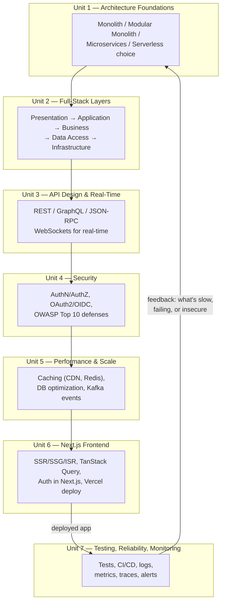

# Lecture 32: Course Review

You've now covered every unit of Advanced Web Technologies (CSC337): enterprise
architecture, full-stack layering and microservices, API design and real-time
communication, security, performance and scalability, a production Next.js frontend, and
testing, reliability, and monitoring. This lecture is the consolidation pass before the
final exam and your semester project demonstration — it pulls every unit into one picture,
recaps what mattered most in each, and gives you a structured way to check your own
understanding before you're asked to apply all of it at once.

This is not new material. If anything here is unfamiliar, that's a signal to go back to
the relevant lecture before the exam, not to memorize the summary in isolation.

## Course Concept Map

Every unit in this course answers a different question about the same underlying system:
a production-grade full-stack application. The diagram below places all seven units into
the shape of one such system, from architectural decision down to what happens after it
ships.

Read the diagram as a loop, not a line: monitoring and testing (Unit 7) don't just come
"after" everything else — what they reveal in production (a slow endpoint, a recurring
error, an abuse pattern) is exactly the kind of evidence that justifies revisiting your
architecture, caching strategy, or security posture. Production systems are iterated on,
not shipped once.

## Unit-by-Unit Recap

For each unit, here is the single idea most worth carrying forward, and the mistake
students (and working engineers) most commonly make with it.

**Unit 1 — Enterprise Architecture Foundations**

- **Most important idea:** Architecture is a trade-off between simplicity and flexibility,
  not a hierarchy with microservices at the top. A modular monolith gets most of the
  maintainability benefit of microservices without the operational cost, and is the right
  starting point for most applications.
- **Most common mistake:** Adopting microservices (or another complex architecture)
  because it's what large companies use, without a measured, concrete reason your own
  system needs independent scaling or deployment.

**Unit 2 — Full-Stack Architecture Layers**

- **Most important idea:** Dependencies should point inward — presentation depends on
  application, which depends on business/domain logic, which knows nothing about HTTP or
  databases. This is what makes business logic testable and infrastructure swappable.
- **Most common mistake:** Letting business rules leak into controllers or database
  models ("fat controllers"), which makes the codebase harder to test and harder to change
  safely as it grows.

**Unit 3 — API Design and Real-Time Communication**

- **Most important idea:** REST, GraphQL, JSON-RPC, and WebSockets solve different
  communication problems (resource-oriented CRUD, flexible client-driven queries,
  simple RPC, and bidirectional real-time, respectively) — the right choice depends on
  your data shape and interaction pattern, not on trend.
- **Most common mistake:** Defaulting to WebSockets (or GraphQL) everywhere out of
  novelty, when a well-designed REST API with proper caching headers would be simpler to
  build, secure, and operate.

**Unit 4 — Web and API Security**

- **Most important idea:** Authentication (who are you) and authorization (what are you
  allowed to do) are separate concerns, and defending against the OWASP Top 10 is a
  baseline expectation, not an advanced feature — most real-world breaches exploit
  well-known, well-documented weaknesses.
- **Most common mistake:** Trusting client-supplied data (including data that "should"
  have been validated on the frontend) and skipping server-side validation and
  authorization checks on every request that touches sensitive data or actions.

**Unit 5 — Performance, Caching, and Scalability**

- **Most important idea:** Caching (CDN, HTTP, and application-level with Redis) and
  database optimization (indexing, query analysis) deliver the largest performance wins
  for the least engineering effort — and event-driven patterns like Kafka decouple
  services so they can scale independently.
- **Most common mistake:** Caching without an invalidation strategy, leading to stale data
  bugs that are worse than the slowness the cache was meant to fix — or optimizing code
  before measuring where the actual bottleneck is.

**Unit 6 — Production Frontend with Next.js**

- **Most important idea:** Rendering strategy (SSR, SSG, ISR, or client-side) is a
  per-page decision based on how often data changes and who needs to see it first — and
  data fetching, layout, and authentication all need to account for the server/client
  boundary Next.js introduces.
- **Most common mistake:** Reaching for client-side rendering and client-side data
  fetching everywhere by habit, losing the SEO, performance, and simplicity benefits that
  server rendering was specifically chosen to provide.

**Unit 7 — Testing, Reliability, and Monitoring**

- **Most important idea:** A production system needs proof that it works (the testing
  pyramid) before shipping, and continuous evidence that it's *still* working (logs,
  metrics, traces, alerting) after shipping — the two are complementary, not
  interchangeable.
- **Most common mistake:** Treating monitoring as something to add "later, if there's
  time," and discovering an outage from angry users instead of from an alert.

## Self-Check Questions

Work through these without your notes first. They deliberately span multiple units — real
exam and interview questions rarely stay inside one lecture's boundaries.

1. You're designing a new internal tool for a five-person startup. Walk through how you'd
   decide between a monolith, a modular monolith, and microservices, and what evidence
   would change your answer later.
2. Explain why the business/domain layer should have no knowledge of HTTP or the database.
   What does that buy you when writing tests?
3. A frontend team wants live order-status updates without polling. Compare REST polling,
   WebSockets, and server-sent events for this use case, and justify a choice.
4. What's the difference between authentication and authorization, and where in a request's
   lifecycle should each be checked?
5. Describe how OAuth 2.0's authorization code flow prevents a malicious app from obtaining
   a user's password directly.
6. Pick two items from the OWASP Top 10 and explain, with a concrete example, how each
   could be exploited in a poorly written Express API — and how you'd fix it.
7. You add a Redis cache in front of a slow database query. What specific problem could
   this introduce, and what strategy would you use to avoid serving stale data?
8. Explain the difference between horizontal and vertical scaling, and why statelessness
   is a prerequisite for horizontal scaling to work cleanly.
9. When would you choose ISR over SSR or full static generation for a Next.js page? Give
   a concrete example page for each.
10. A Next.js app needs to keep a user logged in across page navigations and server
    components. What are the key considerations for handling authentication tokens safely
    in this environment?
11. Why does the testing pyramid recommend far more unit tests than end-to-end tests, and
    what specifically goes wrong in a codebase that inverts this?
12. What's the difference between a log, a metric, and a trace? Give an example of a
    question each one is best suited to answer.
13. Explain what a circuit breaker does and why naive retries without backoff can make an
    outage worse instead of better.
14. Define SLI, SLO, and error budget, and explain how an error budget changes how a team
    decides whether to ship a risky change this week.
15. Your production error rate spikes right after a deploy. Walk through your incident
    response, from detection to postmortem, referencing at least one specific tool or
    technique from Unit 7.
16. Pick any two units from this course and explain, concretely, how a decision made in
    one constrains or enables a decision in the other (for example, architecture and
    testing, or caching and security).

!!! tip "Semester Project Checklist"
    Before you submit your final full-stack project, make sure it can honestly check off
    each of these:

    - [ ] **Architecture** — you can explain, in one or two sentences, *why* you chose the
      architecture you used (monolith, modular monolith, microservices, or a mix), not
      just that you used it.
    - [ ] **Layering** — business logic is separated from route handlers and database
      models; you could swap your database or add a CLI without rewriting core rules.
    - [ ] **API design** — endpoints follow consistent, sensible conventions; any
      real-time features use an appropriate transport (WebSockets/SSE), not polling
      disguised as real-time.
    - [ ] **Security** — authentication and authorization are enforced server-side on
      every protected route; inputs are validated; at least the most relevant items from
      the OWASP Top 10 have been considered and addressed.
    - [ ] **Performance & caching** — at least one deliberate caching decision has been
      made (HTTP, CDN, or Redis) with a clear invalidation strategy, and slow queries have
      been identified and addressed, not just assumed to be fine.
    - [ ] **Frontend** — rendering strategy per page is a deliberate choice, not a
      default; data fetching handles loading and error states, not just the success case.
    - [ ] **Testing** — there is a real test suite (unit and at least some integration or
      E2E coverage) that runs in CI, not just manual clicking before the demo.
    - [ ] **Reliability & observability** — the app has structured logging with at least
      basic request context, a health check endpoint, and you can describe what you'd
      monitor if this were running in production.
    - [ ] **Deployment** — the app is actually deployed somewhere reachable, with a
      documented (even if simple) process for shipping a new change.

## Closing

You started this course able to build a working full-stack application. You're finishing
it able to reason about *why* a production system is built the way it is — how to choose
an architecture deliberately, defend an API against real attackers, keep a system fast
under real load, ship a modern server-rendered frontend, and prove (and keep proving) that
the whole thing actually works once it's live. That combination — architectural judgment
plus engineering discipline — is what separates a class project from a system a team can
run in production for years.

Congratulations on making it through the full arc of both CSC336 and CSC337. Keep the
momentum going after the exam: contribute a small fix to an open-source project you
depend on, turn your semester project into a portfolio piece you keep improving, or go
deeper into one ecosystem that caught your interest this semester — Kubernetes and
container orchestration, GraphQL federation, distributed tracing with OpenTelemetry, or
systems design more broadly. The lectures end here; the practice doesn't have to.
