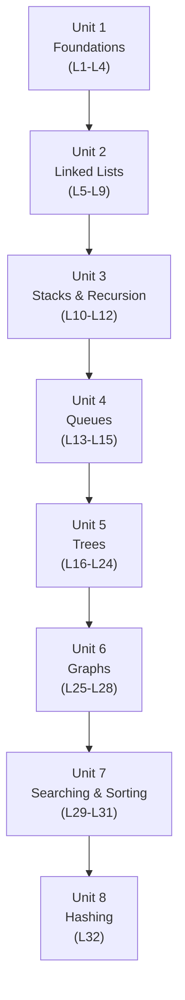

# Algorithms and Data Structures (CSC211)

**Credit hours:** 4 (3 lecture + 1 lab) · **Pre-requisite:** CSC103 — Programming Fundamentals
**Audience:** BS Computer Science, 3rd semester

This course is where you stop just writing programs and start reasoning about *how well*
they work. You already know how to store a value in a variable and loop over a list —
this course asks a harder question: when your program has to manage a thousand records,
a million, or a graph of a million connections, which way of organizing that data keeps
your program fast, and which way quietly makes it fall over? Every data structure you'll
meet here is really an answer to one trade-off or another: fast insertion but slow search,
fast search but slow insertion, more memory for less time, less memory for more time.

This book assumes you can already write a C++ program with functions, loops, arrays, and
classes (your CSC103 course). Every new term — pointer, node, abstract data type,
recursion, Big-O — is explained the first time it shows up, and every algorithm is shown
as **real, compiled, and executed C++ code with its actual output**, not just pseudocode.
You should be able to copy any example straight into your own compiler and get the exact
result shown on the page.

## Course objectives

- Discuss the issues of time complexity and examine algorithms from that perspective.
- Introduce the concept and usage of data structures through abstract data types —
  linked lists, stacks, queues, priority queues, trees, and graphs.
- Implement these data structures and their applications.
- Develop an understanding of recursion as it applies to trees and graphs.

## What you will be able to do (Course Learning Outcomes)

| CLO | You will be able to... | Bloom's level |
|---|---|---|
| CLO-1 | Employ linear data structures to solve computing problems | Applying |
| CLO-2 | Use non-linear data structures to solve computing problems | Applying |
| CLO-3 | Analyze the time complexity of various algorithms | Analyzing |
| CLO-4 (Lab) | Implement data structures and algorithms | Applying |
| CLO-5 (Lab) | Develop a project using appropriate data structures in a team environment | Creating |

## How the book is organized

The 32 lectures are grouped into 8 units, matching the official course description form
and the department's lecture-wise teaching plan. Click a unit to jump straight to its
first lecture.

| Unit | Topic | Lectures |
|---|---|---|
| 1 | [Foundations of Data Structures](lecture-01-introduction-to-data-structures.md) | 1–4 |
| 2 | [Linked Lists](lecture-05-linked-lists-fundamentals.md) | 5–9 |
| 3 | [Stacks and Recursion](lecture-10-stack-adt-and-implementation.md) | 10–12 |
| 4 | [Queues](lecture-13-queue-adt-and-implementation.md) | 13–15 |
| 5 | [Trees](lecture-16-trees-and-general-trees.md) | 16–24 |
| 6 | [Graphs](lecture-25-graphs-and-representation.md) | 25–28 |
| 7 | [Searching and Sorting](lecture-29-searching-algorithms.md) | 29–31 |
| 8 | [Hashing](lecture-32-hashing.md) | 32 |

Every chapter follows the same shape:

| Section | What you'll find there |
|---|---|
| **In this lecture** | A short preview of what you're about to learn and why it matters |
| **Explanation + examples** | Plain-language explanations, with diagrams for how the structure actually looks in memory |
| **Real, compiled C++ examples** | Every code block was actually compiled and run — the output shown is genuine, not guessed |
| **Complexity** | A Big-O summary for every operation covered, building toward Unit 8's formal treatment |
| **Try it yourself** | A small hands-on exercise to reinforce the lecture |
| **Key takeaways** | A quick recap you can revise from before a quiz or exam |

## Assessment

Quizzes, assignments, and a midterm each carry weight toward the theory component, with a
comprehensive final exam worth 50%. Lecture 18 is the midterm; lecture 32 closes with
hashing before the final exam.

## Recommended books

- *Data Structures & Algorithms in C++*, 3rd ed. — Goodrich, Tamassia, Mount & Goldwasser (Wiley, 2024)
- *Data Structures and Algorithm Analysis in C++*, 4th ed. — Mark Allen Weiss (Pearson, 2014)
- *A Common-Sense Guide to Data Structures and Algorithms* — Jay Wengrow (Pragmatic Bookshelf, 2020) — a gentler, example-first companion if a concept isn't clicking from the C++ treatment alone

---

Ready? Start with **[Lecture 1 — Introduction to Data Structures](lecture-01-introduction-to-data-structures.md)**.
