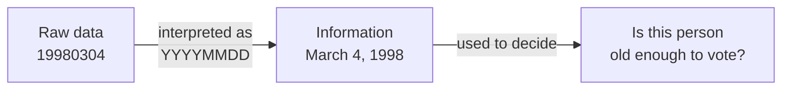
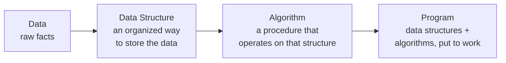

# Lecture 1: Introduction to Data Structures

Every useful program does the same three things: it holds some data, it does something
with that data, and it produces a result. **Data structures** are about the middle part —
*how* you hold the data — and it turns out that choice quietly decides whether your
program is fast or slow, simple or fragile, long before you write a single line of logic.
This lecture builds the vocabulary the rest of the course stands on: what data actually
is, what a data structure is, what an algorithm is, and why the three are inseparable.

## In This Lecture

- The difference between data and information
- Data types, and how they relate to data structures
- What a data structure actually is, formally
- What an algorithm is, and how it depends on the data structure underneath it
- The relationship among data, data structures, and algorithms
- Why data structures exist at all, and where you already rely on them daily

## Data and Information

**Data** is a collection of raw, unprocessed facts — numbers, characters, symbols — with
no meaning attached on its own. The sequence `19980304` is just data until you're told
it's a date of birth in `YYYYMMDD` format; only then does it become **information**:
data that has been organized, interpreted, or given context so it's useful for a decision.



Every program is, at its core, a machine for turning data into information — and data
structures are what make that transformation efficient instead of painful.

## Data Types

A **data type** tells the compiler two things about a value: what *kind* of data it is
(a whole number, a decimal, a single character, true/false), and therefore what
operations are legal on it and how much memory it needs.

```cpp
int studentCount = 320;      // a whole number
double gpa = 3.42;           // a decimal number
char grade = 'A';            // a single character
bool isEnrolled = true;      // true or false
```

C++ splits data types into two broad families:

| Category | Examples | Description |
|---|---|---|
| **Primitive (built-in)** | `int`, `double`, `char`, `bool` | Understood directly by the language; hold exactly one value |
| **User-defined / composite** | `struct`, `class`, arrays | Built out of primitive types, grouped together to represent something more complex |

A single `int` can hold one student's ID. But a class of 320 students, each with an ID,
a name, and a GPA? That needs something bigger than any one primitive type — and *how*
you organize that "something bigger" is exactly what a data structure is.

## Data Structures

A **data structure** is a specific way of organizing, storing, and accessing data in a
computer's memory so that it can be used efficiently. Precisely: it is a **data type**
composed of the relationships between individual data elements, together with the
functions or operations that can be applied to that arrangement.

Notice the two halves of that definition — they're both essential:

1. **The arrangement** — *how* the pieces of data relate to each other (one after another
   in a row, in a hierarchy, connected in a network).
2. **The operations** — *what* you're allowed to do with that arrangement (add an item,
   remove one, look one up, walk through them all).

The same data — say, the names of every student in a class — could be stored as a plain
list, a sorted list, or a tree of names, and each choice makes some operations fast and
others slow. Choosing a data structure is choosing *which* operations you want to be fast,
because you can rarely make everything fast at once — that trade-off is the central theme
of this entire course.

## Algorithms

An **algorithm** is a finite, well-defined, step-by-step procedure for solving a problem
or accomplishing a task — a recipe the computer can follow exactly, with no ambiguity
about what to do next. Three properties separate an algorithm from a vague set of
instructions:

- **Finite** — it must terminate after a finite number of steps, not run forever.
- **Well-defined** — every step must be precise and unambiguous.
- **Effective** — every step must be something the computer can actually carry out.

Here's the smallest possible algorithm, expressed as real, running C++: find the largest
number in a list.

```cpp title="find_largest.cpp"
#include <iostream>
#include <vector>
using namespace std;

int findLargest(const vector<int>& numbers) {
    int largest = numbers[0];          // step 1: assume the first is largest
    for (int i = 1; i < numbers.size(); i++) {  // step 2: check every other value
        if (numbers[i] > largest) {
            largest = numbers[i];      // step 3: update if we find something bigger
        }
    }
    return largest;                    // step 4: report the answer
}

int main() {
    vector<int> scores = {72, 95, 68, 88, 91};
    cout << "The largest score is: " << findLargest(scores) << endl;
    return 0;
}
```

```text
$ g++ -std=c++17 -o find_largest find_largest.cpp
$ ./find_largest
The largest score is: 95
```

Notice the algorithm above is completely tied to its data structure: it works because a
`vector` lets you ask for "element at position `i`" in one fast step. If the numbers were
stored differently — say, scattered across files with no index — the same algorithm
wouldn't even make sense to write this way. That coupling is the point of this lecture's
next section.

## The Relationship Among Data, Data Structures, and Algorithms

These three ideas form a chain, and each link depends on the one before it:



A famous formulation by Niklaus Wirth (the creator of Pascal) captures this exactly:

!!! quote "Algorithms + Data Structures = Programs"
    You cannot design a good algorithm without knowing how its data is organized, and you
    cannot pick a good data structure without knowing what operations your algorithms will
    need to perform on it. The two are designed together, not in isolation.

## Need for Data Structures

Why not just dump everything into the simplest possible container and move on? Because as
the amount of data grows, the *wrong* organization turns a fast program into an unusably
slow one. Concretely, well-chosen data structures give you:

- **Efficiency** — the right structure turns an operation that would take seconds on
  millions of records into one that takes microseconds.
- **Reusability** — a data structure implemented once (a stack, a queue, a tree) can be
  reused across many unrelated programs and problems.
- **Abstraction** — a well-designed data structure lets you *use* it (push, pop, insert,
  search) without needing to know exactly how it stores things internally.
- **Manageable complexity** — organizing related data together makes large programs
  easier to reason about, instead of tracking thousands of loose variables.

## Applications of Data Structures

You already interact with data structures every day, even if you've never written one
yourself:

| Data structure | Where you already use it |
|---|---|
| **Array** | A spreadsheet row, a list of exam scores, pixels in an image |
| **Stack** | Your browser's "back" button, undo/redo in a text editor, function calls in a running program |
| **Queue** | A printer's job queue, customers in a checkout line, messages waiting to be processed |
| **Linked List** | A music playlist's "next song," the browser history you can step through |
| **Tree** | A file system's folders and subfolders, an org chart, a website's navigation menu |
| **Graph** | A road network in Google Maps, friend connections on a social network, links between web pages |
| **Hash Table** | A dictionary/contacts app looking up a name instantly, a spell-checker |

Every one of these will get its own dedicated lecture in this course — by the end, you'll
know not just *what* each one is, but *why* it was the right choice for the job it does.

## Try It Yourself

1. For each of the following real-world scenarios, decide which data structure from the
   table above fits best, and write one sentence justifying your choice: (a) the "undo"
   feature in a word processor, (b) a to-do list app where tasks can be marked urgent,
   (c) suggesting nearby friends-of-friends on a social network.
2. Compile and run the `find_largest.cpp` example above yourself. Then modify it to also
   report the *smallest* value in the same pass, without looping over the list twice.

## Key Takeaways

- **Data** is raw and meaningless on its own; **information** is data given context and
  interpretation.
- A **data structure** is an arrangement of data plus the operations defined on that
  arrangement — the arrangement decides which operations are fast and which are slow.
- An **algorithm** is a finite, well-defined, effective step-by-step procedure — and it is
  always designed *together with* the data structure it operates on, never in isolation.
- Data + Data Structure + Algorithm = Program: each layer builds on the one before it.
- Data structures exist to buy **efficiency, reusability, abstraction, and manageable
  complexity** as programs and datasets grow — and you already rely on several of them
  (stacks, queues, trees, graphs) every time you use a computer.
