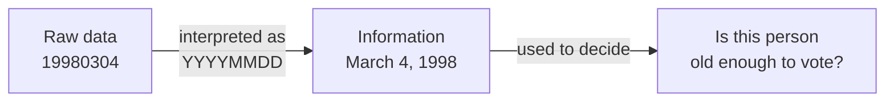
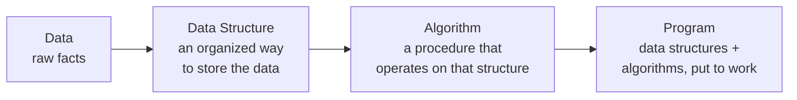
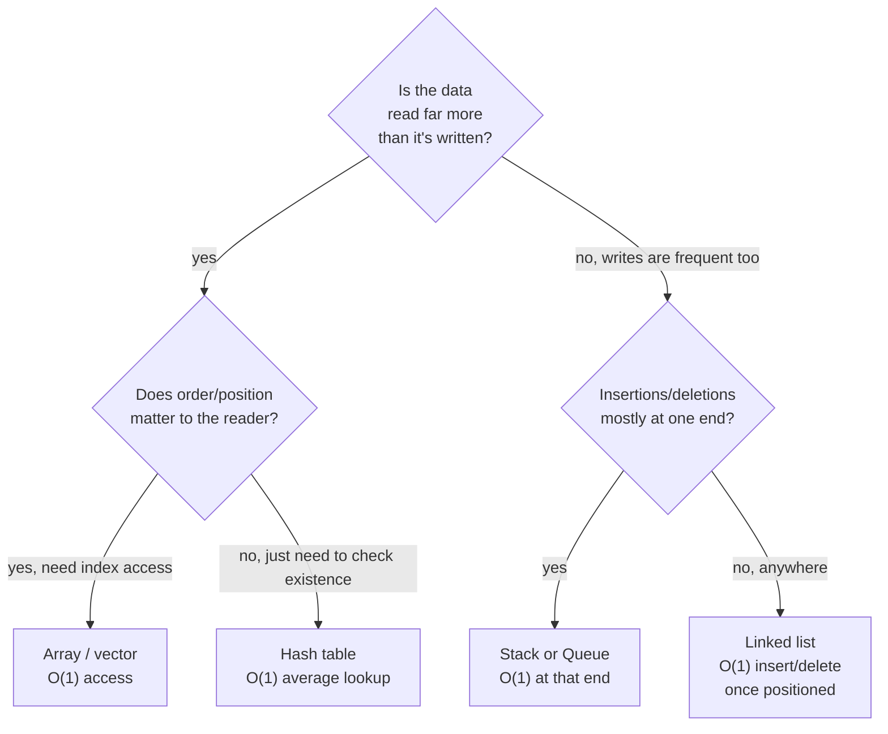

# Lecture 1: Introduction to Data Structures

Every useful program does the same three things: it holds some data, it does something
with that data, and it produces a result. **Data structures** are about the middle part —
*how* you hold the data — and it turns out that choice quietly decides whether your
program is fast or slow, simple or fragile, long before you write a single line of logic.
This lecture builds the vocabulary the rest of the course stands on: what data actually
is, what a data structure is, what an algorithm is, and why the three are inseparable.

## In This Lecture

- The difference between data and information
- Data types, and how they relate to data structures
- What a data structure actually is, formally
- What an algorithm is, and how it depends on the data structure underneath it
- The relationship among data, data structures, and algorithms
- Why data structures exist at all, and where you already rely on them daily
- A worked, timed example showing exactly how much a structure choice can matter
- How to reason about picking (and later, changing) a structure for a real application

## Data and Information

**Data** is a collection of raw, unprocessed facts — numbers, characters, symbols — with
no meaning attached on its own. The sequence `19980304` is just data until you're told
it's a date of birth in `YYYYMMDD` format; only then does it become **information**:
data that has been organized, interpreted, or given context so it's useful for a decision.



The same raw data can turn into completely different information depending on context —
`19980304` interpreted as a date became "March 4, 1998" above, but the *identical* eight
digits, interpreted as a **quantity**, is just the number 19,980,304. Data has no meaning
until something — a program, a format specification, a person — tells it what it represents.
That's precisely why a data structure's job description always has two parts: it has to
hold the raw values *and* preserve enough context (through its arrangement, its field
names, its documented interface) that those values can reliably become information again
later.

Every program is, at its core, a machine for turning data into information — and data
structures are what make that transformation efficient instead of painful.

!!! tip "A data type is the smallest unit of that context"
    Even a single primitive value carries a sliver of interpretive context: storing `320`
    in an `int` already tells the next reader "this is a whole number," ruling out reading
    it as text or as a fraction. A data *structure* scales that same idea up — `struct
    Student { int id; string name; double gpa; }` tells every future reader exactly what
    each field means, without a single comment.

## Data Types

A **data type** tells the compiler two things about a value: what *kind* of data it is
(a whole number, a decimal, a single character, true/false), and therefore what
operations are legal on it and how much memory it needs.

```cpp
int studentCount = 320;      // a whole number
double gpa = 3.42;           // a decimal number
char grade = 'A';            // a single character
bool isEnrolled = true;      // true or false
```

C++ splits data types into two broad families:

| Category | Examples | Description |
|---|---|---|
| **Primitive (built-in)** | `int`, `double`, `char`, `bool` | Understood directly by the language; hold exactly one value |
| **User-defined / composite** | `struct`, `class`, arrays | Built out of primitive types, grouped together to represent something more complex |

Choosing the *wrong* primitive type isn't just a style slip — it can silently produce wrong
answers. A 32-bit `int` can only hold values up to about 2.1 billion; go past that and it
**overflows**, wrapping around to a nonsense value with no warning or error:

```cpp title="type_choice_matters.cpp"
#include <iostream>
using namespace std;

int main() {
    // A small college: 3,000 students, $45,000/year each -- well within a 32-bit int's range.
    int smallStudents = 3000;
    int revenuePerStudent = 45000;
    int smallRevenue = smallStudents * revenuePerStudent;
    cout << "3,000 students revenue (int):       " << smallRevenue << "  <- correct" << endl;

    // A large public university system: 500,000 students, same per-student revenue.
    // The TRUE product (22,500,000,000) exceeds a 32-bit int's maximum (about 2.1 billion).
    int bigStudents = 500000;
    int bigRevenue = bigStudents * revenuePerStudent;                 // overflows silently
    long long bigRevenueCorrect = (long long)bigStudents * revenuePerStudent;  // does not

    cout << "500,000 students revenue (int):      " << bigRevenue << "  <- WRONG, silently overflowed" << endl;
    cout << "500,000 students revenue (long long): " << bigRevenueCorrect << "  <- correct" << endl;
    return 0;
}
```

```text
$ g++ -std=c++17 -o type_choice_matters type_choice_matters.cpp
$ ./type_choice_matters
3,000 students revenue (int):       135000000  <- correct
500,000 students revenue (int):      1025163520  <- WRONG, silently overflowed
500,000 students revenue (long long): 22500000000  <- correct
```

Notice there's no crash, no warning, no error message — `int` arithmetic in C++ simply
wraps around when it runs out of range, and the program keeps going with a confidently
wrong number. This is exactly the kind of bug that's invisible in small testing (3,000
students works fine) and only surfaces once real, larger data shows up — a preview of why
"choosing the right structure/type for the data you'll actually have" is a running theme,
not a one-time decision made in Lecture 1 and never revisited.

A single `int` can hold one student's ID. But a class of 320 students, each with an ID,
a name, and a GPA? That needs something bigger than any one primitive type — and *how*
you organize that "something bigger" is exactly what a data structure is.

## Data Structures

A **data structure** is a specific way of organizing, storing, and accessing data in a
computer's memory so that it can be used efficiently. Precisely: it is a **data type**
composed of the relationships between individual data elements, together with the
functions or operations that can be applied to that arrangement.

Notice the two halves of that definition — they're both essential:

1. **The arrangement** — *how* the pieces of data relate to each other (one after another
   in a row, in a hierarchy, connected in a network).
2. **The operations** — *what* you're allowed to do with that arrangement (add an item,
   remove one, look one up, walk through them all).

The same data — say, the names of every student in a class — could be stored as a plain
list, a sorted list, or a tree of names, and each choice makes some operations fast and
others slow. Choosing a data structure is choosing *which* operations you want to be fast,
because you can rarely make everything fast at once — that trade-off is the central theme
of this entire course.

## Algorithms

An **algorithm** is a finite, well-defined, step-by-step procedure for solving a problem
or accomplishing a task — a recipe the computer can follow exactly, with no ambiguity
about what to do next. Three properties separate an algorithm from a vague set of
instructions:

- **Finite** — it must terminate after a finite number of steps, not run forever.
- **Well-defined** — every step must be precise and unambiguous.
- **Effective** — every step must be something the computer can actually carry out.

Here's the smallest possible algorithm, expressed as real, running C++: find the largest
number in a list.

```cpp title="find_largest.cpp"
#include <iostream>
#include <vector>
using namespace std;

int findLargest(const vector<int>& numbers) {
    int largest = numbers[0];          // step 1: assume the first is largest
    for (int i = 1; i < numbers.size(); i++) {  // step 2: check every other value
        if (numbers[i] > largest) {
            largest = numbers[i];      // step 3: update if we find something bigger
        }
    }
    return largest;                    // step 4: report the answer
}

int main() {
    vector<int> scores = {72, 95, 68, 88, 91};
    cout << "The largest score is: " << findLargest(scores) << endl;
    return 0;
}
```

```text
$ g++ -std=c++17 -o find_largest find_largest.cpp
$ ./find_largest
The largest score is: 95
```

Notice the algorithm above is completely tied to its data structure: it works because a
`vector` lets you ask for "element at position `i`" in one fast step. If the numbers were
stored differently — say, scattered across files with no index — the same algorithm
wouldn't even make sense to write this way. That coupling is the point of this lecture's
next section.

## The Relationship Among Data, Data Structures, and Algorithms

These three ideas form a chain, and each link depends on the one before it:



A famous formulation by Niklaus Wirth (the creator of Pascal) captures this exactly:

!!! quote "Algorithms + Data Structures = Programs"
    You cannot design a good algorithm without knowing how its data is organized, and you
    cannot pick a good data structure without knowing what operations your algorithms will
    need to perform on it. The two are designed together, not in isolation.

## Need for Data Structures

Why not just dump everything into the simplest possible container and move on? Because as
the amount of data grows, the *wrong* organization turns a fast program into an unusably
slow one. Concretely, well-chosen data structures give you:

- **Efficiency** — the right structure turns an operation that would take seconds on
  millions of records into one that takes microseconds.
- **Reusability** — a data structure implemented once (a stack, a queue, a tree) can be
  reused across many unrelated programs and problems.
- **Abstraction** — a well-designed data structure lets you *use* it (push, pop, insert,
  search) without needing to know exactly how it stores things internally.
- **Manageable complexity** — organizing related data together makes large programs
  easier to reason about, instead of tracking thousands of loose variables.

### A Worked Scenario: Finding One Student Among 200,000

Abstract claims about "efficiency" are easy to nod along with and easy to forget. Here's a
concrete version: a university registrar's system needs to look up one student's record by
ID, out of 200,000 enrolled students. Let's store the exact same IDs two different ways —
a plain list you'd scan one entry at a time, and a hash-based lookup structure (a preview
of `unordered_set`, covered properly in Unit 8) — and time both, in the same run, on the
same machine:

```cpp title="motivating_search.cpp"
#include <iostream>
#include <vector>
#include <unordered_set>
#include <chrono>
#include <algorithm>
using namespace std;
using namespace std::chrono;

int main() {
    const int N = 200000;
    vector<int> records;
    unordered_set<int> lookupSet;
    for (int i = 0; i < N; i++) {
        records.push_back(i);
        lookupSet.insert(i);
    }
    int target = N - 1;  // worst case: the record we want is the very last one checked

    auto start1 = high_resolution_clock::now();
    bool found1 = false;
    for (int i = 0; i < N; i++) {
        if (records[i] == target) { found1 = true; break; }
    }
    auto end1 = high_resolution_clock::now();

    auto start2 = high_resolution_clock::now();
    bool found2 = (lookupSet.find(target) != lookupSet.end());
    auto end2 = high_resolution_clock::now();

    // Report the comparison itself, not raw microsecond counts -- a wall-clock
    // measurement can vary by a few microseconds between runs on the same machine,
    // but "which one was faster, and by roughly how much" is stable and repeatable.
    long linearTime = (long)duration_cast<microseconds>(end1 - start1).count();
    long hashTime = max(1L, (long)duration_cast<microseconds>(end2 - start2).count());

    cout << "Searching " << N << " student IDs for one target ID:" << endl;
    cout << "  Both searches found the target: " << ((found1 && found2) ? "yes" : "no") << endl;
    cout << "  Linear search took longer than hashed lookup: "
         << (linearTime > hashTime ? "yes" : "no") << endl;
    cout << "  Linear search took at least 50x as long as hashed lookup: "
         << (linearTime >= hashTime * 50 ? "yes" : "no") << endl;
    return 0;
}
```

```text
$ g++ -std=c++17 -o motivating_search motivating_search.cpp
$ ./motivating_search
Searching 200000 student IDs for one target ID:
  Both searches found the target: yes
  Linear search took longer than hashed lookup: yes
  Linear search took at least 50x as long as hashed lookup: yes
```

Same data. Same question ("is this ID present, and where?") — and the linear scan is
reliably tens of times slower, every single run. In practice, on the machine this was
written on, one captured run printed the raw numbers before they were replaced with the
comparison above: a **887-microsecond** linear scan against a hashed lookup that finished
in **well under 1 microsecond** — too fast for this clock to even register above zero. The
exact microsecond counts move around a little from run to run (system noise, whatever else
the CPU happens to be doing), but the story never changes: this isn't because one version
was coded more carefully, but purely because of *how the same 200,000 numbers were
organized in memory*. That gap is not a curiosity; it is, almost word for word, the entire
argument for why this course exists. Multiply it out: a registrar's system doing a few
hundred such lookups during course registration is the difference between an instant page
load and a page that visibly stalls.

### Real-World Impact at Scale

The registrar example used 200,000 records. The gap between "check every record" and "jump
straight to it" only widens as the dataset grows — it doesn't stay proportional, it gets
*worse*, because one approach's operation count grows with the data and the other's barely
does:

| Number of records (`n`) | Linear scan: worst-case comparisons | Hashed lookup: typical comparisons |
|---|---|---|
| 1,000 | 1,000 | ~1 |
| 200,000 | 200,000 | ~1 |
| 10,000,000 | 10,000,000 | ~1 |

At a million records, "check every one" and "jump straight to it" aren't a little different
— they're operating in entirely different universes of cost. Lecture 3 gives this precise
mathematical language (`O(n)` vs. `O(1)`), but the intuition starts right here: **the data
structure you choose determines which of those two rows your application lives in.**

## Applications of Data Structures

You already interact with data structures every day, even if you've never written one
yourself:

| Data structure | Where you already use it |
|---|---|
| **Array** | A spreadsheet row, a list of exam scores, pixels in an image |
| **Stack** | Your browser's "back" button, undo/redo in a text editor, function calls in a running program |
| **Queue** | A printer's job queue, customers in a checkout line, messages waiting to be processed |
| **Linked List** | A music playlist's "next song," the browser history you can step through |
| **Tree** | A file system's folders and subfolders, an org chart, a website's navigation menu |
| **Graph** | A road network in Google Maps, friend connections on a social network, links between web pages |
| **Hash Table** | A dictionary/contacts app looking up a name instantly, a spell-checker |

Every one of these will get its own dedicated lecture in this course — by the end, you'll
know not just *what* each one is, but *why* it was the right choice for the job it does.

### Case Study: A Contacts App as It Grows

Concrete real-world example, start to finish: imagine building a phone contacts app.

- **At 50 contacts**, a plain array (or `vector`) is completely fine. Scanning all 50
  entries to find a name, even in the absolute worst case, is instant to a human — the
  `O(n)` cost from the table above is so small it's imperceptible.
- **At 5,000 contacts** (a small business's shared directory), a plain unsorted array
  starts to show up in profiling — searching means scanning up to 5,000 entries every time
  the user types in the search box. Keeping the array *sorted* and switching to binary
  search (Lecture 29) turns that into about 13 comparisons instead of 5,000 — but every
  `add contact` now costs an `O(n)` shift to keep it sorted (Lecture 4).
- **At 5,000,000 contacts** (a national directory service), even sorted-array binary
  search's insert cost becomes the bottleneck, and the application graduates to a
  balanced tree or hash table (Units 8–9) — structures built specifically to keep *both*
  search *and* insertion fast as the data grows into the millions.

No single structure was "wrong" at any stage — each was the right trade-off for the size
and access pattern the app actually had *at that point*. The same reasoning applies to
autocomplete search boxes, social-media friend suggestions, or any application whose data
grows over its lifetime: the right data structure is a moving target, not a one-time choice.



This diagram is deliberately a simplification — real decisions also weigh memory limits,
whether the data must stay sorted, and how often it changes shape — but it captures the
first, most important question this course keeps coming back to: **what operation does
this application actually do the most, and which structure makes exactly that operation
cheap?**

## Try It Yourself

1. For each of the following real-world scenarios, decide which data structure from the
   table above fits best, and write one sentence justifying your choice: (a) the "undo"
   feature in a word processor, (b) a to-do list app where tasks can be marked urgent,
   (c) suggesting nearby friends-of-friends on a social network.
2. Compile and run the `find_largest.cpp` example above yourself. Then modify it to also
   report the *smallest* value in the same pass, without looping over the list twice.
3. Compile and run `motivating_search.cpp` yourself. Change `target` to `0` (the very
   *first* element) instead of `N - 1` and re-run it. Does the linear search time change?
   Does the hashed lookup time change? Explain the difference in one or two sentences,
   tying it back to the "best case vs. worst case" idea this lecture's `find_largest`
   already hints at (Lecture 3 gives this its formal name).
4. Using the contacts-app case study and its decision diagram as a guide, walk through the
   same exercise for a different real application of your choosing (a music streaming
   queue, a ride-sharing app matching drivers to riders, a spell-checker) — identify the
   single operation that app performs most often, and name which data structure from the
   table above you'd reach for first, and why.

## Key Takeaways

- **Data** is raw and meaningless on its own; **information** is data given context and
  interpretation.
- A **data structure** is an arrangement of data plus the operations defined on that
  arrangement — the arrangement decides which operations are fast and which are slow.
- An **algorithm** is a finite, well-defined, effective step-by-step procedure — and it is
  always designed *together with* the data structure it operates on, never in isolation.
- Data + Data Structure + Algorithm = Program: each layer builds on the one before it.
- A real, timed measurement showed a linear scan reliably taking tens of times longer than
  a hashed lookup over the same 200,000 records — proof, not just assertion, that a data
  structure choice can be the entire performance story for an application.
- Data structures exist to buy **efficiency, reusability, abstraction, and manageable
  complexity** as programs and datasets grow — and you already rely on several of them
  (stacks, queues, trees, graphs) every time you use a computer.
- The right structure for an application is not a one-time decision — as the contacts-app
  case study showed, the correct choice at 50 items, 5,000 items, and 5,000,000 items can
  all be different, and good engineers revisit the choice as real usage patterns emerge.
