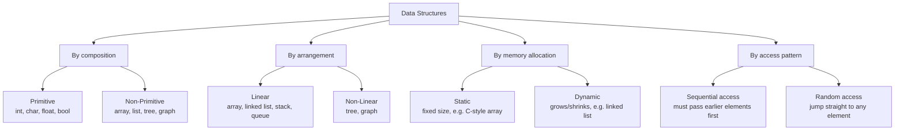

# Lecture 2: Classification, Operations, and Abstract Data Types

Lecture 1 defined *what* a data structure is. Before you can choose the right one for a
job, you need a map of the landscape — the handful of dimensions along which every data
structure can be classified — and a precise way to talk about what a data structure
*promises to do*, separate from how it actually does it. That second idea, the **Abstract
Data Type**, is one of the most important concepts in this entire course.

## In This Lecture

- Six criteria used to classify any data structure
- The standard operations every data structure exposes in some form
- What an Abstract Data Type (ADT) is, and why interface and implementation are kept separate
- Abstraction and encapsulation, and how C++ actually enforces them
- The trade-offs — time vs. space, simplicity vs. efficiency — behind every design choice

## Criteria for Classification of Data Structures

There is no single "type" of data structure — instead, every data structure can be placed
along several independent axes at once. A `std::vector` and a linked list, for example,
are both **linear**, but one is **static-ish** (contiguous, resizes in chunks) and the
other is genuinely **dynamic** (grows one node at a time).



### Primitive vs. Non-Primitive

**Primitive** data structures are the built-in types the language gives you for free —
`int`, `char`, `float`, `bool` — each holding a single value. **Non-primitive** data
structures are built *from* those primitives, combining many values into one organized
whole: arrays, linked lists, stacks, queues, trees, and graphs.

### Linear vs. Non-Linear

A structure is **linear** if its elements form a sequence — each element (except the
first and last) has exactly one predecessor and one successor. Arrays, linked lists,
stacks, and queues are all linear. A structure is **non-linear** if an element can connect
to more than one other element at once — a tree node can have several children, a graph
vertex can have many neighbors.

### Static vs. Dynamic

A **static** data structure has a fixed size decided when it's created — a plain
C-style array `int scores[100]` can never hold more than 100 elements without creating an
entirely new array. A **dynamic** data structure can grow and shrink while the program
runs, allocating exactly as much memory as it currently needs — a linked list is the
clearest example: every insertion allocates one more node, every deletion frees one.

### Sequential vs. Random Access

**Sequential access** means reaching element *N* requires visiting elements 1 through
*N-1* first — true of a linked list, where the only way to element 5 is through elements
1–4. **Random access** means jumping straight to any element in one step, given its
position — true of an array, where `scores[5]` is exactly as fast as `scores[0]`.

### Persistent vs. Ephemeral

An **ephemeral** data structure only ever remembers its *current* state — when you modify
it, the old version is gone. Almost every data structure you'll build in this course is
ephemeral. A **persistent** data structure preserves *every* previous version of itself as
you modify it, so you can go back and query "what did this look like before the last
change?" — the kind of structure behind an editor's full undo history or Git's commit
history, where nothing is ever truly overwritten.

## Operations on Data Structures

Regardless of which structure you're using, the operations you perform on it fall into a
small, recurring set:

| Operation | Meaning |
|---|---|
| **Traversal** | Visit every element, typically to process or display each one |
| **Insertion** | Add a new element |
| **Deletion** | Remove an existing element |
| **Searching** | Find whether (and where) a given value exists |
| **Sorting** | Rearrange elements into a defined order |
| **Updating** | Modify the value of an existing element |
| **Merging** | Combine two data structures of the same type into one |

Every lecture from here on is really answering the same question for a new structure:
*how efficiently can it perform each of these seven operations, and which ones is it
actually good at?*

## Abstract Data Types and Data Structure Design

### Abstract Data Type (ADT)

An **Abstract Data Type** is a mathematical, logical description of a data structure —
*what* operations it supports and *what* they do — with no mention of *how* it's built
underneath. "A Stack supports `push`, `pop`, and `peek`, and `pop` always removes the most
recently pushed item" is a complete ADT description. Nothing in it says whether the stack
is backed by an array or a linked list — and that's the entire point.

### Interface and Implementation

The **interface** is the ADT's public promise — the operation names, their inputs, and
their outputs. The **implementation** is the actual code that makes those operations
work. C++'s `class` keyword lets you write both while keeping them visibly separate:

```cpp title="int_bag.h — an ADT interface"
class IntBag {
public:
    void add(int value);      // interface: what you can DO
    bool contains(int value) const;
    int size() const;
private:
    // implementation: how it's actually stored — callers never see this
    int data[100];
    int count = 0;
};
```

```cpp title="int_bag_demo.cpp"
#include <iostream>
using namespace std;

class IntBag {
public:
    void add(int value) { data[count++] = value; }
    bool contains(int value) const {
        for (int i = 0; i < count; i++) {
            if (data[i] == value) return true;
        }
        return false;
    }
    int size() const { return count; }
private:
    int data[100];
    int count = 0;
};

int main() {
    IntBag bag;
    bag.add(7);
    bag.add(42);
    bag.add(15);

    cout << "Bag size: " << bag.size() << endl;
    cout << "Contains 42? " << (bag.contains(42) ? "yes" : "no") << endl;
    cout << "Contains 99? " << (bag.contains(99) ? "yes" : "no") << endl;
    return 0;
}
```

```text
$ g++ -std=c++17 -o int_bag_demo int_bag_demo.cpp
$ ./int_bag_demo
Bag size: 3
Contains 42? yes
Contains 99? no
```

Whoever calls `bag.add(42)` never needs to know it's a fixed-size array under the hood —
tomorrow you could swap `data[100]` for a dynamically growing array, and every single
line of code that *uses* `IntBag` would keep working, unchanged. That's the payoff of
separating interface from implementation.

### Abstraction and Encapsulation

**Abstraction** means exposing only what a user of the ADT needs to know (`add`,
`contains`, `size`) and hiding everything else. **Encapsulation** is the mechanism C++
gives you to enforce that: the `private` section physically prevents outside code from
touching `data` or `count` directly — the compiler will reject `bag.data[0] = 5;` with an
error, not just a style guideline.

```cpp
// bag.data[0] = 5;   // ERROR: 'data' is private within this context
bag.add(5);           // OK — goes through the public interface
```

## Trade-offs in Data Structure Design

No data structure is best at everything — every design decision trades one thing for
another.

- **Time-space trade-off.** A hash table (covered in Unit 8) answers "is this value
  present?" almost instantly, but it spends extra memory to do it. A plain array uses
  less memory but may have to check every element to answer the same question.
- **Simplicity vs. efficiency.** A simple, unsorted array is trivial to implement and
  insert into — but searching it means checking every element. Keeping it sorted makes
  searching much faster (binary search, Unit 7) but makes every insertion slower, since
  elements may need to shift to stay in order.

### Criteria for Selecting an Appropriate Data Structure

When choosing a structure for a real problem, ask:

1. What operations does the application perform *most often* — lots of lookups? Lots of
   insertions? Rare deletions?
2. How much data will it realistically need to hold, and does that size change at runtime?
3. Is memory usage a hard constraint (embedded systems, mobile), or is speed the priority?
4. How will the application's needs likely change as it grows?

### Impact of Evolving Application Requirements

A choice that's correct today can become wrong tomorrow. A contact list built as a plain
array is perfectly fine for 50 contacts — but if the application grows to millions of
users and needs instant lookup by name, that same array becomes the bottleneck, and a
hash table or a balanced tree becomes the right call instead. Good engineers revisit their
data structure choices as an application's real usage pattern becomes clear, rather than
treating the first choice as permanent.

## Try It Yourself

1. Classify a `std::string` in C++ along all four axes from this lecture: is it primitive
   or non-primitive, linear or non-linear, static or dynamic, sequential or random access?
   Justify each answer in one sentence.
2. Extend the `IntBag` example with a `remove(int value)` method that deletes the first
   occurrence of `value` (shift later elements left by one to fill the gap). Compile and
   run it to confirm `size()` decreases correctly after a removal.

## Key Takeaways

- Every data structure can be classified along several independent axes at once:
  primitive/non-primitive, linear/non-linear, static/dynamic, sequential/random access,
  and ephemeral/persistent.
- Every data structure supports some combination of seven core operations: traversal,
  insertion, deletion, searching, sorting, updating, and merging.
- An **Abstract Data Type (ADT)** describes *what* a structure does, completely separate
  from *how* it's implemented — this is what lets an implementation change without
  breaking any code that uses it.
- **Abstraction** (expose only what's needed) and **encapsulation** (C++'s `private`
  keyword enforcing that) are how ADTs are actually built in real code.
- Every design is a trade-off — usually time vs. space, or simplicity vs. efficiency —
  and the right choice depends on which operations the application actually needs to be
  fast, and can shift as the application's requirements evolve.
