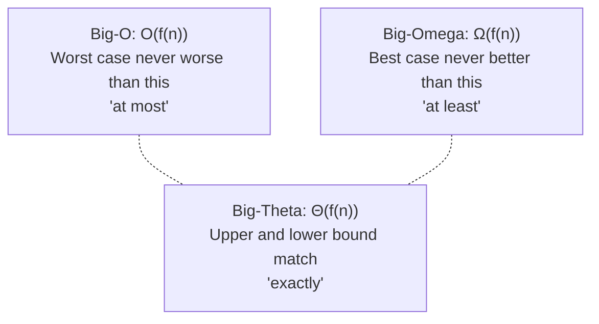

# Lecture 3: Algorithm Analysis and Complexity

"Which one is better?" is a question you'll ask constantly in this course, comparing two
ways of solving the same problem. This lecture gives you the tools to answer it precisely
instead of by gut feeling: how to measure an algorithm's efficiency in a way that doesn't
depend on which computer it runs on, and the notation — **Big-O** — that the rest of this
course (and the rest of your career) will use to talk about it.

## In This Lecture

- Why we measure algorithms by counting operations, not by timing them with a stopwatch
- Time complexity vs. space complexity
- Best-case, average-case, and worst-case analysis
- Asymptotic analysis, and the three notations: Big-O, Big-Theta, Big-Omega
- The common complexity classes you'll see again and again this semester

## Algorithm Efficiency

Two programs can solve the exact same problem and still behave completely differently as
the input grows. Timing them with a stopwatch is tempting but misleading — the result
depends on the CPU, the programming language, how busy the machine is, even the weather.
What we actually want is a measure of efficiency that's true on *any* computer, forever.
The answer: count how the number of **basic operations** grows as the input size (call it
`n`) grows, and ignore everything else.

```cpp title="growth_demo.cpp"
#include <iostream>
using namespace std;

// Counts comparisons instead of timing — the count is identical on every machine, every run.
long countComparisons(int n) {
    long comparisons = 0;
    for (int i = 0; i < n; i++) {
        for (int j = 0; j < n; j++) {
            comparisons++;   // one "basic operation" per inner-loop pass
        }
    }
    return comparisons;
}

int main() {
    for (int n : {10, 20, 40, 80}) {
        cout << "n = " << n << " -> " << countComparisons(n) << " comparisons" << endl;
    }
    return 0;
}
```

```text
$ g++ -std=c++17 -o growth_demo growth_demo.cpp
$ ./growth_demo
n = 10 -> 100 comparisons
n = 20 -> 400 comparisons
n = 40 -> 1600 comparisons
n = 80 -> 6400 comparisons
```

Look at the pattern: every time `n` doubles, the operation count *quadruples* (100 → 400
→ 1600 → 6400). That's not a coincidence of this particular machine — it's a mathematical
property of the nested loop itself (`n × n = n²`), and it will hold true on any computer
that ever runs this code. That's what algorithm analysis actually measures.

## Time Complexity and Space Complexity

- **Time complexity** describes how the number of basic operations an algorithm performs
  grows as a function of the input size `n`.
- **Space complexity** describes how much extra memory an algorithm needs, beyond the
  input itself, as a function of `n`.

The two are often in tension — an algorithm can be sped up by using more memory (caching
results instead of recomputing them), or made more memory-frugal at the cost of extra
time. You'll see this trade-off again in Lecture 2's discussion and throughout this course.

## Best, Average, and Worst-Case Analysis

The *same* algorithm can perform very differently depending on the specific input it's
given, not just the input's size. Consider linear search — checking a list one element at
a time for a target value:

```cpp title="best_worst_case.cpp"
#include <iostream>
#include <vector>
using namespace std;

int linearSearch(const vector<int>& data, int target, long& comparisons) {
    comparisons = 0;
    for (int i = 0; i < data.size(); i++) {
        comparisons++;
        if (data[i] == target) return i;
    }
    return -1;
}

int main() {
    vector<int> data = {4, 8, 15, 16, 23, 42};
    long comparisons;

    linearSearch(data, 4, comparisons);
    cout << "Best case (found immediately): " << comparisons << " comparison(s)" << endl;

    linearSearch(data, 42, comparisons);
    cout << "Worst case (found at the end):  " << comparisons << " comparison(s)" << endl;

    linearSearch(data, 99, comparisons);
    cout << "Worst case (not found at all):  " << comparisons << " comparison(s)" << endl;
    return 0;
}
```

```text
$ g++ -std=c++17 -o best_worst_case best_worst_case.cpp
$ ./best_worst_case
Best case (found immediately): 1 comparison(s)
Worst case (found at the end):  6 comparison(s)
Worst case (not found at all):  6 comparison(s)
```

- **Best case** — the most favorable input possible (the target is the very first
  element). Rarely useful for real planning, since you can't count on always getting lucky.
- **Worst case** — the least favorable input possible (the target is last, or absent
  entirely). This is the number engineers actually design around, because it's the
  guarantee you can rely on no matter what input shows up.
- **Average case** — the expected number of operations across all possible inputs,
  typically the more mathematically involved analysis of the three.

Unless stated otherwise, **this course (and the industry) defaults to worst-case
analysis** when we say "the complexity of an algorithm."

## Asymptotic Analysis

**Asymptotic analysis** studies how an algorithm's resource use grows as `n` approaches
infinity, deliberately ignoring constant factors and lower-order terms — because for large
enough `n`, they stop mattering. An algorithm that does `3n + 20` operations and one that
does `n` operations both belong to the same growth category; an algorithm that does `n²`
operations belongs to a fundamentally different, worse one, no matter what the constants
are.

### Big-O Notation: the Upper Bound

**Big-O**, written `O(f(n))`, describes the **worst-case upper bound** on an algorithm's
growth — a guarantee that it will never do *more* than roughly `f(n)` work, for large
`n`. It is by far the notation you will use the most in this course, because it answers
the practical question: "how bad can this possibly get?"

### Big-Omega Notation: the Lower Bound

**Big-Omega**, written `Ω(f(n))`, describes a **lower bound** — a guarantee that the
algorithm will do *at least* roughly `f(n)` work. Linear search is `Ω(1)` (it might get
lucky on the first element) but also `O(n)` (it might have to check every element).

### Big-Theta Notation: the Tight Bound

**Big-Theta**, written `Θ(f(n))`, is used when the upper and lower bounds match — the
algorithm's growth is *exactly* `f(n)`, not just bounded by it. Summing every element of
an array is `Θ(n)`: it always visits every element, no more, no less, regardless of the
data.



## Common Complexity Classes

Listed from fastest-growing-slowest to fastest-growing-worst, for an input of size `n`:

| Notation | Name | Example |
|---|---|---|
| `O(1)` | Constant | Accessing `array[5]` — one step, regardless of array size |
| `O(log n)` | Logarithmic | Binary search (Lecture 29) — halves the search space each step |
| `O(n)` | Linear | Linear search, printing every element once |
| `O(n log n)` | Linearithmic | Merge sort, quick sort (Lecture 31) |
| `O(n²)` | Quadratic | Bubble sort, nested loops over the same input (Lecture 30) |
| `O(2ⁿ)` | Exponential | Naive recursive Fibonacci (Lecture 12) — grows explosively |

```cpp title="complexity_classes.cpp"
#include <iostream>
#include <cmath>
using namespace std;

int main() {
    cout << "n\tO(1)\tO(log n)\tO(n)\tO(n log n)\tO(n^2)" << endl;
    for (int n : {1, 2, 4, 8, 16, 32}) {
        cout << n << "\t1\t"
             << (int)ceil(log2(n == 0 ? 1 : n)) << "\t\t"
             << n << "\t"
             << (int)(n * ceil(log2(n == 0 ? 1 : n))) << "\t\t"
             << n * n << endl;
    }
    return 0;
}
```

```text
$ g++ -std=c++17 -o complexity_classes complexity_classes.cpp
$ ./complexity_classes
n       O(1)    O(log n)        O(n)    O(n log n)      O(n^2)
1       1       0               1       0               1
2       1       1               2       2               4
4       1       2               4       8               16
8       1       3               8       24              64
16      1       4               16      64              256
32      1       5               32      160             1024
```

Notice how quickly `O(n²)` pulls away from the others — at `n = 32`, it's already doing
1024 operations while `O(n)` is only doing 32. This gap only gets worse as `n` grows,
which is exactly why choosing the right algorithm matters more than choosing a faster
computer: a faster machine buys you a constant-factor speedup, but a better algorithm
changes the entire growth curve.

## Try It Yourself

1. Classify each of these operations by its Big-O complexity in terms of `n`, the size of
   the input: (a) accessing the middle element of a `vector` by index, (b) printing every
   element of a `vector` once, (c) comparing every pair of elements in a `vector` to each
   other.
2. Modify `growth_demo.cpp` to count comparisons for a *single* loop instead of a nested
   one, and confirm from the output that doubling `n` only doubles the operation count —
   the signature of `O(n)` instead of `O(n²)`.

## Key Takeaways

- Algorithms are analyzed by counting how **basic operations** grow with input size `n`,
  not by timing them — this makes the analysis true on any machine, forever.
- **Time complexity** measures operation growth; **space complexity** measures extra
  memory growth — both are functions of `n`.
- **Best-case**, **average-case**, and **worst-case** describe the *same* algorithm's
  behavior on different inputs; this course defaults to worst-case unless stated otherwise.
- **Big-O** is an upper bound ("at most"), **Big-Omega** is a lower bound ("at least"),
  and **Big-Theta** is a tight bound where both match ("exactly") — Big-O is the one
  you'll use constantly.
- Memorize the common classes in growth order: `O(1) < O(log n) < O(n) < O(n log n) <
  O(n²) < O(2ⁿ)` — every remaining lecture in this course will describe its operations in
  these exact terms.
