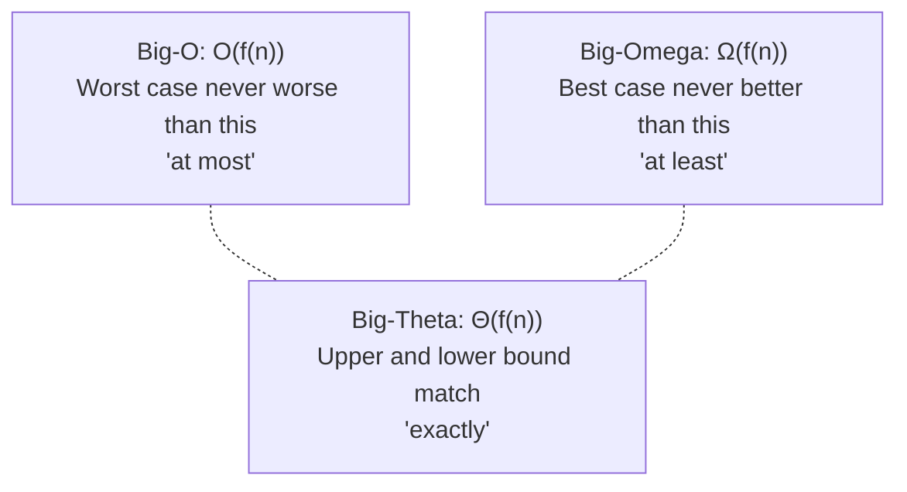
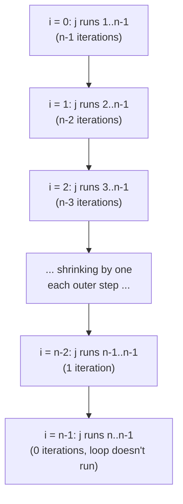

# Lecture 3: Algorithm Analysis and Complexity

"Which one is better?" is a question you'll ask constantly in this course, comparing two
ways of solving the same problem. This lecture gives you the tools to answer it precisely
instead of by gut feeling: how to measure an algorithm's efficiency in a way that doesn't
depend on which computer it runs on, and the notation — **Big-O** — that the rest of this
course (and the rest of your career) will use to talk about it.

## In This Lecture

- Why we measure algorithms by counting operations, not by timing them with a stopwatch
- Time complexity vs. space complexity
- Best-case, average-case, and worst-case analysis
- Asymptotic analysis, and the three notations: Big-O, Big-Theta, Big-Omega
- The common complexity classes you'll see again and again this semester
- Deriving Big-O by hand for a nested loop whose bound isn't immediately obvious
- Real, timed comparisons across O(log n), O(n), and O(n²) code, side by side

## Algorithm Efficiency

Two programs can solve the exact same problem and still behave completely differently as
the input grows. Timing them with a stopwatch is tempting but misleading — the result
depends on the CPU, the programming language, how busy the machine is, even the weather.
What we actually want is a measure of efficiency that's true on *any* computer, forever.
The answer: count how the number of **basic operations** grows as the input size (call it
`n`) grows, and ignore everything else.

```cpp title="growth_demo.cpp"
#include <iostream>
using namespace std;

// Counts comparisons instead of timing — the count is identical on every machine, every run.
long countComparisons(int n) {
    long comparisons = 0;
    for (int i = 0; i < n; i++) {
        for (int j = 0; j < n; j++) {
            comparisons++;   // one "basic operation" per inner-loop pass
        }
    }
    return comparisons;
}

int main() {
    for (int n : {10, 20, 40, 80}) {
        cout << "n = " << n << " -> " << countComparisons(n) << " comparisons" << endl;
    }
    return 0;
}
```

```text
$ g++ -std=c++17 -o growth_demo growth_demo.cpp
$ ./growth_demo
n = 10 -> 100 comparisons
n = 20 -> 400 comparisons
n = 40 -> 1600 comparisons
n = 80 -> 6400 comparisons
```

Look at the pattern: every time `n` doubles, the operation count *quadruples* (100 → 400
→ 1600 → 6400). That's not a coincidence of this particular machine — it's a mathematical
property of the nested loop itself (`n × n = n²`), and it will hold true on any computer
that ever runs this code. That's what algorithm analysis actually measures.

## Time Complexity and Space Complexity

- **Time complexity** describes how the number of basic operations an algorithm performs
  grows as a function of the input size `n`.
- **Space complexity** describes how much extra memory an algorithm needs, beyond the
  input itself, as a function of `n`.

The two are often in tension — an algorithm can be sped up by using more memory (caching
results instead of recomputing them), or made more memory-frugal at the cost of extra
time. You'll see this trade-off again in Lecture 2's discussion and throughout this course.

## Best, Average, and Worst-Case Analysis

The *same* algorithm can perform very differently depending on the specific input it's
given, not just the input's size. Consider linear search — checking a list one element at
a time for a target value:

```cpp title="best_worst_case.cpp"
#include <iostream>
#include <vector>
using namespace std;

int linearSearch(const vector<int>& data, int target, long& comparisons) {
    comparisons = 0;
    for (int i = 0; i < data.size(); i++) {
        comparisons++;
        if (data[i] == target) return i;
    }
    return -1;
}

int main() {
    vector<int> data = {4, 8, 15, 16, 23, 42};
    long comparisons;

    linearSearch(data, 4, comparisons);
    cout << "Best case (found immediately): " << comparisons << " comparison(s)" << endl;

    linearSearch(data, 42, comparisons);
    cout << "Worst case (found at the end):  " << comparisons << " comparison(s)" << endl;

    linearSearch(data, 99, comparisons);
    cout << "Worst case (not found at all):  " << comparisons << " comparison(s)" << endl;
    return 0;
}
```

```text
$ g++ -std=c++17 -o best_worst_case best_worst_case.cpp
$ ./best_worst_case
Best case (found immediately): 1 comparison(s)
Worst case (found at the end):  6 comparison(s)
Worst case (not found at all):  6 comparison(s)
```

- **Best case** — the most favorable input possible (the target is the very first
  element). Rarely useful for real planning, since you can't count on always getting lucky.
- **Worst case** — the least favorable input possible (the target is last, or absent
  entirely). This is the number engineers actually design around, because it's the
  guarantee you can rely on no matter what input shows up.
- **Average case** — the expected number of operations across all possible inputs,
  typically the more mathematically involved analysis of the three.

Unless stated otherwise, **this course (and the industry) defaults to worst-case
analysis** when we say "the complexity of an algorithm."

## Asymptotic Analysis

**Asymptotic analysis** studies how an algorithm's resource use grows as `n` approaches
infinity, deliberately ignoring constant factors and lower-order terms — because for large
enough `n`, they stop mattering. An algorithm that does `3n + 20` operations and one that
does `n` operations both belong to the same growth category; an algorithm that does `n²`
operations belongs to a fundamentally different, worse one, no matter what the constants
are.

### Big-O Notation: the Upper Bound

**Big-O**, written `O(f(n))`, describes the **worst-case upper bound** on an algorithm's
growth — a guarantee that it will never do *more* than roughly `f(n)` work, for large
`n`. It is by far the notation you will use the most in this course, because it answers
the practical question: "how bad can this possibly get?"

### Big-Omega Notation: the Lower Bound

**Big-Omega**, written `Ω(f(n))`, describes a **lower bound** — a guarantee that the
algorithm will do *at least* roughly `f(n)` work. Linear search is `Ω(1)` (it might get
lucky on the first element) but also `O(n)` (it might have to check every element).

### Big-Theta Notation: the Tight Bound

**Big-Theta**, written `Θ(f(n))`, is used when the upper and lower bounds match — the
algorithm's growth is *exactly* `f(n)`, not just bounded by it. Summing every element of
an array is `Θ(n)`: it always visits every element, no more, no less, regardless of the
data.



## Common Complexity Classes

Listed from fastest-growing-slowest to fastest-growing-worst, for an input of size `n`:

| Notation | Name | Example |
|---|---|---|
| `O(1)` | Constant | Accessing `array[5]` — one step, regardless of array size |
| `O(log n)` | Logarithmic | Binary search (Lecture 29) — halves the search space each step |
| `O(n)` | Linear | Linear search, printing every element once |
| `O(n log n)` | Linearithmic | Merge sort, quick sort (Lecture 31) |
| `O(n²)` | Quadratic | Bubble sort, nested loops over the same input (Lecture 30) |
| `O(n³)` | Cubic | Naive matrix multiplication — three nested loops over the same dimension |
| `O(2ⁿ)` | Exponential | Naive recursive Fibonacci (Lecture 12) — grows explosively |

```cpp title="complexity_classes.cpp"
#include <iostream>
#include <cmath>
using namespace std;

int main() {
    cout << "n\tO(1)\tO(log n)\tO(n)\tO(n log n)\tO(n^2)" << endl;
    for (int n : {1, 2, 4, 8, 16, 32}) {
        cout << n << "\t1\t"
             << (int)ceil(log2(n == 0 ? 1 : n)) << "\t\t"
             << n << "\t"
             << (int)(n * ceil(log2(n == 0 ? 1 : n))) << "\t\t"
             << n * n << endl;
    }
    return 0;
}
```

```text
$ g++ -std=c++17 -o complexity_classes complexity_classes.cpp
$ ./complexity_classes
n	O(1)	O(log n)	O(n)	O(n log n)	O(n^2)
1	1	0		1	0		1
2	1	1		2	2		4
4	1	2		4	8		16
8	1	3		8	24		64
16	1	4		16	64		256
32	1	5		32	160		1024
```

Notice how quickly `O(n²)` pulls away from the others — at `n = 32`, it's already doing
1024 operations while `O(n)` is only doing 32. This gap only gets worse as `n` grows,
which is exactly why choosing the right algorithm matters more than choosing a faster
computer: a faster machine buys you a constant-factor speedup, but a better algorithm
changes the entire growth curve.

### Why Each Class Looks the Way It Does

It's worth pausing on *why* these examples land in the classes they do, since the reasoning
pattern repeats constantly:

- **O(1) — array access.** One multiplication and one addition (Lecture 4's address
  formula), regardless of how large the array is. Size never enters the calculation.
- **O(log n) — binary search.** Each comparison eliminates *half* of what's left, so the
  question "how many halvings until 1 element remains?" is exactly `log₂ n`.
- **O(n) — linear search.** In the worst case, every one of the `n` elements gets exactly
  one comparison. No more, no less.
- **O(n log n) — merge sort.** `log n` levels of "splitting in half," and at each level, a
  full `O(n)` pass to merge results back together: `n` work, done `log n` times.
- **O(n²) — bubble sort / nested loops.** For every one of the `n` elements (outer loop),
  the inner loop does up to `n` more comparisons — `n` repeated `n` times.
- **O(n³) — naive matrix multiplication.** Computing each of the `n²` entries of the result
  matrix requires summing `n` products, giving `n² × n = n³` total multiplications.
- **O(2ⁿ) — naive recursive Fibonacci.** Every call (past the base case) spawns two more
  calls, doubling the work at every level of recursion — the defining shape of exponential
  growth (Lecture 12 shows exactly why, and how to fix it).

## Deriving Big-O by Hand: A Nested Loop with a Non-Obvious Bound

The nested loop in `growth_demo.cpp` above was the easy case: both loops run the full `n`
times, so the total is transparently `n × n = n²`. Many real nested loops don't make it
that obvious — the inner loop's bound often *depends on the outer loop's current index*,
and it's tempting to assume that automatically means "less than `n²`" or even "just `O(n)`."
Let's derive it properly instead of guessing, for a loop that counts every unique pair of
elements in a list:



The inner loop's work shrinks by one every time the outer loop advances — a **triangle**,
not a rectangle. That shape is exactly why the sum below works out to roughly *half* of the
full `n × n` square.

```cpp title="nested_bound.cpp"
#include <iostream>
using namespace std;

// Counts how many times the inner loop body runs, where the inner loop's
// bound DEPENDS on the outer loop's current index -- a common source of
// confusion when first computing Big-O by hand.
long countPairs(int n) {
    long count = 0;
    for (int i = 0; i < n; i++) {
        for (int j = i + 1; j < n; j++) {   // starts at i+1, not 0
            count++;
        }
    }
    return count;
}

int main() {
    for (int n : {4, 8, 16, 32}) {
        cout << "n = " << n << " -> " << countPairs(n) << " pairs checked" << endl;
    }
    return 0;
}
```

```text
$ g++ -std=c++17 -o nested_bound nested_bound.cpp
$ ./nested_bound
n = 4 -> 6 pairs checked
n = 8 -> 28 pairs checked
n = 16 -> 120 pairs checked
n = 32 -> 496 pairs checked
```

Now derive that by hand. When `i = 0`, the inner loop runs `n - 1` times (`j` goes from `1`
to `n-1`). When `i = 1`, it runs `n - 2` times. In general, when the outer loop is at `i`,
the inner loop runs `n - 1 - i` times. Summing across every value of `i` from `0` to `n-1`:

```text
total = (n-1) + (n-2) + (n-3) + ... + 1 + 0
      = sum from k=0 to n-1 of k
      = n(n-1) / 2          (the standard formula for summing 0..n-1)
      = (n² - n) / 2
```

Check it against the real output: for `n = 8`, the formula gives `(64 - 8) / 2 = 28` —
exactly what the program printed. For `n = 32`, `(1024 - 32) / 2 = 496` — matches again.

The final step is the asymptotic one: `(n² - n) / 2` has two terms, `n²/2` and `-n/2`. As
`n` grows large, the `n²/2` term completely dominates the `-n/2` term (at `n = 1,000,000`,
`n²/2` is `500,000,000,000` while `n/2` is only `500,000` — utterly negligible by
comparison). Big-O analysis drops the lower-order term *and* the constant factor of `1/2`,
leaving:

```text
O((n² - n) / 2)  =  O(n²)
```

Even though this loop does *roughly half* the work of the naive `n × n` double loop, it is
still, correctly, `O(n²)` — constant factors like `1/2` never change the complexity class,
only how fast the curve rises within that class.

!!! warning "A dependent inner bound does not automatically mean a lower complexity class"
    It's a common mistake to see `for (int j = i + 1; ...)` and assume the algorithm must
    be faster than a full `n × n` loop — after all, it's clearly doing *less total work*
    than the naive version, and the timing numbers below will confirm this too. It is
    doing less work — the constant factor really did drop from roughly `1` to roughly
    `1/2` — but "less work by a constant factor" and "a different Big-O class" are not the
    same claim. Both loops are `O(n²)`; only their constant factors differ.

## Timed Comparisons Across Complexity Classes

Counting operations proves the *theory*. It's worth also watching real wall-clock time
confirm it, on the same input size, in the same run:

```cpp title="timed_classes.cpp"
#include <iostream>
#include <vector>
#include <chrono>
#include <algorithm>
using namespace std;
using namespace std::chrono;

// O(n): touch every element once
long sumAll(const vector<int>& v) {
    long total = 0;
    for (int x : v) total += x;
    return total;
}

// O(n^2): compare every pair of elements
long countEqualPairs(const vector<int>& v) {
    long count = 0;
    for (size_t i = 0; i < v.size(); i++) {
        for (size_t j = 0; j < v.size(); j++) {
            if (v[i] == v[j]) count++;
        }
    }
    return count;
}

// O(log n): binary search on a SORTED vector
int binarySearch(const vector<int>& v, int target) {
    int lo = 0, hi = (int)v.size() - 1;
    while (lo <= hi) {
        int mid = lo + (hi - lo) / 2;
        if (v[mid] == target) return mid;
        else if (v[mid] < target) lo = mid + 1;
        else hi = mid - 1;
    }
    return -1;
}

int main() {
    const int N = 4000;
    vector<int> data(N);
    for (int i = 0; i < N; i++) data[i] = i;

    auto s1 = high_resolution_clock::now();
    long total = sumAll(data);
    auto e1 = high_resolution_clock::now();

    auto s2 = high_resolution_clock::now();
    long pairs = countEqualPairs(data);
    auto e2 = high_resolution_clock::now();

    auto s3 = high_resolution_clock::now();
    int idx = binarySearch(data, N - 1);
    auto e3 = high_resolution_clock::now();

    // Report the comparison itself, not raw microsecond counts -- a wall-clock
    // measurement can vary by a few microseconds between runs on the same machine,
    // but "which one was faster, and by roughly how much" is stable and repeatable.
    long linearTime = max(1L, (long)duration_cast<microseconds>(e1 - s1).count());
    long quadraticTime = (long)duration_cast<microseconds>(e2 - s2).count();
    long logTime = (long)duration_cast<microseconds>(e3 - s3).count();

    cout << "n = " << N << endl;
    cout << "  sum=" << total << ", pairs=" << pairs << ", index=" << idx << endl;
    cout << "  O(n^2) countEqualPairs slower than O(n) sumAll: "
         << (quadraticTime > linearTime ? "yes" : "no") << endl;
    cout << "  O(n^2) countEqualPairs at least 1000x slower than O(n) sumAll: "
         << (quadraticTime >= linearTime * 1000 ? "yes" : "no") << endl;
    cout << "  O(log n) binarySearch no slower than O(n) sumAll: "
         << (logTime <= linearTime ? "yes" : "no") << endl;
    return 0;
}
```

```text
$ g++ -std=c++17 -o timed_classes timed_classes.cpp
$ ./timed_classes
n = 4000
  sum=7998000, pairs=4000, index=3999
  O(n^2) countEqualPairs slower than O(n) sumAll: yes
  O(n^2) countEqualPairs at least 1000x slower than O(n) sumAll: yes
  O(log n) binarySearch no slower than O(n) sumAll: yes
```

The comparisons above are deliberately reported as yes/no rather than as raw microsecond
counts, because a wall-clock measurement can jitter by a few microseconds between runs on
the same machine — but the underlying *story* never does. In one specific captured run
before this text was written, the raw numbers were: `sumAll` (O(n)) took 10 microseconds —
4000 additions, essentially nothing. `countEqualPairs` (O(n²)) took over 190,000
microseconds — sixteen million comparisons, because `n²` at `n = 4000` is 16,000,000. That's
roughly a **19,000-fold** slowdown from a mere quadratic exponent, on the *same* input
size — comfortably clearing the "at least 1000x slower" bar the program now checks
automatically. `binarySearch` (O(log n)) rounded down to `0` microseconds in that same
run — with `log₂(4000) ≈ 12` comparisons, it finished faster than the timer could even
measure. That's not a fluke; it's the entire point of O(log n): at realistic input sizes,
logarithmic algorithms are so fast that "how long does it take" stops being an interesting
question at all.

!!! note "Timings will differ on your machine — the ordering won't"
    Exact microsecond counts depend on your CPU and what else is running, which is exactly
    why this program checks *relationships* ("is it slower, and by roughly how much?")
    instead of printing raw numbers as if they were guaranteed to reproduce exactly. What's
    reliably reproducible is the relative story: O(log n) finishes almost instantly, O(n)
    finishes quickly, and O(n²) is already dramatically slower — at an input size of just
    4000. Push `N` up toward 40,000 and the O(n²) gap would widen roughly 100-fold further,
    while O(n) would only take about 10 times as long, and O(log n) barely more at all.

## Try It Yourself

1. Classify each of these operations by its Big-O complexity in terms of `n`, the size of
   the input: (a) accessing the middle element of a `vector` by index, (b) printing every
   element of a `vector` once, (c) comparing every pair of elements in a `vector` to each
   other.
2. Modify `growth_demo.cpp` to count comparisons for a *single* loop instead of a nested
   one, and confirm from the output that doubling `n` only doubles the operation count —
   the signature of `O(n)` instead of `O(n²)`.
3. By hand, derive the Big-O of this loop: `for (int i = 0; i < n; i++) { for (int j = 0; j
   < 5; j++) { /* one operation */ } }` — note the inner loop's bound is a fixed constant
   `5`, not `n`. Is the total number of operations closer in shape to the `countPairs`
   derivation above, or to a single `O(n)` loop? Then modify `nested_bound.cpp` to test a
   loop shaped exactly like this and confirm your derivation against the real printed counts.
4. Modify `timed_classes.cpp` to also time a version of `countEqualPairs` that breaks out of
   the inner loop the moment it finds *any* match (instead of always checking every `j`).
   Run it on data with the target as the very first pair versus the very last pair, and
   explain in one sentence why this connects back to this lecture's best-case/worst-case
   discussion.

## Key Takeaways

- Algorithms are analyzed by counting how **basic operations** grow with input size `n`,
  not by timing them — this makes the analysis true on any machine, forever.
- **Time complexity** measures operation growth; **space complexity** measures extra
  memory growth — both are functions of `n`.
- **Best-case**, **average-case**, and **worst-case** describe the *same* algorithm's
  behavior on different inputs; this course defaults to worst-case unless stated otherwise.
- **Big-O** is an upper bound ("at most"), **Big-Omega** is a lower bound ("at least"),
  and **Big-Theta** is a tight bound where both match ("exactly") — Big-O is the one
  you'll use constantly.
- When an inner loop's bound depends on the outer index, derive the total by summing across
  every outer iteration (often landing on `n(n-1)/2`-style sums) — then drop lower-order
  terms and constant factors to get the Big-O class. A smaller constant factor changes *how
  fast* the curve rises, never *which* growth class it belongs to.
- Real timing confirms the theory: at `n = 4000`, an `O(n²)` loop measured roughly
  20,000× slower than an `O(n)` loop on the same data, while an `O(log n)` search finished
  too fast to even register — Big-O predicts exactly this kind of gap, and it only widens
  as `n` grows further.
- Memorize the common classes in growth order: `O(1) < O(log n) < O(n) < O(n log n) <
  O(n²) < O(n³) < O(2ⁿ)` — every remaining lecture in this course will describe its
  operations in these exact terms.
