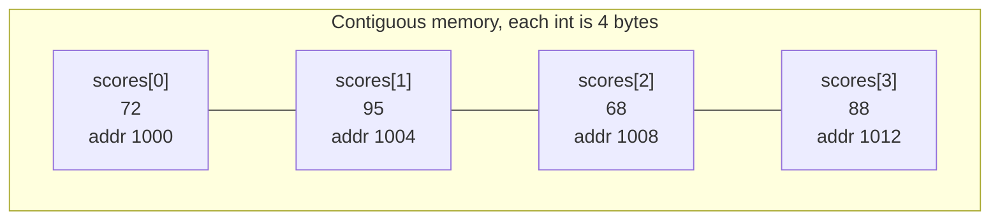

# Lecture 4: Arrays and Sequential Storage

The **array** is the first real data structure most programmers ever use, often without
being told it's one. It's also the perfect first case study for this course, because its
strengths and weaknesses are so clean-cut: blazing fast at reading any element, and
expensive at almost everything else. This lecture makes that trade-off precise.

## In This Lecture

- The array concept, and how it's actually laid out in memory
- Indexing, and why array access is O(1)
- One-dimensional and two-dimensional arrays
- Traversal, insertion, deletion, searching, and updating on an array
- The complexity of every array operation, and where arrays fall short

## The Array Concept and Memory Representation

An **array** is a collection of elements of the same type, stored in **contiguous**
(back-to-back, no gaps) memory locations, and accessed by a numeric **index**. That
contiguity is the entire reason arrays are fast: if the computer knows the address of
element 0 and the size of each element, it can calculate the address of *any* element
with simple arithmetic — no searching required.



The address of `scores[i]` is computed as:

```text
address(scores[i]) = base_address + (i * size_of_one_element)
address(scores[2])  = 1000 + (2 * 4) = 1008
```

This one formula is why **indexing is O(1)** — a single multiplication and addition,
regardless of whether the array holds 10 elements or 10 million.

## One-Dimensional Arrays

```cpp title="one_d_array.cpp"
#include <iostream>
using namespace std;

int main() {
    int scores[5] = {72, 95, 68, 88, 91};

    cout << "scores[0] = " << scores[0] << endl;
    cout << "scores[2] = " << scores[2] << endl;
    cout << "Address of scores[0]: " << &scores[0] << endl;
    cout << "Address of scores[1]: " << &scores[1] << endl;
    return 0;
}
```

```text
$ g++ -std=c++17 -o one_d_array one_d_array.cpp
$ ./one_d_array
scores[0] = 72
scores[2] = 68
Address of scores[0]: 0xf0c6bffaf0
Address of scores[1]: 0xf0c6bffaf4
```

Notice the two addresses differ by exactly `4` (in hex, `af4 - af0 = 4`) — the size of one
`int` — a direct look at the arithmetic from the formula above. (The exact addresses will
differ every time you run this — where the OS places a program's stack varies — but the
`4`-byte gap between consecutive elements never does.)

## Two-Dimensional Arrays

A **2D array** is an array of arrays — commonly used to represent a grid, a matrix, or a
table (rows and columns), like a small grade book of 3 students × 4 quiz scores.

```cpp title="two_d_array.cpp"
#include <iostream>
using namespace std;

int main() {
    int quizScores[3][4] = {
        {8, 9, 7, 10},
        {6, 8, 9, 9},
        {10, 10, 9, 8}
    };

    for (int student = 0; student < 3; student++) {
        cout << "Student " << student << ": ";
        for (int quiz = 0; quiz < 4; quiz++) {
            cout << quizScores[student][quiz] << " ";
        }
        cout << endl;
    }
    return 0;
}
```

```text
$ g++ -std=c++17 -o two_d_array two_d_array.cpp
$ ./two_d_array
Student 0: 8 9 7 10
Student 1: 6 8 9 9
Student 2: 10 10 9 8
```

A 2D array is still stored as one contiguous block in memory (row after row) — element
`quizScores[student][quiz]` sits at
`base_address + (student * 4 + quiz) * size_of_int`, just a slightly longer version of the
same 1D formula.

## Operations on Arrays

### Traversal

Visiting every element once, in order — the basis of almost every other array operation.

```cpp
for (int i = 0; i < 5; i++) {
    cout << scores[i] << " ";
}
```

### Searching

Without knowing anything about the array's order, the only guarantee is to check every
element — **linear search**, already shown in Lecture 3.

### Insertion and Deletion

This is where arrays start to hurt. Because elements must stay contiguous with no gaps,
inserting or deleting in the *middle* requires physically shifting every element after
that position.

```cpp title="array_insert_delete.cpp"
#include <iostream>
using namespace std;

const int MAX = 10;

void printArray(int arr[], int size) {
    for (int i = 0; i < size; i++) cout << arr[i] << " ";
    cout << endl;
}

// Insert `value` at `position`, shifting everything after it one slot right.
int insertAt(int arr[], int size, int position, int value) {
    for (int i = size; i > position; i--) {
        arr[i] = arr[i - 1];
    }
    arr[position] = value;
    return size + 1;
}

// Delete the element at `position`, shifting everything after it one slot left.
int deleteAt(int arr[], int size, int position) {
    for (int i = position; i < size - 1; i++) {
        arr[i] = arr[i + 1];
    }
    return size - 1;
}

int main() {
    int arr[MAX] = {10, 20, 30, 40, 50};
    int size = 5;

    cout << "Original:        "; printArray(arr, size);

    size = insertAt(arr, size, 2, 99);   // insert 99 at index 2
    cout << "After insert(2, 99): "; printArray(arr, size);

    size = deleteAt(arr, size, 0);       // delete the element at index 0
    cout << "After delete(0):     "; printArray(arr, size);

    return 0;
}
```

```text
$ g++ -std=c++17 -o array_insert_delete array_insert_delete.cpp
$ ./array_insert_delete
Original:        10 20 30 40 50
After insert(2, 99): 10 20 99 30 40 50
After delete(0):     20 99 30 40 50
```

Inserting `99` at index 2 shifted `30, 40, 50` one place to the right first — three moves
for one insertion. In the worst case (inserting at the very front), *every* existing
element has to move.

### Updating

Given a valid index, updating is as fast as reading — `scores[2] = 100;` — a single O(1)
operation, no shifting involved at all.

## Complexity of Array Operations

| Operation | Complexity | Why |
|---|---|---|
| Access by index | O(1) | Direct address calculation, no searching |
| Update by index | O(1) | Same address calculation, then a single write |
| Search (unsorted) | O(n) | Must check elements one by one in the worst case |
| Insert at the end (with spare capacity) | O(1) | No shifting needed |
| Insert at the start or middle | O(n) | Every later element must shift right |
| Delete from the end | O(1) | No shifting needed |
| Delete from the start or middle | O(n) | Every later element must shift left |

## Advantages and Limitations of Arrays

**Advantages**

- O(1) random access to any element by index — nothing beats this for read-heavy workloads.
- Memory-efficient: no extra storage overhead per element (unlike a linked list's pointers).
- Cache-friendly: contiguous memory means the CPU can load several elements at once.

**Limitations**

- Fixed size once created (for a plain C-style array) — growing past capacity means
  allocating an entirely new, larger array and copying everything over.
- Expensive insertion/deletion anywhere but the end, due to the shifting cost.
- Wastes memory if allocated larger than needed "just in case," or forces a costly resize
  if allocated too small.

These exact limitations — fixed size, expensive middle insertion — are precisely what
motivate the **linked list**, the subject of the next unit: a structure that trades away
O(1) random access in exchange for cheap insertion and deletion anywhere.

## Try It Yourself

1. Modify `array_insert_delete.cpp` to insert a value at the very *end* of the array
   instead of the middle, and confirm from the output that no shifting is visible (the
   elements before the insertion point are unchanged).
2. Write a function `int linearSearch(int arr[], int size, int target)` that returns the
   index of `target`, or `-1` if it isn't found. Test it on an array where the target is
   present and one where it isn't, printing both results.

## Key Takeaways

- Arrays store elements in **contiguous memory**, which is exactly what makes indexed
  access O(1): the address of any element is computed directly, never searched for.
- 2D arrays are stored the same contiguous way, row by row, under a slightly longer
  address formula.
- **Insertion and deletion in the middle cost O(n)**, because every following element must
  physically shift to keep the array contiguous — this is an array's central weakness.
- Access and update are O(1); search is O(n) on an unsorted array; insert/delete at the
  end are O(1), but insert/delete anywhere else is O(n).
- Arrays are fast and memory-efficient for read-heavy, rarely-resized data — and a poor
  fit when data needs to grow unpredictably or be inserted/removed from the middle often.
