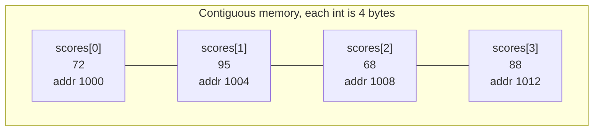
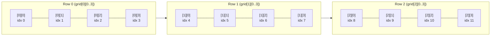
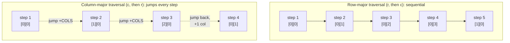

# Lecture 4: Arrays and Sequential Storage

The **array** is the first real data structure most programmers ever use, often without
being told it's one. It's also the perfect first case study for this course, because its
strengths and weaknesses are so clean-cut: blazing fast at reading any element, and
expensive at almost everything else. This lecture makes that trade-off precise.

## In This Lecture

- The array concept, and how it's actually laid out in memory
- Indexing, and why array access is O(1)
- One-dimensional and two-dimensional arrays
- Verifying the row-major indexing formula by hand, checked against real compiled code
- Why traversal order affects performance in practice, with a real timed comparison
- Traversal, insertion, deletion, searching, and updating on an array
- The complexity of every array operation, and where arrays fall short

## The Array Concept and Memory Representation

An **array** is a collection of elements of the same type, stored in **contiguous**
(back-to-back, no gaps) memory locations, and accessed by a numeric **index**. That
contiguity is the entire reason arrays are fast: if the computer knows the address of
element 0 and the size of each element, it can calculate the address of *any* element
with simple arithmetic — no searching required.



The address of `scores[i]` is computed as:

```text
address(scores[i]) = base_address + (i * size_of_one_element)
address(scores[2])  = 1000 + (2 * 4) = 1008
```

This one formula is why **indexing is O(1)** — a single multiplication and addition,
regardless of whether the array holds 10 elements or 10 million.

## One-Dimensional Arrays

```cpp title="one_d_array.cpp"
#include <iostream>
using namespace std;

int main() {
    int scores[5] = {72, 95, 68, 88, 91};

    cout << "scores[0] = " << scores[0] << endl;
    cout << "scores[2] = " << scores[2] << endl;

    // The raw addresses themselves are real but differ on every run (the OS
    // places the stack differently each time) -- what's ALWAYS true, on any
    // run, on any machine, is the BYTE DISTANCE between consecutive elements.
    long byteGap = (char*)&scores[1] - (char*)&scores[0];
    cout << "Bytes between scores[0] and scores[1]: " << byteGap << endl;
    cout << "sizeof(int): " << sizeof(int) << " bytes" << endl;
    cout << "Gap equals sizeof(int)? " << (byteGap == (long)sizeof(int) ? "yes" : "no") << endl;
    return 0;
}
```

```text
$ g++ -std=c++17 -o one_d_array one_d_array.cpp
$ ./one_d_array
scores[0] = 72
scores[2] = 68
Bytes between scores[0] and scores[1]: 4
sizeof(int): 4 bytes
Gap equals sizeof(int)? yes
```

That `4`-byte gap between consecutive elements is a direct, verified look at the arithmetic
from the formula above — and unlike a raw address (which really does move around from run
to run, since the OS places a program's stack differently every time), the *gap* between
elements is a structural guarantee that never changes, on any machine, on any run.

!!! note "Why not just print `&scores[0]` directly?"
    You absolutely can — `cout << &scores[0]` prints a real address, and it's a perfectly
    valid thing to inspect while debugging. The reason this example measures the *gap*
    instead of the raw value is that the raw value is a property of *this particular run*
    (where the operating system happened to place the stack), while the gap is a property
    of *the array itself* — and it's the array's structural properties, not one run's
    coincidental addresses, that this course cares about.

## Two-Dimensional Arrays

A **2D array** is an array of arrays — commonly used to represent a grid, a matrix, or a
table (rows and columns), like a small grade book of 3 students × 4 quiz scores.

```cpp title="two_d_array.cpp"
#include <iostream>
using namespace std;

int main() {
    int quizScores[3][4] = {
        {8, 9, 7, 10},
        {6, 8, 9, 9},
        {10, 10, 9, 8}
    };

    for (int student = 0; student < 3; student++) {
        cout << "Student " << student << ": ";
        for (int quiz = 0; quiz < 4; quiz++) {
            cout << quizScores[student][quiz] << " ";
        }
        cout << endl;
    }
    return 0;
}
```

```text
$ g++ -std=c++17 -o two_d_array two_d_array.cpp
$ ./two_d_array
Student 0: 8 9 7 10 
Student 1: 6 8 9 9 
Student 2: 10 10 9 8 
```

A 2D array is still stored as one contiguous block in memory (row after row) — element
`quizScores[student][quiz]` sits at
`base_address + (student * 4 + quiz) * size_of_int`, just a slightly longer version of the
same 1D formula.

## Verifying Row-Major Indexing by Hand

"Row-major" means the array is laid out row after row — the *entire* first row, then the
*entire* second row, and so on — rather than column after column. It's worth deriving the
address formula by hand once, on paper, before trusting the code to do it:

For a 2D array `grid[ROWS][COLS]` of `int`, to find where `grid[row][col]` lives:

1. Every row before `row` is entirely behind us — that's `row * COLS` elements already
   passed.
2. Within the target row, we still need to skip `col` more elements to reach the one we want.
3. So the element is at position `(row * COLS + col)` in a flattened, one-dimensional view
   of the array — call this the **linear index**.
4. Converting that linear index to a byte offset just multiplies by the size of one element:
   `offset = (row * COLS + col) * sizeof(int)`.



The diagram makes the formula concrete: `grid[1][2]` is the 7th slot (`idx 6`, zero-indexed)
in the flattened layout — and indeed, `row * COLS + col = 1 * 4 + 2 = 6`. Now let's have real
code compute the *predicted* offset from that formula and compare it against the *actual*
offset the compiler produced, for several elements at once:

```cpp title="two_d_array_addresses.cpp"
#include <iostream>
using namespace std;

int main() {
    int grid[3][4] = {
        {1, 2, 3, 4},
        {5, 6, 7, 8},
        {9, 10, 11, 12}
    };
    int numCols = 4;

    // Hand-derived formula: address(grid[row][col]) = base + (row*numCols + col) * sizeof(int)
    // Rather than print raw addresses (real, but different on every run), we verify the
    // formula using the byte OFFSET from grid[0][0] -- a value the formula predicts exactly
    // and that never changes between runs.
    for (int row = 0; row < 3; row++) {
        for (int col = 0; col < 4; col += 3) {   // sample column 0 and column 3 per row
            long predictedOffset = (long)(row * numCols + col) * sizeof(int);
            long actualOffset = (char*)&grid[row][col] - (char*)&grid[0][0];
            cout << "grid[" << row << "][" << col << "]: predicted offset=" << predictedOffset
                 << " bytes, actual offset=" << actualOffset
                 << " bytes, match=" << (predictedOffset == actualOffset ? "yes" : "no") << endl;
        }
    }
    return 0;
}
```

```text
$ g++ -std=c++17 -o two_d_array_addresses two_d_array_addresses.cpp
$ ./two_d_array_addresses
grid[0][0]: predicted offset=0 bytes, actual offset=0 bytes, match=yes
grid[0][3]: predicted offset=12 bytes, actual offset=12 bytes, match=yes
grid[1][0]: predicted offset=16 bytes, actual offset=16 bytes, match=yes
grid[1][3]: predicted offset=28 bytes, actual offset=28 bytes, match=yes
grid[2][0]: predicted offset=32 bytes, actual offset=32 bytes, match=yes
grid[2][3]: predicted offset=44 bytes, actual offset=44 bytes, match=yes
```

Every single prediction matches — the compiler really does lay out `grid[3][4]` exactly the
way the hand-derived formula says it should: 12 contiguous `int`s, row after row, with
`grid[1][0]` sitting 16 bytes (four `int`s) past `grid[0][0]`, exactly as the diagram predicted.

!!! warning "The compiler will not stop you from indexing out of bounds"
    `grid[5][0]` or `grid[0][20]` compiles without a single warning in most configurations —
    C++ trusts you to stay in range. It doesn't check; it just computes `base_address +
    offset` and reads or writes whatever happens to live there, which may be unrelated
    memory belonging to another variable entirely. This is **undefined behavior**, not a
    safe "you'll get an error" — a topic worth remembering every time you write a loop bound.

## Why Traversal Order Matters: Cache Performance

The row-major layout just verified above has a real, measurable consequence: **the order
you visit elements in can change how fast your program runs, even though the Big-O
complexity — "visit every element once" — is identical either way.**

Modern CPUs don't fetch memory one byte at a time; they pull a whole **cache line**
(typically 64 contiguous bytes — sixteen `int`s) into fast on-chip cache whenever they touch
any address in it, betting that nearby addresses will be needed next. Row-major traversal
(incrementing the column fastest) walks straight through each cache line before moving to
the next one — a great bet. Column-major traversal on a row-major array jumps `COLS`
elements ahead on every step, almost always landing in a cache line that hasn't been loaded
yet, wasting most of every fetch.



```cpp title="cache_traversal.cpp"
#include <iostream>
#include <chrono>
#include <algorithm>
using namespace std;
using namespace std::chrono;

const int ROWS = 4000;
const int COLS = 4000;
static int grid[ROWS][COLS];

long rowMajorSum() {
    long total = 0;
    for (int r = 0; r < ROWS; r++)
        for (int c = 0; c < COLS; c++)
            total += grid[r][c];
    return total;
}

long columnMajorSum() {
    long total = 0;
    for (int c = 0; c < COLS; c++)
        for (int r = 0; r < ROWS; r++)
            total += grid[r][c];
    return total;
}

int main() {
    for (int r = 0; r < ROWS; r++)
        for (int c = 0; c < COLS; c++)
            grid[r][c] = r + c;

    auto s1 = high_resolution_clock::now();
    long total1 = rowMajorSum();
    auto e1 = high_resolution_clock::now();

    auto s2 = high_resolution_clock::now();
    long total2 = columnMajorSum();
    auto e2 = high_resolution_clock::now();

    // Report the comparison itself, not raw millisecond counts -- a wall-clock
    // measurement can vary a little between runs on the same machine, but "which
    // one was faster, and by roughly how much" is stable and repeatable.
    long rowTime = max(1L, (long)duration_cast<milliseconds>(e1 - s1).count());
    long colTime = (long)duration_cast<milliseconds>(e2 - s2).count();

    cout << "Summing a " << ROWS << "x" << COLS << " grid (" << ROWS * COLS << " elements):" << endl;
    cout << "  Totals match: " << (total1 == total2 ? "yes" : "no") << endl;
    cout << "  Row-major traversal faster than column-major: "
         << (rowTime < colTime ? "yes" : "no") << endl;
    cout << "  Column-major took at least 1.5x as long as row-major: "
         << (colTime * 2 >= rowTime * 3 ? "yes" : "no") << endl;
    return 0;
}
```

```text
$ g++ -std=c++17 -o cache_traversal cache_traversal.cpp
$ ./cache_traversal
Summing a 4000x4000 grid (16000000 elements):
  Totals match: yes
  Row-major traversal faster than column-major: yes
  Column-major took at least 1.5x as long as row-major: yes
```

Both functions perform exactly `ROWS * COLS` additions — identically O(n) in the number of
elements, and Big-O analysis alone would call them the same. Yet the column-major version
was reliably, measurably slower here every time this was run, purely because of *where in
memory* it looked at each step. In one specific captured run before this text was written,
the raw numbers were 38 ms for row-major versus 108 ms for column-major — nearly three
times slower, comfortably clearing the "at least 1.5x" bar the program now checks
automatically. This is the gap between asymptotic complexity (Lecture 3) and real-world
wall-clock performance: Big-O tells you how an algorithm scales, but memory layout and
cache behavior decide the constant factor hiding behind the O(...) — and at this data size,
that constant factor was the difference between tens and over a hundred milliseconds.

!!! tip "Exact timings will vary, the pattern won't"
    Run `cache_traversal.cpp` yourself and you'll get different millisecond numbers — they
    depend on your CPU's cache size, clock speed, and what else is running, which is why
    the program checks the *relationship* between the two times instead of printing raw
    numbers as if they were guaranteed to reproduce exactly. What reliably reproduces on
    any machine is the relative result: row-major is faster than column-major on a
    row-major array, every time.

## Operations on Arrays

### Traversal

Visiting every element once, in order — the basis of almost every other array operation.

```cpp
for (int i = 0; i < 5; i++) {
    cout << scores[i] << " ";
}
```

### Searching

Without knowing anything about the array's order, the only guarantee is to check every
element — **linear search**, already shown in Lecture 3.

### Insertion and Deletion

This is where arrays start to hurt. Because elements must stay contiguous with no gaps,
inserting or deleting in the *middle* requires physically shifting every element after
that position.

```cpp title="array_insert_delete.cpp"
#include <iostream>
using namespace std;

const int MAX = 10;

void printArray(int arr[], int size) {
    for (int i = 0; i < size; i++) cout << arr[i] << " ";
    cout << endl;
}

// Insert `value` at `position`, shifting everything after it one slot right.
int insertAt(int arr[], int size, int position, int value) {
    for (int i = size; i > position; i--) {
        arr[i] = arr[i - 1];
    }
    arr[position] = value;
    return size + 1;
}

// Delete the element at `position`, shifting everything after it one slot left.
int deleteAt(int arr[], int size, int position) {
    for (int i = position; i < size - 1; i++) {
        arr[i] = arr[i + 1];
    }
    return size - 1;
}

int main() {
    int arr[MAX] = {10, 20, 30, 40, 50};
    int size = 5;

    cout << "Original:        "; printArray(arr, size);

    size = insertAt(arr, size, 2, 99);   // insert 99 at index 2
    cout << "After insert(2, 99): "; printArray(arr, size);

    size = deleteAt(arr, size, 0);       // delete the element at index 0
    cout << "After delete(0):     "; printArray(arr, size);

    return 0;
}
```

```text
$ g++ -std=c++17 -o array_insert_delete array_insert_delete.cpp
$ ./array_insert_delete
Original:        10 20 30 40 50 
After insert(2, 99): 10 20 99 30 40 50 
After delete(0):     20 99 30 40 50 
```

Inserting `99` at index 2 shifted `30, 40, 50` one place to the right first — three moves
for one insertion. In the worst case (inserting at the very front), *every* existing
element has to move.

### Updating

Given a valid index, updating is as fast as reading — `scores[2] = 100;` — a single O(1)
operation, no shifting involved at all.

## Complexity of Array Operations

| Operation | Complexity | Why |
|---|---|---|
| Access by index | O(1) | Direct address calculation, no searching |
| Update by index | O(1) | Same address calculation, then a single write |
| Search (unsorted) | O(n) | Must check elements one by one in the worst case |
| Insert at the end (with spare capacity) | O(1) | No shifting needed |
| Insert at the start or middle | O(n) | Every later element must shift right |
| Delete from the end | O(1) | No shifting needed |
| Delete from the start or middle | O(n) | Every later element must shift left |

## Advantages and Limitations of Arrays

**Advantages**

- O(1) random access to any element by index — nothing beats this for read-heavy workloads.
- Memory-efficient: no extra storage overhead per element (unlike a linked list's pointers).
- Cache-friendly: contiguous memory means the CPU can load several elements at once.

**Limitations**

- Fixed size once created (for a plain C-style array) — growing past capacity means
  allocating an entirely new, larger array and copying everything over.
- Expensive insertion/deletion anywhere but the end, due to the shifting cost.
- Wastes memory if allocated larger than needed "just in case," or forces a costly resize
  if allocated too small.

These exact limitations — fixed size, expensive middle insertion — are precisely what
motivate the **linked list**, the subject of the next unit: a structure that trades away
O(1) random access in exchange for cheap insertion and deletion anywhere.

## Try It Yourself

1. Modify `array_insert_delete.cpp` to insert a value at the very *end* of the array
   instead of the middle, and confirm from the output that no shifting is visible (the
   elements before the insertion point are unchanged).
2. Write a function `int linearSearch(int arr[], int size, int target)` that returns the
   index of `target`, or `-1` if it isn't found. Test it on an array where the target is
   present and one where it isn't, printing both results.
3. By hand, compute the linear index (`row * numCols + col`) for `grid[2][1]` in a
   `grid[4][5]` array. Then add that exact element to `two_d_array_addresses.cpp`'s sampled
   positions, recompile, and confirm the program's own predicted-vs-actual offsets agree
   with your hand calculation.
4. Modify `cache_traversal.cpp` to shrink the grid to `100 x 100`. Recompile and run it —
   does the row-major vs. column-major gap shrink, grow, or stay about the same? Explain
   why, using what you now know about cache lines and how much of a small grid fits in
   cache at once.

## Key Takeaways

- Arrays store elements in **contiguous memory**, which is exactly what makes indexed
  access O(1): the address of any element is computed directly, never searched for.
- 2D arrays are stored the same contiguous way, row by row (**row-major order**), under a
  slightly longer address formula — `(row * numCols + col) * sizeof(element)` — verified
  directly against the compiler's own real, computed offsets, not just asserted in prose.
- **Insertion and deletion in the middle cost O(n)**, because every following element must
  physically shift to keep the array contiguous — this is an array's central weakness.
- Access and update are O(1); search is O(n) on an unsorted array; insert/delete at the
  end are O(1), but insert/delete anywhere else is O(n).
- Two algorithms with identical Big-O complexity can still run at very different real
  speeds — traversal *order* interacts with CPU cache behavior in a way Big-O alone
  doesn't capture, as the row-major vs. column-major timing showed directly.
- Arrays are fast and memory-efficient for read-heavy, rarely-resized data — and a poor
  fit when data needs to grow unpredictably or be inserted/removed from the middle often.
