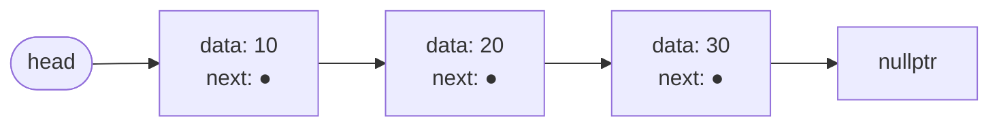
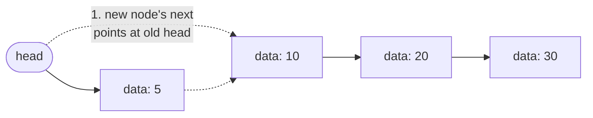
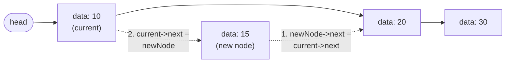
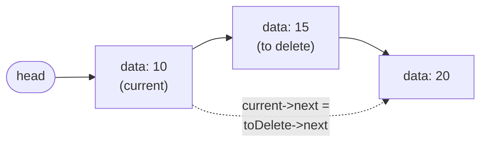
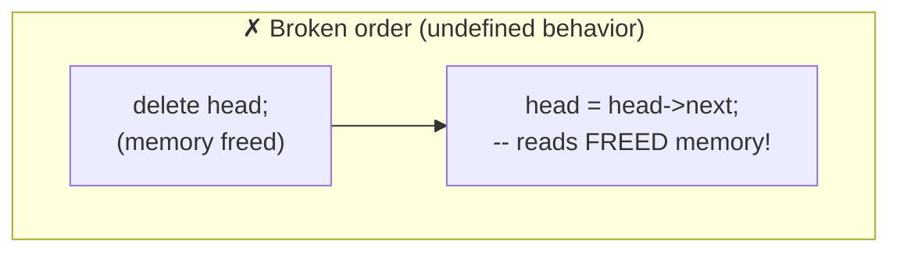
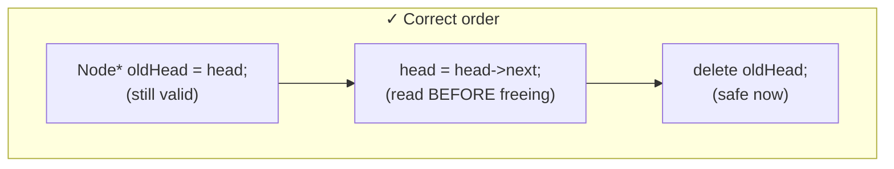

# Lecture 5: Linked Lists: Fundamentals

Lecture 4 ended on a cliffhanger: arrays are fixed-size, and inserting or deleting
anywhere but the end costs O(n) because everything has to shift. The **linked list**
solves both problems at once, at the cost of giving up O(1) random access. This lecture
introduces the structure that will reappear, in one form or another, for the rest of the
course — stacks, queues, and even trees are all built from the same core idea: a **node**
that knows where the *next* node is.

## In This Lecture

- Why arrays alone aren't enough — the need for linked lists
- The linked list concept and how it's actually organized in memory
- The node structure, and what "head" and "tail" mean
- Creating, traversing, and doing basic insertion/deletion on a linked list
- Inserting and deleting at an arbitrary position, not just the front
- The one-node list as an edge case worth tracing carefully
- The classic "delete before you save `next`" bug, shown as broken vs. correct diagrams
- The advantages and limitations of linked lists, compared directly against arrays

## The Need for Linked Lists

An array's size is fixed at creation, and inserting into the middle means shifting every
later element. A linked list fixes both: it grows and shrinks one element at a time, and
inserting or removing an element never requires moving any *other* element — only a
couple of pointers change.

## The Linked List Concept and Memory Organization

Where an array stores its elements *contiguously*, a linked list stores each element in
its own independently-allocated chunk of memory, called a **node**, and each node stores
the *address* of the next node. The nodes can be scattered anywhere in memory — what
makes it a "list" is purely the chain of pointers connecting them.



## The Node Structure

A node bundles two things: the actual data, and a pointer to the next node in the chain.

```cpp
struct Node {
    int data;       // the value this node holds
    Node* next;      // the address of the next node, or nullptr if this is the last one
};
```

`Node* next` is what makes this a *self-referential* structure — a `Node` contains a
pointer to another `Node` of the exact same type. This is the single idea that makes
linked lists (and later, trees and graphs) possible.

## Head and Tail

The **head** is a pointer to the *first* node in the list — it's the only thing you need
to reach the entire list, since every other node is reachable by following `next`
pointers from it. If `head` is `nullptr`, the list is empty. The **tail** is the *last*
node — the one whose `next` is `nullptr`, marking the end of the chain.

## Creating and Traversing a Linked List

```cpp title="linked_list_basics.cpp"
#include <iostream>
using namespace std;

struct Node {
    int data;
    Node* next;
};

// Create a single new node holding `value`, with `next` initialized to nullptr.
Node* createNode(int value) {
    Node* newNode = new Node();   // allocate memory for one Node on the heap
    newNode->data = value;
    newNode->next = nullptr;
    return newNode;
}

// Visit every node from head to the end, printing its data.
void traverse(Node* head) {
    Node* current = head;
    while (current != nullptr) {
        cout << current->data;
        if (current->next != nullptr) cout << " -> ";
        current = current->next;
    }
    cout << endl;
}

int main() {
    // Manually build a list of three nodes: 10 -> 20 -> 30
    Node* head = createNode(10);
    head->next = createNode(20);
    head->next->next = createNode(30);

    cout << "List: ";
    traverse(head);
    return 0;
}
```

```text
$ g++ -std=c++17 -o linked_list_basics linked_list_basics.cpp
$ ./linked_list_basics
List: 10 -> 20 -> 30
```

## Basic Insertion

The cheapest possible insertion is at the **front** of the list: create a new node, point
its `next` at the current head, then make the new node the head. No existing node moves —
only two pointer assignments happen.



```cpp title="linked_list_insert.cpp"
#include <iostream>
using namespace std;

struct Node {
    int data;
    Node* next;
};

Node* createNode(int value) {
    Node* newNode = new Node();
    newNode->data = value;
    newNode->next = nullptr;
    return newNode;
}

void traverse(Node* head) {
    Node* current = head;
    while (current != nullptr) {
        cout << current->data;
        if (current->next != nullptr) cout << " -> ";
        current = current->next;
    }
    cout << endl;
}

// Insert `value` at the very front of the list; returns the new head.
Node* insertAtFront(Node* head, int value) {
    Node* newNode = createNode(value);
    newNode->next = head;
    return newNode;   // the new node is now the head
}

int main() {
    Node* head = createNode(10);
    head->next = createNode(20);
    head->next->next = createNode(30);

    cout << "Before: "; traverse(head);
    head = insertAtFront(head, 5);
    cout << "After:  "; traverse(head);
    return 0;
}
```

```text
$ g++ -std=c++17 -o linked_list_insert linked_list_insert.cpp
$ ./linked_list_insert
Before: 10 -> 20 -> 30
After:  5 -> 10 -> 20 -> 30
```

## Basic Deletion

Deleting the front node means reading `head->next` (the new head-to-be), freeing the old
head's memory, and updating `head` to point at that saved node.

```cpp title="linked_list_delete.cpp"
#include <iostream>
using namespace std;

struct Node {
    int data;
    Node* next;
};

Node* createNode(int value) {
    Node* newNode = new Node();
    newNode->data = value;
    newNode->next = nullptr;
    return newNode;
}

void traverse(Node* head) {
    Node* current = head;
    while (current != nullptr) {
        cout << current->data;
        if (current->next != nullptr) cout << " -> ";
        current = current->next;
    }
    cout << endl;
}

// Delete the front node; returns the new head.
Node* deleteFromFront(Node* head) {
    if (head == nullptr) return nullptr;   // nothing to delete
    Node* oldHead = head;
    head = head->next;   // move head to the second node first
    delete oldHead;       // now it's safe to free the old head's memory
    return head;
}

int main() {
    Node* head = createNode(5);
    head->next = createNode(10);
    head->next->next = createNode(20);

    cout << "Before: "; traverse(head);
    head = deleteFromFront(head);
    cout << "After:  "; traverse(head);
    return 0;
}
```

```text
$ g++ -std=c++17 -o linked_list_delete linked_list_delete.cpp
$ ./linked_list_delete
Before: 5 -> 10 -> 20
After:  10 -> 20
```

!!! warning "Always update the pointer before calling delete"
    `deleteFromFront` reads `head->next` and saves it *before* calling `delete oldHead`.
    Deleting a node frees its memory back to the operating system — reading `oldHead->next`
    *after* the delete would access memory you no longer own, which is undefined behavior
    in C++ (it might work, might crash, or might silently corrupt other data).

## Insertion at an Arbitrary Position

Front insertion is the cheapest case, but real programs often need to insert *in the
middle* — keeping a sorted list sorted, for instance, means inserting exactly where a new
value belongs. The idea generalizes directly: walk from `head` until you're standing on
the node **just before** the target position, then do the same two-pointer trick
`insertAtFront` used, just anchored at that node instead of at `head` itself.



Notice the *order* of the two steps matters: step 1 (pointing the new node at what comes
after `current`) must happen **before** step 2 (pointing `current` at the new node) —
reversing that order would overwrite `current->next` before anything saved where it used
to point, permanently losing the rest of the list.

```cpp title="linked_list_insert_position.cpp"
#include <iostream>
using namespace std;

struct Node {
    int data;
    Node* next;
};

Node* createNode(int value) {
    Node* newNode = new Node();
    newNode->data = value;
    newNode->next = nullptr;
    return newNode;
}

void traverse(Node* head) {
    Node* current = head;
    while (current != nullptr) {
        cout << current->data;
        if (current->next != nullptr) cout << " -> ";
        current = current->next;
    }
    cout << endl;
}

// Insert `value` so it becomes the node at 0-based `position`.
// position 0 means "insert at the front"; a position at or past the list's
// length simply appends at the end instead of failing.
Node* insertAtPosition(Node* head, int value, int position) {
    if (position == 0 || head == nullptr) {
        Node* newNode = createNode(value);
        newNode->next = head;
        return newNode;
    }
    Node* current = head;
    int index = 0;
    // walk to the node just BEFORE the target position, stopping early if
    // we run off the end of the list (then we just append at the last node)
    while (index < position - 1 && current->next != nullptr) {
        current = current->next;
        index++;
    }
    Node* newNode = createNode(value);
    newNode->next = current->next;
    current->next = newNode;
    return head;
}

int main() {
    Node* head = createNode(10);
    head->next = createNode(20);
    head->next->next = createNode(30);

    cout << "Before:                              "; traverse(head);
    head = insertAtPosition(head, 15, 1);   // between 10 and 20
    cout << "After inserting 15 at position 1:    "; traverse(head);
    head = insertAtPosition(head, 99, 10);  // position past the end -> appends
    cout << "After inserting 99 at position 10:   "; traverse(head);
    head = insertAtPosition(head, 1, 0);    // at the very front
    cout << "After inserting 1 at position 0:     "; traverse(head);
    return 0;
}
```

```text
$ g++ -std=c++17 -o linked_list_insert_position linked_list_insert_position.cpp
$ ./linked_list_insert_position
Before:                              10 -> 20 -> 30
After inserting 15 at position 1:    10 -> 15 -> 20 -> 30
After inserting 99 at position 10:   10 -> 15 -> 20 -> 30 -> 99
After inserting 1 at position 0:     1 -> 10 -> 15 -> 20 -> 30 -> 99
```

!!! note "Why insertAtPosition never crashes on a bad position"
    The loop condition `index < position - 1 && current->next != nullptr` stops walking
    the moment it reaches the last node, *even if* `position` asked to go further. That's
    why inserting at position `10` on a 3-node list didn't fail — it silently landed at the
    end instead, exactly the same behavior as `insertAtEnd` would give.

## Deletion at an Arbitrary Position

Deletion at a position mirrors insertion: walk to the node just before the target,
remember the node to delete, splice it out, *then* free it.



```cpp title="linked_list_delete_position.cpp"
#include <iostream>
using namespace std;

struct Node {
    int data;
    Node* next;
};

Node* createNode(int value) {
    Node* newNode = new Node();
    newNode->data = value;
    newNode->next = nullptr;
    return newNode;
}

void traverse(Node* head) {
    Node* current = head;
    while (current != nullptr) {
        cout << current->data;
        if (current->next != nullptr) cout << " -> ";
        current = current->next;
    }
    cout << endl;
}

// Delete the node at 0-based `position`. If `position` is out of range,
// the list is left unchanged.
Node* deleteAtPosition(Node* head, int position) {
    if (head == nullptr) return nullptr;
    if (position == 0) {
        Node* oldHead = head;
        head = head->next;
        delete oldHead;
        return head;
    }
    Node* current = head;
    int index = 0;
    while (index < position - 1 && current->next != nullptr) {
        current = current->next;
        index++;
    }
    if (current->next == nullptr) return head;   // position out of range: nothing to delete
    Node* toDelete = current->next;
    current->next = toDelete->next;   // save the link past toDelete BEFORE deleting it
    delete toDelete;
    return head;
}

int main() {
    Node* head = createNode(5);
    head->next = createNode(10);
    head->next->next = createNode(15);
    head->next->next->next = createNode(20);
    head->next->next->next->next = createNode(30);

    cout << "Before:                          "; traverse(head);
    head = deleteAtPosition(head, 2);   // removes 15
    cout << "After deleting position 2:       "; traverse(head);
    head = deleteAtPosition(head, 99);  // out of range: no change
    cout << "After deleting position 99:      "; traverse(head);
    head = deleteAtPosition(head, 0);   // removes the front (5)
    cout << "After deleting position 0:       "; traverse(head);
    return 0;
}
```

```text
$ g++ -std=c++17 -o linked_list_delete_position linked_list_delete_position.cpp
$ ./linked_list_delete_position
Before:                          5 -> 10 -> 15 -> 20 -> 30
After deleting position 2:       5 -> 10 -> 20 -> 30
After deleting position 99:      5 -> 10 -> 20 -> 30
After deleting position 0:       10 -> 20 -> 30
```

## Edge Case: The One-Node List

A list with exactly one node is where "beginning" and "end" collide — `head` and the only
node's `next == nullptr` (the would-be tail marker) describe the *same* node. It's worth
tracing on its own because it's exactly where off-by-one bugs like to hide: does deleting
the only node correctly leave `head` as `nullptr` instead of a dangling pointer? Does
inserting into an empty list correctly rebuild a valid one-node list?

```cpp title="linked_list_single_node.cpp"
#include <iostream>
using namespace std;

struct Node {
    int data;
    Node* next;
};

Node* createNode(int value) {
    Node* newNode = new Node();
    newNode->data = value;
    newNode->next = nullptr;
    return newNode;
}

void traverse(Node* head) {
    if (head == nullptr) { cout << "(empty)" << endl; return; }
    Node* current = head;
    while (current != nullptr) {
        cout << current->data;
        if (current->next != nullptr) cout << " -> ";
        current = current->next;
    }
    cout << endl;
}

Node* insertAtFront(Node* head, int value) {
    Node* newNode = createNode(value);
    newNode->next = head;
    return newNode;
}

Node* deleteFromFront(Node* head) {
    if (head == nullptr) return nullptr;
    Node* oldHead = head;
    head = head->next;
    delete oldHead;
    return head;
}

int main() {
    // Start with exactly one node.
    Node* head = createNode(42);
    cout << "A one-node list:                  "; traverse(head);

    // Deleting the only node: head->next is nullptr, so the new head becomes
    // nullptr too -- the list correctly becomes empty, not a dangling pointer.
    head = deleteFromFront(head);
    cout << "After deleting the only node:     "; traverse(head);

    // Deleting again on an already-empty list must be a safe no-op --
    // this is exactly the `if (head == nullptr) return nullptr;` guard.
    head = deleteFromFront(head);
    cout << "After deleting an empty list:     "; traverse(head);

    // Inserting into an empty list: newNode->next is set to head, which is
    // nullptr, so it correctly becomes a proper one-node list again.
    head = insertAtFront(head, 7);
    cout << "After inserting into empty list:  "; traverse(head);

    return 0;
}
```

```text
$ g++ -std=c++17 -o linked_list_single_node linked_list_single_node.cpp
$ ./linked_list_single_node
A one-node list:                  42
After deleting the only node:     (empty)
After deleting an empty list:     (empty)
After inserting into empty list:  7
```

Every one of `deleteFromFront`, `insertAtFront`, and `traverse`'s existing `nullptr`
checks was written for exactly this case — the one-node (and empty) list isn't a special
branch bolted on afterward, it falls naturally out of code that treats `nullptr` correctly
everywhere.

## The Classic Bug: Deleting Without Saving `next` First

The warning above `deleteFromFront` is worth seeing as two side-by-side diagrams, because
this exact mistake — freeing a node, *then* trying to read where it used to point — is one
of the most common linked list bugs students write.





In the broken order, `head->next` is read *after* `oldHead`'s memory has already been
returned to the operating system — the value might happen to still "look" correct (many
systems don't immediately overwrite freed memory), which is what makes this bug so
dangerous: it can pass testing by accident and then fail unpredictably later, once that
memory gets reused for something else. The correct order never has this problem, because
every pointer it reads is still backed by memory the program actually owns at the moment
it reads it.

## Advantages and Limitations of Linked Lists

**Advantages**

- Genuinely dynamic size — grows and shrinks one node at a time, no wasted pre-allocated
  space and no "resize and copy everything" step.
- Insertion and deletion at the front (and, as Lecture 6 will show, anywhere with a
  reference to the right node) never requires shifting other elements.

**Limitations**

- No random access — reaching `node[i]` means following `i` pointers from the head, one
  at a time, an O(n) walk. There is no equivalent of an array's instant `arr[i]`.
- Extra memory per element for the `next` pointer, on top of the data itself.
- Worse cache performance than an array — nodes can be scattered anywhere in memory,
  unlike an array's contiguous block.

| | Array | Linked List |
|---|---|---|
| Access by index | O(1) | O(n) |
| Insert/delete at front | O(n) (shift everything) | O(1) |
| Extra memory per element | None | One pointer |
| Memory layout | Contiguous | Scattered |

Lecture 6 builds on today's `insertAtFront`/`deleteFromFront` with the full set of
singly linked list operations: inserting and deleting at the end, at a specific position,
searching, and reversing the list.

## Try It Yourself

1. Draw (on paper) the node-by-node picture, like the diagrams above, of what happens when
   you call `insertAtFront` twice in a row on an empty list, first with `100` then with
   `200`. What does the final list look like?
2. Compile and run `linked_list_insert.cpp`, then modify `main` to insert three more
   values at the front in a row and confirm the final order from the printed output
   matches what you'd expect (each new value ends up first).
3. Compile and run `linked_list_insert_position.cpp`, then add a call that inserts at
   `position` equal to exactly the list's current length (use `traverse` to count first).
   Confirm it behaves identically to appending at the end — trace through the loop
   condition to explain why that's guaranteed, not a coincidence.
4. Modify `linked_list_delete_position.cpp` so that `main` deletes every node one at a
   time, always at position `0`, until the list is empty, printing `traverse(head)` after
   each deletion. Confirm the last printed line reads `(empty)` (you'll need to update
   `traverse` to handle `head == nullptr`, the same way `linked_list_single_node.cpp`
   does) rather than crashing.

## Key Takeaways

- A linked list stores each element in its own **node**, scattered anywhere in memory,
  connected by `next` pointers — contiguity is traded away for dynamic size.
- A node is a **self-referential structure**: it holds data plus a pointer to another node
  of the same type.
- **Head** is the entry point to the whole list; a `nullptr` `next` marks the **tail**.
- Inserting or deleting at the front is O(1) — only pointer assignments happen, no other
  node moves — but reaching any specific position requires an O(n) walk from the head.
- Insertion and deletion at an **arbitrary position** generalize the front-only case: walk
  to the node just before the target, then apply the same "point the new node, then
  re-point its predecessor" (or "splice out, then free") pattern anchored there.
- The **one-node list** is not a special case bolted on afterward — code that checks for
  `nullptr` correctly everywhere handles it (and the empty list) automatically.
- **Always save the pointer you'll need *before* calling `delete`** — reading a pointer
  field on memory you've already freed is undefined behavior, and the two broken-vs-correct
  diagrams above show exactly why the *order* of those two steps is what matters.
- Linked lists trade away an array's O(1) random access in exchange for cheap insertion
  and deletion without shifting — pick whichever trade-off matches what your application
  actually does most.
