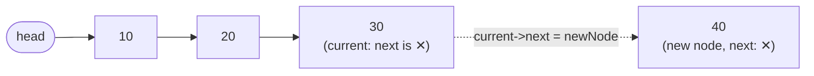
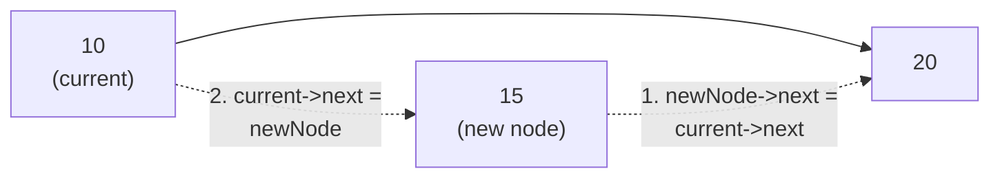
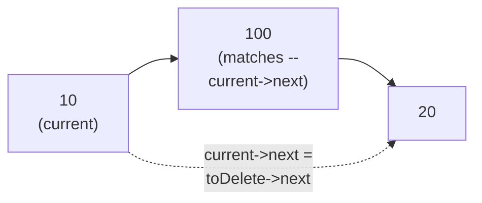
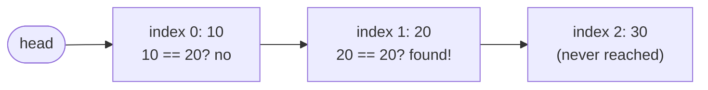
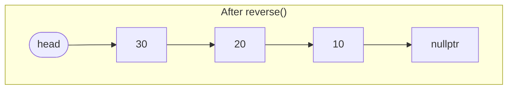

# Lecture 6: Singly Linked List Operations

Lecture 5 covered insertion and deletion at the *front* of a linked list — the cheapest
possible case. Real programs need the full toolkit: inserting or deleting at the *end*, at
an arbitrary *position*, searching for a value, updating a node, counting the list, and
reversing it entirely. This lecture builds all of them into one complete
`SinglyLinkedList` class, compiled and run as one program.

## In This Lecture

- Every core singly linked list operation, built as methods on one reusable class
- Insertion and deletion at the beginning, end, and a specific position
- Deleting by value instead of by position
- Searching, updating, and counting nodes
- Reversing a linked list in place
- Step-by-step diagrams for insertion, deletion, searching, and reversal
- The complexity of every operation covered

## The Singly Linked List Class

A **singly** linked list is exactly what Lecture 5 introduced: each node points only
*forward*, to the next node — there is no way to go backward from a node. Wrapping the
node-pointer logic inside a class (rather than free functions passing `head` around, like
Lecture 5 did) is how real code organizes this: the class keeps track of its own `head`,
and every operation becomes a method on it.

```cpp title="singly_linked_list.cpp"
#include <iostream>
using namespace std;

struct Node {
    int data;
    Node* next;
    Node(int value) : data(value), next(nullptr) {}
};

class SinglyLinkedList {
private:
    Node* head;

public:
    SinglyLinkedList() : head(nullptr) {}

    void insertAtBeginning(int value) {
        Node* newNode = new Node(value);
        newNode->next = head;
        head = newNode;
    }

    void insertAtEnd(int value) {
        Node* newNode = new Node(value);
        if (head == nullptr) {
            head = newNode;
            return;
        }
        Node* current = head;
        while (current->next != nullptr) {
            current = current->next;
        }
        current->next = newNode;
    }

    // position is 0-based; inserting at position == count() appends at the end.
    void insertAtPosition(int value, int position) {
        if (position == 0) { insertAtBeginning(value); return; }
        Node* current = head;
        for (int i = 0; i < position - 1 && current != nullptr; i++) {
            current = current->next;
        }
        if (current == nullptr) return;   // position out of range
        Node* newNode = new Node(value);
        newNode->next = current->next;
        current->next = newNode;
    }

    void deleteFromBeginning() {
        if (head == nullptr) return;
        Node* oldHead = head;
        head = head->next;
        delete oldHead;
    }

    void deleteFromEnd() {
        if (head == nullptr) return;
        if (head->next == nullptr) { delete head; head = nullptr; return; }
        Node* current = head;
        while (current->next->next != nullptr) {
            current = current->next;
        }
        delete current->next;
        current->next = nullptr;
    }

    void deleteAtPosition(int position) {
        if (position == 0) { deleteFromBeginning(); return; }
        Node* current = head;
        for (int i = 0; i < position - 1 && current != nullptr; i++) {
            current = current->next;
        }
        if (current == nullptr || current->next == nullptr) return;
        Node* toDelete = current->next;
        current->next = toDelete->next;
        delete toDelete;
    }

    // Deletes the FIRST node whose data equals `value`. Returns true if a
    // node was found and removed, false if `value` was never in the list.
    bool deleteByValue(int value) {
        if (head == nullptr) return false;
        if (head->data == value) {
            Node* oldHead = head;
            head = head->next;
            delete oldHead;
            return true;
        }
        Node* current = head;
        while (current->next != nullptr && current->next->data != value) {
            current = current->next;
        }
        if (current->next == nullptr) return false;   // reached the end: not found
        Node* toDelete = current->next;
        current->next = toDelete->next;
        delete toDelete;
        return true;
    }

    // Returns the 0-based index of `value`, or -1 if not found.
    int search(int value) const {
        Node* current = head;
        int index = 0;
        while (current != nullptr) {
            if (current->data == value) return index;
            current = current->next;
            index++;
        }
        return -1;
    }

    bool updateAt(int position, int newValue) {
        Node* current = head;
        for (int i = 0; i < position && current != nullptr; i++) {
            current = current->next;
        }
        if (current == nullptr) return false;
        current->data = newValue;
        return true;
    }

    int countNodes() const {
        int count = 0;
        Node* current = head;
        while (current != nullptr) {
            count++;
            current = current->next;
        }
        return count;
    }

    // Reverses the list in place by walking it once, re-pointing each node's `next`
    // backward instead of forward.
    void reverse() {
        Node* previous = nullptr;
        Node* current = head;
        while (current != nullptr) {
            Node* nextNode = current->next;  // save it before we overwrite `next`
            current->next = previous;         // reverse this node's pointer
            previous = current;               // advance previous
            current = nextNode;               // advance current
        }
        head = previous;   // previous is now the new head (the old tail)
    }

    void display() const {
        Node* current = head;
        while (current != nullptr) {
            cout << current->data;
            if (current->next != nullptr) cout << " -> ";
            current = current->next;
        }
        cout << endl;
    }
};

int main() {
    SinglyLinkedList list;

    list.insertAtEnd(10);
    list.insertAtEnd(20);
    list.insertAtEnd(30);
    cout << "After inserting 10, 20, 30 at end: ";
    list.display();

    list.insertAtBeginning(5);
    cout << "After inserting 5 at beginning:    ";
    list.display();

    list.insertAtPosition(15, 2);
    cout << "After inserting 15 at position 2:  ";
    list.display();

    cout << "Search for 20: index " << list.search(20) << endl;
    cout << "Search for 99: index " << list.search(99) << endl;

    list.updateAt(1, 100);
    cout << "After updating position 1 to 100:  ";
    list.display();

    cout << "Node count: " << list.countNodes() << endl;

    list.deleteAtPosition(2);
    cout << "After deleting position 2:         ";
    list.display();

    bool removed = list.deleteByValue(100);
    cout << "deleteByValue(100) returned " << boolalpha << removed << ", list: ";
    list.display();

    bool notFound = list.deleteByValue(9999);
    cout << "deleteByValue(9999) returned " << boolalpha << notFound << ", list: ";
    list.display();

    list.deleteFromEnd();
    cout << "After deleting from end:           ";
    list.display();

    list.reverse();
    cout << "After reversing:                   ";
    list.display();

    return 0;
}
```

```text
$ g++ -std=c++17 -o singly_linked_list singly_linked_list.cpp
$ ./singly_linked_list
After inserting 10, 20, 30 at end: 10 -> 20 -> 30
After inserting 5 at beginning:    5 -> 10 -> 20 -> 30
After inserting 15 at position 2:  5 -> 10 -> 15 -> 20 -> 30
Search for 20: index 3
Search for 99: index -1
After updating position 1 to 100:  5 -> 100 -> 15 -> 20 -> 30
Node count: 5
After deleting position 2:         5 -> 100 -> 20 -> 30
deleteByValue(100) returned true, list: 5 -> 20 -> 30
deleteByValue(9999) returned false, list: 5 -> 20 -> 30
After deleting from end:           5 -> 20
After reversing:                   20 -> 5
```

!!! note "Why reverse() only needs one pass"
    `reverse()` never allocates a new node or copies any data — it walks the list exactly
    once, and at each node it flips `next` to point *backward* instead of forward, using
    two helper pointers (`previous` and `nextNode`) so it never loses track of the rest of
    the list. This is the standard pattern for in-place linked list reversal and is worth
    tracing on paper, node by node, until it clicks.

## Visualizing the Operations, Step by Step

Code alone hides *why* each operation has the complexity it does — the diagrams below
make the pointer movement (and, for `insertAtEnd` and `deleteByValue`, the O(n) *walk*
that precedes it) explicit for the operations that don't reduce directly to the
front-insertion/front-deletion cases Lecture 5 already diagrammed.

### insertAtEnd: Walk, Then Attach

`insertAtEnd` has no `tail` pointer to shortcut with (Lecture 7's doubly linked list adds
one) — it must walk every node until `current->next` is `nullptr`, which is the entire
reason this operation is O(n) instead of O(1).



### insertAtPosition: Splice In the Middle

Once `current` (the node just before the target position) is found by the walk, inserting
in the middle is exactly Lecture 5's arbitrary-position insertion: point the new node at
what `current` used to point to, *then* repoint `current` itself.



### deleteByValue: Search, Then Splice Out

`deleteByValue` combines two ideas already covered separately: it walks like `search`
(comparing `current->next->data` against the target, since it needs to stop one node
*early* to keep a reference to the node being removed), then splices exactly like
`deleteAtPosition` once a match is found.



### search: Comparing Node by Node

There is no shortcut — `search` must compare `data` against every node starting from
`head`, in order, until it finds a match or runs out of nodes. This is precisely the
"no random access" limitation Lecture 5 introduced, made concrete.



### reverse: Every next Pointer Flips Direction

`reverse()`'s single pass leaves every node holding the same *data*, but every `next`
pointer now points the opposite way — and `head` moves from the old first node to the old
last node.




Every arrow reversed direction, and the node that used to be the tail (`30`) is now the
head — exactly what `head = previous;` sets up at the end of the loop, since `previous`
finishes the walk sitting on the old last node.

## Complexity of Singly Linked List Operations

| Operation | Complexity | Why |
|---|---|---|
| Insert at beginning | O(1) | Only the new node's `next` and `head` change |
| Insert at end | O(n) | Must walk the whole list to find the current last node |
| Insert at position `k` | O(k) | Must walk `k` nodes in from the head |
| Delete from beginning | O(1) | Only `head` and one pointer change |
| Delete from end | O(n) | Must walk to the second-to-last node |
| Delete at position `k` | O(k) | Must walk `k` nodes in from the head |
| Delete by value | O(n) | Must search for the value first, in the worst case all the way to the last node |
| Search | O(n) | No way to skip ahead — must check nodes one by one |
| Update at position `k` | O(k) | Same walk as insert/delete at a position |
| Count nodes | O(n) | Must visit every node once |
| Reverse | O(n) | Visits every node exactly once |

Compare this table to Lecture 4's array complexity table: a linked list flips the
array's trade-off almost exactly — cheap insert/delete at the front instead of the end,
expensive access by position instead of cheap.

| Operation | Array | Singly Linked List |
|---|---|---|
| Access by index | O(1) | O(k) — must walk from `head` |
| Insert/delete at front | O(n) (shift everything) | O(1) |
| Insert/delete at end | O(1) (if there's room) | O(n) — no `tail` pointer here |
| Insert/delete at position `k` | O(n) (shift from `k` onward) | O(k) — walk, then splice |
| Search by value | O(n) | O(n) |

Every row tells the same story from a different angle: an array pays its cost up front
(shifting elements to keep them contiguous) so that *later* access is instant; a singly
linked list pays nothing to stay non-contiguous, but every access has to be earned with a
walk from `head`.

!!! note "Common pitfalls when writing these operations by hand"
    A handful of mistakes account for nearly every bug students write in this unit —
    worth checking your own code against, every time:

    - **Losing the rest of the list.** Overwriting a `next` pointer before saving what it
      used to point to (exactly the bug the diagrams above are built to prevent) silently
      detaches every node after that point — they still exist in memory, but nothing
      reachable from `head` points to them anymore, a memory leak with no crash to warn you.
    - **Off-by-one position indices.** `insertAtPosition`'s loop walks to `position - 1`,
      not `position` — because it needs the node *before* the target, not the target
      itself. Writing `position` instead of `position - 1` is the single most common typo
      in this kind of code, and it silently inserts one slot too late instead of crashing.
    - **Forgetting the empty-list check.** Every method above starts by asking "is `head`
      (or the walk it's about to do) actually valid?" Skip that check and the very first
      call on a freshly constructed, empty `SinglyLinkedList` dereferences a `nullptr`.
    - **Dereferencing after `delete`.** Covered in depth in Lecture 5 — reading any field
      of a node after `delete`-ing it is undefined behavior, not merely "risky."
    - **Not checking `current == nullptr` after a bounds-limited walk.** `deleteAtPosition`
      and `insertAtPosition`'s loops stop early if they run off the end — but the code
      *after* the loop still needs to check whether `current` (or `current->next`) came
      back `nullptr` before dereferencing it, or an out-of-range position crashes instead
      of failing gracefully.

## Try It Yourself

1. Compile and run `singly_linked_list.cpp` yourself, then add a call to
   `insertAtPosition(999, 0)` and confirm from the output that it behaves identically to
   `insertAtBeginning` — trace through the code to explain *why* the `position == 0`
   check makes that guaranteed, not a coincidence.
2. Add a method `int sum() const` that returns the sum of every node's data, and a method
   `bool isEmpty() const`. Test both by calling them before and after emptying the list
   with repeated `deleteFromBeginning()` calls.
3. `deleteByValue` only removes the *first* matching node. Write a method
   `int deleteAllByValue(int value)` that removes **every** node holding `value` and
   returns how many were removed. Test it on a list with several duplicates (for example,
   build `10 -> 5 -> 20 -> 5 -> 5 -> 30` and confirm all three `5`s are gone afterward).
4. Draw the "Before reverse()" and "After reverse()" diagrams above yourself, but for a
   4-node list of your choosing, then trace `reverse()`'s loop by hand, writing down the
   values of `previous`, `current`, and `nextNode` after each iteration, before checking
   your answer by actually running the code.

## Key Takeaways

- Wrapping node-pointer logic inside a class turns loose functions into a reusable,
  self-contained ADT — the caller never touches `Node` or `head` directly.
- Insert/delete at the **beginning** are O(1); insert/delete at the **end** or a **specific
  position** are O(n) or O(k), because reaching that point requires walking the list —
  there is no shortcut the way array indexing provides one.
- **Deleting by value** combines a `search`-style walk with a `deleteAtPosition`-style
  splice — it's O(n) because, unlike deleting by position, the position isn't known ahead
  of time.
- **Reversing** a singly linked list is a classic O(n), single-pass algorithm using three
  pointers (`previous`, `current`, `nextNode`) to flip each `next` pointer without losing
  the rest of the list — every arrow in the list ends up pointing the opposite way, and the
  old tail becomes the new head.
- Every operation's complexity comes down to one fact: a singly linked list can only be
  walked forward, one node at a time, from the head.
