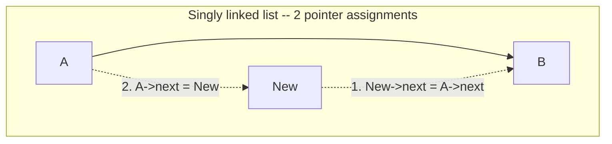
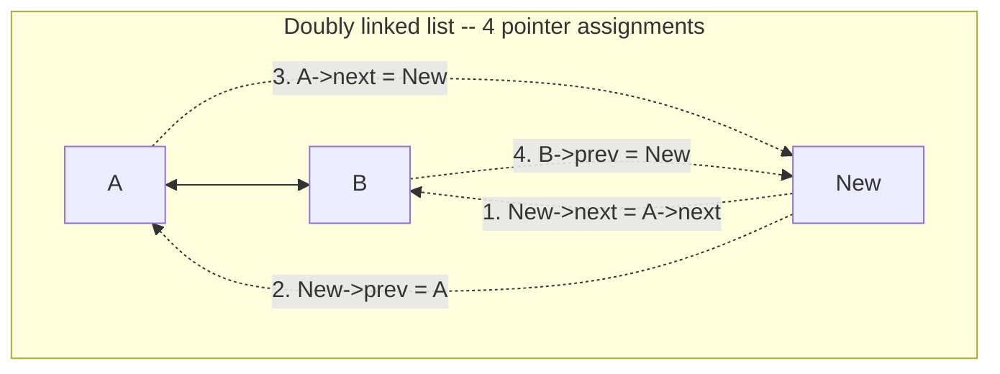
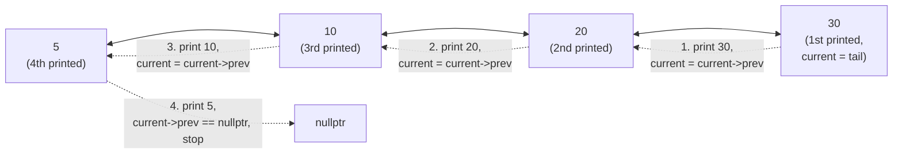

# Lecture 7: Doubly Linked Lists

A singly linked list has one glaring weakness: once you've walked past a node, there's no
way back — and inserting or deleting at the *end* costs O(n) precisely because you have to
walk the whole list just to find the last node. The **doubly linked list** fixes both
problems by giving every node a second pointer, back to the node *before* it.

## In This Lecture

- The doubly linked list concept, and its three-field node structure
- Forward and backward traversal, including a step-by-step worked trace
- Insertion and deletion at the beginning, end, and a specific position
- A direct pointer-count comparison: rewiring a singly vs. a doubly linked node
- Searching and updating
- Common pitfalls specific to keeping two directions of pointers consistent
- A worked application: a mini browser history built on a doubly linked list
- Real applications where "go backward" is exactly what you need

## The Doubly Linked List Concept

A **doubly linked list** node stores three things: the data, a pointer to the *next*
node, and a pointer to the *previous* node. The list itself typically keeps both a `head`
pointer (first node) and a `tail` pointer (last node), which is what makes end-insertion
O(1) instead of the singly linked list's O(n).


## Node Structure: Previous, Data, and Next

```cpp
struct DNode {
    int data;
    DNode* prev;
    DNode* next;
    DNode(int value) : data(value), prev(nullptr), next(nullptr) {}
};
```

## Singly vs. Doubly: Rewiring a Middle Insertion

This is the real cost (and the real benefit) of the second pointer, made concrete.
Inserting a new node between two existing nodes `A` and `B` takes **two** pointer
assignments in a singly linked list, but **four** in a doubly linked list — the extra two
are exactly what keeps `prev` consistent in both directions.





Forgetting any *one* of the doubly linked list's four steps doesn't necessarily crash —
`traverseForward()` might still print correctly while `traverseBackward()` silently prints
garbage (or an incomplete list), because forward traversal never looks at the `prev`
pointer that was left stale. This is exactly why doubly linked list bugs are often caught
late: half the structure looks perfectly fine.

## The Doubly Linked List Class

```cpp title="doubly_linked_list.cpp"
#include <iostream>
using namespace std;

struct DNode {
    int data;
    DNode* prev;
    DNode* next;
    DNode(int value) : data(value), prev(nullptr), next(nullptr) {}
};

class DoublyLinkedList {
private:
    DNode* head;
    DNode* tail;

public:
    DoublyLinkedList() : head(nullptr), tail(nullptr) {}

    void insertAtBeginning(int value) {
        DNode* newNode = new DNode(value);
        if (head == nullptr) { head = tail = newNode; return; }
        newNode->next = head;
        head->prev = newNode;
        head = newNode;
    }

    // O(1): no walk needed, because `tail` already points at the last node.
    void insertAtEnd(int value) {
        DNode* newNode = new DNode(value);
        if (tail == nullptr) { head = tail = newNode; return; }
        newNode->prev = tail;
        tail->next = newNode;
        tail = newNode;
    }

    void insertAtPosition(int value, int position) {
        if (position == 0) { insertAtBeginning(value); return; }
        DNode* current = head;
        for (int i = 0; i < position - 1 && current != nullptr; i++) {
            current = current->next;
        }
        if (current == nullptr) return;
        if (current == tail) { insertAtEnd(value); return; }
        DNode* newNode = new DNode(value);
        newNode->next = current->next;
        newNode->prev = current;
        current->next->prev = newNode;
        current->next = newNode;
    }

    void deleteFromBeginning() {
        if (head == nullptr) return;
        DNode* oldHead = head;
        head = head->next;
        if (head != nullptr) head->prev = nullptr;
        else tail = nullptr;   // list is now empty
        delete oldHead;
    }

    // O(1): `tail` already points at the node to remove, no walk needed.
    void deleteFromEnd() {
        if (tail == nullptr) return;
        DNode* oldTail = tail;
        tail = tail->prev;
        if (tail != nullptr) tail->next = nullptr;
        else head = nullptr;   // list is now empty
        delete oldTail;
    }

    void deleteAtPosition(int position) {
        if (position == 0) { deleteFromBeginning(); return; }
        DNode* current = head;
        for (int i = 0; i < position && current != nullptr; i++) {
            current = current->next;
        }
        if (current == nullptr) return;
        if (current == tail) { deleteFromEnd(); return; }
        current->prev->next = current->next;
        current->next->prev = current->prev;
        delete current;
    }

    int search(int value) const {
        DNode* current = head;
        int index = 0;
        while (current != nullptr) {
            if (current->data == value) return index;
            current = current->next;
            index++;
        }
        return -1;
    }

    bool updateAt(int position, int newValue) {
        DNode* current = head;
        for (int i = 0; i < position && current != nullptr; i++) {
            current = current->next;
        }
        if (current == nullptr) return false;
        current->data = newValue;
        return true;
    }

    void traverseForward() const {
        DNode* current = head;
        while (current != nullptr) {
            cout << current->data;
            if (current->next != nullptr) cout << " <-> ";
            current = current->next;
        }
        cout << endl;
    }

    void traverseBackward() const {
        DNode* current = tail;
        while (current != nullptr) {
            cout << current->data;
            if (current->prev != nullptr) cout << " <-> ";
            current = current->prev;
        }
        cout << endl;
    }
};

int main() {
    DoublyLinkedList list;

    list.insertAtEnd(10);
    list.insertAtEnd(20);
    list.insertAtEnd(30);
    cout << "Forward after inserting 10,20,30 at end: ";
    list.traverseForward();

    list.insertAtBeginning(5);
    cout << "Forward after inserting 5 at beginning:  ";
    list.traverseForward();
    cout << "Backward (same list, walked from tail):  ";
    list.traverseBackward();

    list.insertAtPosition(15, 2);
    cout << "Forward after inserting 15 at position 2: ";
    list.traverseForward();

    cout << "Search for 20: index " << list.search(20) << endl;

    list.deleteAtPosition(2);
    cout << "Forward after deleting position 2:        ";
    list.traverseForward();

    list.deleteFromEnd();
    cout << "Forward after deleting from end:          ";
    list.traverseForward();

    return 0;
}
```

```text
$ g++ -std=c++17 -o doubly_linked_list doubly_linked_list.cpp
$ ./doubly_linked_list
Forward after inserting 10,20,30 at end: 10 <-> 20 <-> 30
Forward after inserting 5 at beginning:  5 <-> 10 <-> 20 <-> 30
Backward (same list, walked from tail):  30 <-> 20 <-> 10 <-> 5
Forward after inserting 15 at position 2: 5 <-> 10 <-> 15 <-> 20 <-> 30
Search for 20: index 3
Forward after deleting position 2:        5 <-> 10 <-> 20 <-> 30
Forward after deleting from end:          5 <-> 10 <-> 20
```

## Worked Example: Tracing traverseBackward() Step by Step

`traverseBackward()` starts at `tail` instead of `head`, and follows `prev` instead of
`next` — otherwise it's the exact same loop shape as forward traversal. Tracing it on the
4-node list from `main()` (`5 <-> 10 <-> 20 <-> 30`) makes the symmetry concrete:



| Step | `current` | Printed | Next `current` |
|---|---|---|---|
| 1 | node holding `30` (`tail`) | `30` | `current->prev` → node holding `20` |
| 2 | node holding `20` | `20` | `current->prev` → node holding `10` |
| 3 | node holding `10` | `10` | `current->prev` → node holding `5` |
| 4 | node holding `5` | `5` | `current->prev` is `nullptr` → loop ends |

Compare this table against the real captured output above: `30 <-> 20 <-> 10 <-> 5` reads
right to left exactly as this trace predicts — `traverseBackward()` is genuinely just
`traverseForward()` with every direction swapped, which is the entire point of paying for
a second pointer per node.

## Common Pitfalls With Doubly Linked Lists

- **Updating `next` but forgetting `prev` (or vice versa).** As the rewiring diagram
  above shows, every insertion or deletion that isn't at an end touches *four* pointers,
  not two — missing one leaves the structure "half correct": one traversal direction
  works, the other doesn't.
- **Forgetting to update `tail` after removing the last node.** `deleteFromEnd` must set
  `tail = tail->prev` — and if that new `tail` is `nullptr` (the list just became empty),
  `head` must also be reset to `nullptr`, or the two pointers disagree about whether the
  list is empty.
- **Off-by-one when the target is the last node.** `insertAtPosition` and
  `deleteAtPosition` above both special-case `current == tail`, delegating to
  `insertAtEnd`/`deleteFromEnd` — without that check, the general-position logic would
  try to dereference `current->next`, which is `nullptr` at the tail.
- **Assuming a single stray pointer bug will crash immediately.** It often won't — a
  wrong `prev` pointer just makes *backward* traversal wrong; nothing about forward
  traversal, `search`, or `updateAt` would ever notice, since none of them read `prev`.
  This is exactly why testing both directions matters, not just one.

## Application: A Mini Browser History

Every one of Lecture 5 and 6's operations was justified by ordering or search speed — but
the browser-history application mentioned below is a case where the *shape* of the doubly
linked list solves the problem almost by itself: `back()` and `forward()` map directly
onto `prev` and `next`, and "visiting a new page from the middle of history" is exactly
what happens when you insert a node and discard everything that used to be ahead of it.

```cpp title="browser_history.cpp"
#include <iostream>
#include <string>
using namespace std;

// A minimal browser-history implementation on top of a doubly linked list.
// `current` is the page being viewed right now; `back()` moves current to
// `prev`, `forward()` moves it to `next` -- both O(1) precisely because
// every node already stores both directions.
struct PageNode {
    string url;
    PageNode* prev;
    PageNode* next;
    PageNode(const string& u) : url(u), prev(nullptr), next(nullptr) {}
};

class BrowserHistory {
private:
    PageNode* current;

public:
    BrowserHistory(const string& homepage) {
        current = new PageNode(homepage);
    }

    // Visiting a new page from the middle of history discards everything
    // that was "forward" of it -- exactly how a real browser behaves.
    void visit(const string& url) {
        PageNode* newPage = new PageNode(url);
        newPage->prev = current;
        current->next = newPage;   // drop the old forward chain, if any
        current = newPage;
    }

    void back() {
        if (current->prev != nullptr) current = current->prev;
    }

    void forward() {
        if (current->next != nullptr) current = current->next;
    }

    string currentUrl() const { return current->url; }
};

int main() {
    BrowserHistory history("home.com");
    history.visit("news.com");
    history.visit("docs.com");
    history.visit("mail.com");
    cout << "After visiting 3 pages, current: " << history.currentUrl() << endl;

    history.back();
    history.back();
    cout << "After two back() calls, current: " << history.currentUrl() << endl;

    history.forward();
    cout << "After one forward() call, current: " << history.currentUrl() << endl;

    // Visiting from the middle discards the old "docs.com -> mail.com" forward chain.
    history.visit("shop.com");
    cout << "After visiting shop.com from the middle: " << history.currentUrl() << endl;

    history.forward();   // nothing ahead anymore -- forward() is a safe no-op
    cout << "forward() with nothing ahead, current:   " << history.currentUrl() << endl;

    history.back();
    history.back();
    cout << "After two more back() calls, current:    " << history.currentUrl() << endl;

    return 0;
}
```

```text
$ g++ -std=c++17 -o browser_history browser_history.cpp
$ ./browser_history
After visiting 3 pages, current: mail.com
After two back() calls, current: news.com
After one forward() call, current: docs.com
After visiting shop.com from the middle: shop.com
forward() with nothing ahead, current:   shop.com
After two more back() calls, current:    news.com
```

Notice what happens after `visit("shop.com")`: the old `mail.com` node is still sitting in
memory (nothing explicitly freed it — a real implementation would need to walk and delete
the discarded forward chain), but it's no longer *reachable* from `current` no matter how
many times `forward()` is called. That unreachability is exactly what "the forward history
was discarded" means at the pointer level.

## Applications of Doubly Linked Lists

- **Browser history** — the back *and* forward buttons need to move in both directions
  through the pages you've visited, exactly what `prev`/`next` provide directly.
- **Music/video playlists** — "previous track" and "next track" map one-to-one onto
  `prev` and `next`.
- **The undo/redo stack in editors** — undo walks backward through past states, redo walks
  forward again; a doubly linked list (or a structure built on the same idea) supports
  both without extra bookkeeping.
- **LRU (Least Recently Used) caches** — moving an item to the front on every access, and
  evicting from the back, are both O(1) with a doubly linked list plus a hash table, a
  combination you'll be well-equipped to build after Unit 8.

## Complexity, Compared to a Singly Linked List

| Operation | Singly Linked List | Doubly Linked List |
|---|---|---|
| Insert/delete at beginning | O(1) | O(1) |
| Insert/delete at end | **O(n)** (must walk to find the last node) | **O(1)** (tail pointer already there) |
| Backward traversal | Not possible | O(n) |
| Extra memory per node | One pointer | Two pointers |

The doubly linked list's `tail` pointer is what turns end-insertion from O(n) into O(1) —
a direct fix for the singly linked list's weakest operation, paid for with one extra
pointer per node.

## Try It Yourself

1. Compile and run `doubly_linked_list.cpp`, then add a call to `deleteFromBeginning()`
   repeated until the list is empty, printing `traverseForward()` after each call. Confirm
   from the output that the list correctly ends up empty with no crash.
2. Add a method `DNode* findNode(int value) const` that returns a pointer to the node
   holding `value` (or `nullptr`), and use it to implement `updateAt` differently —
   searching by *value* to update, instead of by position.
3. Deliberately introduce the bug described in "Common Pitfalls" above: comment out just
   the `newNode->prev = current;` line inside `insertAtPosition`, recompile, and call
   `traverseForward()` then `traverseBackward()` after inserting in the middle. Confirm
   forward traversal still looks correct while backward traversal doesn't — then explain
   in your own words *why* forward traversal can't detect this particular bug.
4. Extend `browser_history.cpp` with a `void printHistory() const` method that walks from
   the *earliest* reachable page (following `prev` from `current` until it hits
   `nullptr`) forward to `current`, printing each URL. Call it after each `visit`, `back`,
   and `forward` in `main` to watch the visible history change in real time.

## Key Takeaways

- A doubly linked list's node adds a `prev` pointer alongside `next`, and the list itself
  tracks both a `head` and a `tail`.
- The **tail pointer** is what makes insertion and deletion at the end O(1), fixing the
  singly linked list's weakest operation — at the cost of one extra pointer per node.
- A middle insertion costs **4 pointer assignments** in a doubly linked list versus **2**
  in a singly linked list — the direct, concrete price of being able to traverse backward.
- Backward traversal, impossible in a singly linked list, becomes a simple O(n) walk from
  `tail`, following `prev` instead of `next` — otherwise identical in shape to forward
  traversal.
- Every insertion and deletion must keep **both** directions' pointers consistent — this
  is the most common source of bugs when hand-writing doubly linked list code, and it's
  especially dangerous because a missed `prev` update can leave forward traversal looking
  completely correct while backward traversal is silently broken.
- A doubly linked list isn't just "a singly linked list with extra bookkeeping" — its
  shape is often the *right* fit for a problem, as the mini browser history shows: `back()`
  and `forward()` fall directly out of `prev` and `next`, with no extra logic needed.
