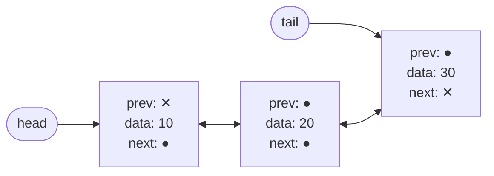

# Lecture 7: Doubly Linked Lists

A singly linked list has one glaring weakness: once you've walked past a node, there's no
way back — and inserting or deleting at the *end* costs O(n) precisely because you have to
walk the whole list just to find the last node. The **doubly linked list** fixes both
problems by giving every node a second pointer, back to the node *before* it.

## In This Lecture

- The doubly linked list concept, and its three-field node structure
- Forward and backward traversal
- Insertion and deletion at the beginning, end, and a specific position
- Searching and updating
- Real applications where "go backward" is exactly what you need

## The Doubly Linked List Concept

A **doubly linked list** node stores three things: the data, a pointer to the *next*
node, and a pointer to the *previous* node. The list itself typically keeps both a `head`
pointer (first node) and a `tail` pointer (last node), which is what makes end-insertion
O(1) instead of the singly linked list's O(n).



## Node Structure: Previous, Data, and Next

```cpp
struct DNode {
    int data;
    DNode* prev;
    DNode* next;
    DNode(int value) : data(value), prev(nullptr), next(nullptr) {}
};
```

## The Doubly Linked List Class

```cpp title="doubly_linked_list.cpp"
#include <iostream>
using namespace std;

struct DNode {
    int data;
    DNode* prev;
    DNode* next;
    DNode(int value) : data(value), prev(nullptr), next(nullptr) {}
};

class DoublyLinkedList {
private:
    DNode* head;
    DNode* tail;

public:
    DoublyLinkedList() : head(nullptr), tail(nullptr) {}

    void insertAtBeginning(int value) {
        DNode* newNode = new DNode(value);
        if (head == nullptr) { head = tail = newNode; return; }
        newNode->next = head;
        head->prev = newNode;
        head = newNode;
    }

    // O(1): no walk needed, because `tail` already points at the last node.
    void insertAtEnd(int value) {
        DNode* newNode = new DNode(value);
        if (tail == nullptr) { head = tail = newNode; return; }
        newNode->prev = tail;
        tail->next = newNode;
        tail = newNode;
    }

    void insertAtPosition(int value, int position) {
        if (position == 0) { insertAtBeginning(value); return; }
        DNode* current = head;
        for (int i = 0; i < position - 1 && current != nullptr; i++) {
            current = current->next;
        }
        if (current == nullptr) return;
        if (current == tail) { insertAtEnd(value); return; }
        DNode* newNode = new DNode(value);
        newNode->next = current->next;
        newNode->prev = current;
        current->next->prev = newNode;
        current->next = newNode;
    }

    void deleteFromBeginning() {
        if (head == nullptr) return;
        DNode* oldHead = head;
        head = head->next;
        if (head != nullptr) head->prev = nullptr;
        else tail = nullptr;   // list is now empty
        delete oldHead;
    }

    // O(1): `tail` already points at the node to remove, no walk needed.
    void deleteFromEnd() {
        if (tail == nullptr) return;
        DNode* oldTail = tail;
        tail = tail->prev;
        if (tail != nullptr) tail->next = nullptr;
        else head = nullptr;   // list is now empty
        delete oldTail;
    }

    void deleteAtPosition(int position) {
        if (position == 0) { deleteFromBeginning(); return; }
        DNode* current = head;
        for (int i = 0; i < position && current != nullptr; i++) {
            current = current->next;
        }
        if (current == nullptr) return;
        if (current == tail) { deleteFromEnd(); return; }
        current->prev->next = current->next;
        current->next->prev = current->prev;
        delete current;
    }

    int search(int value) const {
        DNode* current = head;
        int index = 0;
        while (current != nullptr) {
            if (current->data == value) return index;
            current = current->next;
            index++;
        }
        return -1;
    }

    bool updateAt(int position, int newValue) {
        DNode* current = head;
        for (int i = 0; i < position && current != nullptr; i++) {
            current = current->next;
        }
        if (current == nullptr) return false;
        current->data = newValue;
        return true;
    }

    void traverseForward() const {
        DNode* current = head;
        while (current != nullptr) {
            cout << current->data;
            if (current->next != nullptr) cout << " <-> ";
            current = current->next;
        }
        cout << endl;
    }

    void traverseBackward() const {
        DNode* current = tail;
        while (current != nullptr) {
            cout << current->data;
            if (current->prev != nullptr) cout << " <-> ";
            current = current->prev;
        }
        cout << endl;
    }
};

int main() {
    DoublyLinkedList list;

    list.insertAtEnd(10);
    list.insertAtEnd(20);
    list.insertAtEnd(30);
    cout << "Forward after inserting 10,20,30 at end: ";
    list.traverseForward();

    list.insertAtBeginning(5);
    cout << "Forward after inserting 5 at beginning:  ";
    list.traverseForward();
    cout << "Backward (same list, walked from tail):  ";
    list.traverseBackward();

    list.insertAtPosition(15, 2);
    cout << "Forward after inserting 15 at position 2: ";
    list.traverseForward();

    cout << "Search for 20: index " << list.search(20) << endl;

    list.deleteAtPosition(2);
    cout << "Forward after deleting position 2:        ";
    list.traverseForward();

    list.deleteFromEnd();
    cout << "Forward after deleting from end:          ";
    list.traverseForward();

    return 0;
}
```

```text
$ g++ -std=c++17 -o doubly_linked_list doubly_linked_list.cpp
$ ./doubly_linked_list
Forward after inserting 10,20,30 at end: 10 <-> 20 <-> 30
Forward after inserting 5 at beginning:  5 <-> 10 <-> 20 <-> 30
Backward (same list, walked from tail):  30 <-> 20 <-> 10 <-> 5
Forward after inserting 15 at position 2: 5 <-> 10 <-> 15 <-> 20 <-> 30
Search for 20: index 3
Forward after deleting position 2:        5 <-> 10 <-> 20 <-> 30
Forward after deleting from end:          5 <-> 10 <-> 20
```

## Applications of Doubly Linked Lists

- **Browser history** — the back *and* forward buttons need to move in both directions
  through the pages you've visited, exactly what `prev`/`next` provide directly.
- **Music/video playlists** — "previous track" and "next track" map one-to-one onto
  `prev` and `next`.
- **The undo/redo stack in editors** — undo walks backward through past states, redo walks
  forward again; a doubly linked list (or a structure built on the same idea) supports
  both without extra bookkeeping.
- **LRU (Least Recently Used) caches** — moving an item to the front on every access, and
  evicting from the back, are both O(1) with a doubly linked list plus a hash table, a
  combination you'll be well-equipped to build after Unit 8.

## Complexity, Compared to a Singly Linked List

| Operation | Singly Linked List | Doubly Linked List |
|---|---|---|
| Insert/delete at beginning | O(1) | O(1) |
| Insert/delete at end | **O(n)** (must walk to find the last node) | **O(1)** (tail pointer already there) |
| Backward traversal | Not possible | O(n) |
| Extra memory per node | One pointer | Two pointers |

The doubly linked list's `tail` pointer is what turns end-insertion from O(n) into O(1) —
a direct fix for the singly linked list's weakest operation, paid for with one extra
pointer per node.

## Try It Yourself

1. Compile and run `doubly_linked_list.cpp`, then add a call to `deleteFromBeginning()`
   repeated until the list is empty, printing `traverseForward()` after each call. Confirm
   from the output that the list correctly ends up empty with no crash.
2. Add a method `DNode* findNode(int value) const` that returns a pointer to the node
   holding `value` (or `nullptr`), and use it to implement `updateAt` differently —
   searching by *value* to update, instead of by position.

## Key Takeaways

- A doubly linked list's node adds a `prev` pointer alongside `next`, and the list itself
  tracks both a `head` and a `tail`.
- The **tail pointer** is what makes insertion and deletion at the end O(1), fixing the
  singly linked list's weakest operation — at the cost of one extra pointer per node.
- Backward traversal, impossible in a singly linked list, becomes a simple O(n) walk from
  `tail`.
- Every insertion and deletion must keep **both** directions' pointers consistent — this
  is the most common source of bugs when hand-writing doubly linked list code, so trace
  each operation on paper before trusting it.
