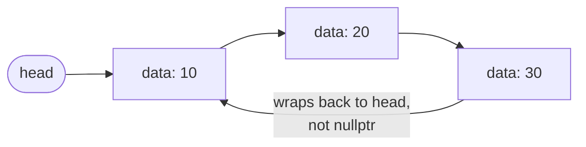

# Lecture 8: Circular Linked Lists

Every linked list so far has had a clear end — a `nullptr` marking "there's nothing
after this." A **circular linked list** removes that end entirely: the last node points
back to the first, turning the chain into a loop. That one change is exactly what a
round-robin scheduler, a multiplayer game's turn order, or a looping playlist needs.

## In This Lecture

- The circular linked list concept, and how "head" and "tail" change meaning
- Traversal, insertion, and deletion on a circular list
- Applications where looping back to the start is the actual requirement
- A direct comparison of singly, doubly, and circular linked lists

## The Circular Node Structure

A circular linked list's node is structurally identical to a singly linked list's node —
the difference is purely in what the *last* node's `next` points to.

```cpp
struct Node {
    int data;
    Node* next;
    Node(int value) : data(value), next(nullptr) {}
};
```

## Head and Tail in a Circular Linked List

There is no `nullptr` anywhere in a non-empty circular linked list — the last node's
`next` points back to `head`, not to `nullptr`. This has one immediate consequence: **you
can no longer use "is `next` `nullptr`?" to detect the end of the list**, because there
is no end. Every traversal must instead check "have I gotten back to where I started?"



## Operations on a Circular Linked List

```cpp title="circular_linked_list.cpp"
#include <iostream>
using namespace std;

struct Node {
    int data;
    Node* next;
    Node(int value) : data(value), next(nullptr) {}
};

class CircularLinkedList {
private:
    Node* tail;   // tracking `tail` (not `head`) makes end-insertion simpler here

public:
    CircularLinkedList() : tail(nullptr) {}

    bool isEmpty() const { return tail == nullptr; }

    void insertAtBeginning(int value) {
        Node* newNode = new Node(value);
        if (isEmpty()) {
            tail = newNode;
            tail->next = tail;   // points to itself: a one-node loop
            return;
        }
        newNode->next = tail->next;   // new node points to the old head
        tail->next = newNode;          // tail's next becomes the new head
    }

    void insertAtEnd(int value) {
        insertAtBeginning(value);   // reuse the same logic...
        tail = tail->next;           // ...then just slide `tail` forward by one
    }

    void insertAtPosition(int value, int position) {
        if (position == 0 || isEmpty()) { insertAtBeginning(value); return; }
        Node* current = tail->next;   // start at head
        for (int i = 0; i < position - 1; i++) {
            current = current->next;
        }
        Node* newNode = new Node(value);
        newNode->next = current->next;
        current->next = newNode;
        if (current == tail) tail = newNode;
    }

    void deleteFromBeginning() {
        if (isEmpty()) return;
        Node* head = tail->next;
        if (head == tail) { delete head; tail = nullptr; return; }   // was the only node
        tail->next = head->next;
        delete head;
    }

    void deleteFromEnd() {
        if (isEmpty()) return;
        Node* head = tail->next;
        if (head == tail) { delete head; tail = nullptr; return; }
        Node* current = head;
        while (current->next != tail) {
            current = current->next;
        }
        current->next = tail->next;   // skip over the old tail, back to head
        delete tail;
        tail = current;
    }

    void traverse() const {
        if (isEmpty()) { cout << "(empty)" << endl; return; }
        Node* head = tail->next;
        Node* current = head;
        do {
            cout << current->data;
            current = current->next;
            if (current != head) cout << " -> ";
        } while (current != head);
        cout << " -> (back to " << head->data << ")" << endl;
    }
};

int main() {
    CircularLinkedList list;

    list.insertAtEnd(10);
    list.insertAtEnd(20);
    list.insertAtEnd(30);
    cout << "After inserting 10, 20, 30 at end: ";
    list.traverse();

    list.insertAtBeginning(5);
    cout << "After inserting 5 at beginning:    ";
    list.traverse();

    list.insertAtPosition(15, 2);
    cout << "After inserting 15 at position 2:  ";
    list.traverse();

    list.deleteFromBeginning();
    cout << "After deleting from beginning:     ";
    list.traverse();

    list.deleteFromEnd();
    cout << "After deleting from end:           ";
    list.traverse();

    return 0;
}
```

```text
$ g++ -std=c++17 -o circular_linked_list circular_linked_list.cpp
$ ./circular_linked_list
After inserting 10, 20, 30 at end: 10 -> 20 -> 30 -> (back to 10)
After inserting 5 at beginning:    5 -> 10 -> 20 -> 30 -> (back to 5)
After inserting 15 at position 2:  5 -> 10 -> 15 -> 20 -> 30 -> (back to 5)
After deleting from beginning:     10 -> 15 -> 20 -> 30 -> (back to 10)
After deleting from end:           10 -> 15 -> 20 -> (back to 10)
```

!!! warning "Why traverse() uses a do-while loop, not a while loop"
    A normal `while (current != head)` would immediately be false on the *first* check
    (since `current` starts equal to `head`), and print nothing at all. `do { ... } while
    (current != head)` guarantees the body runs at least once — visiting `head` itself —
    before the loop condition ever gets checked. This is the standard pattern for
    traversing any circular structure.

## Applications of Circular Linked Lists

- **Round-robin CPU scheduling** — each process gets a turn, and after the last process,
  the scheduler wraps back around to the first, forever, with no special "restart" logic
  needed.
- **Multiplayer turn order** — after the last player's turn, play returns to the first
  player.
- **Looping playlists** — "repeat all" needs the last song to lead straight back into the
  first, without the player needing to detect "end of list" and manually restart.
- **Buffering for streaming data** — a fixed-size circular buffer reuses the same nodes
  over and over instead of endlessly allocating new ones.

## Comparison of Singly, Doubly, and Circular Linked Lists

| | Singly | Doubly | Circular (singly) |
|---|---|---|---|
| Pointers per node | 1 (`next`) | 2 (`prev`, `next`) | 1 (`next`) |
| Last node's `next` | `nullptr` | `nullptr` | Points back to `head` |
| Backward traversal | No | Yes | No (unless also made doubly circular) |
| Natural "end of structure" | Yes | Yes | No — must track a starting point instead |
| Typical use case | General-purpose list | Need both directions | Looping/round-robin behavior |

A circular list can also be made *doubly* circular — combining both ideas, `prev`/`next`
pointers **and** the wraparound — for structures that need to loop in both directions,
such as certain implementations of a deque (Lecture 14).

## Try It Yourself

1. Compile and run `circular_linked_list.cpp`, then delete every node one at a time with
   `deleteFromBeginning()` and confirm — by calling `traverse()` after the final
   deletion — that it correctly prints `(empty)` instead of looping forever or crashing.
2. Write a function that, given a circular linked list and an integer `k`, prints every
   node's data starting from the head and going around the loop exactly `k` times (so for
   a 3-node list and `k = 2`, it prints 6 values total, cycling twice).

## Key Takeaways

- A circular linked list's last node points back to `head` instead of `nullptr` — there is
  no natural end, so every traversal must detect "back to the start" instead of "reached
  null."
- Tracking `tail` (rather than `head`) as the class's one stored pointer makes end
  insertion a clean, constant-time operation, since `tail->next` is always the head.
- `do-while` is the standard loop shape for circular traversal, because a `while` loop
  would incorrectly treat "already at the start" as "already done."
- Circular linked lists are the right tool specifically when the *problem itself* loops —
  round-robin scheduling, turn-based games, repeating playlists — not a general-purpose
  replacement for singly or doubly linked lists.
