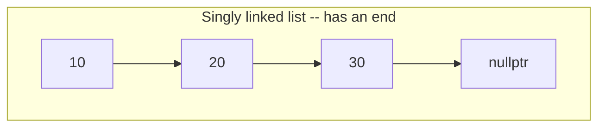
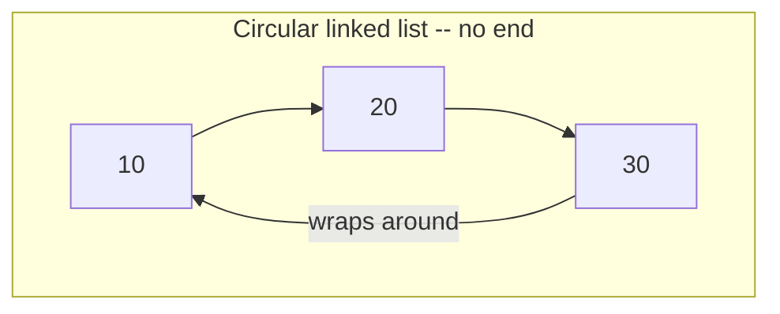
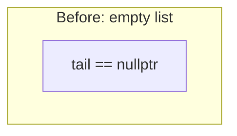
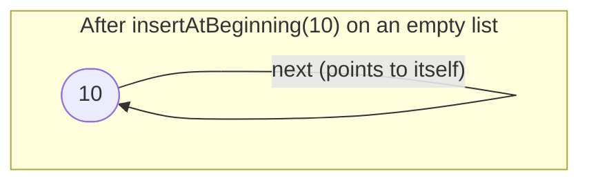
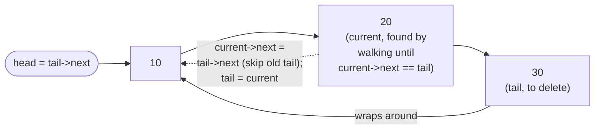

# Lecture 8: Circular Linked Lists

Every linked list so far has had a clear end — a `nullptr` marking "there's nothing
after this." A **circular linked list** removes that end entirely: the last node points
back to the first, turning the chain into a loop. That one change is exactly what a
round-robin scheduler, a multiplayer game's turn order, or a looping playlist needs.

## In This Lecture

- The circular linked list concept, and how "head" and "tail" change meaning
- An explicit side-by-side contrast: nullptr-terminated vs. wraparound structure
- Traversal, insertion, and deletion on a circular list, with pointer-rewiring diagrams
- Common pitfalls specific to a structure with no natural "end"
- A fully worked application: round-robin CPU scheduling on a circular linked list
- Applications where looping back to the start is the actual requirement
- A direct comparison of singly, doubly, and circular linked lists

## The Circular Node Structure

A circular linked list's node is structurally identical to a singly linked list's node —
the difference is purely in what the *last* node's `next` points to.

```cpp
struct Node {
    int data;
    Node* next;
    Node(int value) : data(value), next(nullptr) {}
};
```

## Head and Tail in a Circular Linked List

There is no `nullptr` anywhere in a non-empty circular linked list — the last node's
`next` points back to `head`, not to `nullptr`. This has one immediate consequence: **you
can no longer use "is `next` `nullptr`?" to detect the end of the list**, because there
is no end. Every traversal must instead check "have I gotten back to where I started?"


### Side by Side: Linear Versus Circular

Put next to a singly linked list, the difference is a single arrow — everything else about
the node structure is identical. That one arrow is what removes the concept of "the end"
entirely.





This single structural change ripples through every operation: **any** loop that used
`while (current != nullptr)` must become something like `do { ... } while (current !=
startingPoint)` instead, because there is no longer a sentinel value to stop on — the
*only* way to know you've seen every node is to remember where you started.

## Operations on a Circular Linked List

```cpp title="circular_linked_list.cpp"
#include <iostream>
using namespace std;

struct Node {
    int data;
    Node* next;
    Node(int value) : data(value), next(nullptr) {}
};

class CircularLinkedList {
private:
    Node* tail;   // tracking `tail` (not `head`) makes end-insertion simpler here

public:
    CircularLinkedList() : tail(nullptr) {}

    bool isEmpty() const { return tail == nullptr; }

    void insertAtBeginning(int value) {
        Node* newNode = new Node(value);
        if (isEmpty()) {
            tail = newNode;
            tail->next = tail;   // points to itself: a one-node loop
            return;
        }
        newNode->next = tail->next;   // new node points to the old head
        tail->next = newNode;          // tail's next becomes the new head
    }

    void insertAtEnd(int value) {
        insertAtBeginning(value);   // reuse the same logic...
        tail = tail->next;           // ...then just slide `tail` forward by one
    }

    void insertAtPosition(int value, int position) {
        if (position == 0 || isEmpty()) { insertAtBeginning(value); return; }
        Node* current = tail->next;   // start at head
        for (int i = 0; i < position - 1; i++) {
            current = current->next;
        }
        Node* newNode = new Node(value);
        newNode->next = current->next;
        current->next = newNode;
        if (current == tail) tail = newNode;
    }

    void deleteFromBeginning() {
        if (isEmpty()) return;
        Node* head = tail->next;
        if (head == tail) { delete head; tail = nullptr; return; }   // was the only node
        tail->next = head->next;
        delete head;
    }

    void deleteFromEnd() {
        if (isEmpty()) return;
        Node* head = tail->next;
        if (head == tail) { delete head; tail = nullptr; return; }
        Node* current = head;
        while (current->next != tail) {
            current = current->next;
        }
        current->next = tail->next;   // skip over the old tail, back to head
        delete tail;
        tail = current;
    }

    void traverse() const {
        if (isEmpty()) { cout << "(empty)" << endl; return; }
        Node* head = tail->next;
        Node* current = head;
        do {
            cout << current->data;
            current = current->next;
            if (current != head) cout << " -> ";
        } while (current != head);
        cout << " -> (back to " << head->data << ")" << endl;
    }
};

int main() {
    CircularLinkedList list;

    list.insertAtEnd(10);
    list.insertAtEnd(20);
    list.insertAtEnd(30);
    cout << "After inserting 10, 20, 30 at end: ";
    list.traverse();

    list.insertAtBeginning(5);
    cout << "After inserting 5 at beginning:    ";
    list.traverse();

    list.insertAtPosition(15, 2);
    cout << "After inserting 15 at position 2:  ";
    list.traverse();

    list.deleteFromBeginning();
    cout << "After deleting from beginning:     ";
    list.traverse();

    list.deleteFromEnd();
    cout << "After deleting from end:           ";
    list.traverse();

    return 0;
}
```

```text
$ g++ -std=c++17 -o circular_linked_list circular_linked_list.cpp
$ ./circular_linked_list
After inserting 10, 20, 30 at end: 10 -> 20 -> 30 -> (back to 10)
After inserting 5 at beginning:    5 -> 10 -> 20 -> 30 -> (back to 5)
After inserting 15 at position 2:  5 -> 10 -> 15 -> 20 -> 30 -> (back to 5)
After deleting from beginning:     10 -> 15 -> 20 -> 30 -> (back to 10)
After deleting from end:           10 -> 15 -> 20 -> (back to 10)
```

!!! warning "Why traverse() uses a do-while loop, not a while loop"
    A normal `while (current != head)` would immediately be false on the *first* check
    (since `current` starts equal to `head`), and print nothing at all. `do { ... } while
    (current != head)` guarantees the body runs at least once — visiting `head` itself —
    before the loop condition ever gets checked. This is the standard pattern for
    traversing any circular structure.

## Visualizing insertAtBeginning: the One-Node Self-Loop

The very first insertion into an empty circular list is its own small edge case worth
seeing explicitly: a single node's `next` must point at **itself**, not at `nullptr` —
otherwise it wouldn't be circular at all.





Every subsequent insertion builds on this: `newNode->next = tail->next` (the current head)
followed by `tail->next = newNode` — the same two-step pattern as any linked list
insertion, just applied to a structure that already loops.

## Visualizing deleteFromEnd: Walking to the Second-to-Last Node

Just like a singly linked list, a circular list with only a `tail` pointer (not a `prev`
pointer) has no shortcut to the *second-to-last* node — `deleteFromEnd` must walk the
whole ring to find it before it can bypass the old tail.



After this rewiring, `20` becomes the new `tail`, and `20`'s `next` points straight at
`10` (the head) — the old `30` node is unreachable from anywhere in the ring, and
`delete tail` (the old tail) frees it.

## Common Pitfalls With Circular Linked Lists

- **Using `while (current != nullptr)` out of habit.** There is no `nullptr` to stop on
  in a non-empty circular list — a loop written this way simply never terminates. Every
  traversal must check against a remembered starting point instead.
- **Checking the stopping condition before the first node is visited.** As the warning
  above explains, a plain `while (current != head)` starts out false and skips the entire
  list — this is exactly why `do-while` is the standard shape here, not a stylistic choice.
- **Forgetting the one-node self-loop.** `insertAtBeginning` on an empty list must set
  `tail->next = tail` — a node pointing at itself looks wrong on paper the first time you
  see it, but it's the only structure consistent with "no `nullptr` anywhere."
- **Losing track of `tail` after a deletion that removes it.** Both `deleteFromBeginning`
  and `deleteFromEnd` must special-case "was this the *only* node?" (`head == tail`) —
  deleting the last remaining node has to reset `tail` to `nullptr`, or the list would
  claim to be non-empty while every pointer into it is dangling.

## Application: Round-Robin CPU Scheduling

The applications list below already names round-robin scheduling as circular linked
lists' signature use case — worth implementing directly rather than only describing. A
**round-robin scheduler** gives every process a fixed time slice (a **quantum**); if a
process doesn't finish within its slice, it goes to the back of the line and waits for
its turn to come around again. There is no special "wrap to the first process" logic
needed at all — the ring structure *is* the wraparound.

```cpp title="round_robin_scheduler.cpp"
#include <iostream>
#include <string>
using namespace std;

// A round-robin CPU scheduler: every process gets one fixed-length time
// slice (a "quantum"), then control moves to the next process in the ring --
// wrapping from the last process straight back to the first. A circular
// linked list models this exactly: there is no "end of process list" to
// detect, only "keep going around."
struct Process {
    string name;
    int remainingTime;
    Process* next;
    Process(const string& n, int t) : name(n), remainingTime(t), next(nullptr) {}
};

class RoundRobinScheduler {
private:
    Process* tail;   // tail->next is always the current "front" of the ring

public:
    RoundRobinScheduler() : tail(nullptr) {}

    void addProcess(const string& name, int burstTime) {
        Process* newProcess = new Process(name, burstTime);
        if (tail == nullptr) {
            tail = newProcess;
            tail->next = tail;
            return;
        }
        newProcess->next = tail->next;
        tail->next = newProcess;
        tail = newProcess;
    }

    // Runs the whole ring to completion, giving each process `quantum` units
    // per turn (or less, if it finishes mid-turn), printing the schedule.
    void run(int quantum) {
        if (tail == nullptr) { cout << "(no processes)" << endl; return; }
        Process* current = tail->next;   // start at the front of the ring
        int tick = 0;
        while (tail != nullptr) {
            int slice = min(quantum, current->remainingTime);
            cout << "t=" << tick << ": run " << current->name
                 << " for " << slice << " (remaining after: "
                 << (current->remainingTime - slice) << ")" << endl;
            tick += slice;
            current->remainingTime -= slice;

            Process* nextProcess = current->next;
            if (current->remainingTime == 0) {
                cout << "        " << current->name << " finished." << endl;
                // remove `current` from the ring
                if (current == nextProcess) {
                    // it was the only process left
                    delete current;
                    tail = nullptr;
                    break;
                }
                Process* before = tail;
                while (before->next != current) before = before->next;
                before->next = nextProcess;
                if (tail == current) tail = before;
                delete current;
            }
            current = nextProcess;
        }
        cout << "All processes finished at t=" << tick << "." << endl;
    }
};

int main() {
    RoundRobinScheduler scheduler;
    scheduler.addProcess("P1", 5);
    scheduler.addProcess("P2", 3);
    scheduler.addProcess("P3", 7);

    scheduler.run(4);   // quantum = 4 time units per turn

    return 0;
}
```

```text
$ g++ -std=c++17 -o round_robin_scheduler round_robin_scheduler.cpp
$ ./round_robin_scheduler
t=0: run P1 for 4 (remaining after: 1)
t=4: run P2 for 3 (remaining after: 0)
        P2 finished.
t=7: run P3 for 4 (remaining after: 3)
t=11: run P1 for 1 (remaining after: 0)
        P1 finished.
t=12: run P3 for 3 (remaining after: 0)
        P3 finished.
All processes finished at t=15.
```

Trace `P1`: it starts with 5 units of work, gets a 4-unit slice at `t=0` (1 unit left),
then has to wait for `P2` and `P3` to each get a turn before the ring comes back around to
it at `t=11`, where its last unit finally finishes. That wait — getting skipped over by
every other process exactly once — *is* round robin, and it falls directly out of
`current = current->next` never needing a special case for "wrap back to the start."

## Applications of Circular Linked Lists

- **Round-robin CPU scheduling** — each process gets a turn, and after the last process,
  the scheduler wraps back around to the first, forever, with no special "restart" logic
  needed.
- **Multiplayer turn order** — after the last player's turn, play returns to the first
  player.
- **Looping playlists** — "repeat all" needs the last song to lead straight back into the
  first, without the player needing to detect "end of list" and manually restart.
- **Buffering for streaming data** — a fixed-size circular buffer reuses the same nodes
  over and over instead of endlessly allocating new ones.

## Comparison of Singly, Doubly, and Circular Linked Lists

| | Singly | Doubly | Circular (singly) |
|---|---|---|---|
| Pointers per node | 1 (`next`) | 2 (`prev`, `next`) | 1 (`next`) |
| Last node's `next` | `nullptr` | `nullptr` | Points back to `head` |
| Backward traversal | No | Yes | No (unless also made doubly circular) |
| Natural "end of structure" | Yes | Yes | No — must track a starting point instead |
| Typical use case | General-purpose list | Need both directions | Looping/round-robin behavior |

A circular list can also be made *doubly* circular — combining both ideas, `prev`/`next`
pointers **and** the wraparound — for structures that need to loop in both directions,
such as certain implementations of a deque (Lecture 14).

## Try It Yourself

1. Compile and run `circular_linked_list.cpp`, then delete every node one at a time with
   `deleteFromBeginning()` and confirm — by calling `traverse()` after the final
   deletion — that it correctly prints `(empty)` instead of looping forever or crashing.
2. Write a function that, given a circular linked list and an integer `k`, prints every
   node's data starting from the head and going around the loop exactly `k` times (so for
   a 3-node list and `k = 2`, it prints 6 values total, cycling twice).
3. Compile and run `round_robin_scheduler.cpp`, then change the quantum from `4` to `2`
   and predict, before running it, how the `t=` values in the output will change (the
   total finish time should stay the same — only the schedule's granularity changes).
   Confirm your prediction against the real output.
4. The classic **Josephus problem** asks: given `n` people standing in a circle, and
   counting off every `k`-th person for elimination (wrapping around as needed), who is
   the last person remaining? Using `CircularLinkedList`'s structure as a model (you'll
   need a version whose `deleteFromBeginning`-style operation can remove an arbitrary
   *current* node, not just the head), write a program that solves it for `n = 7`,
   `k = 3`, and prints the elimination order.

## Key Takeaways

- A circular linked list's last node points back to `head` instead of `nullptr` — there is
  no natural end, so every traversal must detect "back to the start" instead of "reached
  null." Side by side with a singly linked list, the entire difference is that one arrow.
- Tracking `tail` (rather than `head`) as the class's one stored pointer makes end
  insertion a clean, constant-time operation, since `tail->next` is always the head.
- The very first node inserted into an empty circular list must point **at itself** — a
  self-loop is the correct, and only, structure for a one-node circular list.
- `do-while` is the standard loop shape for circular traversal, because a `while` loop
  would incorrectly treat "already at the start" as "already done."
- Deleting from the end still requires an O(n) walk to find the second-to-last node,
  exactly like a singly linked list — a circular list's `tail` pointer helps with
  *insertion* at the end, not with finding what comes before `tail`.
- Circular linked lists are the right tool specifically when the *problem itself* loops —
  round-robin scheduling (worked through above in full), turn-based games, repeating
  playlists — not a general-purpose replacement for singly or doubly linked lists.
