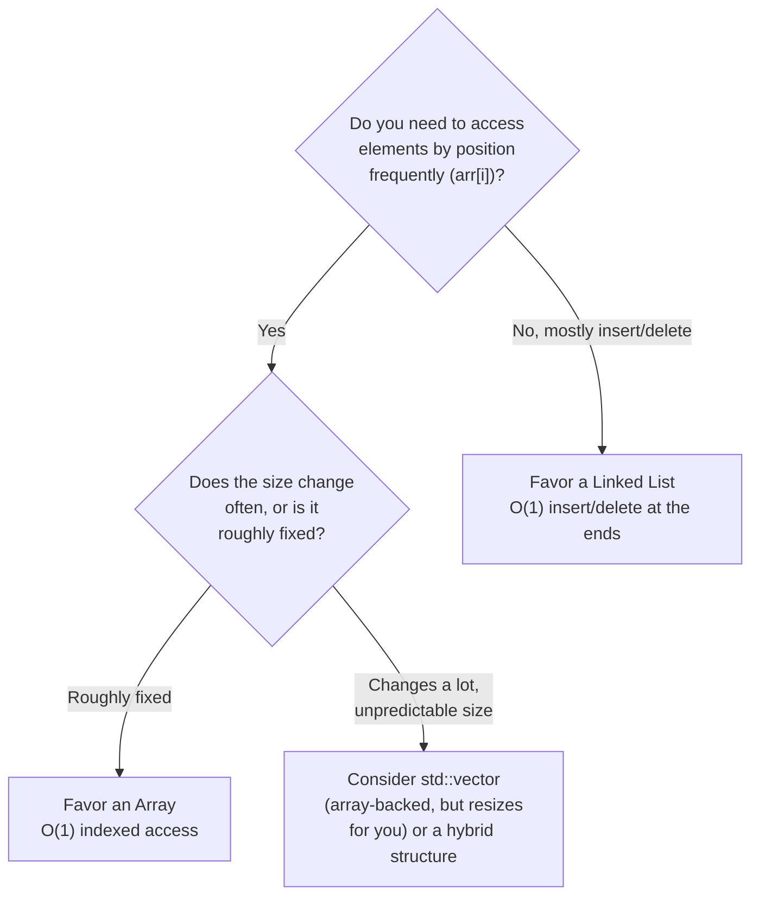

# Lecture 9: Linear Structures: Applications and Problem Solving

Units so far have introduced arrays and every flavor of linked list as separate tools.
This lecture closes Unit 2 by putting them side by side and asking the practical
question you'll face in every real project from here on: **given this specific problem,
which one actually fits?** There usually isn't a single "correct" answer — only a
better-informed trade-off.

## In This Lecture

- A decision framework for choosing between an array and a linked list
- The same problem, solved both ways, compared directly
- Combining structures when neither one alone is the full answer
- Real-world applications that make the choice concrete

## Selecting an Appropriate Linear Data Structure

The decision almost always comes down to which operation your application performs
*most often*.



| Your priority | Better fit |
|---|---|
| Fast lookup by position, size roughly known | Array |
| Frequent insertion/deletion, especially at the front | Linked List |
| Frequent insertion/deletion **and** need indexed access sometimes | `std::vector` (amortized growth) or a data structure from a later unit (tree, hash table) |
| Memory is extremely tight, every byte counts | Array (no per-element pointer overhead) |

## Dynamic Data Management

"Dynamic" data — data whose *size* isn't known ahead of time, or changes constantly while
the program runs — is where linked lists earn their keep. A phone app's incoming
notification list, a text editor's list of open documents, a game's list of currently
active enemies: none of these have a size you could hard-code into an array declaration.

## Array-Based vs. Linked-List-Based Problem Solving

Consider a concrete problem: **maintain a waiting list, where people are served strictly
in the order they arrived, and the list needs to support removing the person at the
front (served) and adding a new person at the end (arrived).** Let's solve it both ways
and measure what actually happens.

```cpp title="waiting_list_comparison.cpp"
#include <iostream>
#include <chrono>
using namespace std;
using namespace std::chrono;

// --- Array-based version ---
class ArrayWaitingList {
private:
    int data[10000];
    int frontIndex = 0;
    int count = 0;
public:
    void arrive(int id) { data[frontIndex + count] = id; count++; }
    int serve() {
        int servedId = data[frontIndex];
        frontIndex++;   // just move the "start" marker -- no shifting of real elements
        count--;
        return servedId;
    }
};

// --- Linked-list-based version ---
struct Node { int data; Node* next; Node(int v) : data(v), next(nullptr) {} };
class LinkedWaitingList {
private:
    Node* head = nullptr;
    Node* tail = nullptr;
public:
    void arrive(int id) {
        Node* newNode = new Node(id);
        if (tail == nullptr) { head = tail = newNode; return; }
        tail->next = newNode;
        tail = newNode;
    }
    int serve() {
        int servedId = head->data;
        Node* oldHead = head;
        head = head->next;
        if (head == nullptr) tail = nullptr;
        delete oldHead;
        return servedId;
    }
};

int main() {
    const int N = 5000;

    ArrayWaitingList arrList;
    auto start1 = high_resolution_clock::now();
    for (int i = 0; i < N; i++) arrList.arrive(i);
    for (int i = 0; i < N; i++) arrList.serve();
    auto end1 = high_resolution_clock::now();

    LinkedWaitingList llList;
    auto start2 = high_resolution_clock::now();
    for (int i = 0; i < N; i++) llList.arrive(i);
    for (int i = 0; i < N; i++) llList.serve();
    auto end2 = high_resolution_clock::now();

    cout << N << " arrivals + " << N << " serves:" << endl;
    cout << "  Array-based:  " << duration_cast<microseconds>(end1 - start1).count() << " microseconds" << endl;
    cout << "  Linked-based: " << duration_cast<microseconds>(end2 - start2).count() << " microseconds" << endl;
    return 0;
}
```

```text
$ g++ -std=c++17 -o waiting_list_comparison waiting_list_comparison.cpp
$ ./waiting_list_comparison
5000 arrivals + 5000 serves:
  Array-based:  29 microseconds
  Linked-based: 460 microseconds
```

!!! note "Both are O(1) per operation here — the array just has a smaller constant factor"
    Notice both versions only ever `arrive()` at the end and `serve()` from the front —
    exactly the access pattern that's cheap for *both* structures. The array wins on raw
    speed because contiguous memory is friendlier to the CPU's cache, and there's no `new`/
    `delete` overhead per element. But if this problem also needed to remove a specific
    person from the *middle* of the line (they left early), the array version would need
    O(n) shifting while a linked list — given a pointer to that person's node — would not.
    The "right" answer depends entirely on which operations the real application performs,
    not on a single benchmark.

## Combined Linear Structure Operations

Real problems often need more than one structure working together, not a single winner:

- A **text editor's undo history** might use an array for the visible document (fast
  rendering, indexed access) alongside a linked list or stack of past edits (cheap
  push/pop of recent changes).
- A **music player** might use an array to display the playlist (so you can jump to song
  #7 instantly) but a doubly linked list's `prev`/`next` logic for the actual "skip
  forward/back" playback controls.

## Real-World Applications

| Application | Structure used | Why |
|---|---|---|
| Undo/redo in an editor | Stack (built on a linked list, Unit 3) | Most recent change is undone first — last in, first out |
| Print job queue | Queue (built on a linked list, Unit 4) | Jobs print in the order they were submitted — first in, first out |
| Autocomplete suggestions cache | Array (sorted) | Frequent lookups, rarely modified after loading |
| Social media "infinite scroll" feed | Linked list | Constantly appending new posts as they load; never needs to jump to post #500 by index |
| Image pixel data | 2D array | Every pixel needs instant, predictable-cost access by (row, column) |

## Try It Yourself

1. Run `waiting_list_comparison.cpp` yourself with `N` increased to `50000`. Does the gap
   between the two versions grow, shrink, or stay about the same proportionally? What does
   that tell you about each structure's growth rate for this access pattern?
2. Pick one application from the "Real-World Applications" table, and argue for the
   *other* structure instead (e.g., why might an infinite-scroll feed use an array in some
   apps?). There's no single right answer — the goal is practicing the trade-off argument.

## Key Takeaways

- Choosing between an array and a linked list is a **trade-off decision**, not a search
  for the objectively "best" structure — it depends on which operations the actual
  application performs most.
- Arrays win when indexed access matters and size is roughly predictable; linked lists win
  when insertion/deletion (especially at the ends) is frequent and size is unpredictable.
- Even when both structures achieve the same Big-O complexity for an operation, their
  real-world constant factors can differ — arrays are typically faster in practice due to
  cache-friendly contiguous memory.
- Real applications frequently combine multiple structures, each handling the part of the
  problem it's naturally good at, rather than forcing one structure to do everything.
