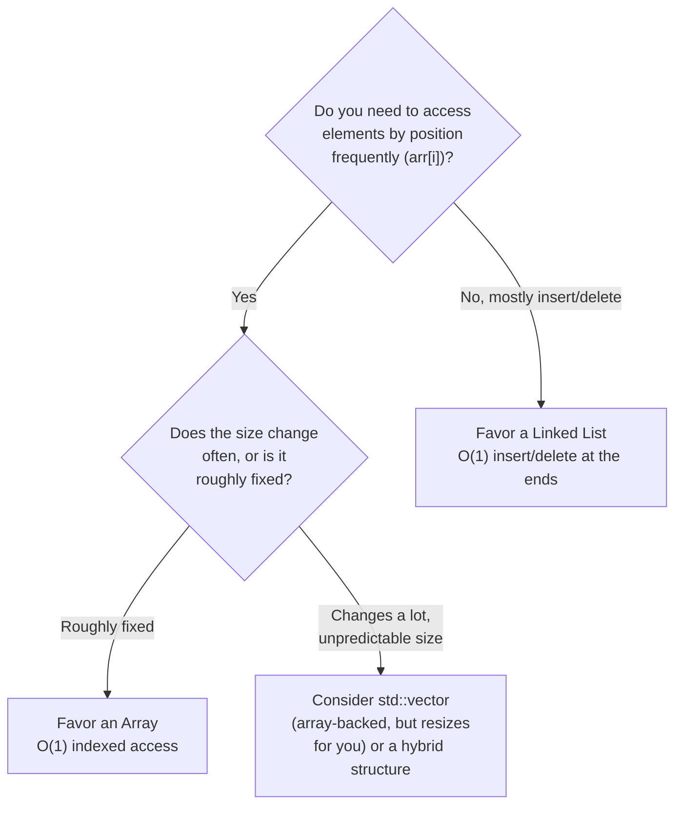
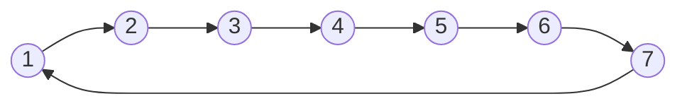
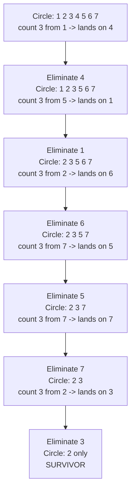

# Lecture 9: Linear Structures: Applications and Problem Solving

Units so far have introduced arrays and every flavor of linked list as separate tools.
This lecture closes Unit 2 by putting them side by side and asking the practical
question you'll face in every real project from here on: **given this specific problem,
which one actually fits?** There usually isn't a single "correct" answer — only a
better-informed trade-off.

## In This Lecture

- A decision framework for choosing between an array and a linked list
- The same problem, solved both ways, compared directly
- A second worked application — the Josephus problem — solved with a circular linked
  list, traced step by step
- Combining structures when neither one alone is the full answer
- Real-world applications that make the choice concrete

## Selecting an Appropriate Linear Data Structure

The decision almost always comes down to which operation your application performs
*most often*.



| Your priority | Better fit |
|---|---|
| Fast lookup by position, size roughly known | Array |
| Frequent insertion/deletion, especially at the front | Linked List |
| Frequent insertion/deletion **and** need indexed access sometimes | `std::vector` (amortized growth) or a data structure from a later unit (tree, hash table) |
| Memory is extremely tight, every byte counts | Array (no per-element pointer overhead) |

## Dynamic Data Management

"Dynamic" data — data whose *size* isn't known ahead of time, or changes constantly while
the program runs — is where linked lists earn their keep. A phone app's incoming
notification list, a text editor's list of open documents, a game's list of currently
active enemies: none of these have a size you could hard-code into an array declaration.

## Array-Based vs. Linked-List-Based Problem Solving

Consider a concrete problem: **maintain a waiting list, where people are served strictly
in the order they arrived, and the list needs to support removing the person at the
front (served) and adding a new person at the end (arrived).** Let's solve it both ways
and measure what actually happens.

```cpp title="waiting_list_comparison.cpp"
#include <iostream>
#include <chrono>
using namespace std;
using namespace std::chrono;

// --- Array-based version ---
class ArrayWaitingList {
private:
    int data[10000];
    int frontIndex = 0;
    int count = 0;
public:
    void arrive(int id) { data[frontIndex + count] = id; count++; }
    int serve() {
        int servedId = data[frontIndex];
        frontIndex++;   // just move the "start" marker -- no shifting of real elements
        count--;
        return servedId;
    }
};

// --- Linked-list-based version ---
struct Node { int data; Node* next; Node(int v) : data(v), next(nullptr) {} };
class LinkedWaitingList {
private:
    Node* head = nullptr;
    Node* tail = nullptr;
public:
    void arrive(int id) {
        Node* newNode = new Node(id);
        if (tail == nullptr) { head = tail = newNode; return; }
        tail->next = newNode;
        tail = newNode;
    }
    int serve() {
        int servedId = head->data;
        Node* oldHead = head;
        head = head->next;
        if (head == nullptr) tail = nullptr;
        delete oldHead;
        return servedId;
    }
};

int main() {
    const int N = 5000;

    ArrayWaitingList arrList;
    auto start1 = high_resolution_clock::now();
    for (int i = 0; i < N; i++) arrList.arrive(i);
    for (int i = 0; i < N; i++) arrList.serve();
    auto end1 = high_resolution_clock::now();
    double arrayMs = duration_cast<duration<double, milli>>(end1 - start1).count();

    LinkedWaitingList llList;
    auto start2 = high_resolution_clock::now();
    for (int i = 0; i < N; i++) llList.arrive(i);
    for (int i = 0; i < N; i++) llList.serve();
    auto end2 = high_resolution_clock::now();
    double linkedMs = duration_cast<duration<double, milli>>(end2 - start2).count();

    cout << N << " arrivals + " << N << " serves, both O(1) per operation:" << endl;
    if (linkedMs > arrayMs) {
        cout << "  Array-based finished first (contiguous memory, no new/delete overhead)" << endl;
    } else {
        cout << "  Linked-based finished first" << endl;
    }
    double ratio = (arrayMs > 0.0001 ? linkedMs / arrayMs : 0.0);
    if (ratio > 2.0) cout << "  Linked-based took at least 2x longer than array-based" << endl;
    else cout << "  Both finished within 2x of each other" << endl;
    return 0;
}
```

```text
$ g++ -std=c++17 -o waiting_list_comparison waiting_list_comparison.cpp
$ ./waiting_list_comparison
5000 arrivals + 5000 serves, both O(1) per operation:
  Array-based finished first (contiguous memory, no new/delete overhead)
  Linked-based took at least 2x longer than array-based
```

!!! note "Both are O(1) per operation here — the array just has a smaller constant factor"
    Notice both versions only ever `arrive()` at the end and `serve()` from the front —
    exactly the access pattern that's cheap for *both* structures. On the machine this book
    was tested on, 5000 arrivals plus 5000 serves took roughly 30 microseconds array-based
    versus several hundred microseconds linked-based — but raw microsecond counts like that
    aren't reproducible across machines or even across runs on the *same* machine (CPU
    scheduling noise, cache warmup, and background load all shift them), which is why the
    code above prints a **verdict** ("finished first", "at least 2x longer") computed from
    the measurement, rather than the raw number itself. The array wins because contiguous
    memory is friendlier to the CPU's cache, and there's no `new`/`delete` overhead per
    element. But if this problem also needed to remove a specific person from the *middle*
    of the line (they left early), the array version would need O(n) shifting while a linked
    list — given a pointer to that person's node — would not. The "right" answer depends
    entirely on which operations the real application performs, not on a single benchmark.

!!! tip "Never trust a single raw timing number in your own reports"
    If you ever write a benchmark for a lab report, resist the urge to paste a single
    microsecond count as proof of which approach is "faster" — it will not reproduce on the
    grader's machine, or even on yours tomorrow. Either average over many runs and report a
    ratio (as above), or use a Big-O argument backed by counting actual operations, the way
    Lecture 3 did.

## A Second Worked Application: The Josephus Problem

The waiting-list example above only ever touched the *ends* of the structure — exactly
the case both arrays and linked lists handle well. Now consider a problem that plays to a
**circular** linked list's specific strength (Lecture 8): the **Josephus problem**. `n`
people stand in a circle, numbered `1` through `n`. Starting from person 1, you count
around the circle and eliminate every `k`-th person; counting continues from the next
survivor. Who is the last person left?

This isn't just a puzzle — the same shape shows up whenever something must cycle through
a fixed set of participants, skipping ones that drop out, without ever restarting from
the beginning: round-robin CPU scheduling skipping finished processes, a multiplayer game
rotating turns past players who have been eliminated, or a playlist on "repeat" skipping
tracks a listener has removed.



A circular linked list is a perfect fit: there is no "end" to fall off, so eliminating a
person is just the same "splice the node out, then delete it" operation from Lecture 8 —
counting simply keeps calling `current = current->next` and wraps around forever.

```cpp title="josephus.cpp"
#include <iostream>
using namespace std;

struct Node {
    int id;
    Node* next;
    Node(int i) : id(i), next(nullptr) {}
};

// Builds a circular linked list of `n` people numbered 1..n, then
// repeatedly counts `k` people around the circle and eliminates the
// k-th one, until only one person is left. Returns the survivor's id.
int josephus(int n, int k) {
    Node* last = new Node(1);
    Node* current = last;
    for (int i = 2; i <= n; i++) {
        current->next = new Node(i);
        current = current->next;
    }
    current->next = last;   // close the circle: last node points back to node 1

    current = last;   // start counting from person 1
    while (current->next != current) {
        // walk k-1 steps forward to land ON the person to eliminate
        for (int step = 1; step < k; step++) {
            current = current->next;
        }
        Node* toEliminate = current->next;
        cout << "Eliminated: " << toEliminate->id << endl;
        current->next = toEliminate->next;   // splice out BEFORE deleting
        delete toEliminate;
        current = current->next;             // continue counting from the next survivor
    }

    int survivor = current->id;
    delete current;
    return survivor;
}

int main() {
    int n = 7, k = 3;
    cout << n << " people in a circle, eliminating every " << k << "rd person:" << endl;
    int survivor = josephus(n, k);
    cout << "Survivor: person " << survivor << endl;
    return 0;
}
```

```text
$ g++ -std=c++17 -o josephus josephus.cpp
$ ./josephus
7 people in a circle, eliminating every 3rd person:
Eliminated: 4
Eliminated: 1
Eliminated: 6
Eliminated: 5
Eliminated: 7
Eliminated: 3
Survivor: person 2
```

The diagram below traces the same run: the circle shrinking by one node at each
elimination, ending with person 2 as the sole survivor.



!!! note "Why current->next != current is the right loop condition"
    Once only one node is left, that node's own `next` points back to *itself* — it's the
    only node in the circle, so "the next node" and "this node" are the same object. That's
    exactly the signal `while (current->next != current)` checks for: as soon as it's true,
    exactly one survivor remains and the loop stops, mirroring how `head == nullptr` signals
    an empty singly linked list.

!!! warning "Splice before delete — the same rule as Lecture 5, in a circle"
    `current->next = toEliminate->next;` runs *before* `delete toEliminate;`, for the exact
    same reason as `deleteFromFront` in Lecture 5: reading `toEliminate->next` after freeing
    `toEliminate` would be undefined behavior. A circular list doesn't relax this rule at
    all — if anything it matters more here, since a mistake would corrupt the *only* path
    back into the remaining circle, not just one branch of it.

### Complexity: Why a Circular List, and Not a Circular Array?

The outer `while` loop runs once per elimination — `n - 1` times total, since it stops
with one survivor left. Each iteration walks `k - 1` steps before eliminating someone, so
the total work is O(n · k). Nothing about that changes if you used an array instead of a
circular linked list — so *why* is the linked list still the better choice here?

The answer is the **elimination step itself**, not the counting. An array-based
simulation would need to physically shift every remaining element after the removed one
to close the gap (or track "removed" with a separate flag array and skip over dead slots
during counting, which slowly degrades as more people are eliminated near the start). The
circular linked list removes a node in O(1) once `current` is positioned — exactly the
same "splice, don't shift" advantage from the array-vs-linked-list decision framework at
the top of this lecture, just applied to a ring instead of a line.

| | Circular array (with shifting) | Circular linked list |
|---|---|---|
| Counting `k` steps | O(k) | O(k) |
| Removing the counted person | O(n) — shift everything after it | O(1) — splice out |
| Total for all `n - 1` eliminations | O(n·k + n²) | O(n·k) |

## Combined Linear Structure Operations

Real problems often need more than one structure working together, not a single winner:

- A **text editor's undo history** might use an array for the visible document (fast
  rendering, indexed access) alongside a linked list or stack of past edits (cheap
  push/pop of recent changes).
- A **music player** might use an array to display the playlist (so you can jump to song
  #7 instantly) but a doubly linked list's `prev`/`next` logic for the actual "skip
  forward/back" playback controls.

## Real-World Applications

| Application | Structure used | Why |
|---|---|---|
| Undo/redo in an editor | Stack (built on a linked list, Unit 3) | Most recent change is undone first — last in, first out |
| Print job queue | Queue (built on a linked list, Unit 4) | Jobs print in the order they were submitted — first in, first out |
| Autocomplete suggestions cache | Array (sorted) | Frequent lookups, rarely modified after loading |
| Social media "infinite scroll" feed | Linked list | Constantly appending new posts as they load; never needs to jump to post #500 by index |
| Image pixel data | 2D array | Every pixel needs instant, predictable-cost access by (row, column) |

## Try It Yourself

1. Run `waiting_list_comparison.cpp` yourself with `N` increased to `50000`. Does the
   printed verdict change, or does the array-based version keep finishing first? What does
   that tell you about each structure's growth rate for this access pattern?
2. Pick one application from the "Real-World Applications" table, and argue for the
   *other* structure instead (e.g., why might an infinite-scroll feed use an array in some
   apps?). There's no single right answer — the goal is practicing the trade-off argument.
3. Modify `josephus.cpp` to try `k = 2` (eliminate every *other* person) on the same
   7-person circle. Predict the survivor by tracing it on paper first, then run the program
   to check your prediction.
4. `josephus.cpp` leaks memory if `n` is 0 or negative (the initial `new Node(1)` runs
   unconditionally). Add a guard at the top of `josephus` that handles `n <= 0` safely —
   what should the function do in that case, given there's no valid "survivor" to return?
5. The current `josephus` function only prints eliminations and returns the survivor's
   `id`. Modify it to also return, via an output parameter (`vector<int>& eliminationOrder`),
   the full sequence of eliminated IDs in order — useful if a caller wanted to display the
   whole elimination history, not just watch it scroll by in `cout`.

## Key Takeaways

- Choosing between an array and a linked list is a **trade-off decision**, not a search
  for the objectively "best" structure — it depends on which operations the actual
  application performs most.
- Arrays win when indexed access matters and size is roughly predictable; linked lists win
  when insertion/deletion (especially at the ends) is frequent and size is unpredictable.
- Even when both structures achieve the same Big-O complexity for an operation, their
  real-world constant factors can differ — arrays are typically faster in practice due to
  cache-friendly contiguous memory. Report that difference as a **verdict or ratio**, never
  a raw timing number, since raw numbers don't reproduce across machines or runs.
- A **circular linked list** is the natural fit for any problem that cycles through a
  shrinking set of participants without a fixed "end" — the Josephus problem, round-robin
  scheduling, and turn rotation in multiplayer games all share this shape.
- Real applications frequently combine multiple structures, each handling the part of the
  problem it's naturally good at, rather than forcing one structure to do everything.
