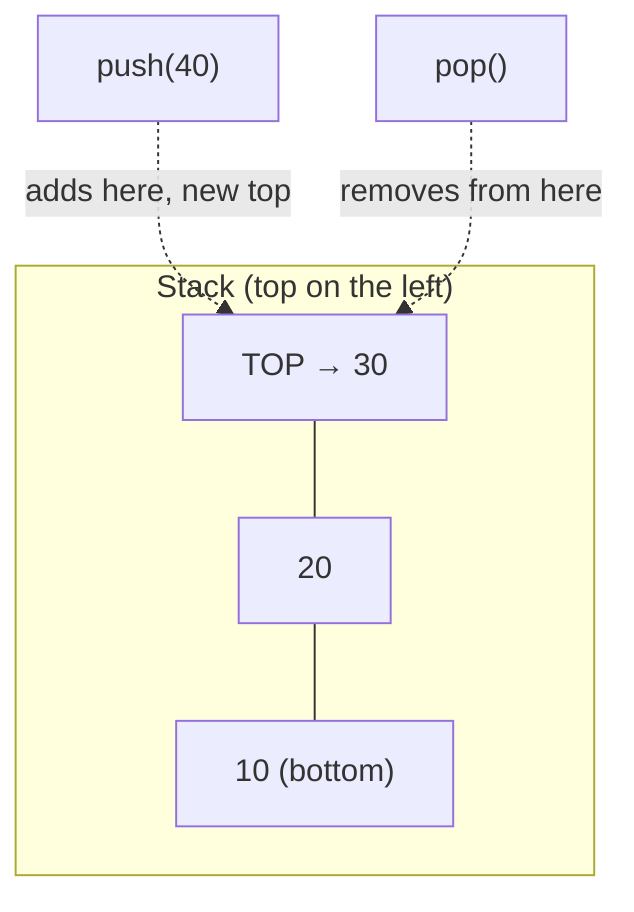
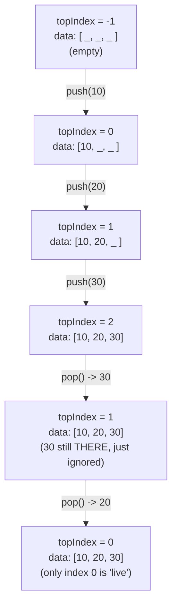
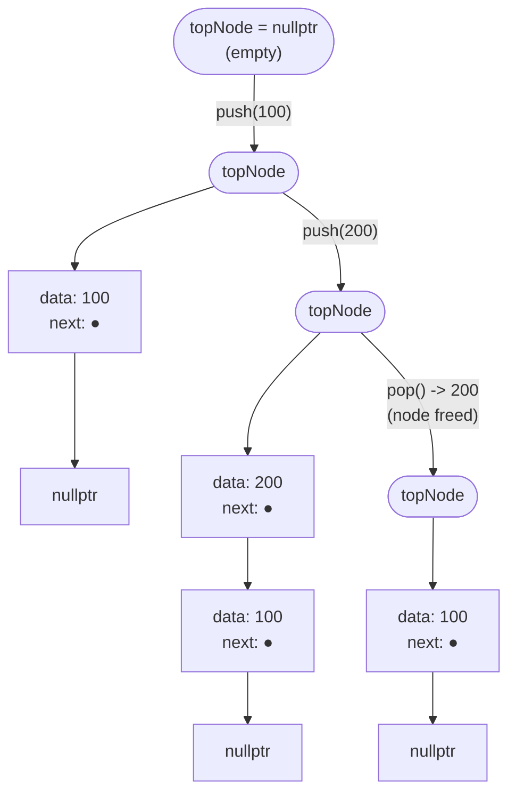

# Lecture 10: Stack ADT and Implementation

A **stack** is the simplest possible non-trivial data structure, and one of the most
useful: it restricts you to touching only *one* end of the data, and that single
restriction turns out to model an enormous number of real problems perfectly — undo
history, function calls, and (Lecture 11) parsing arithmetic expressions.

## In This Lecture

- The stack concept and the LIFO principle
- The Stack ADT: push, pop, and peek
- An array-based implementation, traced step by step
- A linked-list-based implementation, traced step by step
- Overflow and underflow as concrete, compiled edge cases
- Choosing between the two implementations
- The complexity of every stack operation

## The Stack Concept and the LIFO Principle

A stack behaves like a physical stack of plates: you can only add a plate to the *top*,
and you can only remove the plate that's currently on *top* — never one from the middle
or bottom without first removing everything above it. This is the **LIFO** principle:
**L**ast **I**n, **F**irst **O**ut — whatever was pushed most recently is the first thing
popped.



## The Stack ADT

As an Abstract Data Type, a stack promises exactly three core operations, regardless of
how it's implemented underneath:

| Operation | Meaning |
|---|---|
| `push(value)` | Add `value` to the top of the stack |
| `pop()` | Remove and return the value at the top of the stack |
| `peek()` / `top()` | Return the value at the top, without removing it |
| `isEmpty()` | Report whether the stack has any elements at all |

## Array-Based Implementation of Stack

The simplest implementation uses a fixed-size array plus an integer tracking the index
of the current top element.

```cpp title="array_stack.cpp"
#include <iostream>
#include <stdexcept>
using namespace std;

class ArrayStack {
private:
    static const int CAPACITY = 100;
    int data[CAPACITY];
    int topIndex;   // index of the top element; -1 means empty

public:
    ArrayStack() : topIndex(-1) {}

    bool isEmpty() const { return topIndex == -1; }
    bool isFull() const { return topIndex == CAPACITY - 1; }

    void push(int value) {
        if (isFull()) throw overflow_error("Stack overflow");
        data[++topIndex] = value;
    }

    int pop() {
        if (isEmpty()) throw underflow_error("Stack underflow");
        return data[topIndex--];
    }

    int peek() const {
        if (isEmpty()) throw underflow_error("Stack is empty");
        return data[topIndex];
    }
};

int main() {
    ArrayStack stack;

    stack.push(10);
    stack.push(20);
    stack.push(30);
    cout << "Pushed 10, 20, 30. Top is now: " << stack.peek() << endl;

    cout << "Popped: " << stack.pop() << endl;
    cout << "Popped: " << stack.pop() << endl;
    cout << "Top after two pops: " << stack.peek() << endl;
    cout << "Is empty? " << (stack.isEmpty() ? "yes" : "no") << endl;

    stack.pop();
    cout << "Is empty after popping the last element? " << (stack.isEmpty() ? "yes" : "no") << endl;

    return 0;
}
```

```text
$ g++ -std=c++17 -o array_stack array_stack.cpp
$ ./array_stack
Pushed 10, 20, 30. Top is now: 30
Popped: 30
Popped: 20
Top after two pops: 10
Is empty? no
Is empty after popping the last element? yes
```

The diagram below traces the array's underlying state — the `data` array and `topIndex`
— through exactly this sequence of calls. Notice `pop()` never actually erases the old
value from `data`; it just moves `topIndex` backward, so the "old" value is simply ignored
until something overwrites it with a future `push`.



!!! note "Popping doesn't erase — it just relabels what's live"
    After the two pops, `data[1]` and `data[2]` still physically hold `20` and `30` in
    memory — `pop()` only decremented `topIndex`. That's fine and completely safe: every
    stack operation only ever looks at indices `0` through `topIndex`, so anything past
    `topIndex` is simply invisible to the ADT, exactly the same way a `vector`'s unused
    reserved capacity is invisible to its `size()`. The next `push` will silently overwrite
    it.

## Linked-List Implementation of Stack

A stack can just as easily be built on top of a singly linked list — `push` inserts at the
head, `pop` removes from the head. Neither operation ever needs to walk the list, which
means the linked-list version never suffers the array's fixed-capacity limit and never
needs a resize.

```cpp title="linked_stack.cpp"
#include <iostream>
#include <stdexcept>
using namespace std;

struct Node {
    int data;
    Node* next;
    Node(int value) : data(value), next(nullptr) {}
};

class LinkedStack {
private:
    Node* topNode;

public:
    LinkedStack() : topNode(nullptr) {}

    bool isEmpty() const { return topNode == nullptr; }

    void push(int value) {
        Node* newNode = new Node(value);
        newNode->next = topNode;
        topNode = newNode;
    }

    int pop() {
        if (isEmpty()) throw underflow_error("Stack underflow");
        Node* oldTop = topNode;
        int value = oldTop->data;
        topNode = topNode->next;
        delete oldTop;
        return value;
    }

    int peek() const {
        if (isEmpty()) throw underflow_error("Stack is empty");
        return topNode->data;
    }
};

int main() {
    LinkedStack stack;

    stack.push(100);
    stack.push(200);
    stack.push(300);
    cout << "Pushed 100, 200, 300. Top is now: " << stack.peek() << endl;

    cout << "Popped: " << stack.pop() << endl;
    cout << "Top after one pop: " << stack.peek() << endl;

    return 0;
}
```

```text
$ g++ -std=c++17 -o linked_stack linked_stack.cpp
$ ./linked_stack
Pushed 100, 200, 300. Top is now: 300
Popped: 300
Top after one pop: 200
```

Contrast this with the array's diagram above: here, `pop()` genuinely frees the old top
node's memory — there's no leftover "dead" data sitting around, because each node is its
own independent heap allocation rather than a slot inside one shared array.



## Array-Based vs. Linked-List-Based: Which Should You Pick?

Both implementations satisfy the Stack ADT identically from the *caller's* perspective —
`push`, `pop`, and `peek` behave the same way no matter which one sits underneath. The
choice between them is the same array-vs-linked-list trade-off from Lecture 9, just
narrowed to a structure that only ever touches one end:

| | Array-based stack | Linked-list-based stack |
|---|---|---|
| Maximum size | Fixed at construction (or needs a resize-and-copy) | Grows one node at a time, limited only by available memory |
| Memory per element | Just the element itself | Element plus one `next` pointer |
| Cache behavior | Excellent — contiguous memory | Worse — nodes scattered on the heap |
| `push`/`pop` cost | O(1) (amortized, if it resizes) | O(1), always, no resize ever needed |
| Best when... | Maximum size is known or boundable in advance | Size is unpredictable, or memory must never be pre-reserved |

!!! tip "std::vector's growth strategy borrows the array stack's whole idea"
    A resizable array-based stack (like `std::vector` used as a stack) doesn't resize on
    *every* push past capacity — it typically **doubles** its capacity when full, which
    makes the *amortized* cost of push still O(1) even though any single push that triggers
    a resize is O(n). This is the same idea Lecture 32's hash table rehashing uses.

## Complexity of Stack Operations

| Operation | Array-based | Linked-list-based |
|---|---|---|
| `push` | O(1) — unless the array is full and must resize | O(1) — always |
| `pop` | O(1) | O(1) |
| `peek` | O(1) | O(1) |
| `isEmpty` | O(1) | O(1) |

Every core stack operation is O(1) in *both* implementations — the difference between
them is entirely about **capacity**: the array version has a hard limit (or needs a
resize-and-copy step to grow past it), while the linked-list version can keep growing
one node at a time for as long as memory allows.

!!! note "C++'s own std::stack"
    In real projects you would rarely write your own stack from scratch — the C++
    Standard Library already provides `std::stack`, which by default wraps a
    `std::deque` internally and offers exactly the `push`/`pop`/`top` interface shown
    above. Building your own here is about understanding *how* it works underneath,
    which is exactly what Lecture 11's expression-conversion algorithm depends on.

## Edge Cases: Overflow and Underflow

`push` and `pop` both have exactly one failure mode each, and both are worth seeing fail
*on purpose* once, with real exceptions caught, rather than only reading about them.
**Overflow** is pushing onto an already-full array-based stack; **underflow** is popping
(or peeking) an already-empty stack — a mistake that's easy to make in code that pops in a
loop without checking `isEmpty()` first.

```cpp title="stack_edge_cases.cpp"
#include <iostream>
#include <stdexcept>
using namespace std;

class ArrayStack {
private:
    static const int CAPACITY = 5;   // tiny on purpose, to hit the limit quickly
    int data[CAPACITY];
    int topIndex;
public:
    ArrayStack() : topIndex(-1) {}
    bool isEmpty() const { return topIndex == -1; }
    bool isFull() const { return topIndex == CAPACITY - 1; }
    void push(int value) {
        if (isFull()) throw overflow_error("Stack overflow");
        data[++topIndex] = value;
    }
    int pop() {
        if (isEmpty()) throw underflow_error("Stack underflow");
        return data[topIndex--];
    }
};

int main() {
    ArrayStack stack;

    cout << "Pushing 5 values onto a stack with CAPACITY = 5..." << endl;
    for (int i = 1; i <= 5; i++) {
        stack.push(i * 10);
        cout << "  pushed " << i * 10 << endl;
    }

    cout << "Attempting a 6th push (should overflow)..." << endl;
    try {
        stack.push(60);
    } catch (const overflow_error& e) {
        cout << "  caught overflow_error: " << e.what() << endl;
    }

    cout << "Popping all 5 values back off..." << endl;
    for (int i = 0; i < 5; i++) {
        cout << "  popped " << stack.pop() << endl;
    }

    cout << "Attempting one more pop on an empty stack (should underflow)..." << endl;
    try {
        stack.pop();
    } catch (const underflow_error& e) {
        cout << "  caught underflow_error: " << e.what() << endl;
    }

    return 0;
}
```

```text
$ g++ -std=c++17 -o stack_edge_cases stack_edge_cases.cpp
$ ./stack_edge_cases
Pushing 5 values onto a stack with CAPACITY = 5...
  pushed 10
  pushed 20
  pushed 30
  pushed 40
  pushed 50
Attempting a 6th push (should overflow)...
  caught overflow_error: Stack overflow
Popping all 5 values back off...
  popped 50
  popped 40
  popped 30
  popped 20
  popped 10
Attempting one more pop on an empty stack (should underflow)...
  caught underflow_error: Stack underflow
```

!!! warning "The linked-list stack can't overflow the same way — but it isn't immune to failure"
    `LinkedStack` has no `CAPACITY` and no `isFull()` — it can keep accepting `push` calls
    until the *system* runs out of heap memory, at which point `new` itself throws
    `std::bad_alloc` rather than a stack-specific `overflow_error`. It is, however, just as
    vulnerable to **underflow**: `LinkedStack::pop()` still checks `isEmpty()` and throws
    `underflow_error`, for exactly the same reason `ArrayStack::pop()` does — reading
    `topNode->data` when `topNode` is `nullptr` would dereference a null pointer.

## Try It Yourself

1. Compile and run `array_stack.cpp`, then push 100 elements in a loop and try to push a
   101st. Confirm it throws the `overflow_error` and doesn't silently corrupt memory.
2. Add a `size()` method to `LinkedStack` that returns the current number of elements
   without modifying the stack. (Hint: you'll need to either walk the list — O(n) — or
   maintain a running count as an extra field, updated in `push` and `pop` — O(1). Which
   one did you pick, and why is it the better choice here?)
3. Compile and run `stack_edge_cases.cpp`, then change `CAPACITY` to `1` and re-run.
   Confirm the program still behaves correctly — one push succeeds, the second overflows —
   and explain why `CAPACITY = 1` doesn't need any special-case code of its own (compare
   this to Lecture 5's "one-node list" discussion).
4. Write a `main` that calls `pop()` on a completely fresh, never-pushed-to `LinkedStack`
   inside a `try`/`catch`, confirming the `underflow_error` is caught rather than crashing
   with a null-pointer dereference. This is exactly the check `isEmpty()` inside `pop()`
   exists to prevent.

## Key Takeaways

- A stack enforces **LIFO** (Last In, First Out) — the only element you can ever touch is
  the one on top.
- The Stack ADT has three core operations — `push`, `pop`, `peek` — each O(1) regardless
  of whether the stack is implemented on an array or a linked list.
- An array-based stack has a fixed capacity (or needs a resize); a linked-list-based
  stack can grow indefinitely, one node at a time, at the cost of one pointer's extra
  memory per element.
- **Overflow** (pushing when full) only threatens the array-based version; **underflow**
  (popping or peeking when empty) threatens *both* versions equally, and both this
  lecture's implementations guard against it by throwing a clear exception rather than
  reading invalid memory.
- Real code almost always reaches for `std::stack` rather than hand-writing one — but
  understanding the underlying push/pop mechanics is what makes Lecture 11's stack-based
  algorithms make sense.
