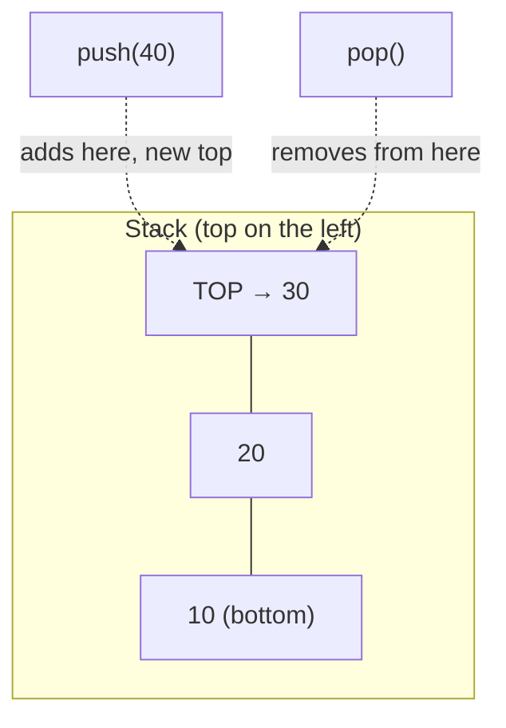

# Lecture 10: Stack ADT and Implementation

A **stack** is the simplest possible non-trivial data structure, and one of the most
useful: it restricts you to touching only *one* end of the data, and that single
restriction turns out to model an enormous number of real problems perfectly — undo
history, function calls, and (Lecture 11) parsing arithmetic expressions.

## In This Lecture

- The stack concept and the LIFO principle
- The Stack ADT: push, pop, and peek
- An array-based implementation
- A linked-list-based implementation
- The complexity of every stack operation

## The Stack Concept and the LIFO Principle

A stack behaves like a physical stack of plates: you can only add a plate to the *top*,
and you can only remove the plate that's currently on *top* — never one from the middle
or bottom without first removing everything above it. This is the **LIFO** principle:
**L**ast **I**n, **F**irst **O**ut — whatever was pushed most recently is the first thing
popped.



## The Stack ADT

As an Abstract Data Type, a stack promises exactly three core operations, regardless of
how it's implemented underneath:

| Operation | Meaning |
|---|---|
| `push(value)` | Add `value` to the top of the stack |
| `pop()` | Remove and return the value at the top of the stack |
| `peek()` / `top()` | Return the value at the top, without removing it |
| `isEmpty()` | Report whether the stack has any elements at all |

## Array-Based Implementation of Stack

The simplest implementation uses a fixed-size array plus an integer tracking the index
of the current top element.

```cpp title="array_stack.cpp"
#include <iostream>
#include <stdexcept>
using namespace std;

class ArrayStack {
private:
    static const int CAPACITY = 100;
    int data[CAPACITY];
    int topIndex;   // index of the top element; -1 means empty

public:
    ArrayStack() : topIndex(-1) {}

    bool isEmpty() const { return topIndex == -1; }
    bool isFull() const { return topIndex == CAPACITY - 1; }

    void push(int value) {
        if (isFull()) throw overflow_error("Stack overflow");
        data[++topIndex] = value;
    }

    int pop() {
        if (isEmpty()) throw underflow_error("Stack underflow");
        return data[topIndex--];
    }

    int peek() const {
        if (isEmpty()) throw underflow_error("Stack is empty");
        return data[topIndex];
    }
};

int main() {
    ArrayStack stack;

    stack.push(10);
    stack.push(20);
    stack.push(30);
    cout << "Pushed 10, 20, 30. Top is now: " << stack.peek() << endl;

    cout << "Popped: " << stack.pop() << endl;
    cout << "Popped: " << stack.pop() << endl;
    cout << "Top after two pops: " << stack.peek() << endl;
    cout << "Is empty? " << (stack.isEmpty() ? "yes" : "no") << endl;

    stack.pop();
    cout << "Is empty after popping the last element? " << (stack.isEmpty() ? "yes" : "no") << endl;

    return 0;
}
```

```text
$ g++ -std=c++17 -o array_stack array_stack.cpp
$ ./array_stack
Pushed 10, 20, 30. Top is now: 30
Popped: 30
Popped: 20
Top after two pops: 10
Is empty? no
Is empty after popping the last element? yes
```

## Linked-List Implementation of Stack

A stack can just as easily be built on top of a singly linked list — `push` inserts at the
head, `pop` removes from the head. Neither operation ever needs to walk the list, which
means the linked-list version never suffers the array's fixed-capacity limit and never
needs a resize.

```cpp title="linked_stack.cpp"
#include <iostream>
#include <stdexcept>
using namespace std;

struct Node {
    int data;
    Node* next;
    Node(int value) : data(value), next(nullptr) {}
};

class LinkedStack {
private:
    Node* topNode;

public:
    LinkedStack() : topNode(nullptr) {}

    bool isEmpty() const { return topNode == nullptr; }

    void push(int value) {
        Node* newNode = new Node(value);
        newNode->next = topNode;
        topNode = newNode;
    }

    int pop() {
        if (isEmpty()) throw underflow_error("Stack underflow");
        Node* oldTop = topNode;
        int value = oldTop->data;
        topNode = topNode->next;
        delete oldTop;
        return value;
    }

    int peek() const {
        if (isEmpty()) throw underflow_error("Stack is empty");
        return topNode->data;
    }
};

int main() {
    LinkedStack stack;

    stack.push(100);
    stack.push(200);
    stack.push(300);
    cout << "Pushed 100, 200, 300. Top is now: " << stack.peek() << endl;

    cout << "Popped: " << stack.pop() << endl;
    cout << "Top after one pop: " << stack.peek() << endl;

    return 0;
}
```

```text
$ g++ -std=c++17 -o linked_stack linked_stack.cpp
$ ./linked_stack
Pushed 100, 200, 300. Top is now: 300
Popped: 300
Top after one pop: 200
```

## Complexity of Stack Operations

| Operation | Array-based | Linked-list-based |
|---|---|---|
| `push` | O(1) — unless the array is full and must resize | O(1) — always |
| `pop` | O(1) | O(1) |
| `peek` | O(1) | O(1) |
| `isEmpty` | O(1) | O(1) |

Every core stack operation is O(1) in *both* implementations — the difference between
them is entirely about **capacity**: the array version has a hard limit (or needs a
resize-and-copy step to grow past it), while the linked-list version can keep growing
one node at a time for as long as memory allows.

!!! note "C++'s own std::stack"
    In real projects you would rarely write your own stack from scratch — the C++
    Standard Library already provides `std::stack`, which by default wraps a
    `std::deque` internally and offers exactly the `push`/`pop`/`top` interface shown
    above. Building your own here is about understanding *how* it works underneath,
    which is exactly what Lecture 11's expression-conversion algorithm depends on.

## Try It Yourself

1. Compile and run `array_stack.cpp`, then push 100 elements in a loop and try to push a
   101st. Confirm it throws the `overflow_error` and doesn't silently corrupt memory.
2. Add a `size()` method to `LinkedStack` that returns the current number of elements
   without modifying the stack. (Hint: you'll need to either walk the list — O(n) — or
   maintain a running count as an extra field, updated in `push` and `pop` — O(1). Which
   one did you pick, and why is it the better choice here?)

## Key Takeaways

- A stack enforces **LIFO** (Last In, First Out) — the only element you can ever touch is
  the one on top.
- The Stack ADT has three core operations — `push`, `pop`, `peek` — each O(1) regardless
  of whether the stack is implemented on an array or a linked list.
- An array-based stack has a fixed capacity (or needs a resize); a linked-list-based
  stack can grow indefinitely, one node at a time, at the cost of one pointer's extra
  memory per element.
- Real code almost always reaches for `std::stack` rather than hand-writing one — but
  understanding the underlying push/pop mechanics is what makes Lecture 11's stack-based
  algorithms make sense.
