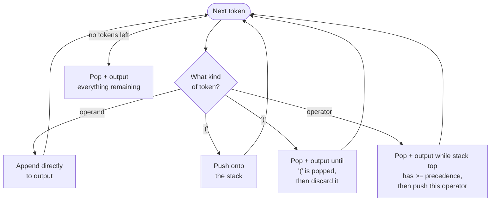
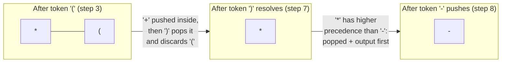

# Lecture 11: Stack Applications: Expression Conversion

Stacks aren't just an academic exercise — they're the quiet machinery behind function
calls, undo/redo, and browser back-buttons. This lecture focuses on one of their most
elegant applications: converting the arithmetic expressions you write by hand (`infix`,
like `3 + 4 * 2`) into a form a computer can evaluate without ever worrying about operator
precedence or parentheses — `postfix`.

## In This Lecture

- Real applications of stacks: function calls, backtracking, undo/redo
- Infix, prefix, and postfix expression notation
- Operator precedence and associativity
- Converting infix to postfix using a stack, traced token by token
- A second, harder trace exercising precedence and parentheses together
- Evaluating a postfix expression using a stack

## Applications of Stacks

- **Function call management** — every time a function calls another, the computer pushes
  a "stack frame" (its local variables and return address) onto the **call stack**; when
  the function returns, that frame is popped. This is *why* it's called a call stack.
- **Backtracking** — algorithms that try a path, and "undo" it if it fails (maze solving,
  Sudoku solvers), push each decision as they go and pop back to the last decision point
  when they hit a dead end.
- **Undo/redo** — every action is pushed onto an undo stack; undoing pops the most recent
  action and reverses it.

## Expression Notation

The same arithmetic expression can be written three different ways, depending on *where*
the operator sits relative to its operands:

| Notation | Operator position | Example (for "3 plus 4") |
|---|---|---|
| **Infix** | Between the two operands | `3 + 4` |
| **Prefix** | Before the two operands | `+ 3 4` |
| **Postfix** | After the two operands | `3 4 +` |

Infix is what humans write and read naturally — but it's genuinely hard for a computer to
evaluate directly, because it has to know about **operator precedence** (`*` before `+`)
and **parentheses** to get the right answer. Postfix needs neither: it can be evaluated
left to right with nothing but a stack, no precedence rules required at all.

## Operator Precedence and Associativity

| Operator | Precedence | Associativity |
|---|---|---|
| `^` (exponent) | Highest | Right to left |
| `*`, `/` | Middle | Left to right |
| `+`, `-` | Lowest | Left to right |

**Associativity** decides the tie-breaker when two operators of the *same* precedence sit
next to each other: `10 - 3 - 2` is evaluated left to right (`(10 - 3) - 2 = 5`), because
`-` is left-associative.

## Infix-to-Postfix Conversion

The conversion algorithm uses a stack to temporarily hold operators until it's their
turn to be placed in the output:

1. Scan the infix expression left to right, one token at a time.
2. If the token is an **operand** (a number), append it directly to the output.
3. If the token is `(`, push it onto the stack.
4. If the token is `)`, pop and output operators until a matching `(` is popped (and
   discarded).
5. If the token is an **operator**, pop and output any operators on top of the stack that
   have *greater or equal* precedence, then push the current operator.
6. After scanning the whole expression, pop and output any remaining operators.



Before looking at the code, trace the algorithm by hand on the simplest example,
`3+4*2`, one token at a time — this is exactly what the code below does, just with a real
stack instead of a table:

| Token | Action | Stack (bottom → top) | Output so far |
|---|---|---|---|
| `3` | operand: append | *(empty)* | `3` |
| `+` | stack empty, push | `+` | `3` |
| `4` | operand: append | `+` | `3 4` |
| `*` | `+` has *lower* precedence than `*` — don't pop, push | `+ *` | `3 4` |
| `2` | operand: append | `+ *` | `3 4 2` |
| *(end)* | pop everything remaining: `*`, then `+` | *(empty)* | `3 4 2 * +` |

That matches the program's actual output below exactly — `3 4 2 * +` — and shows *why*
`*` ends up before `+` in the postfix result even though `+` appears first in the infix
expression: `*` was pushed *after* `+` (since it binds tighter) and so it's popped and
output *before* `+` is, once the stack finally unwinds at the end.

```cpp title="infix_to_postfix.cpp"
#include <iostream>
#include <stack>
#include <string>
#include <sstream>
#include <cctype>
using namespace std;

int precedence(char op) {
    if (op == '^') return 3;
    if (op == '*' || op == '/') return 2;
    if (op == '+' || op == '-') return 1;
    return 0;   // '(' has the lowest precedence when compared this way
}

string infixToPostfix(const string& infix) {
    stack<char> operators;
    ostringstream postfix;

    for (char token : infix) {
        if (isspace(token)) continue;

        if (isdigit(token)) {
            postfix << token;
        } else if (token == '(') {
            operators.push(token);
        } else if (token == ')') {
            while (!operators.empty() && operators.top() != '(') {
                postfix << ' ' << operators.top();
                operators.pop();
            }
            operators.pop();   // discard the matching '('
        } else {
            // token is an operator: +, -, *, /, ^
            postfix << ' ';
            while (!operators.empty() && precedence(operators.top()) >= precedence(token)) {
                postfix << operators.top() << ' ';
                operators.pop();
            }
            operators.push(token);
        }
    }
    while (!operators.empty()) {
        postfix << ' ' << operators.top();
        operators.pop();
    }
    return postfix.str();
}

int main() {
    string expressions[] = {"3+4*2", "(3+4)*2", "3+4*2-1", "2^3^2", "5*(3+2)-8/4^2"};
    for (const string& expr : expressions) {
        cout << "Infix:   " << expr << endl;
        cout << "Postfix: " << infixToPostfix(expr) << endl << endl;
    }
    return 0;
}
```

```text
$ g++ -std=c++17 -o infix_to_postfix infix_to_postfix.cpp
$ ./infix_to_postfix
Infix:   3+4*2
Postfix: 3 4 2 * +

Infix:   (3+4)*2
Postfix: 3 4 + 2 *

Infix:   3+4*2-1
Postfix: 3 4 2 * + 1 -

Infix:   2^3^2
Postfix: 2 3 ^ 2 ^

Infix:   5*(3+2)-8/4^2
Postfix: 5 3 2 + * 8 4 2 ^ / -
```

!!! note "Why the spacing works out correctly even for multi-digit numbers"
    Digits of the *same* number are appended back-to-back with no separator (so `1` then
    `2` become `12`, not `1 2`), while every operator branch explicitly writes a leading
    space before doing anything else. The result is that digits belonging to one number
    stay glued together, while distinct tokens always end up separated — try it yourself
    with `"12+34"` and confirm the output is `12 34 +`, not `1234+` or `1 2 3 4 +`.

## A Second, Harder Trace: Precedence, Parentheses, and Exponents Together

`3+4*2` only ever needed the stack to hold at most two operators at once, and never
exercised parentheses at all. A more demanding expression, `5*(3+2)-8/4^2`, exercises
every rule in the algorithm: a `(`/`)` pair that must be fully resolved before anything
outside it, a lower-precedence `-` that has to wait behind a completed multiplication,
and a right-associative `^` competing with `/` for precedence.

| Token | Action | Stack (bottom → top) | Output so far |
|---|---|---|---|
| `5` | operand: append | *(empty)* | `5` |
| `*` | stack empty, push | `*` | `5` |
| `(` | always push | `* (` | `5` |
| `3` | operand: append | `* (` | `5 3` |
| `+` | top is `(` — never pop past it, push | `* ( +` | `5 3` |
| `2` | operand: append | `* ( +` | `5 3 2` |
| `)` | pop + output until `(`: pops `+`, then discards `(` | `*` | `5 3 2 +` |
| `-` | top `*` has *higher* precedence — pop + output it, then push `-` | `-` | `5 3 2 + *` |
| `8` | operand: append | `-` | `5 3 2 + * 8` |
| `/` | top `-` has *lower* precedence — don't pop, push | `- /` | `5 3 2 + * 8` |
| `4` | operand: append | `- /` | `5 3 2 + * 8 4` |
| `^` | top `/` has *lower* precedence (2 < 3) — don't pop, push | `- / ^` | `5 3 2 + * 8 4` |
| `2` | operand: append | `- / ^` | `5 3 2 + * 8 4 2` |
| *(end)* | pop everything remaining: `^`, `/`, `-` | *(empty)* | `5 3 2 + * 8 4 2 ^ / -` |

This is the fifth pair `infix_to_postfix.cpp` prints (its `expressions` array above already
includes `"5*(3+2)-8/4^2"`) — the real, compiled output is `5 3 2 + * 8 4 2 ^ / -`, matching
the hand trace exactly.



Two things are worth noticing in this trace that `3+4*2` never exercised. First, the `-`
token forces `*` off the stack *before* pushing itself (row 9): `*` was left sitting on
top from step 2, waiting the entire time the `(...)` group was being processed, since
parentheses never let anything pop past them prematurely. Second, `^` never has to compete
with another `^` here (there's only one), so this particular trace doesn't actually test
right-associativity — that's exactly what the earlier `2^3^2` example (further up this
lecture) is for. Comparing the two traces side by side is a good exercise: `5*(3+2)-8/4^2`
stresses parentheses and mixed precedence, while `2^3^2` isolates associativity alone.

## Postfix Expression Evaluation

Evaluating postfix is the payoff for doing the conversion: scan left to right, push every
**operand**, and whenever you see an **operator**, pop the top two operands, apply the
operator, and push the result back.

```cpp title="postfix_eval.cpp"
#include <iostream>
#include <stack>
#include <sstream>
using namespace std;

int evaluatePostfix(const string& postfix) {
    stack<int> values;
    istringstream tokens(postfix);
    string token;

    while (tokens >> token) {
        if (isdigit(token[0])) {
            values.push(stoi(token));
        } else {
            int b = values.top(); values.pop();
            int a = values.top(); values.pop();
            int result = 0;
            switch (token[0]) {
                case '+': result = a + b; break;
                case '-': result = a - b; break;
                case '*': result = a * b; break;
                case '/': result = a / b; break;
            }
            values.push(result);
        }
    }
    return values.top();
}

int main() {
    string postfixExpressions[] = {"3 4 2 * +", "3 4 + 2 *", "5 1 2 + 4 * + 3 -"};
    for (const string& expr : postfixExpressions) {
        cout << "Postfix: " << expr << "  =  " << evaluatePostfix(expr) << endl;
    }
    return 0;
}
```

```text
$ g++ -std=c++17 -o postfix_eval postfix_eval.cpp
$ ./postfix_eval
Postfix: 3 4 2 * +  =  11
Postfix: 3 4 + 2 *  =  14
Postfix: 5 1 2 + 4 * + 3 -  =  14
```

The last example, `5 1 2 + 4 * + 3 -`, corresponds to the infix expression
`5 + (1 + 2) * 4 - 3` — worth tracing by hand with the stack, one token at a time, to see
exactly how `(1 + 2) * 4` gets computed with no parentheses in sight at all.

| Token | Action | Stack (bottom → top) |
|---|---|---|
| `5` | push operand | `5` |
| `1` | push operand | `5 1` |
| `2` | push operand | `5 1 2` |
| `+` | pop `2, 1` -> `1+2=3`, push `3` | `5 3` |
| `4` | push operand | `5 3 4` |
| `*` | pop `4, 3` -> `3*4=12`, push `12` | `5 12` |
| `+` | pop `12, 5` -> `5+12=17`, push `17` | `17` |
| `3` | push operand | `17 3` |
| `-` | pop `3, 17` -> `17-3=14`, push `14` | `14` |

The final stack holds exactly one value, `14` — which matches the program's real output
above, and is also the last value ever pushed, since a well-formed postfix expression
always leaves precisely one operand on the stack once every token has been consumed.

!!! note "Operand order matters for non-commutative operators"
    Notice the `+` and `-` rows always pop the value that was pushed *second* into the
    left-hand slot when it matters (e.g. `b = values.top(); values.pop(); a = values.top();`
    in the code, then `a - b`, not `b - a`). For `+` and `*` this wouldn't matter since
    they're commutative, but for `-` and `/` getting the operand order backwards would
    silently produce a wrong (but plausible-looking) answer — a bug that's easy to
    introduce and easy to miss without a trace like the one above.

## Try It Yourself

1. Trace `infix_to_postfix.cpp`'s algorithm by hand for `2^3^2`, one token at a time,
   writing down the stack's contents after each step. Confirm your trace matches the
   program's actual output, `2 3 ^ 2 ^` — and explain why right-associativity of `^` is
   what makes this particular result correct (rather than `2 2 3 ^ ^`, which would come from
   treating `^` as left-associative).
2. Extend `evaluatePostfix` to handle the `^` (exponent) operator using `pow()` from
   `<cmath>` (remember to cast the result back to `int`), and test it on `"2 3 ^"`.
3. Trace `infix_to_postfix.cpp` by hand for `"5*(3+2)-8/4^2"`, exactly like the table
   earlier in this lecture — but this time start your own table from a blank page before
   checking it against the one shown, rather than reading it top to bottom. Where did you
   make a mistake, if any, and why?
4. Write a `main` that converts `"5*(3+2)-8/4^2"` to postfix with `infixToPostfix`, then
   feeds that exact result string into `evaluatePostfix` (after adding `^` support from
   exercise 2), printing the final numeric answer. Confirm it matches what you'd get by
   evaluating the original infix expression using normal order-of-operations arithmetic.
5. `infixToPostfix` doesn't check for a mismatched `)` with no matching `(` — trace what
   happens to `operators.pop()` in the `)` branch if the stack is already empty when it's
   called (hint: this is undefined behavior on `std::stack`). Add a check that throws a
   clear exception instead, and test it on the malformed input `"3+4)"`.

## Key Takeaways

- **Prefix**, **infix**, and **postfix** are three ways to write the same expression,
  differing only in where the operator sits relative to its operands.
- **Postfix** can be evaluated left to right using only a stack, with no precedence rules
  or parentheses needed — which is exactly why compilers and calculators convert to it
  internally.
- Infix-to-postfix conversion works by holding operators on a stack until an operator of
  *lower or equal* precedence forces earlier ones to be output first — and parentheses act
  as a hard wall that nothing on either side can pop past.
- A harder expression like `5*(3+2)-8/4^2` shows the algorithm handling parentheses,
  mixed precedence, and a right-associative operator all at once — tracing the stack's
  contents token by token, as the tables in this lecture do, is the fastest way to make
  the algorithm's behavior concrete rather than abstract.
- Postfix evaluation is the mirror operation: push operands, and whenever an operator
  appears, pop the two most recent operands, apply it (in the right order — operand
  order matters for `-` and `/`), and push the result back.
