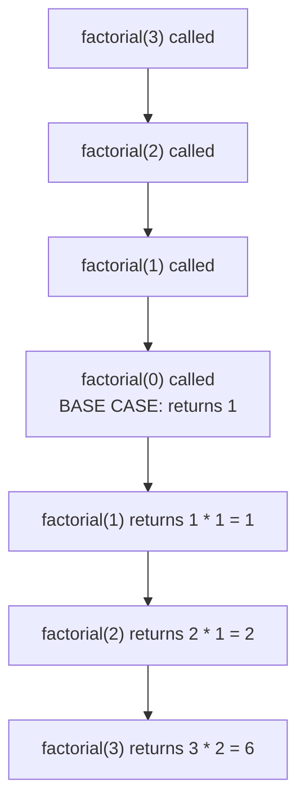
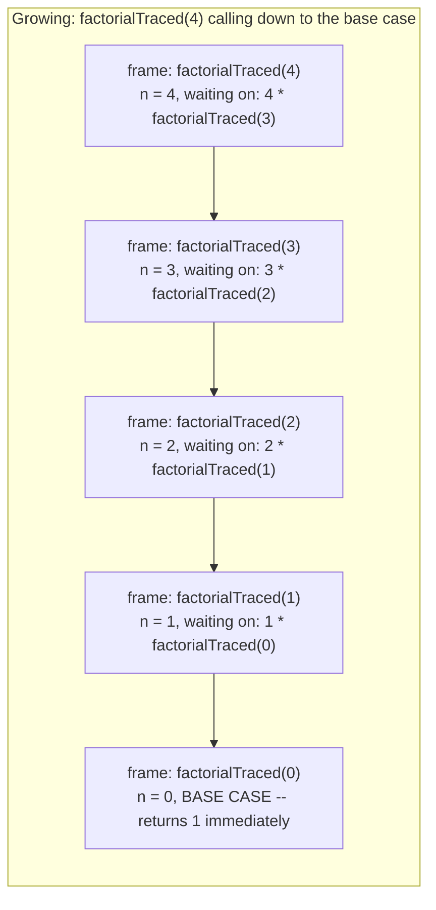
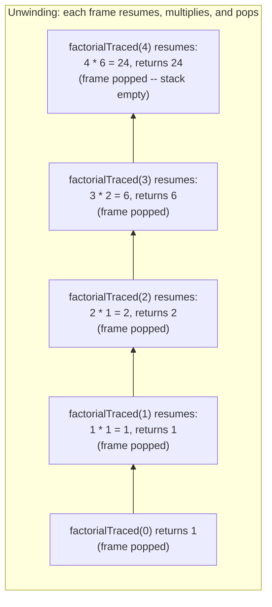
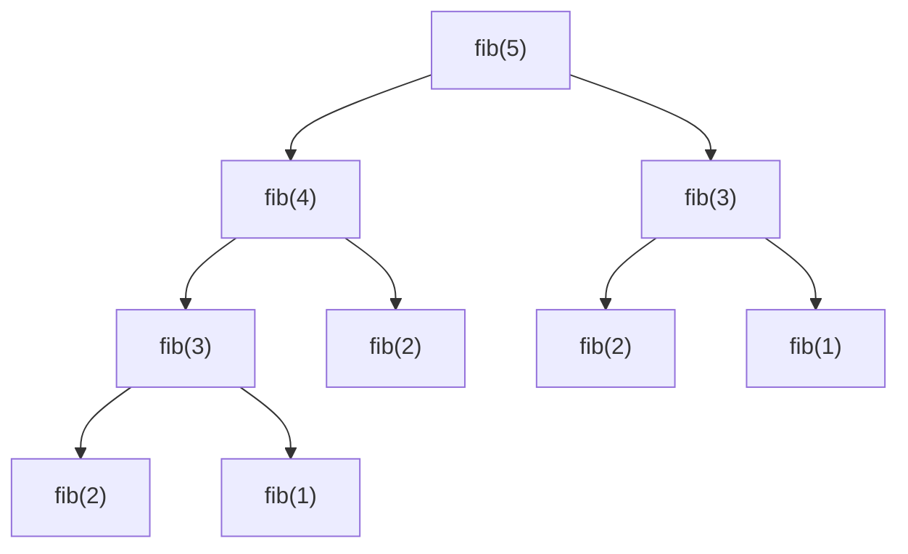

# Lecture 12: Recursion

**Recursion** is a function calling itself to solve a smaller version of the same
problem. It can feel like a magic trick the first time you see it work — but underneath,
it's just the call stack from Lecture 11, doing exactly what it always does. Recursion is
the natural way to think about trees (Unit 5) and graphs (Unit 6), which is why it earns
its own dedicated lecture right before those units begin.

## In This Lecture

- The basic concept: base case and recursive case
- How recursion actually uses the call stack, traced and diagrammed frame by frame
- Recursion versus iteration, with a real timed comparison on Fibonacci
- Why deep recursion can exhaust the stack, demonstrated safely
- Types of recursion
- The advantages and limitations of thinking recursively

## Basic Concept: Base Case and Recursive Case

Every correct recursive function needs exactly two parts:

- **Base case** — the simplest possible version of the problem, answered directly with no
  further recursive call. Without one, the function calls itself forever.
- **Recursive case** — the function calls itself on a *smaller* version of the problem,
  and combines that result to solve the original.

```cpp title="factorial.cpp"
#include <iostream>
using namespace std;

// factorial(n) = n * (n-1) * (n-2) * ... * 1, and factorial(0) = 1
unsigned long factorial(int n) {
    if (n == 0) {           // base case: the simplest version, no recursion needed
        return 1;
    }
    return n * factorial(n - 1);   // recursive case: solve a smaller problem, then combine
}

int main() {
    for (int n : {0, 1, 5, 10}) {
        cout << n << "! = " << factorial(n) << endl;
    }
    return 0;
}
```

```text
$ g++ -std=c++17 -o factorial factorial.cpp
$ ./factorial
0! = 1
1! = 1
5! = 120
10! = 3628800
```

## The Call Stack

Every function call — recursive or not — pushes a new **stack frame** onto the call
stack: its parameters, local variables, and where to resume once it returns. A recursive
call is no different; it's just a function pushing *another copy of itself*.



Each call waits, paused on the call stack, for the call *below* it to return before it can
finish its own multiplication — the stack unwinds from the base case back up to the
original call, exactly like popping a stack one frame at a time.

```cpp title="recursion_trace.cpp"
#include <iostream>
using namespace std;

int factorialTraced(int n, int depth = 0) {
    string indent(depth * 2, ' ');
    cout << indent << "-> factorialTraced(" << n << ") called" << endl;

    if (n == 0) {
        cout << indent << "<- base case, returning 1" << endl;
        return 1;
    }

    int result = n * factorialTraced(n - 1, depth + 1);
    cout << indent << "<- factorialTraced(" << n << ") returning " << result << endl;
    return result;
}

int main() {
    int result = factorialTraced(4);   // let the trace finish before printing the result
    cout << "Result: " << result << endl;
    return 0;
}
```

```text
$ g++ -std=c++17 -o recursion_trace recursion_trace.cpp
$ ./recursion_trace
-> factorialTraced(4) called
  -> factorialTraced(3) called
    -> factorialTraced(2) called
      -> factorialTraced(1) called
        -> factorialTraced(0) called
        <- base case, returning 1
      <- factorialTraced(1) returning 1
    <- factorialTraced(2) returning 2
  <- factorialTraced(3) returning 6
<- factorialTraced(4) returning 24
Result: 24
```

Notice the shape: calls go *down* (indenting deeper) until the base case, then results
come back *up* in reverse order — the last call made is the first one to return. That's
the call stack's LIFO behavior from Lecture 10, made visible.

The trace above shows the *order* of calls and returns, but not what's physically sitting
on the call stack at the deepest point. The diagram below makes that literal: each box is
one stack frame — one paused, waiting call to `factorialTraced` — stacked exactly like
Lecture 10's `LinkedStack`, with the most recently pushed frame drawn on top.





Every frame in the "growing" diagram is genuinely still on the stack, paused mid-statement
(`n * factorialTraced(n - 1)` can't finish computing the multiplication until the recursive
call returns) — exactly `n + 1` frames deep for `factorialTraced(n)`, which is *why* deep
recursion costs stack memory proportional to the recursion depth, not a constant amount.

!!! warning "Forgetting the base case causes a stack overflow"
    If `factorial` never checked `n == 0`, it would keep calling itself — `factorial(-1)`,
    `factorial(-2)`, forever — pushing a new stack frame every time, until the program
    runs out of stack memory and crashes with a **stack overflow**. This is the single most
    common bug in recursive code; always verify the base case is actually reachable.

## Recursion versus Iteration

Anything recursion can do, a loop (iteration) can also do — the two are
computationally equivalent. The choice is about which one expresses the *problem* more
naturally.

```cpp title="recursion_vs_iteration.cpp"
#include <iostream>
using namespace std;

unsigned long factorialRecursive(int n) {
    if (n == 0) return 1;
    return n * factorialRecursive(n - 1);
}

unsigned long factorialIterative(int n) {
    unsigned long result = 1;
    for (int i = 1; i <= n; i++) {
        result *= i;
    }
    return result;
}

int main() {
    int n = 8;
    cout << "Recursive: " << n << "! = " << factorialRecursive(n) << endl;
    cout << "Iterative: " << n << "! = " << factorialIterative(n) << endl;
    return 0;
}
```

```text
$ g++ -std=c++17 -o recursion_vs_iteration recursion_vs_iteration.cpp
$ ./recursion_vs_iteration
Recursive: 8! = 40320
Iterative: 8! = 40320
```

| | Recursion | Iteration |
|---|---|---|
| Memory | Uses O(n) call stack space for `n` nested calls | O(1) extra space, just loop variables |
| Readability | Often much closer to the mathematical definition (trees, Unit 5, are naturally recursive) | Can be less obvious for inherently recursive problems |
| Risk | Stack overflow if the base case is unreachable or the input is very large | Infinite loop if the loop condition is wrong — no stack risk |

`factorial` doesn't make the performance difference between the two obvious, because it
only ever makes *one* recursive call per level — the recursive and iterative versions both
do exactly `n` multiplications. **Fibonacci** is a far more dramatic example, because the
naive recursive version makes **two** recursive calls per level, and those two calls'
subtrees overlap heavily — `fibRecursive(5)` and `fibRecursive(4)` both end up separately
recomputing `fibRecursive(3)` from scratch, with no memory of having done it already.



Notice `fib(3)` appears **twice** and `fib(2)` appears **three times** in just this small
slice down to `fib(5)` — each identical call re-does all the work of its entire subtree
below it, from scratch, every single time. The number of calls roughly doubles with every
increase in `n`, giving O(2ⁿ) total calls — genuinely exponential, unlike factorial's O(n).

```cpp title="fib_recursive_vs_iterative.cpp"
#include <iostream>
#include <chrono>
using namespace std;
using namespace std::chrono;

long fibRecursive(int n) {
    if (n <= 1) return n;
    return fibRecursive(n - 1) + fibRecursive(n - 2);
}

long fibIterative(int n) {
    if (n <= 1) return n;
    long prev = 0, curr = 1;
    for (int i = 2; i <= n; i++) {
        long next = prev + curr;
        prev = curr;
        curr = next;
    }
    return curr;
}

int main() {
    int n = 32;

    auto start1 = high_resolution_clock::now();
    long r1 = fibRecursive(n);
    auto end1 = high_resolution_clock::now();
    double recursiveMs = duration_cast<duration<double, milli>>(end1 - start1).count();

    auto start2 = high_resolution_clock::now();
    long r2 = fibIterative(n);
    auto end2 = high_resolution_clock::now();
    double iterativeMs = duration_cast<duration<double, milli>>(end2 - start2).count();

    cout << "fibRecursive(" << n << ") = " << r1 << endl;
    cout << "fibIterative(" << n << ") = " << r2 << endl;

    double ratio = recursiveMs / (iterativeMs > 0.0001 ? iterativeMs : 0.0001);
    cout << "Recursive vs iterative: ";
    if (ratio > 100.0) cout << "recursion was at least 100x slower" << endl;
    else if (ratio > 10.0) cout << "recursion was at least 10x slower" << endl;
    else cout << "recursion was slower, but by less than 10x" << endl;

    return 0;
}
```

```text
$ g++ -std=c++17 -o fib_recursive_vs_iterative fib_recursive_vs_iterative.cpp
$ ./fib_recursive_vs_iterative
fibRecursive(32) = 2178309
fibIterative(32) = 2178309
Recursive vs iterative: recursion was at least 100x slower
```

!!! note "Same answer, wildly different cost — and a verdict instead of a raw number"
    Both functions compute the identical value, `2178309` — correctness isn't the issue,
    cost is. `fibIterative` does exactly `n - 1` additions no matter what; `fibRecursive`
    makes roughly two million calls to compute `fib(32)` alone, because of all the repeated
    subtree work shown in the diagram above. As with Lecture 9's timing comparison, the
    program prints a **bucketed verdict** ("at least 100x slower") rather than a raw
    millisecond count — the exact ratio depends on the machine, but the *fact* that
    exponential beats linear by orders of magnitude does not, which is exactly what makes
    it safe to assert as a fixed, reproducible verdict here. Unit 5 and Unit 6 (trees and
    graphs) both fix exactly this kind of repeated-subproblem waste with **memoization** —
    caching each subproblem's answer the first time it's computed.

## Why Deep Recursion Can Exhaust the Stack

The call-stack diagrams earlier in this lecture showed `factorialTraced(4)` using 5 stack
frames. That's nothing — but the *pattern* scales directly: `factorialTraced(n)` always
uses `n + 1` frames, and every frame consumes a small but nonzero amount of stack memory
(parameters, local variables, and bookkeeping for where to resume). A typical program's
call stack is only a few megabytes, set by the operating system when the program starts —
nothing like the gigabytes of heap memory `new` can draw from. Recurse deep enough, and
that stack space runs out: a **stack overflow**, which typically crashes the entire
program immediately, with no exception to catch (unlike `ArrayStack::push` in Lecture 10,
which throws a clean, catchable `overflow_error` instead).

```cpp title="deep_recursion.cpp"
#include <iostream>
using namespace std;

// Recurses `depth` levels deep, doing negligible work per frame, then
// unwinds back and returns the deepest level actually reached.
int recurseTo(int target, int current = 1) {
    if (current >= target) return current;
    return recurseTo(target, current + 1);
}

int main() {
    for (int target : {1000, 5000, 20000}) {
        int reached = recurseTo(target);
        cout << "Requested depth " << target << " -> reached " << reached
             << " (returned successfully, stack intact)" << endl;
    }
    return 0;
}
```

```text
$ g++ -std=c++17 -o deep_recursion deep_recursion.cpp
$ ./deep_recursion
Requested depth 1000 -> reached 1000 (returned successfully, stack intact)
Requested depth 5000 -> reached 5000 (returned successfully, stack intact)
Requested depth 20000 -> reached 20000 (returned successfully, stack intact)
```

All three depths here complete safely — each frame of `recurseTo` is tiny (two `int`
parameters, nothing else), so even 20,000 nested frames comfortably fits inside a typical
few-megabyte stack. This lecture deliberately stops at a depth that succeeds, rather than
pushing further until it crashes: a genuine stack overflow terminates the whole process
immediately (no recoverable exception, no clean output), which is the wrong thing to
trigger in code you intend to keep running — including this book's own verification tooling.

!!! warning "This same function crashes well before 100,000 on a typical default stack"
    Pushing `recurseTo`'s target past roughly 30,000–40,000 on a typical MinGW/Windows
    default stack (about 1 MB, well under the 8 MB some Linux defaults reserve) is enough
    to exhaust it and crash with a stack overflow — try it locally outside of any grading
    or verification pipeline, at your own risk, and watch the program terminate abruptly
    with no output for that line at all. The fix is never "recurse more carefully" — it's
    either converting to an equivalent iterative loop (as `fibIterative` did above, O(1)
    extra space instead of O(n)) or, for problems that genuinely need it, explicitly
    managing your own stack data structure on the heap instead of relying on the call
    stack's fixed-size memory.

## Types of Recursion

- **Direct recursion** — a function calls itself directly, as `factorial` does above.
- **Indirect recursion** — function `A` calls function `B`, which calls `A` again.
- **Tail recursion** — the recursive call is the *very last* thing the function does,
  with no pending work afterward (some compilers can optimize this into a loop
  automatically). `factorial` above is **not** tail-recursive, because it still has to
  multiply by `n` *after* the recursive call returns.

!!! tip "Why tail recursion connects back to the stack-overflow discussion"
    A **tail-recursive** function's stack frame has nothing left to do once the recursive
    call returns — it can just hand back whatever the recursive call produced. A sufficiently
    smart compiler can therefore reuse the *same* stack frame for every "call" instead of
    pushing a new one, turning the recursion into a loop under the hood at zero extra stack
    cost. `factorial(int n)` as written is not tail-recursive (the pending `n *` means the
    frame is still needed after the call returns), but rewriting it with an accumulator
    parameter — `factorialTail(int n, unsigned long acc = 1)`, returning
    `factorialTail(n - 1, n * acc)` — would be. Don't rely on this optimization happening,
    though: C++ doesn't guarantee it (unlike some functional languages), so treating it as
    "recursion with no stack cost" is a bug waiting to happen if you ever change compilers
    or optimization settings.

## Advantages and Limitations of Recursion

**Advantages**

- Naturally expresses problems that are themselves defined recursively — tree traversal
  (Lecture 19), graph traversal (Lecture 26), and divide-and-conquer sorting (Lecture 31)
  all read far more clearly as recursion than as hand-rolled loops with manual bookkeeping.
- Often shorter and closer to a mathematical proof than the equivalent iterative code.

**Limitations**

- Each call consumes stack memory — deep recursion on very large inputs can overflow the
  stack, a risk plain loops don't share.
- Can be slower than iteration due to function-call overhead, unless the compiler
  optimizes it away.

## Try It Yourself

1. Write a recursive function `int sumDigits(int n)` that returns the sum of the digits
   of a non-negative integer `n` (e.g., `sumDigits(1234)` should return `10`). Identify
   the base case and the recursive case before writing any code.
2. Compile and run `recursion_trace.cpp` with `factorialTraced(6)` instead of `4`, and
   count how many lines of indentation deep the trace goes before hitting the base case.
   Confirm it matches your expectation based on the call-stack diagram above.
3. Add a `fibTraced(int n, int depth = 0)` function, modeled on `factorialTraced`, that
   prints an indented "called" line on entry and a "returning" line on exit. Run it for
   `fibTraced(4)` and count how many times `fib(1)` and `fib(0)` get printed as "called" —
   does the count match what the recursion-tree diagram earlier in this lecture predicts?
4. Modify `fib_recursive_vs_iterative.cpp` to also print the *number of calls*
   `fibRecursive` makes (add a `static long callCount` or pass a counter by reference,
   incremented once per call) for `n = 20`, `n = 25`, and `n = 30`. Does the call count
   roughly double each time `n` increases by 1, matching the O(2ⁿ) claim in this lecture?
5. Write `factorialTail(int n, unsigned long acc = 1)`, the tail-recursive version of
   factorial described in the tip above. Confirm it produces the same results as
   `factorialRecursive` for several values of `n`, then explain in a sentence or two why
   its stack-frame *shape*, if you were to draw it as the growing/unwinding diagrams from
   earlier, would look different from `factorialTraced`'s.
6. Using `deep_recursion.cpp` as a starting point, write a *separate* program (don't run
   it inside any grading or verification pipeline) that increases the target depth in a
   loop — 10,000, 20,000, 40,000, 80,000 — until it crashes on your machine. Record the
   approximate depth where it stopped succeeding. Is it close to the range this lecture's
   warning mentions?

## Key Takeaways

- Every correct recursive function needs a **base case** (stops the recursion) and a
  **recursive case** (calls itself on a smaller problem).
- Recursive calls use the **call stack** exactly like any other function call — LIFO,
  with each paused call waiting for the one below it to return; the growing/unwinding
  diagrams in this lecture make that literal, one stack frame per pending call.
- Recursion and iteration are computationally equivalent — the choice is about which one
  more naturally expresses the problem, not raw capability. But equivalent doesn't mean
  equally *fast*: naive recursive Fibonacci is O(2ⁿ) because of massively overlapping
  repeated work, while the iterative version is O(n) — a gap real enough to report as a
  reproducible verdict, not just a theoretical curiosity.
- A missing or unreachable base case causes a **stack overflow**, the most common bug in
  recursive code — always verify it before trusting a recursive function. Even a *correct*
  base case doesn't save you if the recursion is simply too deep for the available stack
  space, which is finite (typically a few megabytes) unlike heap memory.
- **Tail recursion** — where the recursive call is the last thing a function does — can in
  principle be optimized into a loop with zero extra stack cost, but C++ never guarantees
  this happens, so it shouldn't be relied on as a substitute for an explicit iterative
  rewrite when stack depth is a genuine concern.
- Recursion is the natural mental model for trees and graphs — the next two units will
  lean on it constantly.
