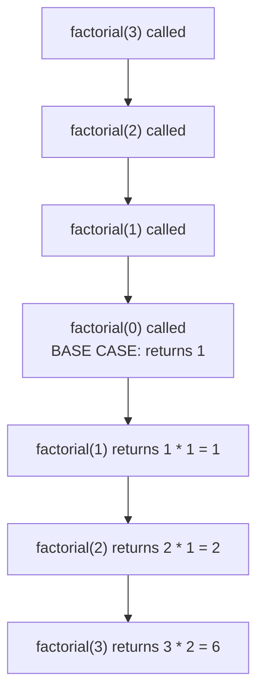

# Lecture 12: Recursion

**Recursion** is a function calling itself to solve a smaller version of the same
problem. It can feel like a magic trick the first time you see it work — but underneath,
it's just the call stack from Lecture 11, doing exactly what it always does. Recursion is
the natural way to think about trees (Unit 5) and graphs (Unit 6), which is why it earns
its own dedicated lecture right before those units begin.

## In This Lecture

- The basic concept: base case and recursive case
- How recursion actually uses the call stack
- Recursion versus iteration
- Types of recursion
- The advantages and limitations of thinking recursively

## Basic Concept: Base Case and Recursive Case

Every correct recursive function needs exactly two parts:

- **Base case** — the simplest possible version of the problem, answered directly with no
  further recursive call. Without one, the function calls itself forever.
- **Recursive case** — the function calls itself on a *smaller* version of the problem,
  and combines that result to solve the original.

```cpp title="factorial.cpp"
#include <iostream>
using namespace std;

// factorial(n) = n * (n-1) * (n-2) * ... * 1, and factorial(0) = 1
unsigned long factorial(int n) {
    if (n == 0) {           // base case: the simplest version, no recursion needed
        return 1;
    }
    return n * factorial(n - 1);   // recursive case: solve a smaller problem, then combine
}

int main() {
    for (int n : {0, 1, 5, 10}) {
        cout << n << "! = " << factorial(n) << endl;
    }
    return 0;
}
```

```text
$ g++ -std=c++17 -o factorial factorial.cpp
$ ./factorial
0! = 1
1! = 1
5! = 120
10! = 3628800
```

## The Call Stack

Every function call — recursive or not — pushes a new **stack frame** onto the call
stack: its parameters, local variables, and where to resume once it returns. A recursive
call is no different; it's just a function pushing *another copy of itself*.



Each call waits, paused on the call stack, for the call *below* it to return before it can
finish its own multiplication — the stack unwinds from the base case back up to the
original call, exactly like popping a stack one frame at a time.

```cpp title="recursion_trace.cpp"
#include <iostream>
using namespace std;

int factorialTraced(int n, int depth = 0) {
    string indent(depth * 2, ' ');
    cout << indent << "-> factorialTraced(" << n << ") called" << endl;

    if (n == 0) {
        cout << indent << "<- base case, returning 1" << endl;
        return 1;
    }

    int result = n * factorialTraced(n - 1, depth + 1);
    cout << indent << "<- factorialTraced(" << n << ") returning " << result << endl;
    return result;
}

int main() {
    int result = factorialTraced(4);   // let the trace finish before printing the result
    cout << "Result: " << result << endl;
    return 0;
}
```

```text
$ g++ -std=c++17 -o recursion_trace recursion_trace.cpp
$ ./recursion_trace
-> factorialTraced(4) called
  -> factorialTraced(3) called
    -> factorialTraced(2) called
      -> factorialTraced(1) called
        -> factorialTraced(0) called
        <- base case, returning 1
      <- factorialTraced(1) returning 1
    <- factorialTraced(2) returning 2
  <- factorialTraced(3) returning 6
<- factorialTraced(4) returning 24
Result: 24
```

Notice the shape: calls go *down* (indenting deeper) until the base case, then results
come back *up* in reverse order — the last call made is the first one to return. That's
the call stack's LIFO behavior from Lecture 10, made visible.

!!! warning "Forgetting the base case causes a stack overflow"
    If `factorial` never checked `n == 0`, it would keep calling itself — `factorial(-1)`,
    `factorial(-2)`, forever — pushing a new stack frame every time, until the program
    runs out of stack memory and crashes with a **stack overflow**. This is the single most
    common bug in recursive code; always verify the base case is actually reachable.

## Recursion versus Iteration

Anything recursion can do, a loop (iteration) can also do — the two are
computationally equivalent. The choice is about which one expresses the *problem* more
naturally.

```cpp title="recursion_vs_iteration.cpp"
#include <iostream>
using namespace std;

unsigned long factorialRecursive(int n) {
    if (n == 0) return 1;
    return n * factorialRecursive(n - 1);
}

unsigned long factorialIterative(int n) {
    unsigned long result = 1;
    for (int i = 1; i <= n; i++) {
        result *= i;
    }
    return result;
}

int main() {
    int n = 8;
    cout << "Recursive: " << n << "! = " << factorialRecursive(n) << endl;
    cout << "Iterative: " << n << "! = " << factorialIterative(n) << endl;
    return 0;
}
```

```text
$ g++ -std=c++17 -o recursion_vs_iteration recursion_vs_iteration.cpp
$ ./recursion_vs_iteration
Recursive: 8! = 40320
Iterative: 8! = 40320
```

| | Recursion | Iteration |
|---|---|---|
| Memory | Uses O(n) call stack space for `n` nested calls | O(1) extra space, just loop variables |
| Readability | Often much closer to the mathematical definition (trees, Unit 5, are naturally recursive) | Can be less obvious for inherently recursive problems |
| Risk | Stack overflow if the base case is unreachable or the input is very large | Infinite loop if the loop condition is wrong — no stack risk |

## Types of Recursion

- **Direct recursion** — a function calls itself directly, as `factorial` does above.
- **Indirect recursion** — function `A` calls function `B`, which calls `A` again.
- **Tail recursion** — the recursive call is the *very last* thing the function does,
  with no pending work afterward (some compilers can optimize this into a loop
  automatically). `factorial` above is **not** tail-recursive, because it still has to
  multiply by `n` *after* the recursive call returns.

## Advantages and Limitations of Recursion

**Advantages**

- Naturally expresses problems that are themselves defined recursively — tree traversal
  (Lecture 19), graph traversal (Lecture 26), and divide-and-conquer sorting (Lecture 31)
  all read far more clearly as recursion than as hand-rolled loops with manual bookkeeping.
- Often shorter and closer to a mathematical proof than the equivalent iterative code.

**Limitations**

- Each call consumes stack memory — deep recursion on very large inputs can overflow the
  stack, a risk plain loops don't share.
- Can be slower than iteration due to function-call overhead, unless the compiler
  optimizes it away.

## Try It Yourself

1. Write a recursive function `int sumDigits(int n)` that returns the sum of the digits
   of a non-negative integer `n` (e.g., `sumDigits(1234)` should return `10`). Identify
   the base case and the recursive case before writing any code.
2. Compile and run `recursion_trace.cpp` with `factorialTraced(6)` instead of `4`, and
   count how many lines of indentation deep the trace goes before hitting the base case.
   Confirm it matches your expectation based on the call-stack diagram above.

## Key Takeaways

- Every correct recursive function needs a **base case** (stops the recursion) and a
  **recursive case** (calls itself on a smaller problem).
- Recursive calls use the **call stack** exactly like any other function call — LIFO,
  with each paused call waiting for the one below it to return.
- Recursion and iteration are computationally equivalent — the choice is about which one
  more naturally expresses the problem, not raw capability.
- A missing or unreachable base case causes a **stack overflow**, the most common bug in
  recursive code — always verify it before trusting a recursive function.
- Recursion is the natural mental model for trees and graphs — the next two units will
  lean on it constantly.
