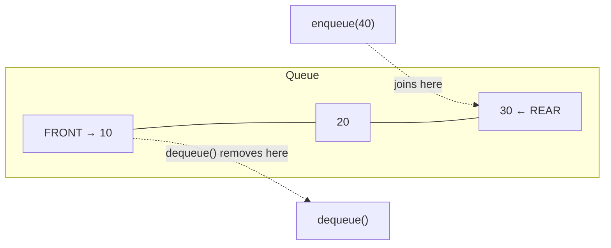

# Lecture 13: Queue ADT and Implementation

Where a stack restricts you to one end, a **queue** splits the two operations across
*both* ends: you add at the back and remove from the front — exactly like a real-world
line of people waiting to be served. This models an enormous range of real problems:
anything processed in the order it arrived.

## In This Lecture

- The queue concept and the FIFO principle
- The Queue ADT: enqueue and dequeue
- An array-based implementation, and the limitation it exposes
- A linked-list-based implementation
- The complexity of every queue operation

## The Queue Concept and the FIFO Principle

A queue follows **FIFO**: **F**irst **I**n, **F**irst **O**ut — whichever element has
been waiting the longest is the next one removed. New elements join at the **rear**;
elements leave from the **front**.



## The Queue ADT

| Operation | Meaning |
|---|---|
| `enqueue(value)` | Add `value` at the rear of the queue |
| `dequeue()` | Remove and return the value at the front of the queue |
| `peek()` / `front()` | Return the front value without removing it |
| `isEmpty()` | Report whether the queue has any elements |

## Array-Based Implementation

A first attempt uses an array with two indices: `frontIndex` (where the next dequeue
comes from) and `rearIndex` (where the next enqueue goes).

```cpp title="array_queue.cpp"
#include <iostream>
#include <stdexcept>
using namespace std;

class ArrayQueue {
private:
    static const int CAPACITY = 5;
    int data[CAPACITY];
    int frontIndex;
    int rearIndex;   // index of the next free slot

public:
    ArrayQueue() : frontIndex(0), rearIndex(0) {}

    bool isEmpty() const { return frontIndex == rearIndex; }
    bool isFull() const { return rearIndex == CAPACITY; }

    void enqueue(int value) {
        if (isFull()) throw overflow_error("Queue is full");
        data[rearIndex++] = value;
    }

    int dequeue() {
        if (isEmpty()) throw underflow_error("Queue is empty");
        return data[frontIndex++];
    }

    int peek() const {
        if (isEmpty()) throw underflow_error("Queue is empty");
        return data[frontIndex];
    }
};

int main() {
    ArrayQueue queue;

    queue.enqueue(10);
    queue.enqueue(20);
    queue.enqueue(30);
    cout << "Enqueued 10, 20, 30. Front is: " << queue.peek() << endl;

    cout << "Dequeued: " << queue.dequeue() << endl;
    cout << "Dequeued: " << queue.dequeue() << endl;
    cout << "Front after two dequeues: " << queue.peek() << endl;

    queue.enqueue(40);
    queue.enqueue(50);
    cout << "Enqueued 40, 50. Queue is now full (rearIndex reached CAPACITY)." << endl;

    try {
        queue.enqueue(60);
    } catch (const overflow_error& e) {
        cout << "enqueue(60) failed: " << e.what()
             << " -- even though only 3 elements are logically in the queue!" << endl;
    }

    return 0;
}
```

```text
$ g++ -std=c++17 -o array_queue array_queue.cpp
$ ./array_queue
Enqueued 10, 20, 30. Front is: 10
Dequeued: 10
Dequeued: 20
Front after two dequeues: 30
Enqueued 40, 50. Queue is now full (rearIndex reached CAPACITY).
enqueue(60) failed: Queue is full -- even though only 3 elements are logically in the queue!
```

!!! warning "This simple array queue wastes space"
    After two `dequeue()` calls, slots 0 and 1 are sitting empty forever — `frontIndex`
    only ever moves forward, and `rearIndex` has no idea those slots are free again. The
    queue reports "full" once `rearIndex` reaches `CAPACITY`, even though most of the
    array is actually empty. **Lecture 14 fixes this directly** with a *circular* queue,
    which reuses freed slots by wrapping `rearIndex` back around to 0.

## Linked-List Implementation

A linked-list-based queue sidesteps the wasted-space problem entirely — `enqueue` adds at
the tail, `dequeue` removes from the head, and freed nodes are genuinely returned to the
system, not just abandoned in an array.

```cpp title="linked_queue.cpp"
#include <iostream>
#include <stdexcept>
using namespace std;

struct Node {
    int data;
    Node* next;
    Node(int value) : data(value), next(nullptr) {}
};

class LinkedQueue {
private:
    Node* frontNode;
    Node* rearNode;

public:
    LinkedQueue() : frontNode(nullptr), rearNode(nullptr) {}

    bool isEmpty() const { return frontNode == nullptr; }

    void enqueue(int value) {
        Node* newNode = new Node(value);
        if (isEmpty()) { frontNode = rearNode = newNode; return; }
        rearNode->next = newNode;
        rearNode = newNode;
    }

    int dequeue() {
        if (isEmpty()) throw underflow_error("Queue is empty");
        Node* oldFront = frontNode;
        int value = oldFront->data;
        frontNode = frontNode->next;
        if (frontNode == nullptr) rearNode = nullptr;   // queue is now empty
        delete oldFront;
        return value;
    }

    int peek() const {
        if (isEmpty()) throw underflow_error("Queue is empty");
        return frontNode->data;
    }
};

int main() {
    LinkedQueue queue;

    for (int i = 1; i <= 6; i++) {
        queue.enqueue(i * 10);
    }
    cout << "Enqueued 6 elements (no fixed capacity to worry about)." << endl;

    for (int i = 0; i < 3; i++) {
        cout << "Dequeued: " << queue.dequeue() << endl;
    }
    cout << "Front after 3 dequeues: " << queue.peek() << endl;

    return 0;
}
```

```text
$ g++ -std=c++17 -o linked_queue linked_queue.cpp
$ ./linked_queue
Enqueued 6 elements (no fixed capacity to worry about).
Dequeued: 10
Dequeued: 20
Dequeued: 30
Front after 3 dequeues: 40
```

## Complexity of Queue Operations

| Operation | Array-based (simple) | Linked-list-based |
|---|---|---|
| `enqueue` | O(1) — but limited by fixed capacity, as shown above | O(1) — always |
| `dequeue` | O(1) | O(1) |
| `peek` | O(1) | O(1) |

Both implementations achieve O(1) for every core operation — the real difference, exactly
as with stacks in Lecture 10, is about capacity and wasted space, not raw speed. Lecture
14's circular queue closes that gap for the array-based version entirely.

## Try It Yourself

1. Compile and run `array_queue.cpp`, then add `dequeue()` calls to fully empty the
   queue, followed by an `enqueue()`. Confirm from the output whether the new element can
   actually be added, or whether `isFull()` still incorrectly reports true — this is the
   bug Lecture 14 fixes.
2. Add a `size()` method to `LinkedQueue` that returns the current number of elements in
   O(1) (maintain a running count, updated in `enqueue` and `dequeue`, rather than walking
   the list).

## Key Takeaways

- A queue enforces **FIFO** (First In, First Out) — elements are added at the rear and
  removed from the front.
- The Queue ADT's core operations — `enqueue`, `dequeue`, `peek` — are O(1) in both an
  array-based and a linked-list-based implementation.
- A naive array-based queue **wastes space**: once `frontIndex` moves past the start,
  those slots are never reused, so the queue can report "full" while mostly empty.
- A linked-list-based queue avoids this entirely, since freed nodes are genuinely
  returned to the system — but Lecture 14's circular queue shows how to fix the array
  version too, without giving up an array's cache-friendly memory layout.
