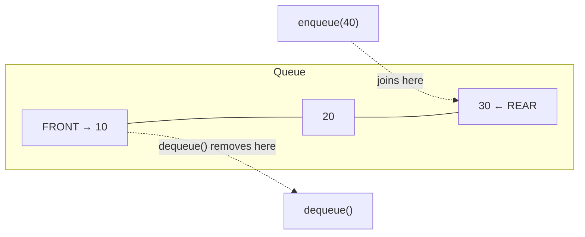
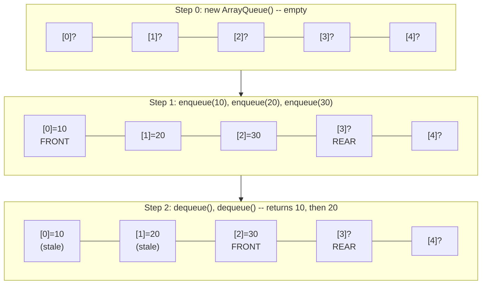
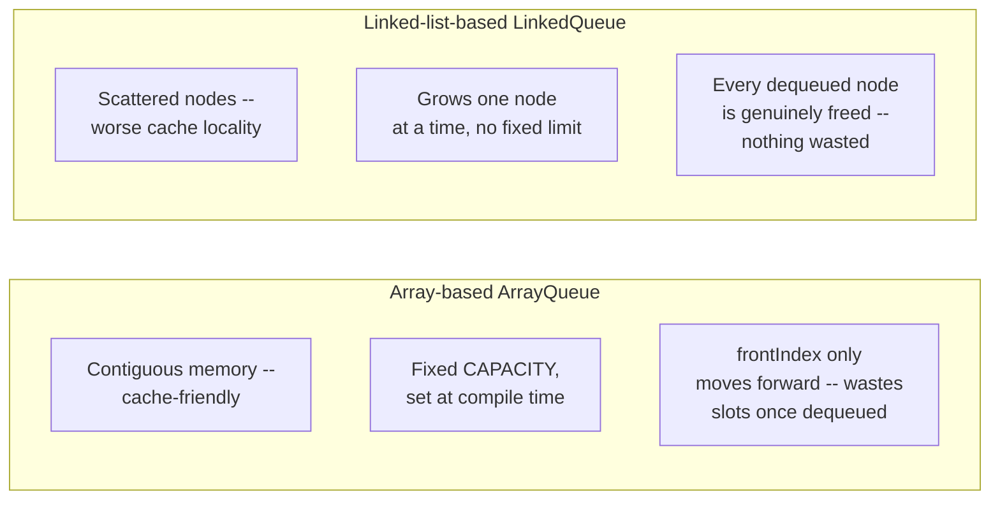

# Lecture 13: Queue ADT and Implementation

Where a stack restricts you to one end, a **queue** splits the two operations across
*both* ends: you add at the back and remove from the front — exactly like a real-world
line of people waiting to be served. This models an enormous range of real problems:
anything processed in the order it arrived.

## In This Lecture

- The queue concept and the FIFO principle
- The Queue ADT: enqueue and dequeue
- An array-based implementation, and the limitation it exposes
- Tracing `enqueue`/`dequeue` step by step against the underlying array
- The queue-full and queue-empty edge cases, and why both must be checked explicitly
- A linked-list-based implementation
- Comparing the array-based and linked-list-based approaches directly
- The complexity of every queue operation

## The Queue Concept and the FIFO Principle

A queue follows **FIFO**: **F**irst **I**n, **F**irst **O**ut — whichever element has
been waiting the longest is the next one removed. New elements join at the **rear**;
elements leave from the **front**.



## The Queue ADT

| Operation | Meaning |
|---|---|
| `enqueue(value)` | Add `value` at the rear of the queue |
| `dequeue()` | Remove and return the value at the front of the queue |
| `peek()` / `front()` | Return the front value without removing it |
| `isEmpty()` | Report whether the queue has any elements |

## Array-Based Implementation

A first attempt uses an array with two indices: `frontIndex` (where the next dequeue
comes from) and `rearIndex` (where the next enqueue goes).

```cpp title="array_queue.cpp"
#include <iostream>
#include <stdexcept>
using namespace std;

class ArrayQueue {
private:
    static const int CAPACITY = 5;
    int data[CAPACITY];
    int frontIndex;
    int rearIndex;   // index of the next free slot

public:
    ArrayQueue() : frontIndex(0), rearIndex(0) {}

    bool isEmpty() const { return frontIndex == rearIndex; }
    bool isFull() const { return rearIndex == CAPACITY; }

    void enqueue(int value) {
        if (isFull()) throw overflow_error("Queue is full");
        data[rearIndex++] = value;
    }

    int dequeue() {
        if (isEmpty()) throw underflow_error("Queue is empty");
        return data[frontIndex++];
    }

    int peek() const {
        if (isEmpty()) throw underflow_error("Queue is empty");
        return data[frontIndex];
    }
};

int main() {
    ArrayQueue queue;

    queue.enqueue(10);
    queue.enqueue(20);
    queue.enqueue(30);
    cout << "Enqueued 10, 20, 30. Front is: " << queue.peek() << endl;

    cout << "Dequeued: " << queue.dequeue() << endl;
    cout << "Dequeued: " << queue.dequeue() << endl;
    cout << "Front after two dequeues: " << queue.peek() << endl;

    queue.enqueue(40);
    queue.enqueue(50);
    cout << "Enqueued 40, 50. Queue is now full (rearIndex reached CAPACITY)." << endl;

    try {
        queue.enqueue(60);
    } catch (const overflow_error& e) {
        cout << "enqueue(60) failed: " << e.what()
             << " -- even though only 3 elements are logically in the queue!" << endl;
    }

    return 0;
}
```

```text
$ g++ -std=c++17 -o array_queue array_queue.cpp
$ ./array_queue
Enqueued 10, 20, 30. Front is: 10
Dequeued: 10
Dequeued: 20
Front after two dequeues: 30
Enqueued 40, 50. Queue is now full (rearIndex reached CAPACITY).
enqueue(60) failed: Queue is full -- even though only 3 elements are logically in the queue!
```

!!! warning "This simple array queue wastes space"
    After two `dequeue()` calls, slots 0 and 1 are sitting empty forever — `frontIndex`
    only ever moves forward, and `rearIndex` has no idea those slots are free again. The
    queue reports "full" once `rearIndex` reaches `CAPACITY`, even though most of the
    array is actually empty. **Lecture 14 fixes this directly** with a *circular* queue,
    which reuses freed slots by wrapping `rearIndex` back around to 0.

### Why Two Separate Indices?

It's worth pausing on *why* `ArrayQueue` needs two indices instead of one. A stack
(Lecture 10) only ever touches one end, so a single `top` index is enough. A queue touches
*both* ends — `enqueue` writes at the rear, `dequeue` reads from the front — and those two
positions drift apart independently as the queue is used. `frontIndex` tracks "where does
the oldest surviving element live," and `rearIndex` tracks "where does the next new
element go." The gap between them (`rearIndex - frontIndex`) is exactly how many elements
are logically in the queue right now, even though the *array itself* has no idea which
slots are "real" data and which are leftover garbage from an element already dequeued.

### Tracing `enqueue`/`dequeue` Step by Step

Seeing the indices move against the underlying array, one operation at a time, makes the
wasted-space problem concrete rather than abstract:



Notice `dequeue()` never actually erases slots `[0]` and `[1]` — it only moves
`frontIndex` past them. The old values `10` and `20` are still physically sitting in the
array (the diagram labels them "stale" for that reason), but the queue correctly refuses
to consider them part of its logical contents anymore. That's the whole story behind the
"wastes space" warning above: those two slots are gone for good, because `rearIndex` only
ever climbs toward `CAPACITY` and never learns they're free.

## Queue Full and Queue Empty: The Edge Cases

Every queue operation above checks `isFull()` or `isEmpty()` before touching the array,
and that isn't a formality — both edges are places real programs break if the check is
skipped. `enqueue` on a full queue would silently write past the end of the array (or
overwrite a slot that's still logically in use); `dequeue` or `peek` on an empty queue
would read a slot that was never written, returning garbage instead of failing loudly.
The example below deliberately hits *both* edges, on a queue small enough (`CAPACITY = 3`)
to reach them in just a few calls:

```cpp title="queue_edge_cases.cpp"
#include <iostream>
#include <stdexcept>
using namespace std;

class ArrayQueue {
private:
    static const int CAPACITY = 3;
    int data[CAPACITY];
    int frontIndex;
    int rearIndex;

public:
    ArrayQueue() : frontIndex(0), rearIndex(0) {}

    bool isEmpty() const { return frontIndex == rearIndex; }
    bool isFull() const { return rearIndex == CAPACITY; }

    void enqueue(int value) {
        if (isFull()) throw overflow_error("Queue is full");
        data[rearIndex++] = value;
    }

    int dequeue() {
        if (isEmpty()) throw underflow_error("Queue is empty");
        return data[frontIndex++];
    }

    int peek() const {
        if (isEmpty()) throw underflow_error("Queue is empty");
        return data[frontIndex];
    }
};

int main() {
    ArrayQueue queue;   // CAPACITY = 3, small on purpose so both edges are easy to hit

    cout << "-- Testing the empty edge first --" << endl;
    try {
        queue.dequeue();
    } catch (const underflow_error& e) {
        cout << "dequeue() on a brand-new queue failed: " << e.what() << endl;
    }
    try {
        queue.peek();
    } catch (const underflow_error& e) {
        cout << "peek() on a brand-new queue failed: " << e.what() << endl;
    }

    cout << "\n-- Now filling it to capacity --" << endl;
    queue.enqueue(1);
    queue.enqueue(2);
    queue.enqueue(3);
    cout << "Enqueued 1, 2, 3 -- queue is now full (CAPACITY = 3)." << endl;

    try {
        queue.enqueue(4);
    } catch (const overflow_error& e) {
        cout << "enqueue(4) failed: " << e.what() << endl;
    }

    cout << "\n-- Draining it back to empty --" << endl;
    while (!queue.isEmpty()) {
        cout << "dequeue() -> " << queue.dequeue() << endl;
    }

    try {
        queue.dequeue();
    } catch (const underflow_error& e) {
        cout << "dequeue() on the now-empty queue failed again: " << e.what() << endl;
    }

    return 0;
}
```

```text
$ g++ -std=c++17 -o queue_edge_cases queue_edge_cases.cpp
$ ./queue_edge_cases
-- Testing the empty edge first --
dequeue() on a brand-new queue failed: Queue is empty
peek() on a brand-new queue failed: Queue is empty

-- Now filling it to capacity --
Enqueued 1, 2, 3 -- queue is now full (CAPACITY = 3).
enqueue(4) failed: Queue is full

-- Draining it back to empty --
dequeue() -> 1
dequeue() -> 2
dequeue() -> 3
dequeue() on the now-empty queue failed again: Queue is empty
```

!!! note "isEmpty and isFull look almost identical, but they're checking different things"
    `isEmpty()` compares `frontIndex == rearIndex` (nothing between them). `isFull()`
    compares `rearIndex == CAPACITY` (no room left to grow). It's tempting to assume one
    check is just the "opposite" of the other, but they're not — a queue can be neither
    (some elements, some room) or, briefly, could even satisfy both conditions on a
    circular queue if you're not careful, which is exactly why Lecture 14's circular
    queue tracks a separate `count` variable instead of comparing indices directly.

## Linked-List Implementation

A linked-list-based queue sidesteps the wasted-space problem entirely — `enqueue` adds at
the tail, `dequeue` removes from the head, and freed nodes are genuinely returned to the
system, not just abandoned in an array.

```cpp title="linked_queue.cpp"
#include <iostream>
#include <stdexcept>
using namespace std;

struct Node {
    int data;
    Node* next;
    Node(int value) : data(value), next(nullptr) {}
};

class LinkedQueue {
private:
    Node* frontNode;
    Node* rearNode;

public:
    LinkedQueue() : frontNode(nullptr), rearNode(nullptr) {}

    bool isEmpty() const { return frontNode == nullptr; }

    void enqueue(int value) {
        Node* newNode = new Node(value);
        if (isEmpty()) { frontNode = rearNode = newNode; return; }
        rearNode->next = newNode;
        rearNode = newNode;
    }

    int dequeue() {
        if (isEmpty()) throw underflow_error("Queue is empty");
        Node* oldFront = frontNode;
        int value = oldFront->data;
        frontNode = frontNode->next;
        if (frontNode == nullptr) rearNode = nullptr;   // queue is now empty
        delete oldFront;
        return value;
    }

    int peek() const {
        if (isEmpty()) throw underflow_error("Queue is empty");
        return frontNode->data;
    }
};

int main() {
    LinkedQueue queue;

    for (int i = 1; i <= 6; i++) {
        queue.enqueue(i * 10);
    }
    cout << "Enqueued 6 elements (no fixed capacity to worry about)." << endl;

    for (int i = 0; i < 3; i++) {
        cout << "Dequeued: " << queue.dequeue() << endl;
    }
    cout << "Front after 3 dequeues: " << queue.peek() << endl;

    return 0;
}
```

```text
$ g++ -std=c++17 -o linked_queue linked_queue.cpp
$ ./linked_queue
Enqueued 6 elements (no fixed capacity to worry about).
Dequeued: 10
Dequeued: 20
Dequeued: 30
Front after 3 dequeues: 40
```

## Comparing the Two Implementations

Both implementations satisfy the exact same Queue ADT — the same `enqueue`, `dequeue`,
and `peek` signatures — but they make very different trade-offs underneath:



| | Array-based (simple) | Linked-list-based |
|---|---|---|
| Maximum size | Fixed at compile time (`CAPACITY`) | Limited only by available memory |
| Memory per element | Just the element itself | Element + one `next` pointer |
| Cache performance | Better (contiguous memory) | Worse (nodes scattered on the heap) |
| Wasted space after dequeues | Yes, until Lecture 14's circular fix | No — freed nodes return to the system |
| Good fit when... | The maximum size is known ahead of time | The size is unpredictable or highly variable |

Neither one is a strictly "better" queue — a fixed-size buffer for, say, a keyboard's
input queue is a perfectly reasonable place to prefer the array version once Lecture 14
fixes its space problem, while a task queue whose length depends entirely on user
behavior is a natural fit for the linked version's unbounded growth.

## Complexity of Queue Operations

| Operation | Array-based (simple) | Linked-list-based |
|---|---|---|
| `enqueue` | O(1) — but limited by fixed capacity, as shown above | O(1) — always |
| `dequeue` | O(1) | O(1) |
| `peek` | O(1) | O(1) |

Both implementations achieve O(1) for every core operation — the real difference, exactly
as with stacks in Lecture 10, is about capacity and wasted space, not raw speed. Lecture
14's circular queue closes that gap for the array-based version entirely.

## Try It Yourself

1. Compile and run `array_queue.cpp`, then add `dequeue()` calls to fully empty the
   queue, followed by an `enqueue()`. Confirm from the output whether the new element can
   actually be added, or whether `isFull()` still incorrectly reports true — this is the
   bug Lecture 14 fixes.
2. Add a `size()` method to `LinkedQueue` that returns the current number of elements in
   O(1) (maintain a running count, updated in `enqueue` and `dequeue`, rather than walking
   the list).
3. Compile and run `queue_edge_cases.cpp`, then change `CAPACITY` to `1` and re-run.
   Trace through by hand first: how many total `enqueue`/`dequeue` calls happen in
   `main`, and at exactly which calls do you expect an exception now that only a single
   slot exists? Confirm your prediction against the real output.
4. Draw (on paper), in the same style as the "Tracing enqueue/dequeue" diagram above, what
   `frontIndex` and `rearIndex` look like after `enqueue(1)`, `enqueue(2)`, `dequeue()`,
   `enqueue(3)`, `enqueue(4)` on a fresh `ArrayQueue` with `CAPACITY = 5`. Then modify
   `array_queue.cpp` to run exactly that sequence and check your diagram against the real
   behavior (e.g. by calling `peek()` after each step).

## Key Takeaways

- A queue enforces **FIFO** (First In, First Out) — elements are added at the rear and
  removed from the front.
- The Queue ADT's core operations — `enqueue`, `dequeue`, `peek` — are O(1) in both an
  array-based and a linked-list-based implementation.
- An array-based queue needs **two independent indices** — `frontIndex` for reading,
  `rearIndex` for writing — because the two ends of a queue drift apart independently as
  it's used, unlike a stack's single `top`.
- `isFull()` and `isEmpty()` check genuinely different conditions (`rearIndex == CAPACITY`
  vs. `frontIndex == rearIndex`) and **both** must be checked before every operation that
  touches the array — skipping either one lets `enqueue` write past the array or
  `dequeue`/`peek` read uninitialized memory.
- A naive array-based queue **wastes space**: once `frontIndex` moves past the start,
  those slots are never reused, so the queue can report "full" while mostly empty.
- A linked-list-based queue avoids this entirely, since freed nodes are genuinely
  returned to the system — the trade-off is worse cache locality and one extra pointer
  per element.
- Neither implementation is universally "better" — pick the array version when a maximum
  size is known ahead of time, and the linked version when size is unpredictable. Lecture
  14's circular queue shows how to fix the array version's wasted space too, without
  giving up an array's cache-friendly memory layout.
