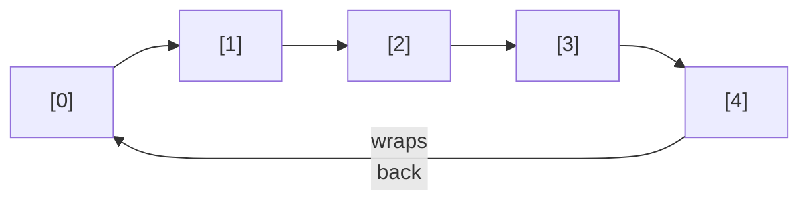
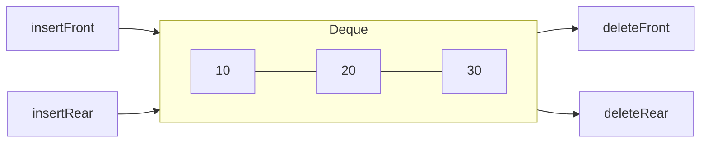

# Lecture 14: Circular Queue, Deque, and Priority Queue

Lecture 13 ended with a real, working queue that had a real, wasteful bug: freed slots at
the front of the array were never reused. This lecture fixes that with a **circular
queue**, then introduces two useful variations: the **deque**, which allows insertion and
removal at *both* ends, and the **priority queue**, which breaks FIFO on purpose when
some elements matter more than others.

## In This Lecture

- The limitation of a simple array-based queue, and how a circular queue fixes it
- Implementing a circular queue with wraparound indices
- The deque (double-ended queue): insertion and deletion at both ends
- Input-restricted and output-restricted deques
- The priority queue concept: priority over arrival order

## Limitations of a Simple Queue

Recall Lecture 13's problem exactly: `frontIndex` only ever increases, so once elements
are dequeued from the front, those array slots are permanently abandoned — the queue can
report "full" while most of its storage sits empty.

## Circular Queue Concept

A **circular queue** treats the underlying array as if its last index wrapped back around
to connect to index 0 — conceptually a ring, not a straight line. Both `frontIndex` and
`rearIndex` advance using the modulo operator (`% capacity`), so they naturally wrap
around and reuse freed slots.



```cpp title="circular_queue.cpp"
#include <iostream>
#include <stdexcept>
using namespace std;

class CircularQueue {
private:
    static const int CAPACITY = 5;
    int data[CAPACITY];
    int frontIndex;
    int count;   // how many elements are actually stored right now

public:
    CircularQueue() : frontIndex(0), count(0) {}

    bool isEmpty() const { return count == 0; }
    bool isFull() const { return count == CAPACITY; }

    void enqueue(int value) {
        if (isFull()) throw overflow_error("Queue is full");
        int rearIndex = (frontIndex + count) % CAPACITY;
        data[rearIndex] = value;
        count++;
    }

    int dequeue() {
        if (isEmpty()) throw underflow_error("Queue is empty");
        int value = data[frontIndex];
        frontIndex = (frontIndex + 1) % CAPACITY;
        count--;
        return value;
    }
};

int main() {
    CircularQueue queue;

    queue.enqueue(10);
    queue.enqueue(20);
    queue.enqueue(30);
    cout << "Enqueued 10, 20, 30. Dequeuing two: "
         << queue.dequeue() << ", " << queue.dequeue() << endl;

    // Slots 0 and 1 are now free. A naive array queue would refuse more than 2 more
    // enqueues (capacity 5, rearIndex already at 3) -- let's prove the circular version
    // reuses them instead.
    queue.enqueue(40);
    queue.enqueue(50);
    queue.enqueue(60);
    cout << "Enqueued 40, 50, 60 -- reusing the freed slots 0 and 1." << endl;

    cout << "Remaining, in order: ";
    while (!queue.isEmpty()) {
        cout << queue.dequeue() << " ";
    }
    cout << endl;

    return 0;
}
```

```text
$ g++ -std=c++17 -o circular_queue circular_queue.cpp
$ ./circular_queue
Enqueued 10, 20, 30. Dequeuing two: 10, 20
Enqueued 40, 50, 60 -- reusing the freed slots 0 and 1.
Remaining, in order: 30 40 50 60
```

Five enqueues total (`10, 20, 30, 40, 50, 60` is six — but only 5 fit at once, which is
exactly the point) happened against a `CAPACITY` of 5, with two dequeues freeing room
along the way — something the simple array queue from Lecture 13 could never have done.

## Advantages of a Circular Queue

- Uses a fixed-size array's memory efficiently — no slot is ever permanently wasted.
- Still O(1) for every operation, with none of a linked list's per-node pointer overhead.
- The standard way real systems implement fixed-size buffers — audio/video streaming
  buffers, keyboard input buffers, and network packet buffers are all circular queues
  under the hood.

## Deque (Double-Ended Queue)

A **deque** ("deck") generalizes the queue further: insertion and deletion are both
allowed at *either* end, not just one.



```cpp title="deque_demo.cpp"
#include <iostream>
#include <deque>
using namespace std;

int main() {
    deque<int> dq;   // C++'s own built-in deque

    dq.push_back(10);
    dq.push_back(20);
    dq.push_front(5);
    cout << "After push_back(10), push_back(20), push_front(5): ";
    for (int v : dq) cout << v << " ";
    cout << endl;

    dq.pop_front();
    cout << "After pop_front(): ";
    for (int v : dq) cout << v << " ";
    cout << endl;

    dq.pop_back();
    cout << "After pop_back(): ";
    for (int v : dq) cout << v << " ";
    cout << endl;

    return 0;
}
```

```text
$ g++ -std=c++17 -o deque_demo deque_demo.cpp
$ ./deque_demo
After push_back(10), push_back(20), push_front(5): 5 10 20
After pop_front(): 10 20
After pop_back(): 10
```

A queue is really just a deque used with only two of its four possible operations
(`push_back` and `pop_front`); a stack is a deque used with only `push_back` and
`pop_back`. The deque is the more general structure both are built from.

### Input-Restricted and Output-Restricted Deques

Real problems sometimes need a deque with one end locked down:

- **Input-restricted deque** — insertion allowed at only *one* end, but deletion allowed
  at *both*.
- **Output-restricted deque** — deletion allowed at only *one* end, but insertion allowed
  at *both*.

These are used when a problem is *mostly* a plain queue or stack, but occasionally needs
one extra flexibility at just one end, without opening up full deque behavior everywhere.

## Priority Queue Concept

A **priority queue** breaks FIFO on purpose: each element carries a **priority**, and
`dequeue` always removes the *highest-priority* element first, regardless of arrival
order. Two elements that arrive in the "wrong" order relative to each other will still
come out in priority order.

```cpp title="priority_queue_demo.cpp"
#include <iostream>
#include <queue>
#include <string>
using namespace std;

struct Task {
    string name;
    int priority;   // higher number = more urgent
};

// A comparator so std::priority_queue knows how to order Tasks: highest priority first.
struct CompareTask {
    bool operator()(const Task& a, const Task& b) {
        return a.priority < b.priority;   // smaller priority = "less important" = later
    }
};

int main() {
    priority_queue<Task, vector<Task>, CompareTask> pq;

    pq.push({"Send weekly report", 2});
    pq.push({"Fix production outage", 9});
    pq.push({"Reply to a comment", 1});
    pq.push({"Patch a security bug", 8});

    cout << "Processing tasks by priority (highest first), not arrival order:" << endl;
    while (!pq.empty()) {
        Task next = pq.top();
        cout << "  [" << next.priority << "] " << next.name << endl;
        pq.pop();
    }
    return 0;
}
```

```text
$ g++ -std=c++17 -o priority_queue_demo priority_queue_demo.cpp
$ ./priority_queue_demo
Processing tasks by priority (highest first), not arrival order:
  [9] Fix production outage
  [8] Patch a security bug
  [2] Send weekly report
  [1] Reply to a comment
```

"Fix production outage" was pushed *second*, but processed *first*, because its priority
(9) beats every other task's — exactly the FIFO-breaking behavior a priority queue exists
to provide. Lecture 23 builds a priority queue from scratch on top of a **heap**, the data
structure `std::priority_queue` itself uses internally.

## Try It Yourself

1. Compile and run `circular_queue.cpp`, then try to `enqueue` a 6th element while the
   queue already holds 5. Confirm it throws `overflow_error`, proving the circular queue
   still correctly enforces its real capacity limit — reusing freed slots isn't the same
   as having unlimited space.
2. Modify `priority_queue_demo.cpp` to add a 5th task with the *same* priority as an
   existing one. Run it and observe which one comes out first — `std::priority_queue`
   makes no promise about the relative order of equal-priority elements, which is worth
   confirming for yourself rather than assuming.

## Key Takeaways

- A **circular queue** reuses freed array slots by wrapping indices with the modulo
  operator, fixing the wasted-space problem of a simple array-based queue while staying
  O(1) for every operation.
- A **deque** generalizes the queue to allow insertion and deletion at both ends — a
  stack and a queue are both special cases of a deque used with only two of its four
  operations.
- **Input-restricted** and **output-restricted** deques lock down one end when a problem
  needs only a little extra flexibility, not the full generality of a deque.
- A **priority queue** deliberately breaks FIFO: elements come out in priority order, not
  arrival order — the foundation for Lecture 23's heap-based implementation.
