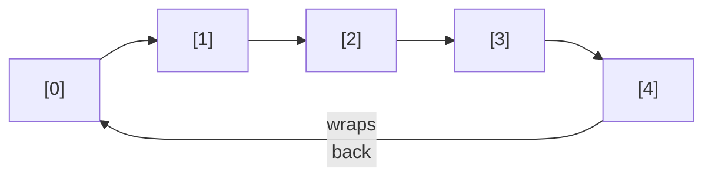
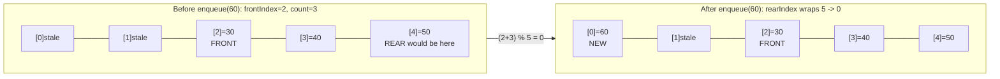
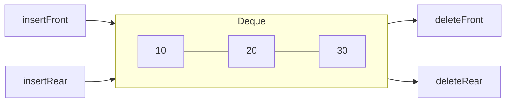

# Lecture 14: Circular Queue, Deque, and Priority Queue

Lecture 13 ended with a real, working queue that had a real, wasteful bug: freed slots at
the front of the array were never reused. This lecture fixes that with a **circular
queue**, then introduces two useful variations: the **deque**, which allows insertion and
removal at *both* ends, and the **priority queue**, which breaks FIFO on purpose when
some elements matter more than others.

## In This Lecture

- The limitation of a simple array-based queue, and how a circular queue fixes it
- Implementing a circular queue with wraparound indices
- Tracing the wraparound itself, index by index, past the array's physical end
- The deque (double-ended queue): insertion and deletion at both ends
- Building a deque from scratch as a circular array, not just using `std::deque`
- Input-restricted and output-restricted deques
- The priority queue concept: priority over arrival order
- Min-heap vs. max-heap priority queues, and how the comparator controls which one you get

## Limitations of a Simple Queue

Recall Lecture 13's problem exactly: `frontIndex` only ever increases, so once elements
are dequeued from the front, those array slots are permanently abandoned — the queue can
report "full" while most of its storage sits empty.

## Circular Queue Concept

A **circular queue** treats the underlying array as if its last index wrapped back around
to connect to index 0 — conceptually a ring, not a straight line. Both `frontIndex` and
`rearIndex` advance using the modulo operator (`% capacity`), so they naturally wrap
around and reuse freed slots.



```cpp title="circular_queue.cpp"
#include <iostream>
#include <stdexcept>
using namespace std;

class CircularQueue {
private:
    static const int CAPACITY = 5;
    int data[CAPACITY];
    int frontIndex;
    int count;   // how many elements are actually stored right now

public:
    CircularQueue() : frontIndex(0), count(0) {}

    bool isEmpty() const { return count == 0; }
    bool isFull() const { return count == CAPACITY; }

    void enqueue(int value) {
        if (isFull()) throw overflow_error("Queue is full");
        int rearIndex = (frontIndex + count) % CAPACITY;
        data[rearIndex] = value;
        count++;
    }

    int dequeue() {
        if (isEmpty()) throw underflow_error("Queue is empty");
        int value = data[frontIndex];
        frontIndex = (frontIndex + 1) % CAPACITY;
        count--;
        return value;
    }
};

int main() {
    CircularQueue queue;

    queue.enqueue(10);
    queue.enqueue(20);
    queue.enqueue(30);
    cout << "Enqueued 10, 20, 30. Dequeuing two: "
         << queue.dequeue() << ", " << queue.dequeue() << endl;

    // Slots 0 and 1 are now free. A naive array queue would refuse more than 2 more
    // enqueues (capacity 5, rearIndex already at 3) -- let's prove the circular version
    // reuses them instead.
    queue.enqueue(40);
    queue.enqueue(50);
    queue.enqueue(60);
    cout << "Enqueued 40, 50, 60 -- reusing the freed slots 0 and 1." << endl;

    cout << "Remaining, in order: ";
    while (!queue.isEmpty()) {
        cout << queue.dequeue() << " ";
    }
    cout << endl;

    return 0;
}
```

```text
$ g++ -std=c++17 -o circular_queue circular_queue.cpp
$ ./circular_queue
Enqueued 10, 20, 30. Dequeuing two: 10, 20
Enqueued 40, 50, 60 -- reusing the freed slots 0 and 1.
Remaining, in order: 30 40 50 60
```

Five enqueues total (`10, 20, 30, 40, 50, 60` is six — but only 5 fit at once, which is
exactly the point) happened against a `CAPACITY` of 5, with two dequeues freeing room
along the way — something the simple array queue from Lecture 13 could never have done.

### Tracing the Wraparound, Index by Index

The part that trips students up isn't the concept — it's watching `rearIndex` actually
compute its way past index 4 and land back on index 0. Here's every step from the example
above, with `frontIndex`, `count`, and the array contents shown explicitly:

| Step | Operation | `frontIndex` before | `rearIndex = (frontIndex+count) % 5` | Array after |
|---|---|---|---|---|
| 1 | `enqueue(10)` | 0 | (0+0)%5 = **0** | `[10, _, _, _, _]` |
| 2 | `enqueue(20)` | 0 | (0+1)%5 = **1** | `[10, 20, _, _, _]` |
| 3 | `enqueue(30)` | 0 | (0+2)%5 = **2** | `[10, 20, 30, _, _]` |
| 4 | `dequeue()` → 10 | 0 → **1** | — | `[10, 20, 30, _, _]` (slot 0 now stale) |
| 5 | `dequeue()` → 20 | 1 → **2** | — | slots 0, 1 now stale |
| 6 | `enqueue(40)` | 2 | (2+1)%5 = **3** | `[.., .., 30, 40, _]` |
| 7 | `enqueue(50)` | 2 | (2+2)%5 = **4** | `[.., .., 30, 40, 50]` |
| 8 | `enqueue(60)` | 2 | (2+3)%5 = **0** ← wraps! | `[60, .., 30, 40, 50]` |

At step 8, `rearIndex` would arithmetically be `5` if the queue simply kept incrementing —
but `5 % 5 = 0`, so `60` is written into slot `0`, the exact slot that `10` vacated back at
step 4. That single `% CAPACITY` is the entire mechanism: it's what turns a straight line
of array indices into a ring.



!!! warning "The classic off-by-one trap"
    It's tempting to compute `rearIndex` as a variable that increments independently and
    wraps with `if (rearIndex == CAPACITY) rearIndex = 0;`. That works too, but it's easy
    to get the *order* wrong relative to the write (wrap before writing? after?) and to
    forget to apply the same wrap to `frontIndex` in `dequeue`. Computing
    `rearIndex = (frontIndex + count) % CAPACITY` fresh every time, as `CircularQueue`
    does, sidesteps the whole class of bug — there's no separate `rearIndex` variable to
    forget to wrap, since it's always derived from `frontIndex` and `count` together. Trace
    the math by hand (as the table above does) whenever a circular structure misbehaves;
    guessing at the modulo arithmetic is exactly how off-by-one bugs slip through.

## Advantages of a Circular Queue

- Uses a fixed-size array's memory efficiently — no slot is ever permanently wasted.
- Still O(1) for every operation, with none of a linked list's per-node pointer overhead.
- The standard way real systems implement fixed-size buffers — audio/video streaming
  buffers, keyboard input buffers, and network packet buffers are all circular queues
  under the hood.

## Deque (Double-Ended Queue)

A **deque** ("deck") generalizes the queue further: insertion and deletion are both
allowed at *either* end, not just one.



```cpp title="deque_demo.cpp"
#include <iostream>
#include <deque>
using namespace std;

int main() {
    deque<int> dq;   // C++'s own built-in deque

    dq.push_back(10);
    dq.push_back(20);
    dq.push_front(5);
    cout << "After push_back(10), push_back(20), push_front(5): ";
    for (int v : dq) cout << v << " ";
    cout << endl;

    dq.pop_front();
    cout << "After pop_front(): ";
    for (int v : dq) cout << v << " ";
    cout << endl;

    dq.pop_back();
    cout << "After pop_back(): ";
    for (int v : dq) cout << v << " ";
    cout << endl;

    return 0;
}
```

```text
$ g++ -std=c++17 -o deque_demo deque_demo.cpp
$ ./deque_demo
After push_back(10), push_back(20), push_front(5): 5 10 20 
After pop_front(): 10 20 
After pop_back(): 10 
```

A queue is really just a deque used with only two of its four possible operations
(`push_back` and `pop_front`); a stack is a deque used with only `push_back` and
`pop_back`. The deque is the more general structure both are built from.

### Building a Deque From Scratch

`std::deque` is convenient, but it hides exactly how a deque achieves O(1) operations at
*both* ends. The same circular-array trick from `CircularQueue` extends naturally: instead
of only ever writing at `rearIndex`, a deque also needs to write *behind* `frontIndex` —
which means `frontIndex` has to be able to move **backward**, wrapping to `CAPACITY - 1`
instead of going negative.

```cpp title="array_deque.cpp"
#include <iostream>
#include <stdexcept>
using namespace std;

// A fixed-capacity deque built the same way Lecture 14's CircularQueue was:
// a circular array, with modulo arithmetic letting both ends wrap around.
class ArrayDeque {
private:
    static const int CAPACITY = 5;
    int data[CAPACITY];
    int frontIndex;
    int count;

public:
    ArrayDeque() : frontIndex(0), count(0) {}

    bool isEmpty() const { return count == 0; }
    bool isFull() const { return count == CAPACITY; }

    void insertRear(int value) {
        if (isFull()) throw overflow_error("Deque is full");
        int rearIndex = (frontIndex + count) % CAPACITY;
        data[rearIndex] = value;
        count++;
    }

    void insertFront(int value) {
        if (isFull()) throw overflow_error("Deque is full");
        // moving frontIndex BACKWARD by one, wrapping to CAPACITY - 1 instead of -1
        frontIndex = (frontIndex - 1 + CAPACITY) % CAPACITY;
        data[frontIndex] = value;
        count++;
    }

    int deleteFront() {
        if (isEmpty()) throw underflow_error("Deque is empty");
        int value = data[frontIndex];
        frontIndex = (frontIndex + 1) % CAPACITY;
        count--;
        return value;
    }

    int deleteRear() {
        if (isEmpty()) throw underflow_error("Deque is empty");
        int rearIndex = (frontIndex + count - 1) % CAPACITY;
        count--;
        return data[rearIndex];
    }
};

int main() {
    ArrayDeque dq;

    dq.insertRear(10);
    dq.insertRear(20);
    dq.insertFront(5);
    cout << "After insertRear(10), insertRear(20), insertFront(5):" << endl;
    cout << "  deleteFront() -> " << dq.deleteFront() << " (should be 5)" << endl;

    dq.insertFront(1);
    dq.insertFront(0);
    cout << "After insertFront(1), insertFront(0):" << endl;
    cout << "  deleteRear() -> " << dq.deleteRear() << " (should be 20, the oldest rear value)" << endl;

    cout << "Draining the rest from the front: ";
    while (!dq.isEmpty()) {
        cout << dq.deleteFront() << " ";
    }
    cout << endl;

    return 0;
}
```

```text
$ g++ -std=c++17 -o array_deque array_deque.cpp
$ ./array_deque
After insertRear(10), insertRear(20), insertFront(5):
  deleteFront() -> 5 (should be 5)
After insertFront(1), insertFront(0):
  deleteRear() -> 20 (should be 20, the oldest rear value)
Draining the rest from the front: 0 1 10
```

`frontIndex - 1 + CAPACITY) % CAPACITY` is the mirror image of the wraparound seen
earlier: instead of overflowing past `CAPACITY - 1` back to `0`, `insertFront` has to
underflow past `0` back to `CAPACITY - 1`. Adding `CAPACITY` before taking `%` is what
makes that safe — in C++, `%` on a negative number does *not* automatically wrap to a
positive result the way a mathematical modulo would, so `(frontIndex - 1) % CAPACITY`
alone would produce `-1`, not `CAPACITY - 1`, whenever `frontIndex` was already `0`.

### Input-Restricted and Output-Restricted Deques

Real problems sometimes need a deque with one end locked down:

- **Input-restricted deque** — insertion allowed at only *one* end, but deletion allowed
  at *both*.
- **Output-restricted deque** — deletion allowed at only *one* end, but insertion allowed
  at *both*.

These are used when a problem is *mostly* a plain queue or stack, but occasionally needs
one extra flexibility at just one end, without opening up full deque behavior everywhere.

## Priority Queue Concept

A **priority queue** breaks FIFO on purpose: each element carries a **priority**, and
`dequeue` always removes the *highest-priority* element first, regardless of arrival
order. Two elements that arrive in the "wrong" order relative to each other will still
come out in priority order.

```cpp title="priority_queue_demo.cpp"
#include <iostream>
#include <queue>
#include <string>
using namespace std;

struct Task {
    string name;
    int priority;   // higher number = more urgent
};

// A comparator so std::priority_queue knows how to order Tasks: highest priority first.
struct CompareTask {
    bool operator()(const Task& a, const Task& b) {
        return a.priority < b.priority;   // smaller priority = "less important" = later
    }
};

int main() {
    priority_queue<Task, vector<Task>, CompareTask> pq;

    pq.push({"Send weekly report", 2});
    pq.push({"Fix production outage", 9});
    pq.push({"Reply to a comment", 1});
    pq.push({"Patch a security bug", 8});

    cout << "Processing tasks by priority (highest first), not arrival order:" << endl;
    while (!pq.empty()) {
        Task next = pq.top();
        cout << "  [" << next.priority << "] " << next.name << endl;
        pq.pop();
    }
    return 0;
}
```

```text
$ g++ -std=c++17 -o priority_queue_demo priority_queue_demo.cpp
$ ./priority_queue_demo
Processing tasks by priority (highest first), not arrival order:
  [9] Fix production outage
  [8] Patch a security bug
  [2] Send weekly report
  [1] Reply to a comment
```

"Fix production outage" was pushed *second*, but processed *first*, because its priority
(9) beats every other task's — exactly the FIFO-breaking behavior a priority queue exists
to provide. Lecture 23 builds a priority queue from scratch on top of a **heap**, the data
structure `std::priority_queue` itself uses internally.

### Min-Heap vs. Max-Heap: It's Just the Comparator

`CompareTask` above always pops the *highest* priority first — that's a **max-heap**
behavior. Sometimes the opposite is what a problem needs: a hospital triage system where
"priority 1" means *most* urgent, or a task scheduler that should always run whichever job
has the *soonest* deadline first. `std::priority_queue` supports both — which one you get
depends entirely on the comparator (or, for a plain `int`, whether you pass `less<int>`,
the default, or `greater<int>`):

```cpp title="priority_queue_min_max.cpp"
#include <iostream>
#include <queue>
#include <vector>
#include <functional>
using namespace std;

int main() {
    int values[] = {40, 10, 90, 20, 70};

    // Max-heap: std::priority_queue's DEFAULT ordering. top() is always the largest.
    priority_queue<int> maxHeap;
    for (int v : values) maxHeap.push(v);

    cout << "Max-heap pop order (largest first): ";
    while (!maxHeap.empty()) {
        cout << maxHeap.top() << " ";
        maxHeap.pop();
    }
    cout << endl;

    // Min-heap: swap the comparator to std::greater<int>. top() is always the smallest.
    priority_queue<int, vector<int>, greater<int>> minHeap;
    for (int v : values) minHeap.push(v);

    cout << "Min-heap pop order (smallest first): ";
    while (!minHeap.empty()) {
        cout << minHeap.top() << " ";
        minHeap.pop();
    }
    cout << endl;

    return 0;
}
```

```text
$ g++ -std=c++17 -o priority_queue_min_max priority_queue_min_max.cpp
$ ./priority_queue_min_max
Max-heap pop order (largest first): 90 70 40 20 10 
Min-heap pop order (smallest first): 10 20 40 70 90 
```

The full template signature `priority_queue<T, Container, Compare>` reveals why this
works: the default is `priority_queue<T, vector<T>, less<T>>`, and passing `less<T>`
happens to produce a *max*-heap (`top()` returns the element nothing else is "less than").
Swapping in `greater<T>` inverts the comparison, so `top()` instead returns the element
nothing else is "greater than" — the smallest. The earlier `CompareTask` struct is exactly
this same idea spelled out by hand, for a type (`Task`) that has no natural `<` operator
of its own to fall back on.

| Comparator | `top()` returns | Use it for... |
|---|---|---|
| `less<T>` (the default) | The **largest** element | "Most urgent first" — outage tickets, highest-score leaderboard |
| `greater<T>` | The **smallest** element | "Soonest first" — nearest deadline, lowest bid, shortest remaining time |

## Try It Yourself

1. Compile and run `circular_queue.cpp`, then try to `enqueue` a 6th element while the
   queue already holds 5. Confirm it throws `overflow_error`, proving the circular queue
   still correctly enforces its real capacity limit — reusing freed slots isn't the same
   as having unlimited space.
2. Modify `priority_queue_demo.cpp` to add a 5th task with the *same* priority as an
   existing one. Run it and observe which one comes out first — `std::priority_queue`
   makes no promise about the relative order of equal-priority elements, which is worth
   confirming for yourself rather than assuming.
3. Using the wraparound table as a template, hand-trace `frontIndex`, `rearIndex`, and the
   array contents for this exact sequence on a fresh `CircularQueue` (`CAPACITY = 5`):
   `enqueue(1)`, `enqueue(2)`, `enqueue(3)`, `enqueue(4)`, `dequeue()`, `dequeue()`,
   `dequeue()`, `enqueue(5)`, `enqueue(6)`. At which enqueue does the wraparound happen?
   Then modify `circular_queue.cpp` to run that sequence and confirm your trace with
   `peek()`-style prints after each step.
4. Add an `insertFront`/`deleteRear` pair of calls to `array_deque.cpp`'s `main` that
   deliberately fills the deque to its `CAPACITY` of 5, then attempt one more `insertRear`.
   Confirm it throws `overflow_error` — the same capacity discipline a circular queue
   enforces applies just as strictly to a circular deque.
5. Change `priority_queue_min_max.cpp`'s `minHeap` to instead order `Task` structs (reuse
   the `Task` struct and a new `CompareTaskMin` comparator, flipping the `<` in
   `CompareTask` from Lecture 14's earlier example) so that the task with the *lowest*
   priority number comes out first — model a support-ticket system where priority `1`
   means "critical, handle immediately."

## Key Takeaways

- A **circular queue** reuses freed array slots by wrapping indices with the modulo
  operator, fixing the wasted-space problem of a simple array-based queue while staying
  O(1) for every operation.
- `rearIndex = (frontIndex + count) % CAPACITY`, recomputed fresh every time rather than
  tracked as its own incrementing variable, is what makes the wraparound arithmetic safe
  to reason about — trace it by hand (as the step-by-step table above does) whenever a
  circular structure misbehaves, since off-by-one mistakes here are easy to make and hard
  to spot by inspection alone.
- A **deque** generalizes the queue to allow insertion and deletion at both ends — a
  stack and a queue are both special cases of a deque used with only two of its four
  operations. Building one from scratch is the same circular-array trick as a circular
  queue, extended so `frontIndex` can move *backward* (wrapping to `CAPACITY - 1`, not
  a negative index) as well as forward.
- **Input-restricted** and **output-restricted** deques lock down one end when a problem
  needs only a little extra flexibility, not the full generality of a deque.
- A **priority queue** deliberately breaks FIFO: elements come out in priority order, not
  arrival order.
- Whether `std::priority_queue` behaves as a **max-heap** or a **min-heap** is entirely a
  function of its comparator — `less<T>` (the default) yields a max-heap, `greater<T>`
  yields a min-heap — the foundation for Lecture 23's heap-based implementation.
