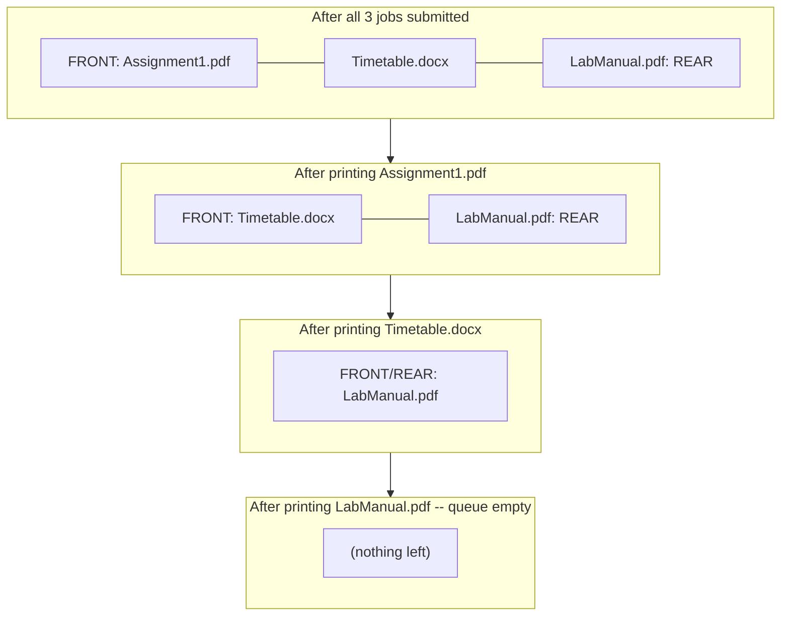
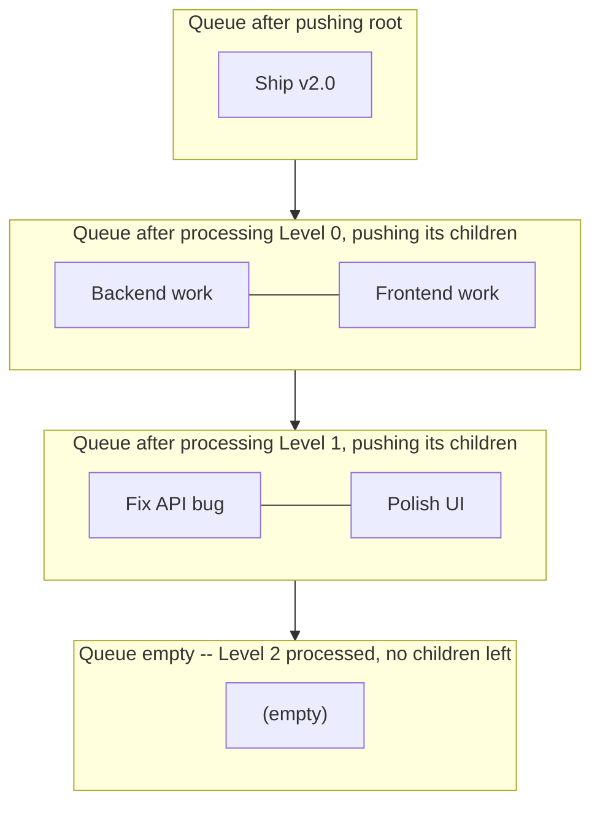
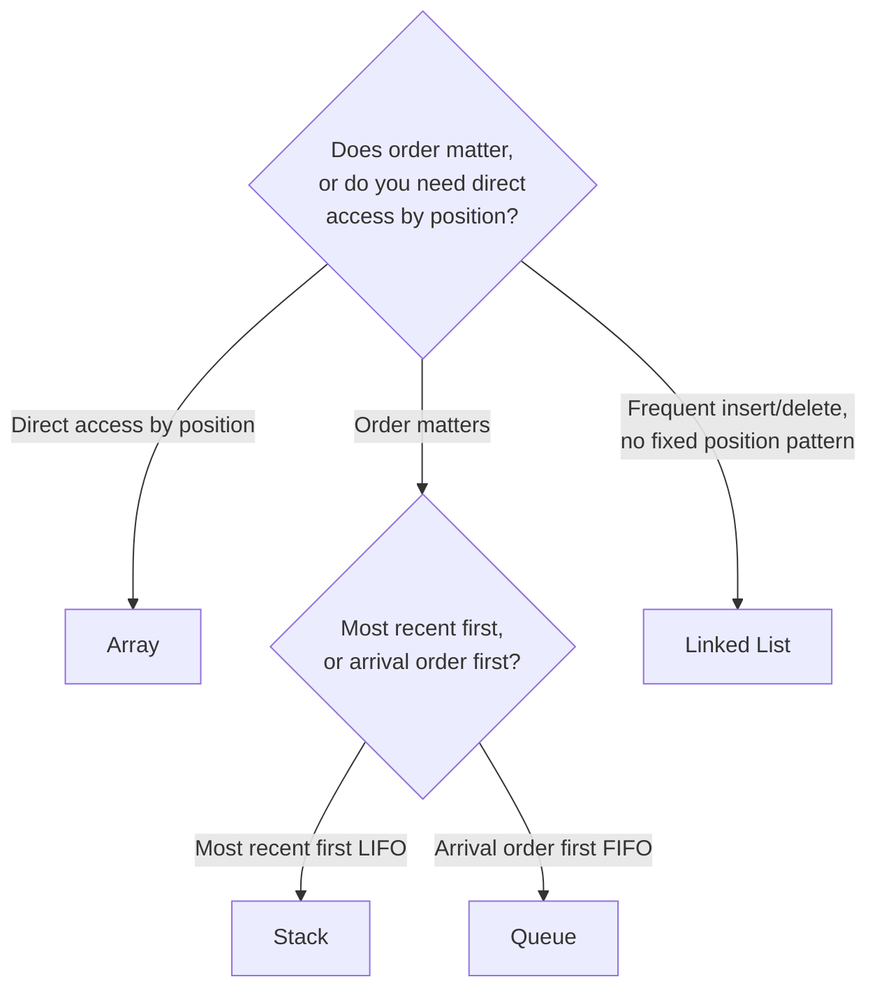

# Lecture 15: Queue Applications and Linear Structure Selection

Unit 4 closes the same way Unit 2 did: with real applications, and a decision framework
for choosing the right tool. Queues turn out to model an enormous range of real systems
— anywhere multiple things compete for one resource and fairness (first come, first
served) matters.

## In This Lecture

- Real applications of queues: scheduling, spoolers, buffers, resource management
- A worked simulation: a print spooler processing jobs in order, with its queue state
  traced step by step
- A second worked application: breadth-first, level-order processing with a queue
- A complete decision framework across every linear structure covered so far

## Job Scheduling

An operating system's CPU scheduler maintains a **ready queue** of processes waiting for
their turn to run. In the simplest scheduling policy (First-Come-First-Served), this is
literally just a queue: `enqueue` when a process becomes ready, `dequeue` when the CPU
picks the next process to run.

## Printer Spoolers

A **print spooler** queues up print jobs from multiple applications (or multiple users on
a shared office printer) and sends them to the physical printer one at a time, in the
order they were submitted — a direct, everyday application of FIFO.

```cpp title="print_spooler.cpp"
#include <iostream>
#include <queue>
#include <string>
using namespace std;

struct PrintJob {
    string documentName;
    int pages;
};

int main() {
    queue<PrintJob> spooler;

    spooler.push({"Assignment1.pdf", 3});
    spooler.push({"Timetable.docx", 1});
    spooler.push({"LabManual.pdf", 12});

    cout << "Printer processing jobs in submission order:" << endl;
    int totalPagesPrinted = 0;
    while (!spooler.empty()) {
        PrintJob job = spooler.front();
        spooler.pop();
        cout << "  Printing \"" << job.documentName << "\" (" << job.pages << " pages)" << endl;
        totalPagesPrinted += job.pages;
    }
    cout << "Total pages printed: " << totalPagesPrinted << endl;

    return 0;
}
```

```text
$ g++ -std=c++17 -o print_spooler print_spooler.cpp
$ ./print_spooler
Printer processing jobs in submission order:
  Printing "Assignment1.pdf" (3 pages)
  Printing "Timetable.docx" (1 pages)
  Printing "LabManual.pdf" (12 pages)
Total pages printed: 16
```

### The Spooler's Queue State, Step by Step

It's worth watching the queue itself shrink from the front as `spooler.pop()` runs,
exactly the FIFO discipline Lecture 13 introduced applied to a real job list:



Whichever job was submitted first is always the one sitting at `front()` — a later job
can never "jump the line" no matter how small it is, which is precisely the fairness
guarantee a real print queue promises its users.

## Router and Network Buffers

A network router receives data packets faster than it can forward them at times of high
traffic — it holds the overflow in a queue (a **buffer**) and forwards packets in the
order they arrived, dropping only if the buffer itself fills up completely. This is the
same circular-queue idea from Lecture 14, sized to the router's available memory.

## Resource Management

Any system where multiple requesters compete for one limited resource — a database
connection pool, a bank of shared printers, a hospital's single MRI machine — uses a
queue to guarantee requests are served fairly, in the order they arrived, rather than
letting requests be handled in an unpredictable order.

## Simulation Applications

Queues are the backbone of **discrete event simulation** — modeling systems like a bank
with multiple tellers and a single customer line, to answer questions like "how many
tellers do we need to keep the average wait under 5 minutes?" without actually opening a
real bank branch to find out.

```cpp title="bank_simulation.cpp"
#include <iostream>
#include <queue>
using namespace std;

int main() {
    queue<int> customerLine;   // each value is that customer's arrival minute

    // Simulate 5 customers arriving at these minutes
    int arrivalTimes[] = {0, 2, 2, 5, 9};
    for (int t : arrivalTimes) customerLine.push(t);

    int teller1FreeAt = 0;
    int totalWaitTime = 0;
    int customerNumber = 1;

    while (!customerLine.empty()) {
        int arrival = customerLine.front();
        customerLine.pop();

        int serviceStart = max(arrival, teller1FreeAt);
        int waitTime = serviceStart - arrival;
        int serviceDuration = 3;   // each customer takes 3 minutes, for this simulation
        teller1FreeAt = serviceStart + serviceDuration;

        cout << "Customer " << customerNumber << " arrives at minute " << arrival
             << ", served at minute " << serviceStart
             << " (waited " << waitTime << " minute(s))" << endl;

        totalWaitTime += waitTime;
        customerNumber++;
    }

    cout << "Average wait time: " << (double)totalWaitTime / 5 << " minutes" << endl;
    return 0;
}
```

```text
$ g++ -std=c++17 -o bank_simulation bank_simulation.cpp
$ ./bank_simulation
Customer 1 arrives at minute 0, served at minute 0 (waited 0 minute(s))
Customer 2 arrives at minute 2, served at minute 3 (waited 1 minute(s))
Customer 3 arrives at minute 2, served at minute 6 (waited 4 minute(s))
Customer 4 arrives at minute 5, served at minute 9 (waited 4 minute(s))
Customer 5 arrives at minute 9, served at minute 12 (waited 3 minute(s))
Average wait time: 2.4 minutes
```

With only one teller, customers who arrive close together (like customers 2 and 3, both
around minute 2) end up waiting — this is exactly the kind of question a real simulation
would explore by re-running with two tellers and comparing the average wait.

## Level-by-Level Processing: Breadth-First Traversal

Every application so far processed a genuinely *linear* list of waiting items. Queues have
a second, less obvious use: processing a **branching** structure one whole level at a time.
Unit 5 (starting with Lecture 16) introduces trees, where a single item can have multiple
children — and a queue turns out to be exactly the right tool for visiting "everything at
depth 0, then everything at depth 1, then depth 2," known as a **breadth-first** or
**level-order** traversal.

The idea: push the root into a queue. Repeatedly dequeue a node, process it, and push
*its* children onto the back of the same queue. Because a queue is FIFO, every node at a
shallower depth is guaranteed to be dequeued (and its children enqueued) before any node
at the next depth down gets processed — the queue naturally enforces the level-by-level
order without any explicit tracking of "which level am I on" logic beyond counting how
many nodes are currently queued.

```cpp title="level_order_tasks.cpp"
#include <iostream>
#include <queue>
#include <string>
using namespace std;

// A small tree of delegated tasks: a manager assigns sub-tasks to team leads,
// who assign further sub-tasks to individual contributors. Processing "level
// by level" (all of the manager's direct tasks, then all of the team leads',
// and so on) is exactly a queue-driven breadth-first traversal.
struct TaskNode {
    string name;
    TaskNode* left;
    TaskNode* right;
    TaskNode(string n) : name(n), left(nullptr), right(nullptr) {}
};

int main() {
    // Build a small task tree by hand:
    //              "Ship v2.0"
    //             /            \
    //     "Backend work"   "Frontend work"
    //       /                     \
    // "Fix API bug"          "Polish UI"
    TaskNode* root = new TaskNode("Ship v2.0");
    root->left = new TaskNode("Backend work");
    root->right = new TaskNode("Frontend work");
    root->left->left = new TaskNode("Fix API bug");
    root->right->right = new TaskNode("Polish UI");

    queue<TaskNode*> pending;
    pending.push(root);

    int level = 0;
    while (!pending.empty()) {
        int countAtThisLevel = pending.size();   // exactly how many nodes are on this level
        cout << "Level " << level << ": ";
        for (int i = 0; i < countAtThisLevel; i++) {
            TaskNode* current = pending.front();
            pending.pop();
            cout << "\"" << current->name << "\" ";
            if (current->left != nullptr) pending.push(current->left);
            if (current->right != nullptr) pending.push(current->right);
        }
        cout << endl;
        level++;
    }

    return 0;
}
```

```text
$ g++ -std=c++17 -o level_order_tasks level_order_tasks.cpp
$ ./level_order_tasks
Level 0: "Ship v2.0" 
Level 1: "Backend work" "Frontend work" 
Level 2: "Fix API bug" "Polish UI" 
```



The key line is `int countAtThisLevel = pending.size();`, captured *before* the inner loop
starts. Without it, the loop would have no way to know where one level ends and the next
begins — new children are being pushed onto the very same queue *while* the current
level's nodes are still being popped off of it, so "snapshotting" the size first is what
keeps the levels from bleeding into each other. This exact pattern — a queue driving a
breadth-first walk over a branching structure — reappears throughout Unit 5 whenever a
tree or graph needs to be processed level by level rather than depth by depth.

## Selecting Appropriate Linear Data Structures

Units 2 through 4 covered four linear structures. Here's the complete decision table:

| Structure | Access pattern | Use it when... |
|---|---|---|
| **Array** | Random access by index | You need fast lookups by position and size is roughly known |
| **Linked List** | Sequential, either direction (if doubly linked) | You insert/delete often, especially not at a known index |
| **Stack** | LIFO — one end only | The most recent item must be handled first (undo, function calls, backtracking) |
| **Queue** | FIFO — add at rear, remove at front | Items must be handled in the exact order they arrived (scheduling, buffers) |



## Problem Solving Using Linear Structures

When facing a new problem, ask: *does this problem inherently process things in a
specific order?* "Undo the last action" is a stack question. "Handle requests in the
order they arrived" is a queue question. "I need to jump straight to the 500th record" is
an array question. Recognizing which category a problem falls into is most of the work —
the implementation, as you've now seen four times over, tends to follow directly once the
right structure is chosen.

## Try It Yourself

1. Modify `bank_simulation.cpp` to use **two** tellers instead of one (track
   `teller1FreeAt` and `teller2FreeAt`, and always assign the next customer to whichever
   teller is free soonest). Re-run it and compare the new average wait time to the
   single-teller result above.
2. For each of the following, name the single best-fitting linear structure from this
   unit and justify it in one sentence: (a) a text editor's redo feature, (b) a
   ride-sharing app matching drivers to the *next* rider in a busy area, (c) storing a
   fixed-size window of the last 10 sensor readings, where the oldest reading is
   discarded as each new one arrives.
3. Extend `level_order_tasks.cpp` so that `TaskNode` has a third child pointer (making it
   no longer strictly binary), and update the traversal loop to push all three children
   when present. Add a fourth level to the task tree and confirm the level-order output
   still prints one clean line per depth.
4. Modify `level_order_tasks.cpp` to also print, on each level's line, how many total
   nodes have been processed *so far* (a running count across all levels, not just the
   current one). This is the same running-total pattern the bank simulation used for
   `totalWaitTime`.
5. Trace by hand what would go wrong in `level_order_tasks.cpp` if the line
   `int countAtThisLevel = pending.size();` were deleted and the inner `for` loop instead
   ran `for (int i = 0; i < pending.size(); i++)` directly (re-checking `pending.size()`
   on every iteration, after children have already been pushed). Then make that change and
   run it to confirm your prediction.

## Key Takeaways

- Queues model **any** real system where multiple things wait their turn for one shared
  resource, in arrival order: CPU scheduling, print spoolers, network buffers, and
  simulations of real-world waiting lines.
- Discrete event simulation is a genuine, widely-used application of queues — modeling a
  system's behavior over time without needing to build the real thing.
- A queue isn't only for linear waiting lines — pushing a branching structure's root and
  repeatedly dequeuing-then-enqueuing-its-children produces a **breadth-first,
  level-order traversal**, visiting everything at one depth before moving to the next.
  Snapshotting `size()` before each level's inner loop is what keeps levels from bleeding
  into each other, since children are pushed onto the same queue mid-loop.
- The choice among array, linked list, stack, and queue comes down to one question: what
  *access pattern* does the problem actually need — random access, frequent
  insert/delete, most-recent-first, or arrival-order-first?
- This closes the four linear structures of Units 2–4. Unit 5 moves to **non-linear**
  structures — trees — where an element can connect to more than just "the next one," and
  where this lecture's level-order traversal returns as one of the standard ways to walk
  a tree.
