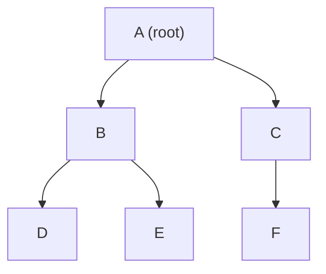
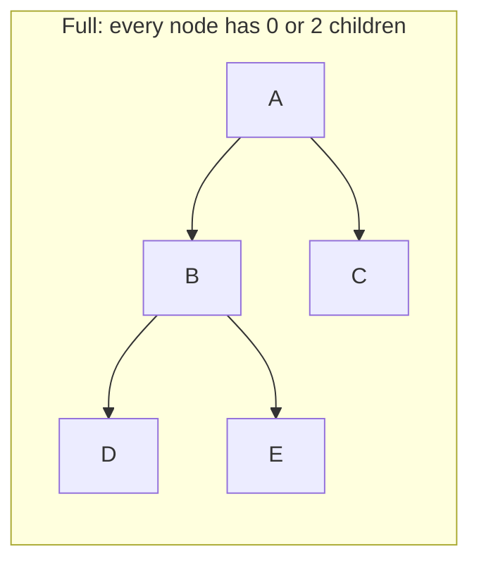
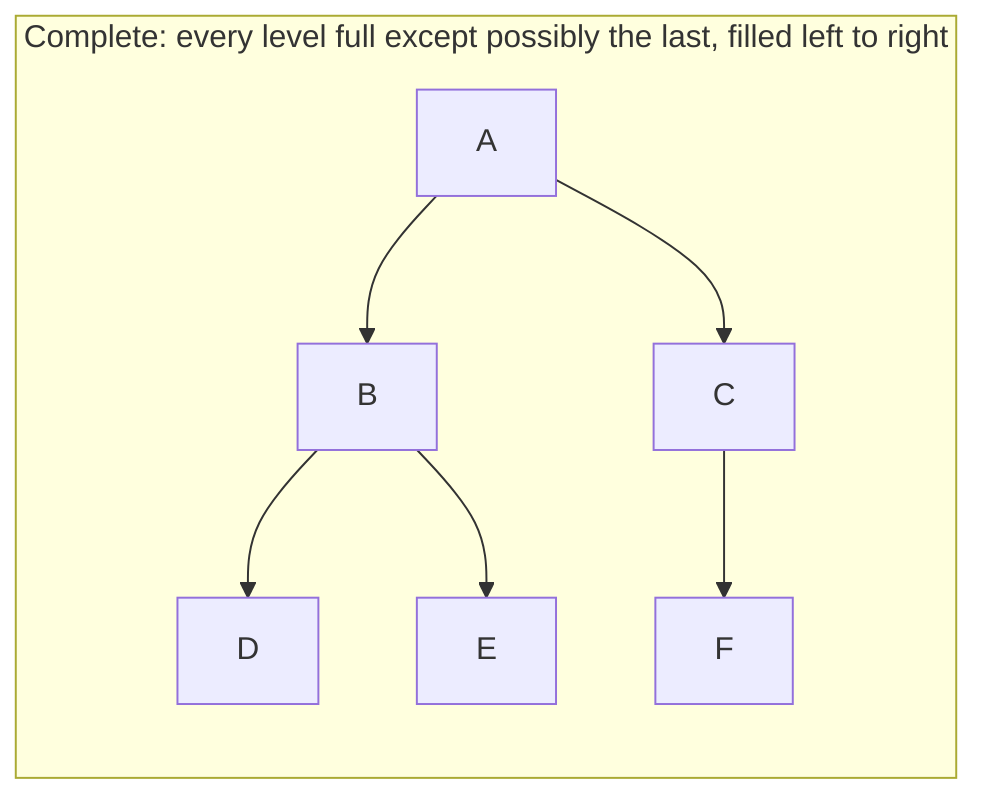
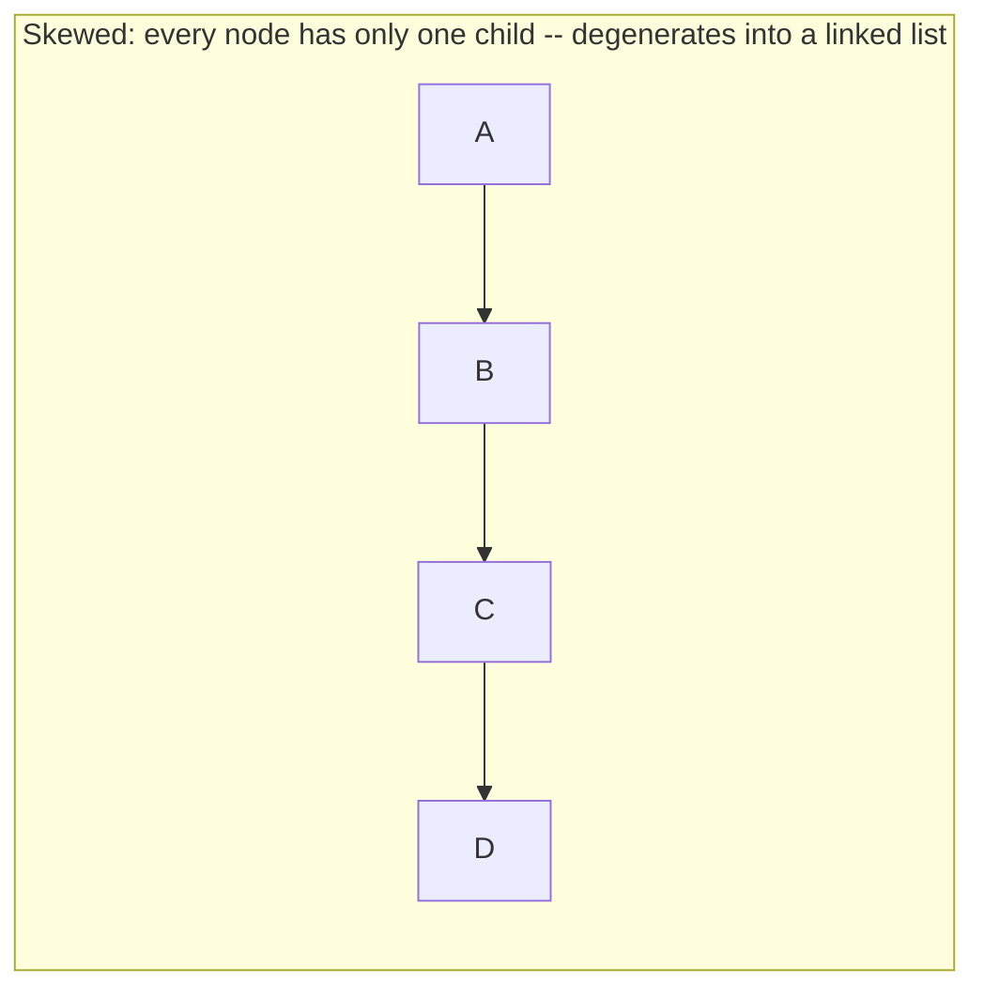

# Lecture 16: Trees and General Trees

Every structure so far — array, linked list, stack, queue — is **linear**: each element
connects to at most one "next" and one "previous." A **tree** breaks that restriction
completely: one element can branch into many children at once. This is Unit 5's subject,
and it's the structure behind file systems, org charts, decision-making, and (once you
add ordering rules in Lecture 20) fast searching.

## In This Lecture

- Why non-linear structures are needed at all
- The tree concept and its full terminology
- Binary trees specifically: their properties and the three shapes they can take
- Two ways to represent a binary tree in memory: array-based and linked

## The Need for Non-Linear Data Structures

A file system is the clearest everyday example of why linear structures aren't enough: a
folder can contain many subfolders, each of which can contain many more. There is no
single "next" folder — there's a whole branching hierarchy. Representing that naturally
requires a structure where one element can have *multiple* children, not just one.

## The Tree Concept and Terminology

A **tree** is a hierarchical, non-linear structure made of **nodes** connected by
**edges**, with one special node — the **root** — that has no parent, and every other
node reachable from the root by exactly one path.



| Term | Meaning |
|---|---|
| **Root** | The one node with no parent — the top of the tree (`A` above) |
| **Node** | Any single element in the tree |
| **Edge** | The connection between a parent and a child |
| **Parent** | A node with at least one child (`A` is the parent of `B` and `C`) |
| **Child** | A node directly connected below another (`B` and `C` are children of `A`) |
| **Sibling** | Nodes sharing the same parent (`B` and `C` are siblings) |
| **Leaf node** | A node with no children (`D`, `E`, `F` above) |
| **Internal node** | A node with at least one child (`A`, `B`, `C` above) |
| **Degree** | The number of children a node has (`A` has degree 2, `D` has degree 0) |
| **Depth** (of a node) | The number of edges from the root down to that node (`A` is depth 0, `B`/`C` are depth 1) |
| **Height** (of the tree) | The number of edges on the longest path from root to a leaf (height 2 above) |
| **Subtree** | Any node together with all of its descendants, treated as a tree in its own right |

A **general tree** places no limit on how many children a node can have — a file system
folder might contain 2 subfolders or 200. Binary trees, the rest of this unit's main
focus, add exactly one restriction to make analysis dramatically simpler.

## Introduction to Tree Representation

## Binary Tree Concept and Properties

A **binary tree** restricts every node to **at most two children**, conventionally called
the **left child** and the **right child**. This one restriction is what makes binary
trees so central to computer science — most of the tree algorithms in this unit
(traversal, search, balancing) are built around exactly two children per node.

- A binary tree with `n` nodes has exactly `n - 1` edges (every node except the root has
  exactly one edge connecting it to its parent).
- The maximum number of nodes at depth `d` is `2^d` (1 node at depth 0, up to 2 at depth
  1, up to 4 at depth 2, and so on).

## Types of Binary Trees







- **Full binary tree** — every node has either exactly 0 or exactly 2 children, never 1.
- **Complete binary tree** — every level is completely filled except possibly the last,
  which fills strictly left to right with no gaps. (This shape is exactly what Lecture 23's
  heap requires.)
- **Skewed binary tree** — every node has only one child, all leaning the same direction —
  structurally this is just a linked list wearing a tree's clothing, and it's the *worst*
  case shape for search performance, as Lecture 21 will show.

## Sequential (Array) Representation of Binary Trees

For a **complete** binary tree specifically, you can store every node in a plain array,
using arithmetic instead of pointers to find parents and children — the same trick a heap
(Lecture 23) relies on:

```text
For a node stored at index i (0-based):
  left child index  = 2*i + 1
  right child index = 2*i + 2
  parent index       = (i - 1) / 2   (integer division)
```

```cpp title="array_tree.cpp"
#include <iostream>
#include <vector>
using namespace std;

int main() {
    // A complete binary tree, stored level by level, left to right:
    //         1
    //       /   \
    //      2     3
    //     / \   /
    //    4   5 6
    vector<int> tree = {1, 2, 3, 4, 5, 6};

    for (int i = 0; i < tree.size(); i++) {
        cout << "Node " << tree[i] << " (index " << i << "): ";
        int leftIdx = 2 * i + 1;
        int rightIdx = 2 * i + 2;
        if (leftIdx < tree.size()) cout << "left child = " << tree[leftIdx] << " ";
        if (rightIdx < tree.size()) cout << "right child = " << tree[rightIdx] << " ";
        if (leftIdx >= tree.size() && rightIdx >= tree.size()) cout << "(leaf)";
        cout << endl;
    }
    return 0;
}
```

```text
$ g++ -std=c++17 -o array_tree array_tree.cpp
$ ./array_tree
Node 1 (index 0): left child = 2 right child = 3 
Node 2 (index 1): left child = 4 right child = 5 
Node 3 (index 2): left child = 6 
Node 4 (index 3): (leaf)
Node 5 (index 4): (leaf)
Node 6 (index 5): (leaf)
```

This representation is compact and cache-friendly — but it only stays efficient for
*complete* trees. A skewed tree stored this way would waste enormous amounts of array
space on empty gaps, since a node's position depends on where it would sit in a complete
tree, not just how many nodes actually exist.

## Linked Representation of Binary Trees

The more general and far more common representation uses nodes with explicit pointers,
exactly the same idea as a linked list, but with *two* "next" pointers instead of one.

```cpp title="linked_tree.cpp"
#include <iostream>
using namespace std;

struct TreeNode {
    int data;
    TreeNode* left;
    TreeNode* right;
    TreeNode(int value) : data(value), left(nullptr), right(nullptr) {}
};

int main() {
    // Build the same tree by hand:
    //         1
    //       /   \
    //      2     3
    //     / \   /
    //    4   5 6
    TreeNode* root = new TreeNode(1);
    root->left = new TreeNode(2);
    root->right = new TreeNode(3);
    root->left->left = new TreeNode(4);
    root->left->right = new TreeNode(5);
    root->right->left = new TreeNode(6);

    cout << "Root: " << root->data << endl;
    cout << "Root's left child: " << root->left->data << endl;
    cout << "Root's right child: " << root->right->data << endl;
    cout << "Root's left-left grandchild: " << root->left->left->data << endl;
    cout << "Root's right child has a right child? "
         << (root->right->right == nullptr ? "no" : "yes") << endl;

    return 0;
}
```

```text
$ g++ -std=c++17 -o linked_tree linked_tree.cpp
$ ./linked_tree
Root: 1
Root's left child: 2
Root's right child: 3
Root's left-left grandchild: 4
Root's right child has a right child? no
```

| | Array representation | Linked representation |
|---|---|---|
| Best for | Complete binary trees (e.g., heaps) | Any binary tree shape, including skewed |
| Memory | Compact, no pointer overhead — but wastes space on incomplete trees | One node per element, plus two pointers each |
| Finding a child | O(1) arithmetic | O(1) pointer dereference |

Every remaining lecture in this unit uses the **linked representation**, since it handles
any tree shape without wasted space — the array representation returns specifically for
the heap in Lecture 23, where completeness is guaranteed by construction.

## Try It Yourself

1. Draw (on paper) the general tree from the terminology diagram, and label every node
   with its depth and its degree.
2. Extend `linked_tree.cpp` to add one more level to the tree (give node `4` two children,
   `7` and `8`), and print their values by walking `root->left->left->left` and
   `root->left->left->right`.

## Key Takeaways

- A **tree** is a hierarchical, non-linear structure — one node can have multiple
  children, unlike every linear structure covered so far.
- Core terminology — root, parent, child, sibling, leaf, depth, height, subtree — will be
  used throughout the rest of this unit without re-explanation.
- A **binary tree** restricts every node to at most two children; it can be **full**,
  **complete**, or **skewed**, and its shape directly affects how efficiently it can be
  searched (Lecture 21).
- The **array representation** is compact but only efficient for complete trees; the
  **linked representation** handles any shape and is what the rest of this unit builds on.
