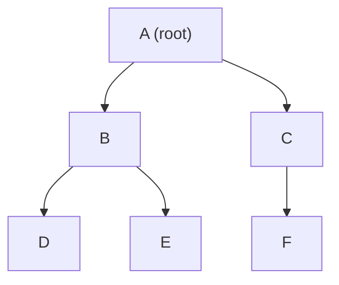
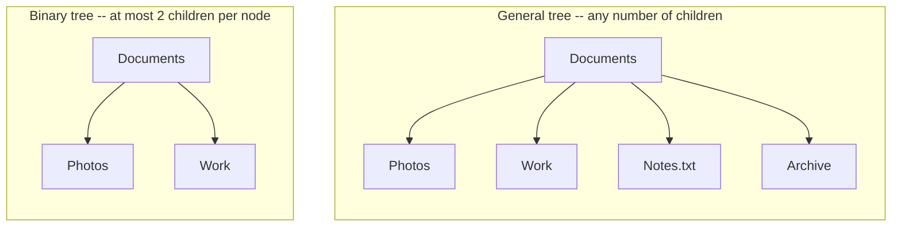
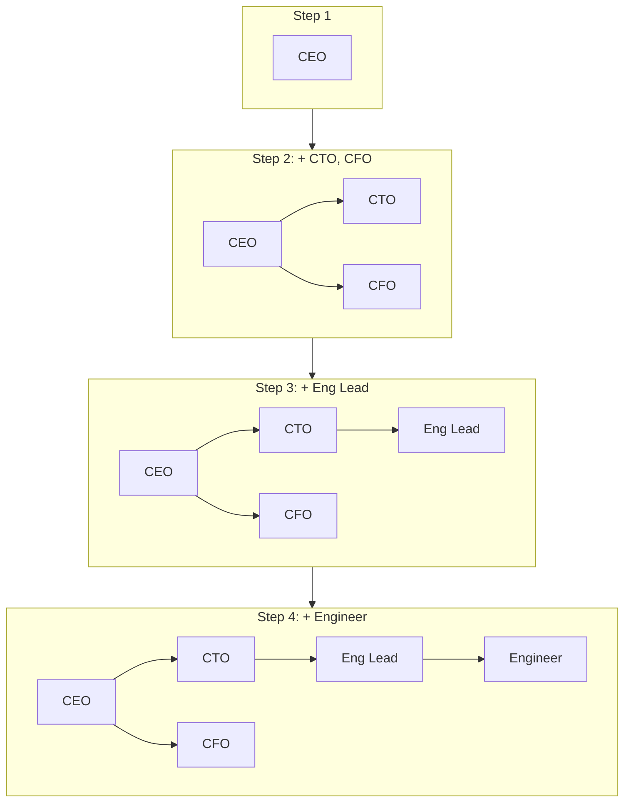
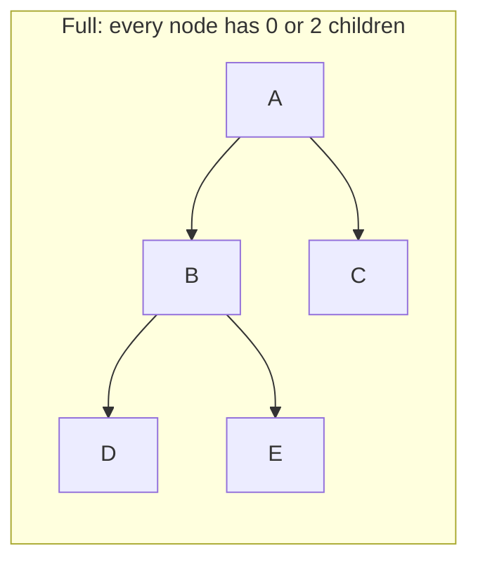
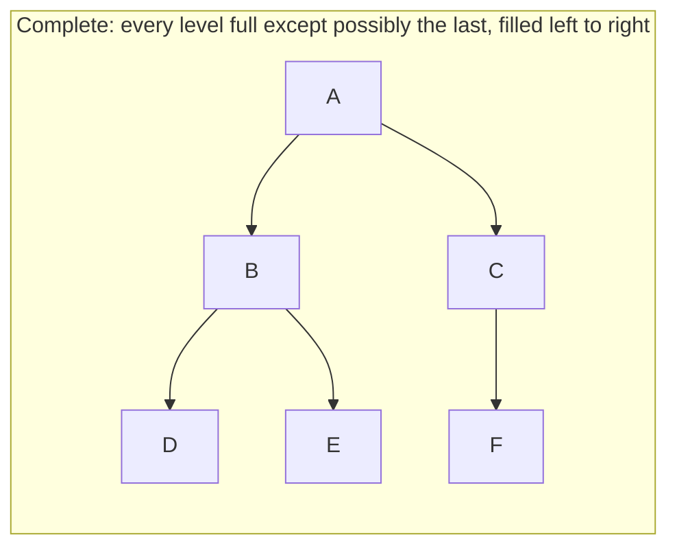
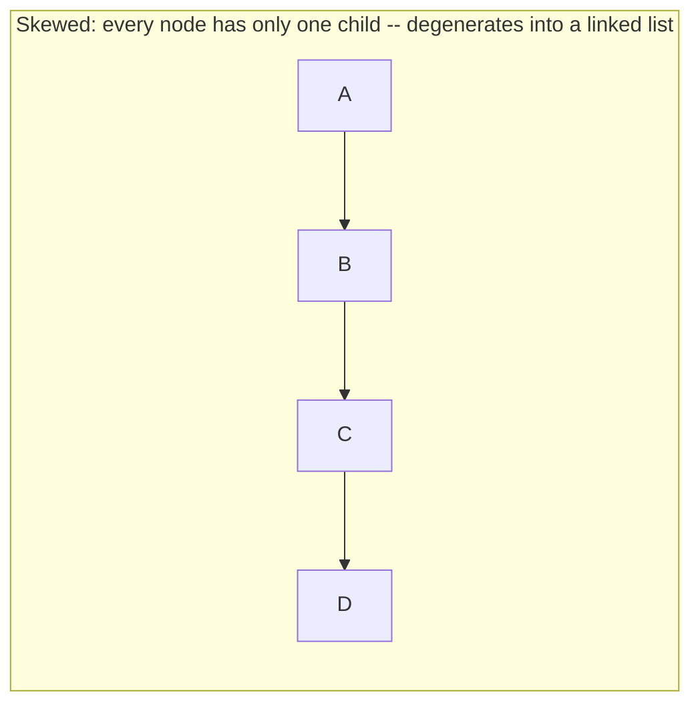
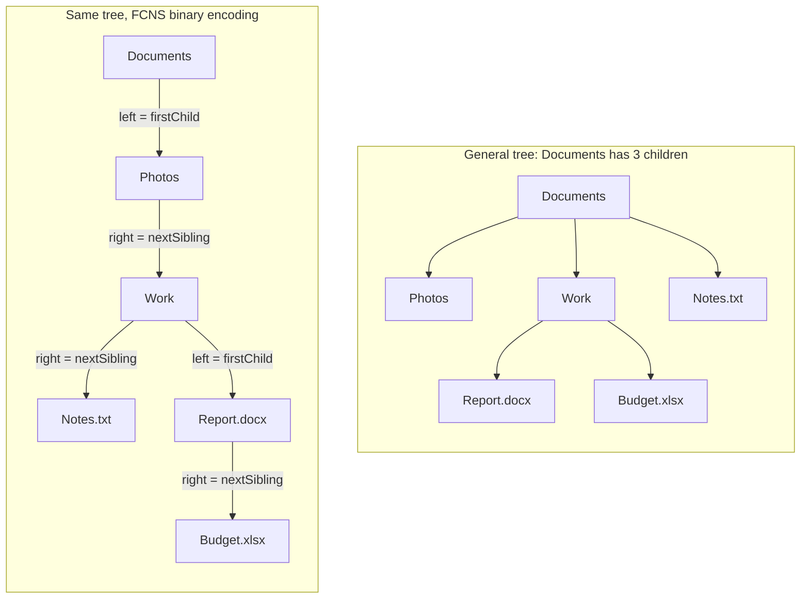

# Lecture 16: Trees and General Trees

Every structure so far — array, linked list, stack, queue — is **linear**: each element
connects to at most one "next" and one "previous." A **tree** breaks that restriction
completely: one element can branch into many children at once. This is Unit 5's subject,
and it's the structure behind file systems, org charts, decision-making, and (once you
add ordering rules in Lecture 20) fast searching.

## In This Lecture

- Why non-linear structures are needed at all
- The tree concept and its full terminology
- Building a tree by hand, node by node, and watching its shape grow at each step
- Binary trees specifically: their properties and the three shapes they can take
- Two ways to represent a binary tree in memory: array-based and linked
- How a **general** tree (unlimited children per node) can still be represented as a
  binary tree, using the first-child/next-sibling trick
- Where trees show up in real software: file systems, org charts, the DOM, and more

## The Need for Non-Linear Data Structures

A file system is the clearest everyday example of why linear structures aren't enough: a
folder can contain many subfolders, each of which can contain many more. There is no
single "next" folder — there's a whole branching hierarchy. Representing that naturally
requires a structure where one element can have *multiple* children, not just one.

## The Tree Concept and Terminology

A **tree** is a hierarchical, non-linear structure made of **nodes** connected by
**edges**, with one special node — the **root** — that has no parent, and every other
node reachable from the root by exactly one path.



| Term | Meaning |
|---|---|
| **Root** | The one node with no parent — the top of the tree (`A` above) |
| **Node** | Any single element in the tree |
| **Edge** | The connection between a parent and a child |
| **Parent** | A node with at least one child (`A` is the parent of `B` and `C`) |
| **Child** | A node directly connected below another (`B` and `C` are children of `A`) |
| **Sibling** | Nodes sharing the same parent (`B` and `C` are siblings) |
| **Leaf node** | A node with no children (`D`, `E`, `F` above) |
| **Internal node** | A node with at least one child (`A`, `B`, `C` above) |
| **Degree** | The number of children a node has (`A` has degree 2, `D` has degree 0) |
| **Depth** (of a node) | The number of edges from the root down to that node (`A` is depth 0, `B`/`C` are depth 1) |
| **Height** (of the tree) | The number of edges on the longest path from root to a leaf (height 2 above) |
| **Subtree** | Any node together with all of its descendants, treated as a tree in its own right |

A **general tree** places no limit on how many children a node can have — a file system
folder might contain 2 subfolders or 200. Binary trees, the rest of this unit's main
focus, add exactly one restriction to make analysis dramatically simpler.

## Introduction to Tree Representation

Before looking at how a tree is stored in memory, it helps to see two things concretely:
how a general tree's shape differs structurally from a binary tree's, and how a tree
actually comes into being — one node, and one pointer assignment, at a time.

### General Tree vs. Binary Tree, Side by Side



`Documents` in the general tree on the left has **four** children — perfectly normal for a
file system folder. That same node in a binary tree could have at most **two** — there is
no third or fourth pointer to use. This isn't just a cosmetic difference: it's the reason
binary trees need a completely different strategy (covered later in this lecture) to
represent something like a general tree's unlimited branching at all.

### Building a Tree, Node by Node

A tree doesn't spring into existence fully formed — it's built one `new TreeNode(...)` and
one pointer assignment at a time, exactly the way a linked list was in Lecture 5. Watching
the shape grow, step by step, makes the earlier terminology (parent, child, depth, height)
concrete rather than abstract.

```cpp title="tree_build_step_by_step.cpp"
#include <iostream>
#include <string>
using namespace std;

struct TreeNode {
    string data;
    TreeNode* left;
    TreeNode* right;
    TreeNode(string value) : data(value), left(nullptr), right(nullptr) {}
};

// Prints the tree sideways, root on the left, so its shape is readable in a
// terminal: indentation shows depth, and each node prints under its parent.
void printSideways(TreeNode* node, int depth = 0) {
    if (node == nullptr) return;
    printSideways(node->right, depth + 1);
    cout << string(depth * 4, ' ') << node->data << endl;
    printSideways(node->left, depth + 1);
}

int main() {
    // Step 1: just the root.
    TreeNode* root = new TreeNode("CEO");
    cout << "Step 1: insert root\n";
    printSideways(root);

    // Step 2: give the CEO two direct reports.
    root->left = new TreeNode("CTO");
    root->right = new TreeNode("CFO");
    cout << "\nStep 2: insert CTO (left) and CFO (right) under CEO\n";
    printSideways(root);

    // Step 3: the CTO gets a report of their own.
    root->left->left = new TreeNode("Eng Lead");
    cout << "\nStep 3: insert Eng Lead under CTO\n";
    printSideways(root);

    // Step 4: the Eng Lead gets a report too -- three levels deep now.
    root->left->left->left = new TreeNode("Engineer");
    cout << "\nStep 4: insert Engineer under Eng Lead\n";
    printSideways(root);

    cout << "\nFinal height (edges from root to deepest leaf): 3" << endl;

    return 0;
}
```

```text
$ g++ -std=c++17 -o tree_build_step_by_step tree_build_step_by_step.cpp
$ ./tree_build_step_by_step
Step 1: insert root
CEO

Step 2: insert CTO (left) and CFO (right) under CEO
    CFO
CEO
    CTO

Step 3: insert Eng Lead under CTO
    CFO
CEO
    CTO
        Eng Lead

Step 4: insert Engineer under Eng Lead
    CFO
CEO
    CTO
        Eng Lead
            Engineer

Final height (edges from root to deepest leaf): 3
```

Each step is a single, tiny operation — allocate a `TreeNode`, then point an existing
node's `left` or `right` at it — but the *cumulative* effect after four steps is a
three-level-deep hierarchy. The same diagrammed-step approach applies to any tree, no
matter how large: it's always built from this one primitive, repeated.



!!! note "printSideways is not a traversal algorithm you need to memorize yet"
    `printSideways` recurses right-before-left specifically so the tree reads top-to-bottom
    on screen the same way it would look rotated 90° on paper. It's a visualization trick
    for this lecture, not one of the traversal orders (preorder, inorder, postorder) that
    Lecture 17 formally introduces — don't confuse the two.

## Binary Tree Concept and Properties

A **binary tree** restricts every node to **at most two children**, conventionally called
the **left child** and the **right child**. This one restriction is what makes binary
trees so central to computer science — most of the tree algorithms in this unit
(traversal, search, balancing) are built around exactly two children per node.

- A binary tree with `n` nodes has exactly `n - 1` edges (every node except the root has
  exactly one edge connecting it to its parent).
- The maximum number of nodes at depth `d` is `2^d` (1 node at depth 0, up to 2 at depth
  1, up to 4 at depth 2, and so on).

## Types of Binary Trees







- **Full binary tree** — every node has either exactly 0 or exactly 2 children, never 1.
- **Complete binary tree** — every level is completely filled except possibly the last,
  which fills strictly left to right with no gaps. (This shape is exactly what Lecture 23's
  heap requires.)
- **Skewed binary tree** — every node has only one child, all leaning the same direction —
  structurally this is just a linked list wearing a tree's clothing, and it's the *worst*
  case shape for search performance, as Lecture 21 will show.

## Sequential (Array) Representation of Binary Trees

For a **complete** binary tree specifically, you can store every node in a plain array,
using arithmetic instead of pointers to find parents and children — the same trick a heap
(Lecture 23) relies on:

```text
For a node stored at index i (0-based):
  left child index  = 2*i + 1
  right child index = 2*i + 2
  parent index       = (i - 1) / 2   (integer division)
```

```cpp title="array_tree.cpp"
#include <iostream>
#include <vector>
using namespace std;

int main() {
    // A complete binary tree, stored level by level, left to right:
    //         1
    //       /   \
    //      2     3
    //     / \   /
    //    4   5 6
    vector<int> tree = {1, 2, 3, 4, 5, 6};

    for (int i = 0; i < tree.size(); i++) {
        cout << "Node " << tree[i] << " (index " << i << "): ";
        int leftIdx = 2 * i + 1;
        int rightIdx = 2 * i + 2;
        if (leftIdx < tree.size()) cout << "left child = " << tree[leftIdx] << " ";
        if (rightIdx < tree.size()) cout << "right child = " << tree[rightIdx] << " ";
        if (leftIdx >= tree.size() && rightIdx >= tree.size()) cout << "(leaf)";
        cout << endl;
    }
    return 0;
}
```

```text
$ g++ -std=c++17 -o array_tree array_tree.cpp
$ ./array_tree
Node 1 (index 0): left child = 2 right child = 3 
Node 2 (index 1): left child = 4 right child = 5 
Node 3 (index 2): left child = 6 
Node 4 (index 3): (leaf)
Node 5 (index 4): (leaf)
Node 6 (index 5): (leaf)
```

This representation is compact and cache-friendly — but it only stays efficient for
*complete* trees. A skewed tree stored this way would waste enormous amounts of array
space on empty gaps, since a node's position depends on where it would sit in a complete
tree, not just how many nodes actually exist.

## Linked Representation of Binary Trees

The more general and far more common representation uses nodes with explicit pointers,
exactly the same idea as a linked list, but with *two* "next" pointers instead of one.

```cpp title="linked_tree.cpp"
#include <iostream>
using namespace std;

struct TreeNode {
    int data;
    TreeNode* left;
    TreeNode* right;
    TreeNode(int value) : data(value), left(nullptr), right(nullptr) {}
};

int main() {
    // Build the same tree by hand:
    //         1
    //       /   \
    //      2     3
    //     / \   /
    //    4   5 6
    TreeNode* root = new TreeNode(1);
    root->left = new TreeNode(2);
    root->right = new TreeNode(3);
    root->left->left = new TreeNode(4);
    root->left->right = new TreeNode(5);
    root->right->left = new TreeNode(6);

    cout << "Root: " << root->data << endl;
    cout << "Root's left child: " << root->left->data << endl;
    cout << "Root's right child: " << root->right->data << endl;
    cout << "Root's left-left grandchild: " << root->left->left->data << endl;
    cout << "Root's right child has a right child? "
         << (root->right->right == nullptr ? "no" : "yes") << endl;

    return 0;
}
```

```text
$ g++ -std=c++17 -o linked_tree linked_tree.cpp
$ ./linked_tree
Root: 1
Root's left child: 2
Root's right child: 3
Root's left-left grandchild: 4
Root's right child has a right child? no
```

| | Array representation | Linked representation |
|---|---|---|
| Best for | Complete binary trees (e.g., heaps) | Any binary tree shape, including skewed |
| Memory | Compact, no pointer overhead — but wastes space on incomplete trees | One node per element, plus two pointers each |
| Finding a child | O(1) arithmetic | O(1) pointer dereference |

Every remaining lecture in this unit uses the **linked representation**, since it handles
any tree shape without wasted space — the array representation returns specifically for
the heap in Lecture 23, where completeness is guaranteed by construction.

## Representing a General Tree as a Binary Tree

The `Documents` folder from earlier had four children — something a `TreeNode` with only
`left` and `right` genuinely cannot store directly. And yet real systems (including the
file system itself) very often implement general trees using nothing but two-pointer
nodes. The trick, called **first-child/next-sibling (FCNS)** representation, reinterprets
what `left` and `right` *mean*:

- `left` no longer means "smaller child" or "left child" — it means **this node's first
  child**.
- `right` no longer means "second child" — it means **this node's next sibling** (the
  next child of *this node's own parent*).



A node's full list of children, in the FCNS encoding, is recovered by starting at
`firstChild` and walking `nextSibling` pointers until hitting `nullptr` — exactly like
traversing a linked list. `Documents`'s three children (`Photos`, `Work`, `Notes.txt`)
become a **sibling chain** hanging off `Documents->left`, not three separate pointers out
of `Documents` itself.

```cpp title="general_to_binary.cpp"
#include <iostream>
#include <string>
#include <vector>
using namespace std;

// A general tree node: any number of children, stored directly in a vector.
struct GeneralNode {
    string name;
    vector<GeneralNode*> children;
    GeneralNode(string n) : name(n) {}
};

// The SAME tree, represented as a binary tree using the classic
// "first child / next sibling" trick:
//   left  = this node's FIRST child
//   right = this node's NEXT SIBLING (i.e. the next child of ITS parent)
struct FCNSNode {
    string name;
    FCNSNode* firstChild;
    FCNSNode* nextSibling;
    FCNSNode(string n) : name(n), firstChild(nullptr), nextSibling(nullptr) {}
};

// Recursively converts a general-tree node (and all its children/descendants)
// into the equivalent first-child/next-sibling binary node.
FCNSNode* convert(GeneralNode* node) {
    if (node == nullptr) return nullptr;
    FCNSNode* converted = new FCNSNode(node->name);
    if (!node->children.empty()) {
        converted->firstChild = convert(node->children[0]);
        FCNSNode* sibling = converted->firstChild;
        for (size_t i = 1; i < node->children.size(); i++) {
            sibling->nextSibling = convert(node->children[i]);
            sibling = sibling->nextSibling;
        }
    }
    return converted;
}

// Proves the conversion is lossless: walks the FCNS binary tree and
// reconstructs each node's full list of children by following nextSibling.
void printReconstructed(FCNSNode* node, int depth = 0) {
    if (node == nullptr) return;
    cout << string(depth * 2, ' ') << node->name << endl;
    FCNSNode* child = node->firstChild;
    while (child != nullptr) {
        printReconstructed(child, depth + 1);
        child = child->nextSibling;
    }
}

int main() {
    // A general tree with a node ("Documents") that has THREE children --
    // something a binary tree node cannot represent directly.
    GeneralNode* root = new GeneralNode("Documents");
    GeneralNode* photos = new GeneralNode("Photos");
    GeneralNode* work = new GeneralNode("Work");
    GeneralNode* notes = new GeneralNode("Notes.txt");
    root->children = {photos, work, notes};
    work->children = {new GeneralNode("Report.docx"), new GeneralNode("Budget.xlsx")};

    cout << "Documents has " << root->children.size() << " children directly -- "
         << "impossible for a plain binary tree node." << endl;

    FCNSNode* binaryRoot = convert(root);

    cout << "\nReconstructed by walking the binary (FCNS) tree's left/right pointers:\n";
    printReconstructed(binaryRoot);

    cout << "\nIn the binary encoding: Documents->left = "
         << binaryRoot->firstChild->name
         << " (first child), Documents->left->right = "
         << binaryRoot->firstChild->nextSibling->name
         << " (next sibling of Photos)" << endl;

    return 0;
}
```

```text
$ g++ -std=c++17 -o general_to_binary general_to_binary.cpp
$ ./general_to_binary
Documents has 3 children directly -- impossible for a plain binary tree node.

Reconstructed by walking the binary (FCNS) tree's left/right pointers:
Documents
  Photos
  Work
    Report.docx
    Budget.xlsx
  Notes.txt

In the binary encoding: Documents->left = Photos (first child), Documents->left->right = Work (next sibling of Photos)
```

`printReconstructed` never once looks at a `children` vector — it only ever follows
`firstChild` and `nextSibling`, yet it reproduces the *exact* original structure,
including `Work`'s two children. That's the proof the encoding is lossless: any general
tree, no matter how many children a node has, can be represented with ordinary two-pointer
binary tree nodes, at the cost of trading "direct child access" for "walk a sibling
chain."

!!! note "Why this matters beyond a classroom exercise"
    FCNS representation is exactly how the classic Unix filesystem's in-memory tree and
    many XML/DOM libraries have historically been implemented internally — a `TreeNode`
    with `firstChild`/`nextSibling` pointers uses less memory per node than a node holding
    a resizable list of child pointers (like `vector<GeneralNode*>` above), because it
    needs only two fixed-size pointers regardless of how many children a node actually
    has.

## Real-World Applications of Trees

| Application | What the tree represents | Why a tree (not a list)? |
|---|---|---|
| **File systems** | Each folder is a node; its files and subfolders are its children | A folder can hold any number of items, and navigation is naturally hierarchical (`cd` into a child, `cd ..` back to a parent) |
| **Organization charts** | Each employee is a node; direct reports are children | Authority and reporting lines are inherently hierarchical — a manager's "next" isn't one person, it's a whole team |
| **The DOM (web pages)** | Each HTML element is a node; nested elements are children | A `<div>` can contain any number of child elements, each of which can contain more — rendering, styling, and event propagation all walk this tree |
| **Decision trees** | Each internal node is a yes/no (or multi-way) question; leaves are outcomes | Each answer branches to a completely different next question — a linear list can't represent "different paths depending on the answer" |
| **Compilers (syntax trees)** | Each node is an expression or statement; children are its sub-expressions | `a + b * c` naturally nests `b * c` inside the addition — the *structure* of the expression is a tree by definition |

Every one of these shares the same underlying shape this lecture introduced: one root,
parent-child edges, and (except for file systems and the DOM, which are general trees) the
node connections following whatever domain-specific rule the application needs. Recognizing
"this data is naturally hierarchical, not sequential" is the signal that a tree — not an
array, linked list, stack, or queue — is the right structure to reach for.

## Try It Yourself

1. Draw (on paper) the general tree from the terminology diagram, and label every node
   with its depth and its degree.
2. Extend `linked_tree.cpp` to add one more level to the tree (give node `4` two children,
   `7` and `8`), and print their values by walking `root->left->left->left` and
   `root->left->left->right`.
3. Extend `tree_build_step_by_step.cpp` with a "Step 5" that gives `CFO` a child of its
   own (e.g. `"Controller"`), and add a `printSideways` call after it. Confirm the new
   node appears in the correct position relative to `CEO` and `CTO`'s branch.
4. Modify `tree_build_step_by_step.cpp`'s `main` to compute and print the tree's height
   after each step (count the longest root-to-leaf path by hand for each step, then check
   your count against the printed shape) rather than hardcoding `Final height: 3` only at
   the end.
5. Extend `general_to_binary.cpp` so `Photos` also has two children of its own (e.g.
   `"Vacation"` and `"Family"`). Re-run it and confirm `printReconstructed` still recovers
   every node correctly — trace by hand first which `firstChild`/`nextSibling` pointers
   change before checking the real output.
6. For each application in the real-world applications table, name one operation that
   would be *hard* to do efficiently if that data were instead stored as a single flat
   array or linked list (for example: "finding all files inside a specific folder" for the
   file system row).

## Key Takeaways

- A **tree** is a hierarchical, non-linear structure — one node can have multiple
  children, unlike every linear structure covered so far.
- Core terminology — root, parent, child, sibling, leaf, depth, height, subtree — will be
  used throughout the rest of this unit without re-explanation.
- A tree is built incrementally, one `new TreeNode(...)` and one pointer assignment at a
  time — there is no special "bulk construction" operation, and tracing that growth step
  by step is the fastest way to build intuition for depth, height, and shape.
- A **binary tree** restricts every node to at most two children; it can be **full**,
  **complete**, or **skewed**, and its shape directly affects how efficiently it can be
  searched (Lecture 21).
- The **array representation** is compact but only efficient for complete trees; the
  **linked representation** handles any shape and is what the rest of this unit builds on.
- A **general tree** (unlimited children per node) can still be represented using ordinary
  two-pointer binary tree nodes via **first-child/next-sibling (FCNS)** encoding: `left`
  becomes "first child," `right` becomes "next sibling," and a node's full child list is
  recovered by walking the sibling chain — the same technique real filesystem and DOM
  implementations have historically used.
- Trees model any **naturally hierarchical** relationship — file systems, org charts, the
  DOM, decision trees, and compiler syntax trees all share the same root/parent/child
  shape this lecture introduced, even though each domain uses it for something different.
