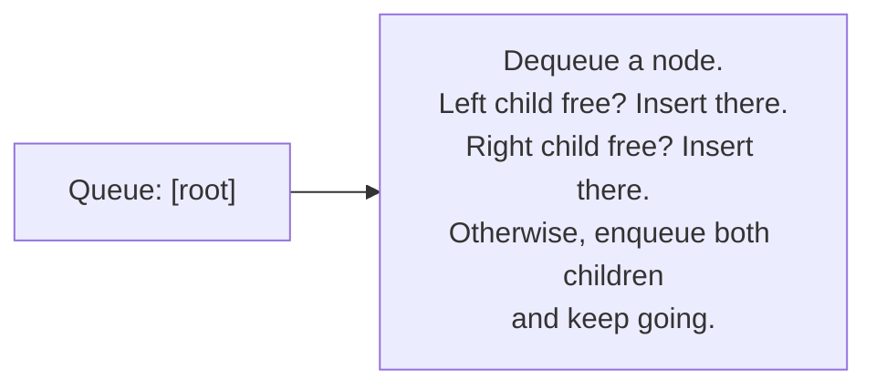

# Lecture 17: Binary Trees and Representation

Lecture 16 introduced binary trees by building them by hand, one pointer assignment at a
time. Real code needs a general-purpose way to *insert* into a binary tree
programmatically. This lecture builds a complete `BinaryTree` class around **level-order
insertion** — always filling the next open position left to right, level by level — which
keeps the tree in the **complete** shape from Lecture 16 automatically.

## In This Lecture

- The Binary Tree ADT, formalized as an interface
- Level-order insertion, and why it needs a queue
- A complete, working `BinaryTree` class
- Printing a tree's structure to see the shape you've built

## The Binary Tree ADT

| Operation | Meaning |
|---|---|
| `insert(value)` | Add a new node holding `value` at the next available position |
| `isEmpty()` | Report whether the tree has any nodes |
| `height()` | Report the tree's height (Lecture 16's definition) |
| Traversal operations | Visit every node in some defined order (the whole subject of Lecture 19) |

## Level-Order Insertion

"Next available position" means: scan the tree level by level, left to right, and insert
at the first spot with a missing child. This is exactly a **breadth-first** walk — which
means, perhaps surprisingly, that building a binary tree correctly needs a **queue**
(Unit 4), not a stack: at each node, you check "does it have a free child slot?" before
moving on to the *next* node at the same or deeper level, not before diving deeper into
one branch first.



## A Complete Binary Tree Class

```cpp title="binary_tree.cpp"
#include <iostream>
#include <queue>
using namespace std;

struct TreeNode {
    int data;
    TreeNode* left;
    TreeNode* right;
    TreeNode(int value) : data(value), left(nullptr), right(nullptr) {}
};

class BinaryTree {
private:
    TreeNode* root;

public:
    BinaryTree() : root(nullptr) {}

    bool isEmpty() const { return root == nullptr; }

    void insert(int value) {
        TreeNode* newNode = new TreeNode(value);
        if (root == nullptr) { root = newNode; return; }

        queue<TreeNode*> toVisit;
        toVisit.push(root);

        while (!toVisit.empty()) {
            TreeNode* current = toVisit.front();
            toVisit.pop();

            if (current->left == nullptr) {
                current->left = newNode;
                return;
            } else {
                toVisit.push(current->left);
            }

            if (current->right == nullptr) {
                current->right = newNode;
                return;
            } else {
                toVisit.push(current->right);
            }
        }
    }

    int height(TreeNode* node) const {
        if (node == nullptr) return -1;   // an empty (sub)tree has height -1
        return 1 + max(height(node->left), height(node->right));
    }

    int height() const { return height(root); }

    // Prints the tree level by level, so its actual shape is visible.
    void printLevelOrder() const {
        if (root == nullptr) { cout << "(empty tree)" << endl; return; }
        queue<TreeNode*> toVisit;
        toVisit.push(root);
        int currentLevel = 0;
        int nodesInCurrentLevel = 1;
        int nodesInNextLevel = 0;

        while (!toVisit.empty()) {
            TreeNode* current = toVisit.front();
            toVisit.pop();
            cout << current->data << " ";

            if (current->left != nullptr) { toVisit.push(current->left); nodesInNextLevel++; }
            if (current->right != nullptr) { toVisit.push(current->right); nodesInNextLevel++; }

            if (--nodesInCurrentLevel == 0) {
                cout << endl;
                currentLevel++;
                nodesInCurrentLevel = nodesInNextLevel;
                nodesInNextLevel = 0;
            }
        }
    }
};

int main() {
    BinaryTree tree;
    for (int value : {1, 2, 3, 4, 5, 6, 7}) {
        tree.insert(value);
    }

    cout << "Tree built by level-order insertion of 1..7:" << endl;
    tree.printLevelOrder();

    cout << "Height: " << tree.height() << endl;

    return 0;
}
```

```text
$ g++ -std=c++17 -o binary_tree binary_tree.cpp
$ ./binary_tree
Tree built by level-order insertion of 1..7:
1 
2 3 
4 5 6 7 
Height: 2
```

The result is exactly the **complete** binary tree shape from Lecture 16: level 0 has one
node, level 1 is completely full with two, level 2 is completely full with four — no gaps
anywhere, because level-order insertion always fills the leftmost open slot first.

!!! note "Why height() recurses instead of using the level-order queue"
    `height()` is written recursively because "the height of a tree" is naturally defined
    recursively: *1 + the taller of its two subtrees' heights* — precisely mirroring
    Lecture 12's recursion pattern (base case: an empty subtree has height -1; recursive
    case: combine both children's results). Trying to compute height with a queue instead
    is possible, but far less directly connected to the definition itself.

## Try It Yourself

1. Compile and run `binary_tree.cpp`, then insert three more values (`8, 9, 10`) and call
   `printLevelOrder()` again. Predict the new shape on paper first, then confirm your
   prediction against the real output.
2. Add a `int countNodes(TreeNode* node) const` method (recursive, following the same
   pattern as `height()`) that returns the total number of nodes in the tree, and verify
   it returns `7` for the tree built in `main()`.

## Key Takeaways

- The Binary Tree ADT's core operation is **insertion at the next available position** —
  formalized as level-order (breadth-first) insertion.
- Level-order insertion needs a **queue**, not a stack, because it must fully process one
  level before moving to the next — the queue's FIFO order is exactly what "level by
  level" means.
- Building a tree this way automatically keeps it in the **complete** shape from Lecture
  16, with no manual position-tracking required.
- Tree properties like `height()` are naturally written as recursive functions, mirroring
  their own recursive definitions — a pattern that will repeat throughout this unit.
