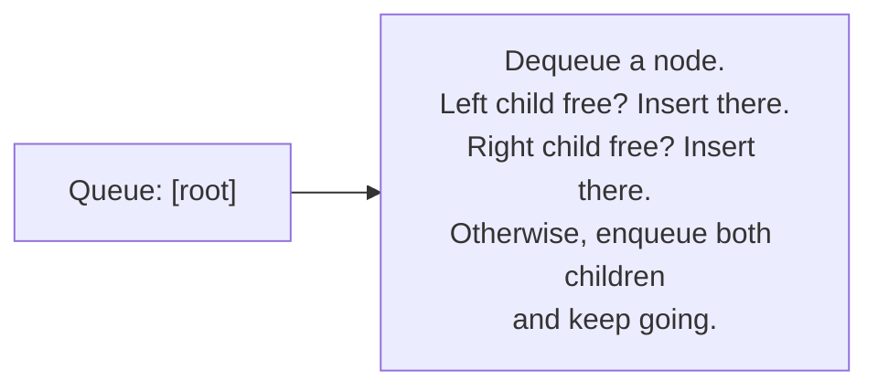
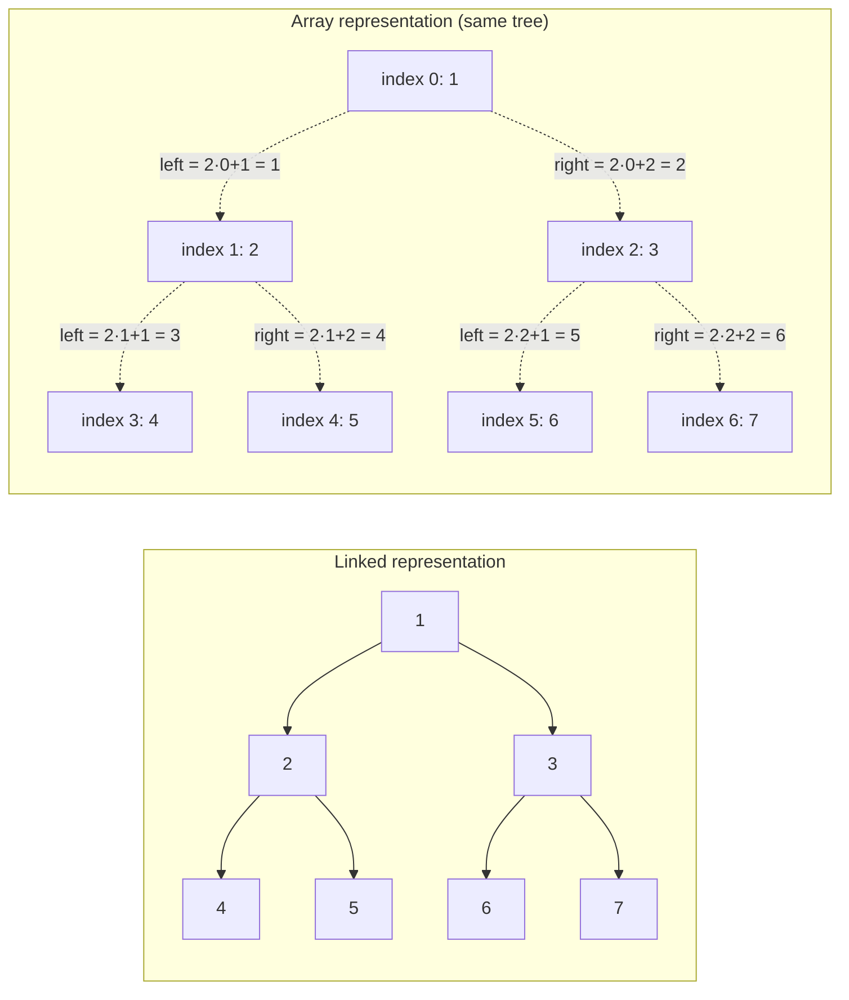
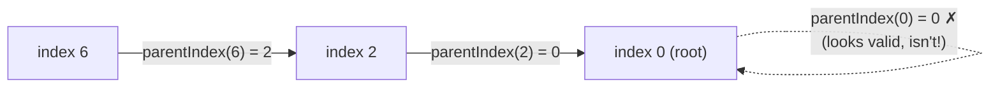

# Lecture 17: Binary Trees and Representation

Lecture 16 introduced binary trees by building them by hand, one pointer assignment at a
time. Real code needs a general-purpose way to *insert* into a binary tree
programmatically. This lecture builds a complete `BinaryTree` class around **level-order
insertion** — always filling the next open position left to right, level by level — which
keeps the tree in the **complete** shape from Lecture 16 automatically.

## In This Lecture

- The Binary Tree ADT, formalized as an interface
- Level-order insertion, and why it needs a queue
- A complete, working `BinaryTree` class
- Printing a tree's structure to see the shape you've built
- The array representation, revisited: level-order insertion as plain `push_back`
- The index math (`2i+1`, `2i+2`, `(i-1)/2`) that connects a node to its parent and children — and the one case where it silently misleads you
- Why array representation wastes space on anything but a complete tree, measured with real numbers

## The Binary Tree ADT

| Operation | Meaning |
|---|---|
| `insert(value)` | Add a new node holding `value` at the next available position |
| `isEmpty()` | Report whether the tree has any nodes |
| `height()` | Report the tree's height (Lecture 16's definition) |
| Traversal operations | Visit every node in some defined order (the whole subject of Lecture 19) |

## Level-Order Insertion

"Next available position" means: scan the tree level by level, left to right, and insert
at the first spot with a missing child. This is exactly a **breadth-first** walk — which
means, perhaps surprisingly, that building a binary tree correctly needs a **queue**
(Unit 4), not a stack: at each node, you check "does it have a free child slot?" before
moving on to the *next* node at the same or deeper level, not before diving deeper into
one branch first.



## A Complete Binary Tree Class

```cpp title="binary_tree.cpp"
#include <iostream>
#include <queue>
using namespace std;

struct TreeNode {
    int data;
    TreeNode* left;
    TreeNode* right;
    TreeNode(int value) : data(value), left(nullptr), right(nullptr) {}
};

class BinaryTree {
private:
    TreeNode* root;

public:
    BinaryTree() : root(nullptr) {}

    bool isEmpty() const { return root == nullptr; }

    void insert(int value) {
        TreeNode* newNode = new TreeNode(value);
        if (root == nullptr) { root = newNode; return; }

        queue<TreeNode*> toVisit;
        toVisit.push(root);

        while (!toVisit.empty()) {
            TreeNode* current = toVisit.front();
            toVisit.pop();

            if (current->left == nullptr) {
                current->left = newNode;
                return;
            } else {
                toVisit.push(current->left);
            }

            if (current->right == nullptr) {
                current->right = newNode;
                return;
            } else {
                toVisit.push(current->right);
            }
        }
    }

    int height(TreeNode* node) const {
        if (node == nullptr) return -1;   // an empty (sub)tree has height -1
        return 1 + max(height(node->left), height(node->right));
    }

    int height() const { return height(root); }

    // Prints the tree level by level, so its actual shape is visible.
    void printLevelOrder() const {
        if (root == nullptr) { cout << "(empty tree)" << endl; return; }
        queue<TreeNode*> toVisit;
        toVisit.push(root);
        int currentLevel = 0;
        int nodesInCurrentLevel = 1;
        int nodesInNextLevel = 0;

        while (!toVisit.empty()) {
            TreeNode* current = toVisit.front();
            toVisit.pop();
            cout << current->data << " ";

            if (current->left != nullptr) { toVisit.push(current->left); nodesInNextLevel++; }
            if (current->right != nullptr) { toVisit.push(current->right); nodesInNextLevel++; }

            if (--nodesInCurrentLevel == 0) {
                cout << endl;
                currentLevel++;
                nodesInCurrentLevel = nodesInNextLevel;
                nodesInNextLevel = 0;
            }
        }
    }
};

int main() {
    BinaryTree tree;
    for (int value : {1, 2, 3, 4, 5, 6, 7}) {
        tree.insert(value);
    }

    cout << "Tree built by level-order insertion of 1..7:" << endl;
    tree.printLevelOrder();

    cout << "Height: " << tree.height() << endl;

    return 0;
}
```

```text
$ g++ -std=c++17 -o binary_tree binary_tree.cpp
$ ./binary_tree
Tree built by level-order insertion of 1..7:
1 
2 3 
4 5 6 7 
Height: 2
```

The result is exactly the **complete** binary tree shape from Lecture 16: level 0 has one
node, level 1 is completely full with two, level 2 is completely full with four — no gaps
anywhere, because level-order insertion always fills the leftmost open slot first.

!!! note "Why height() recurses instead of using the level-order queue"
    `height()` is written recursively because "the height of a tree" is naturally defined
    recursively: *1 + the taller of its two subtrees' heights* — precisely mirroring
    Lecture 12's recursion pattern (base case: an empty subtree has height -1; recursive
    case: combine both children's results). Trying to compute height with a queue instead
    is possible, but far less directly connected to the definition itself.

## Array Representation, Revisited: Insertion Without a Queue

Lecture 16 introduced the array representation of a binary tree and its index math, but
only for a tree that was already built by hand. Here's the payoff: **level-order
insertion is what a `vector` already does for free.** `printLevelOrder()` above needed a
queue because a *linked* tree has no built-in notion of "level order" — you have to
rediscover it every time by walking the tree breadth-first. An array representation, by
contrast, **is** the tree stored in level order already, so inserting at "the next
available position" is just `push_back`: the next open slot in level order is always the
next index.



```cpp title="array_binary_tree.cpp"
#include <iostream>
#include <vector>
using namespace std;

class ArrayBinaryTree {
private:
    vector<int> nodes;   // level-order storage: nodes[0] is the root

public:
    // Level-order insertion is just "append at the end" -- the next open
    // slot in level order is ALWAYS the next index in a vector, because
    // the vector already IS the tree stored level by level, left to right.
    void insert(int value) {
        nodes.push_back(value);
    }

    bool isEmpty() const { return nodes.empty(); }

    int leftChildIndex(int i) const { return 2 * i + 1; }
    int rightChildIndex(int i) const { return 2 * i + 2; }
    int parentIndex(int i) const { return (i - 1) / 2; }

    void printLevelOrder() const {
        if (nodes.empty()) { cout << "(empty tree)" << endl; return; }
        int index = 0;
        int nodesInLevel = 1;
        while (index < (int)nodes.size()) {
            for (int k = 0; k < nodesInLevel && index < (int)nodes.size(); k++, index++) {
                cout << nodes[index] << " ";
            }
            cout << endl;
            nodesInLevel *= 2;
        }
    }

    // Valid ONLY because level-order insertion guarantees a complete tree:
    // the last-inserted index is always the deepest node, so walking its
    // parent chain back to the root counts exactly the tree's height.
    int height() const {
        int i = (int)nodes.size() - 1;
        int edges = 0;
        while (i > 0) {
            i = parentIndex(i);
            edges++;
        }
        return edges;
    }
};

int main() {
    ArrayBinaryTree tree;
    for (int value : {1, 2, 3, 4, 5, 6, 7}) {
        tree.insert(value);
    }

    cout << "Tree built by level-order insertion of 1..7 (array form):" << endl;
    tree.printLevelOrder();
    cout << "Height: " << tree.height() << endl;

    return 0;
}
```

```text
$ g++ -std=c++17 -o array_binary_tree array_binary_tree.cpp
$ ./array_binary_tree
Tree built by level-order insertion of 1..7 (array form):
1 
2 3 
4 5 6 7 
Height: 2
```

Same shape, same height, as the linked `BinaryTree` built from the identical insertion
sequence in `binary_tree.cpp` — the two representations agree because they're two
different encodings of the exact same tree, not two different trees.

!!! note "Where the O(n) actually went"
    `BinaryTree::insert` (linked) looks like it does real work — it enqueues and dequeues
    nodes in a `while` loop — while `ArrayBinaryTree::insert` looks trivial. That
    difference is real, not cosmetic: the linked version has to **rediscover** the next
    open slot by walking (in the worst case) every existing node, an O(n) search performed
    on *every* insertion. The array version never searches for the slot at all — level
    order *is* the storage order, so "the next slot" is always just `nodes.size()`, an
    O(1) operation. This is the same trade-off Lecture 16's comparison table hinted at:
    array representation is cheaper, but only because it assumes the tree stays complete.

## The Index Math: Parent, Children, and a Pitfall

Three formulas connect an index `i` to its neighbors in the array representation:

```text
left child index  = 2*i + 1
right child index = 2*i + 2
parent index       = (i - 1) / 2   (integer division)
```

The first two are safe at every index — a left or right child either exists within the
array's bounds or it doesn't, and checking `index < nodes.size()` before using the result
is all that's needed. The parent formula has a sharp edge that's easy to miss:

```cpp title="parent_index_pitfall.cpp"
#include <iostream>
using namespace std;

int main() {
    // The formula (i - 1) / 2 finds a node's parent index -- EXCEPT at the
    // root, where it silently gives the wrong answer instead of failing loudly.
    for (int i = 0; i <= 3; i++) {
        int parent = (i - 1) / 2;   // C++ integer division truncates toward zero
        cout << "index " << i << " -> (i-1)/2 = " << parent << endl;
    }
    return 0;
}
```

```text
$ g++ -std=c++17 -o parent_index_pitfall parent_index_pitfall.cpp
$ ./parent_index_pitfall
index 0 -> (i-1)/2 = 0
index 1 -> (i-1)/2 = 0
index 2 -> (i-1)/2 = 0
index 3 -> (i-1)/2 = 1
```

Look closely at the first line: `parentIndex(0)` returns `0` — the root's "parent" is
reported as *itself*. This isn't a special quirk of this one formula; it's C++'s integer
division truncating `-1 / 2` toward zero instead of flooring it, so `(0 - 1) / 2` lands on
`0` rather than `-1`. A formula that was supposed to fail obviously (return an invalid,
out-of-range index) instead fails *quietly*, returning a value that looks perfectly
legitimate. The fix is a guard that every correct use of `parentIndex` needs: check
`i == 0` (or equivalently, "is this the root?") *before* trusting the formula's output,
exactly the same discipline as checking `head == nullptr` before dereferencing in a linked
list.



## Space Efficiency: Array Representation on a Skewed Tree

Lecture 16 noted in passing that array representation "wastes enormous amounts of array
space" on an incomplete tree — here's exactly how much. A node's array index depends on
*where it would sit in a complete tree*, not on how many nodes actually exist. For a
**skewed** tree of height `h` (only `h + 1` real nodes, one per level), the deepest node's
index is still as large as it would be in a *complete* tree of that same height — which
means the array needs `2^(h+1) - 1` slots to hold just `h + 1` real values.

```cpp title="array_waste.cpp"
#include <iostream>
using namespace std;

int main() {
    for (int h : {2, 4, 6, 10}) {
        int actualNodes = h + 1;
        long long slotsNeeded = (1LL << (h + 1)) - 1;
        cout << "height " << h << ": " << actualNodes << " real node(s), "
             << slotsNeeded << " array slot(s) reserved, "
             << (slotsNeeded - actualNodes) << " wasted" << endl;
    }
    return 0;
}
```

```text
$ g++ -std=c++17 -o array_waste array_waste.cpp
$ ./array_waste
height 2: 3 real node(s), 7 array slot(s) reserved, 4 wasted
height 4: 5 real node(s), 31 array slot(s) reserved, 26 wasted
height 6: 7 real node(s), 127 array slot(s) reserved, 120 wasted
height 10: 11 real node(s), 2047 array slot(s) reserved, 2036 wasted
```

The waste grows **exponentially** with height, while a skewed linked tree of the same
height uses exactly `h + 1` nodes and no more — this is precisely why Lecture 16 said the
array representation "only stays efficient for complete trees," and precisely why heaps
(Lecture 23, always kept complete by construction) are the structure that actually gets to
exploit it.

## Try It Yourself

1. Compile and run `binary_tree.cpp`, then insert three more values (`8, 9, 10`) and call
   `printLevelOrder()` again. Predict the new shape on paper first, then confirm your
   prediction against the real output.
2. Add a `int countNodes(TreeNode* node) const` method (recursive, following the same
   pattern as `height()`) that returns the total number of nodes in the tree, and verify
   it returns `7` for the tree built in `main()`.
3. Compile and run `array_binary_tree.cpp`, then add a `leftChild(int i)` helper that
   returns `-1` when `leftChildIndex(i)` is out of bounds, instead of an unchecked index.
   Call it on every index of the 7-node tree and confirm leaves (indices 3–6) all report
   `-1`.
4. Fix `parentIndex` in `array_binary_tree.cpp` so it returns `-1` for the root instead of
   `0`, and update `height()` to stop at `-1` rather than `0`. Confirm the height still
   comes out to `2` for the 7-node tree — the bug in `parent_index_pitfall.cpp` happened to
   not affect `height()` here (why not? trace `height()`'s loop condition to see).
5. Using the formula in `array_waste.cpp`, compute by hand how many array slots a skewed
   tree of height `20` would need, then check your arithmetic by adding `20` to the list of
   heights in `main()` and recompiling.

## Key Takeaways

- The Binary Tree ADT's core operation is **insertion at the next available position** —
  formalized as level-order (breadth-first) insertion.
- Level-order insertion needs a **queue**, not a stack, because it must fully process one
  level before moving to the next — the queue's FIFO order is exactly what "level by
  level" means.
- Building a tree this way automatically keeps it in the **complete** shape from Lecture
  16, with no manual position-tracking required.
- Tree properties like `height()` are naturally written as recursive functions, mirroring
  their own recursive definitions — a pattern that will repeat throughout this unit.
- In the **array representation**, level-order insertion needs no queue at all — it's just
  `push_back`, because the array's storage order already *is* level order. The linked
  version's queue exists purely to *rediscover* that ordering on every insertion.
- The index formulas `2i+1`, `2i+2`, and `(i-1)/2` connect a node to its children and
  parent in O(1) — but `(i-1)/2` silently returns `0` (a "valid-looking" wrong answer, not
  an error) when called on the root, because of how C++ truncates integer division.
  Always guard it with an explicit "is this the root?" check.
- Array representation's compactness is a bet that the tree stays **complete** — a skewed
  tree pays for that bet with array space that grows *exponentially* in the tree's height,
  while the linked representation never pays that cost at all.
