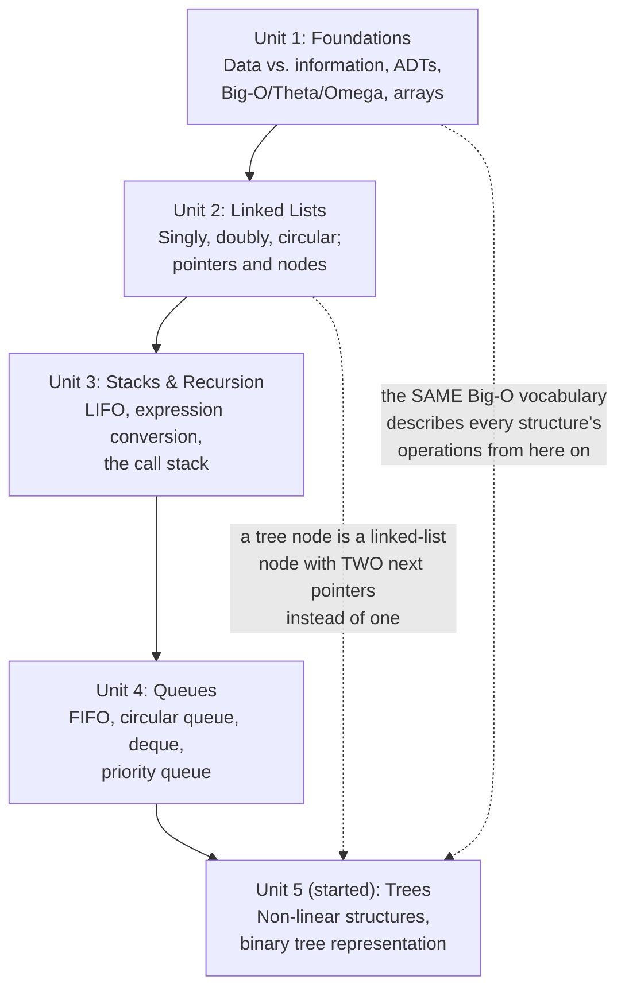

# Lecture 18: Midterm Review

This week is midterm exam week — there is no new topic to learn today. Instead, this
chapter is a **checkpoint**: a consolidated review of everything covered so far, from
"what is a data structure" through the start of trees. Use it to check which ideas feel
solid and which need another look before the exam.

## Concept Map

Every unit so far builds on the one before it: Unit 1 gave you the vocabulary
(data structures, algorithms, Big-O); Units 2–4 built every **linear** structure on top
of that vocabulary; Unit 5 just took the first step into **non-linear** structures, which
the rest of the course (after the midterm) will spend most of its time on.



## Complexity Cheat Sheet So Far

| Structure | Access | Search | Insert | Delete |
|---|---|---|---|---|
| Array | O(1) | O(n) | O(n) middle, O(1) end (if space) | O(n) middle, O(1) end |
| Singly linked list | O(n) | O(n) | O(1) front, O(n) elsewhere | O(1) front, O(n) elsewhere |
| Doubly linked list | O(n) | O(n) | O(1) front/end, O(n) middle | O(1) front/end, O(n) middle |
| Stack | O(1) top only | — | O(1) push | O(1) pop |
| Queue | O(1) front/rear only | — | O(1) enqueue | O(1) dequeue |

Every entry in this table comes down to one question, asked over and over throughout
Units 1–4: *does reaching this position require walking past other elements first, or
can you get there directly?*

## Self-Test: Trace This Code

Before checking your answer, predict this program's output by hand.

```cpp title="self_test.cpp"
#include <iostream>
using namespace std;

struct Node {
    int data;
    Node* next;
    Node(int v) : data(v), next(nullptr) {}
};

int main() {
    Node* head = new Node(10);
    head->next = new Node(20);
    head->next->next = new Node(30);

    // Reverse it in place (Lecture 6's algorithm)
    Node* previous = nullptr;
    Node* current = head;
    while (current != nullptr) {
        Node* nextNode = current->next;
        current->next = previous;
        previous = current;
        current = nextNode;
    }
    head = previous;

    Node* walker = head;
    while (walker != nullptr) {
        cout << walker->data;
        if (walker->next != nullptr) cout << " -> ";
        walker = walker->next;
    }
    cout << endl;

    return 0;
}
```

```text
$ g++ -std=c++17 -o self_test self_test.cpp
$ ./self_test
30 -> 20 -> 10
```

If you predicted `30 -> 20 -> 10`, Lecture 6's reversal algorithm has genuinely clicked —
if not, it's worth re-reading that lecture's diagram before the exam, tracing the three
pointers (`previous`, `current`, `nextNode`) one line at a time on paper.

## Questions to Test Yourself

1. What is the difference between an algorithm's **worst-case** and **average-case**
   complexity, and which one does this course default to when it just says "the
   complexity is O(...)"?
2. Why is inserting at the *front* of a singly linked list O(1), but inserting at the
   *front* of an array O(n)?
3. A stack and a queue are both built from the same idea — restricted access to a linear
   sequence. What's the one-sentence difference between what each one restricts you to?
4. What problem does a **circular** queue solve that a simple array-based queue doesn't?
5. In a **binary tree**, what's the difference between a *full*, a *complete*, and a
   *skewed* tree — and which shape is structurally identical to a linked list?

## Key Takeaways

- Units 1–4 built every **linear** structure in this course — array, linked list, stack,
  queue — each one a different trade-off between fast access, fast insertion, and fast
  deletion.
- The **Big-O vocabulary** from Unit 1 (O(1), O(log n), O(n), O(n²)) is the language every
  remaining unit will use to describe its own structures' performance — it does not get
  re-taught, only re-applied.
- Unit 5 has just begun the shift from **linear** to **non-linear** structures — trees,
  and later graphs — where a single node can connect to more than one "next."
- If any of the five self-test questions above felt shaky, revisit that lecture before
  the exam — everything after this point in the course builds directly on these
  foundations.
