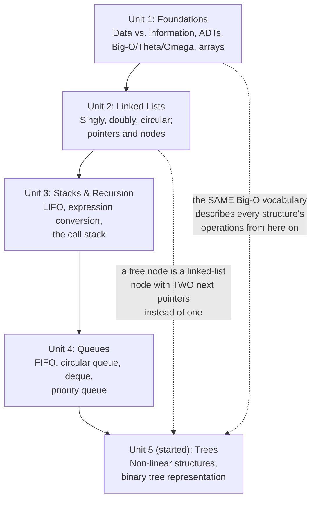
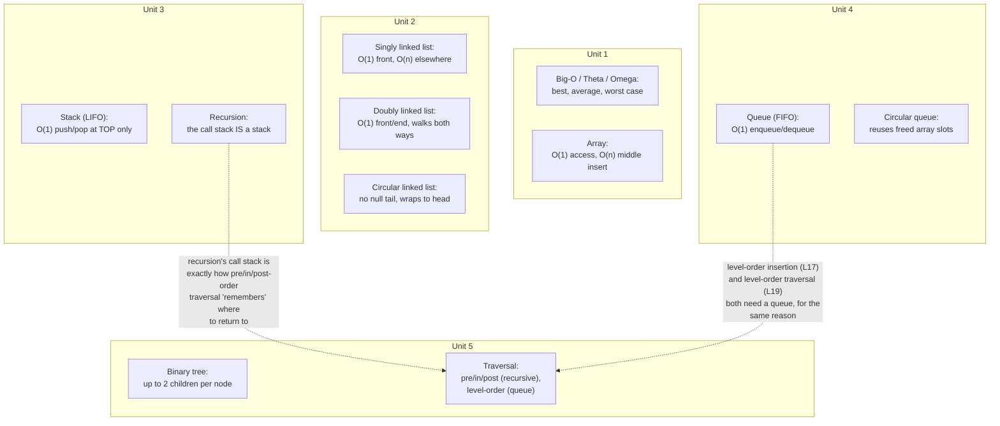

# Lecture 18: Midterm Review

This week is midterm exam week — there is no new topic to learn today. Instead, this
chapter is a **checkpoint**: a consolidated review of everything covered so far, from
"what is a data structure" through the start of trees. Use it to check which ideas feel
solid and which need another look before the exam.

## Concept Map

Every unit so far builds on the one before it: Unit 1 gave you the vocabulary
(data structures, algorithms, Big-O); Units 2–4 built every **linear** structure on top
of that vocabulary; Unit 5 just took the first step into **non-linear** structures, which
the rest of the course (after the midterm) will spend most of its time on.



Zooming in on any one unit reveals the same pattern: a small set of core operations, each
with its own trade-off between how fast it is and what it costs elsewhere.



Two threads worth tracing before the exam: recursion's call stack (Unit 3) is the hidden
mechanism behind every depth-first tree traversal (Unit 5), and the queue (Unit 4)
reappears verbatim — not just "something similar" — as the mechanism behind level-order
insertion and level-order traversal. Neither idea was re-taught in Unit 5; both were
simply *reused*.

## Complexity Cheat Sheet So Far

| Structure | Access | Search | Insert | Delete |
|---|---|---|---|---|
| Array | O(1) | O(n) | O(n) middle, O(1) end (if space) | O(n) middle, O(1) end |
| Singly linked list | O(n) | O(n) | O(1) front, O(n) elsewhere | O(1) front, O(n) elsewhere |
| Doubly linked list | O(n) | O(n) | O(1) front/end, O(n) middle | O(1) front/end, O(n) middle |
| Circular linked list | O(n) | O(n) | O(1) at the known node, O(n) elsewhere | O(1) at the known node, O(n) elsewhere |
| Stack | O(1) top only | O(n) (must pop through) | O(1) push | O(1) pop |
| Queue | O(1) front/rear only | O(n) (must dequeue through) | O(1) enqueue | O(1) dequeue |
| Circular queue (array-based) | O(1) front/rear only | O(n) | O(1) enqueue (wraps via `% capacity`) | O(1) dequeue |
| Binary tree (general, linked) | O(n) | O(n) | O(n) — level-order must find the next open slot | O(n) |
| Binary Search Tree (preview, Lecture 20) | O(h) | O(h) | O(h) | O(h) |

`h` is the tree's height. For a BST that stays roughly balanced, `h ≈ log₂ n`, giving
O(log n) — but nothing *forces* balance, and a BST built from already-sorted input degrades
to `h = n - 1`, i.e., O(n), no better than a linked list. Lecture 20 covers this in depth,
and Lecture 22's AVL tree exists specifically to *guarantee* `h ≈ log n` no matter the
insertion order.

Every entry in this table comes down to one question, asked over and over throughout
Units 1–4: *does reaching this position require walking past other elements first, or
can you get there directly?* Unit 5 adds a second question on top of it: *does the
structure's **shape** guarantee a short path, or merely make one likely?*

## Self-Test: Trace This Code

Before checking your answer, predict this program's output by hand.

```cpp title="self_test.cpp"
#include <iostream>
using namespace std;

struct Node {
    int data;
    Node* next;
    Node(int v) : data(v), next(nullptr) {}
};

int main() {
    Node* head = new Node(10);
    head->next = new Node(20);
    head->next->next = new Node(30);

    // Reverse it in place (Lecture 6's algorithm)
    Node* previous = nullptr;
    Node* current = head;
    while (current != nullptr) {
        Node* nextNode = current->next;
        current->next = previous;
        previous = current;
        current = nextNode;
    }
    head = previous;

    Node* walker = head;
    while (walker != nullptr) {
        cout << walker->data;
        if (walker->next != nullptr) cout << " -> ";
        walker = walker->next;
    }
    cout << endl;

    return 0;
}
```

```text
$ g++ -std=c++17 -o self_test self_test.cpp
$ ./self_test
30 -> 20 -> 10
```

If you predicted `30 -> 20 -> 10`, Lecture 6's reversal algorithm has genuinely clicked —
if not, it's worth re-reading that lecture's diagram before the exam, tracing the three
pointers (`previous`, `current`, `nextNode`) one line at a time on paper.

## More Self-Tests: Trace, Predict, Then Verify

Each of these pulls its core idea from an earlier unit. Cover the `text` block, predict
the output on paper, then compile and run the `cpp` block yourself to check.

### Trace: Stack-Based Bracket Matching (Unit 3)

```cpp title="trace_stack.cpp"
#include <iostream>
using namespace std;

struct Node {
    char data;
    Node* next;
    Node(char v) : data(v), next(nullptr) {}
};

class Stack {
private:
    Node* top;
public:
    Stack() : top(nullptr) {}
    void push(char value) {
        Node* newNode = new Node(value);
        newNode->next = top;
        top = newNode;
    }
    char pop() {
        char value = top->data;
        Node* oldTop = top;
        top = top->next;
        delete oldTop;
        return value;
    }
    bool isEmpty() const { return top == nullptr; }
};

int main() {
    string expression = "([{}])";
    Stack brackets;
    bool balanced = true;

    for (char c : expression) {
        if (c == '(' || c == '[' || c == '{') {
            brackets.push(c);
        } else {
            if (brackets.isEmpty()) { balanced = false; break; }
            char opener = brackets.pop();
            if ((c == ')' && opener != '(') ||
                (c == ']' && opener != '[') ||
                (c == '}' && opener != '{')) {
                balanced = false;
                break;
            }
        }
    }
    if (!brackets.isEmpty()) balanced = false;

    cout << "Expression: " << expression << endl;
    cout << "Balanced: " << (balanced ? "yes" : "no") << endl;
    return 0;
}
```

```text
$ g++ -std=c++17 -o trace_stack trace_stack.cpp
$ ./trace_stack
Expression: ([{}])
Balanced: yes
```

The key idea being tested: a stack's LIFO order is exactly what makes bracket matching
work — the *most recently opened* bracket must be the *next one closed*, which is what
`pop()` naturally gives you.

### Trace: Circular Queue Wraparound (Unit 4)

```cpp title="trace_circular_queue.cpp"
#include <iostream>
using namespace std;

class CircularQueue {
private:
    int data[5];
    int front, rear, count, capacity;
public:
    CircularQueue() : front(0), rear(-1), count(0), capacity(5) {}
    void enqueue(int value) {
        rear = (rear + 1) % capacity;
        data[rear] = value;
        count++;
    }
    int dequeue() {
        int value = data[front];
        front = (front + 1) % capacity;
        count--;
        return value;
    }
};

int main() {
    CircularQueue q;
    for (int v : {1, 2, 3, 4, 5}) q.enqueue(v);

    cout << q.dequeue() << " " << q.dequeue() << " " << q.dequeue() << endl;

    // rear has wrapped around to index 0 and 1 by now
    q.enqueue(6);
    q.enqueue(7);

    cout << q.dequeue() << " " << q.dequeue() << " " << q.dequeue() << " " << q.dequeue() << endl;
    return 0;
}
```

```text
$ g++ -std=c++17 -o trace_circular_queue trace_circular_queue.cpp
$ ./trace_circular_queue
1 2 3
4 5 6 7
```

The key idea being tested: `% capacity` is what lets `rear` wrap from index `4` back to
index `0` and reuse the slots that `dequeue()` already freed, instead of a plain array
queue's problem of running out of room even when space is available at the front.

### Trace: Doubly Linked List, Both Directions (Unit 2)

```cpp title="trace_dll.cpp"
#include <iostream>
using namespace std;

struct Node {
    int data;
    Node* prev;
    Node* next;
    Node(int v) : data(v), prev(nullptr), next(nullptr) {}
};

int main() {
    Node* head = new Node(1);
    head->next = new Node(2);
    head->next->prev = head;
    head->next->next = new Node(3);
    head->next->next->prev = head->next;

    Node* tail = head->next->next;

    cout << "Forward:  ";
    for (Node* cur = head; cur != nullptr; cur = cur->next) cout << cur->data << " ";
    cout << endl;

    cout << "Backward: ";
    for (Node* cur = tail; cur != nullptr; cur = cur->prev) cout << cur->data << " ";
    cout << endl;

    return 0;
}
```

```text
$ g++ -std=c++17 -o trace_dll trace_dll.cpp
$ ./trace_dll
Forward:  1 2 3 
Backward: 3 2 1 
```

The key idea being tested: a doubly linked list's `prev` pointers are what a singly
linked list simply cannot do — walking backward from an arbitrary node without ever
touching `head`.

### Trace: Recursion's Call Order (Unit 3, previewing Unit 5)

```cpp title="trace_recursion.cpp"
#include <iostream>
using namespace std;

int mystery(int n) {
    if (n <= 1) return 1;
    cout << "entering mystery(" << n << ")" << endl;
    int result = n * mystery(n - 1);
    cout << "leaving mystery(" << n << "), returning " << result << endl;
    return result;
}

int main() {
    int answer = mystery(4);
    cout << "Final answer: " << answer << endl;
    return 0;
}
```

```text
$ g++ -std=c++17 -o trace_recursion trace_recursion.cpp
$ ./trace_recursion
entering mystery(4)
entering mystery(3)
entering mystery(2)
leaving mystery(2), returning 2
leaving mystery(3), returning 6
leaving mystery(4), returning 24
Final answer: 24
```

The key idea being tested: every "entering" line happens **before** the recursive call
returns, and every "leaving" line happens **after** it — the call stack unwinds in
exactly the reverse order it built up, the same mechanism Lecture 19 relies on for
pre-order and post-order tree traversal (the "entering" print is pre-order-shaped; the
"leaving" print is post-order-shaped, on the same call tree).

## Questions to Test Yourself

1. What is the difference between an algorithm's **worst-case** and **average-case**
   complexity, and which one does this course default to when it just says "the
   complexity is O(...)"?
2. Why is inserting at the *front* of a singly linked list O(1), but inserting at the
   *front* of an array O(n)?
3. A stack and a queue are both built from the same idea — restricted access to a linear
   sequence. What's the one-sentence difference between what each one restricts you to?
4. What problem does a **circular** queue solve that a simple array-based queue doesn't?
5. In a **binary tree**, what's the difference between a *full*, a *complete*, and a
   *skewed* tree — and which shape is structurally identical to a linked list?
6. Level-order insertion into a binary tree (Lecture 17) and level-order *traversal*
   (Lecture 19) both use a queue. Are they using it for the same reason, or two different
   reasons that happen to both need FIFO order? Explain in one or two sentences.
7. Lecture 6's linked-list reversal and Lecture 19's tree traversals both process a
   structure recursively-flavored structure of pointers, yet only one of them is usually
   written with actual recursion. Which one, and why does the other one *not* need it?
8. Suppose you need a structure that supports fast search **and** lets you retrieve every
   value in sorted order on demand. Of everything covered so far (array, linked list,
   stack, queue, binary tree), which comes closest, and what's still missing from a plain
   binary tree that Lecture 20 adds?

## Key Takeaways

- Units 1–4 built every **linear** structure in this course — array, linked list, stack,
  queue, and their circular/double-ended variants — each one a different trade-off
  between fast access, fast insertion, and fast deletion.
- The **Big-O vocabulary** from Unit 1 (O(1), O(log n), O(n), O(n²)) is the language every
  remaining unit will use to describe its own structures' performance — it does not get
  re-taught, only re-applied. Unit 5 adds one refinement: complexity can depend on a
  structure's **shape**, not just its size.
- Unit 5 has just begun the shift from **linear** to **non-linear** structures — trees,
  and later graphs — where a single node can connect to more than one "next."
- Two mechanisms from earlier units get **reused, not re-taught**, in Unit 5: the queue
  (Unit 4) drives level-order insertion and traversal; the call stack (Unit 3's recursion)
  drives every depth-first traversal.
- If any of the self-test questions above felt shaky, revisit that lecture before the
  exam — everything after this point in the course builds directly on these foundations.
