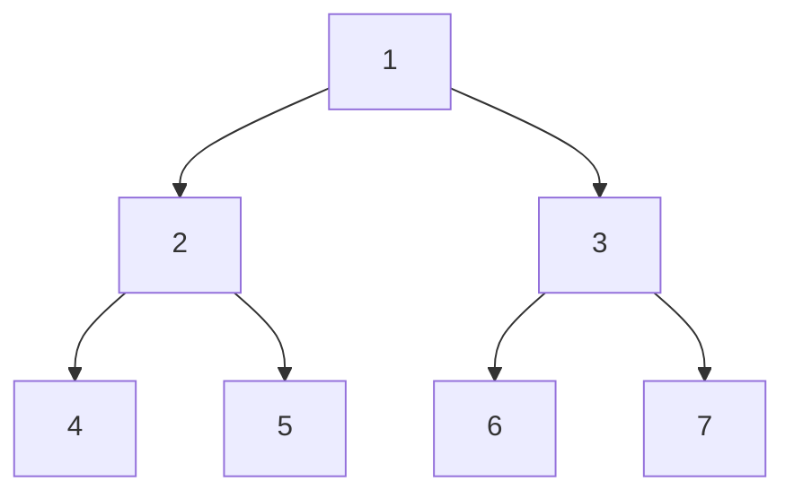
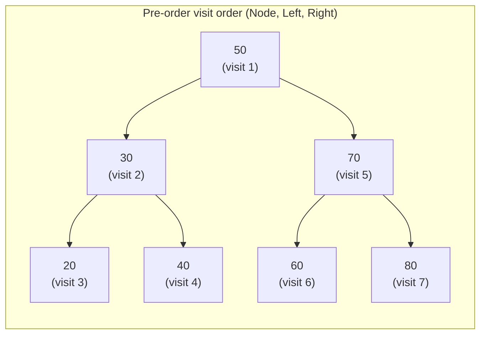
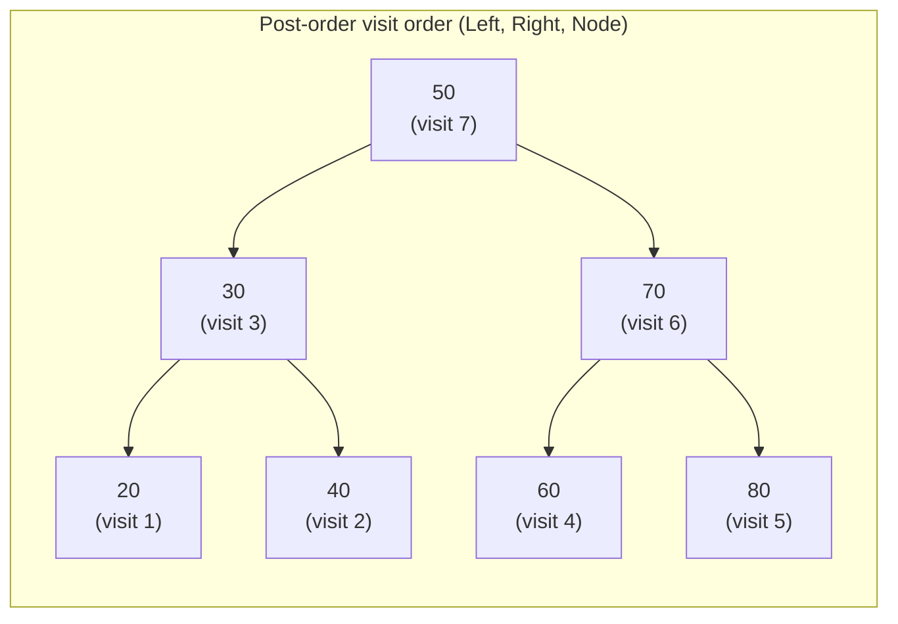

# Lecture 19: Binary Tree Traversals

"Visit every element" was trivial for a linear structure — just walk forward. A tree
offers no single obvious order: at every node, do you go left first, process the node
first, or go right first? Each choice defines a different **traversal**, and each one
turns out to be useful for a different real purpose.

## In This Lecture

- The traversal concept, and why a tree has more than one natural visiting order
- Pre-order, in-order, and post-order traversal (all depth-first)
- Level-order traversal (breadth-first, from Lecture 17)
- A direct comparison, and when to reach for each one
- The visit order annotated directly on the tree, for all three depth-first traversals
- Proof, with real code, that in-order traversal sorts a BST for free
- A classic bug: confusing *when you print* with *which order you recurse in*

## The Tree Traversal Concept

All traversals in this lecture work on the same example tree:



The three **depth-first** traversals — pre-order, in-order, post-order — differ only in
*when* they process the current node relative to visiting its left and right subtrees.

## Pre-Order Traversal: Node, Left, Right

Process the current node **first**, then recurse left, then recurse right.

```cpp title="tree_traversals.cpp"
#include <iostream>
using namespace std;

struct TreeNode {
    int data;
    TreeNode* left;
    TreeNode* right;
    TreeNode(int value) : data(value), left(nullptr), right(nullptr) {}
};

void preOrder(TreeNode* node) {
    if (node == nullptr) return;
    cout << node->data << " ";   // 1. process the node
    preOrder(node->left);         // 2. recurse left
    preOrder(node->right);        // 3. recurse right
}

void inOrder(TreeNode* node) {
    if (node == nullptr) return;
    inOrder(node->left);          // 1. recurse left
    cout << node->data << " ";   // 2. process the node
    inOrder(node->right);         // 3. recurse right
}

void postOrder(TreeNode* node) {
    if (node == nullptr) return;
    postOrder(node->left);        // 1. recurse left
    postOrder(node->right);       // 2. recurse right
    cout << node->data << " ";   // 3. process the node
}

int main() {
    TreeNode* root = new TreeNode(1);
    root->left = new TreeNode(2);
    root->right = new TreeNode(3);
    root->left->left = new TreeNode(4);
    root->left->right = new TreeNode(5);
    root->right->left = new TreeNode(6);
    root->right->right = new TreeNode(7);

    cout << "Pre-order  (Node, Left, Right): ";
    preOrder(root);
    cout << endl;

    cout << "In-order   (Left, Node, Right): ";
    inOrder(root);
    cout << endl;

    cout << "Post-order (Left, Right, Node): ";
    postOrder(root);
    cout << endl;

    return 0;
}
```

```text
$ g++ -std=c++17 -o tree_traversals tree_traversals.cpp
$ ./tree_traversals
Pre-order  (Node, Left, Right): 1 2 4 5 3 6 7 
In-order   (Left, Node, Right): 4 2 5 1 6 3 7 
Post-order (Left, Right, Node): 4 5 2 6 7 3 1 
```

Laid side by side, on the exact same tree, the three sequences make the difference
concrete instead of abstract:

| Traversal | Visit order rule | Output on this tree |
|---|---|---|
| Pre-order | Node → Left → Right | `1 2 4 5 3 6 7` |
| In-order | Left → Node → Right | `4 2 5 1 6 3 7` |
| Post-order | Left → Right → Node | `4 5 2 6 7 3 1` |

Three facts jump out from this table alone: **every traversal visits all 7 nodes** (only
the order changes, never the set of nodes visited); **root `1` appears first in pre-order,
last in post-order, and in the middle of in-order** — exactly matching where "Node" sits
in each rule; and **no two traversals ever produce the same sequence** for a tree with more
than one node, which is exactly why picking the right one for the job (Lecture 19's final
section) actually matters.

## In-Order Traversal: Left, Node, Right

Recurse left **first**, then process the node, then recurse right. For a **Binary Search
Tree** specifically (Lecture 20), in-order traversal visits every node in **sorted
order** — this is the single most important fact about in-order traversal in the entire
course, and it's why BSTs are useful at all.

### Seeing the Visit Order on the Tree Itself

The table above shows *what* gets printed, but not *when*, relative to the shape of the
tree. Annotating each node with its position in the visit order makes that concrete — here
it's done on Lecture 20's example BST (`50, 30, 70, 20, 40, 60, 80`), so the same diagram
does double duty once Lecture 20 introduces the BST property.






Look at the **in-order** diagram's numbers only: reading them left to right across the
bottom of the tree (`20`→1, `30`→2, `40`→3, `50`→4, `60`→5, `70`→6, `80`→7) is *already*
`20, 30, 40, 50, 60, 70, 80` — sorted. That's not a coincidence of this particular tree; it
falls directly out of the BST property (left subtree smaller, right subtree larger) plus
in-order's "left, node, right" rule, applied recursively at every node. Verified with real
code, not just the diagram:

```cpp title="bst_traversal_orders.cpp"
#include <iostream>
using namespace std;

struct TreeNode {
    int data;
    TreeNode* left;
    TreeNode* right;
    TreeNode(int value) : data(value), left(nullptr), right(nullptr) {}
};

void preOrder(TreeNode* node) {
    if (node == nullptr) return;
    cout << node->data << " ";
    preOrder(node->left);
    preOrder(node->right);
}

void inOrder(TreeNode* node) {
    if (node == nullptr) return;
    inOrder(node->left);
    cout << node->data << " ";
    inOrder(node->right);
}

void postOrder(TreeNode* node) {
    if (node == nullptr) return;
    postOrder(node->left);
    postOrder(node->right);
    cout << node->data << " ";
}

int main() {
    // The SAME shape used in Lecture 20's BST example -- this tree obeys
    // the BST property (left < node < right at every node).
    TreeNode* root = new TreeNode(50);
    root->left = new TreeNode(30);
    root->right = new TreeNode(70);
    root->left->left = new TreeNode(20);
    root->left->right = new TreeNode(40);
    root->right->left = new TreeNode(60);
    root->right->right = new TreeNode(80);

    cout << "Pre-order:  "; preOrder(root);  cout << endl;
    cout << "In-order:   "; inOrder(root);   cout << endl;
    cout << "Post-order: "; postOrder(root); cout << endl;

    return 0;
}
```

```text
$ g++ -std=c++17 -o bst_traversal_orders bst_traversal_orders.cpp
$ ./bst_traversal_orders
Pre-order:  50 30 20 40 70 60 80 
In-order:   20 30 40 50 60 70 80 
Post-order: 20 40 30 60 80 70 50 
```

The in-order line reads `20 30 40 50 60 70 80` — perfectly sorted, with **zero** extra
sorting work. This is the payoff Lecture 20 is built around: a BST gives you fast search
*and* a free sorted traversal, something neither a plain binary tree nor an unsorted array
can offer both of at once.

## Post-Order Traversal: Left, Right, Node

Recurse left, then recurse right, and process the node **last**. This ordering guarantees
every node's children are fully processed *before* the node itself — exactly what's
needed to safely delete an entire tree (free every child before freeing the parent) or to
evaluate an expression tree (Lecture 24) bottom-up.

## Recursive Traversal

Notice all three functions above share the exact same three-line shape — only the
*order* of the three lines changes. This is a direct application of Lecture 12's
recursion pattern: the base case is `node == nullptr` (an empty subtree has nothing to
visit), and the recursive case processes the node plus both subtrees in whichever order
defines that traversal.

## Common Pitfall: Confusing "When You Print" with "Which Order You Recurse In"

Because all three traversals are the *same three lines* rearranged, it's tempting to think
only the position of the `cout` line matters. It's actually **two independent choices**:
*when* you print relative to the two recursive calls, and *which order* you make those two
calls in — and mixing either one up produces a real, different, wrong traversal, not a
minor variation. Both mistakes below compile cleanly and run without crashing, which is
exactly what makes them dangerous — the only way to catch them is to check the output
against what the traversal is actually supposed to produce, never to assume the code is
correct because it "looks like" the right traversal.

```cpp title="traversal_pitfall.cpp"
#include <iostream>
using namespace std;

struct TreeNode {
    int data;
    TreeNode* left;
    TreeNode* right;
    TreeNode(int value) : data(value), left(nullptr), right(nullptr) {}
};

// Correct in-order: Left, Node, Right
void inOrderCorrect(TreeNode* node) {
    if (node == nullptr) return;
    inOrderCorrect(node->left);
    cout << node->data << " ";
    inOrderCorrect(node->right);
}

// BUG: the print statement was moved to the top "to make it simpler" --
// but that doesn't produce in-order, it produces pre-order, because WHEN
// you print relative to the two recursive calls is the entire definition
// of which traversal you get.
void inOrderBuggy(TreeNode* node) {
    if (node == nullptr) return;
    cout << node->data << " ";   // moved here by mistake
    inOrderBuggy(node->left);
    inOrderBuggy(node->right);
}

// Correct post-order: Left, Right, Node
void postOrderCorrect(TreeNode* node) {
    if (node == nullptr) return;
    postOrderCorrect(node->left);
    postOrderCorrect(node->right);
    cout << node->data << " ";
}

// BUG: the two recursive calls were swapped "it shouldn't matter, both
// subtrees get visited either way" -- but the ORDER of the two calls matters
// just as much as when you print. This silently mirrors the traversal,
// visiting the right subtree before the left one at every level.
void postOrderBuggy(TreeNode* node) {
    if (node == nullptr) return;
    postOrderBuggy(node->right);   // right and left swapped
    postOrderBuggy(node->left);
    cout << node->data << " ";
}

int main() {
    TreeNode* root = new TreeNode(50);
    root->left = new TreeNode(30);
    root->right = new TreeNode(70);
    root->left->left = new TreeNode(20);
    root->left->right = new TreeNode(40);
    root->right->left = new TreeNode(60);
    root->right->right = new TreeNode(80);

    cout << "inOrderCorrect:   "; inOrderCorrect(root);   cout << endl;
    cout << "inOrderBuggy:     "; inOrderBuggy(root);     cout << endl;
    cout << "postOrderCorrect: "; postOrderCorrect(root); cout << endl;
    cout << "postOrderBuggy:   "; postOrderBuggy(root);   cout << endl;

    return 0;
}
```

```text
$ g++ -std=c++17 -o traversal_pitfall traversal_pitfall.cpp
$ ./traversal_pitfall
inOrderCorrect:   20 30 40 50 60 70 80 
inOrderBuggy:     50 30 20 40 70 60 80 
postOrderCorrect: 20 40 30 60 80 70 50 
postOrderBuggy:   80 60 70 40 20 30 50 
```

Two things to notice in the real output: `inOrderBuggy`'s output (`50 30 20 40 70 60 80`)
is *identical* to `preOrder`'s output from `tree_traversals.cpp` — moving the print to the
top didn't create some new broken traversal, it silently turned `inOrderBuggy` into a
pre-order function wearing an in-order name. And `postOrderBuggy`'s output
(`80 60 70 40 20 30 50`) is a genuinely different sequence from both `postOrderCorrect`
and any other traversal covered so far — swapping the two recursive calls produces a
*mirrored* post-order, visiting every right subtree before every left one. Neither bug
throws an error or crashes; both simply return the wrong answer with complete confidence,
which is exactly why this lecture insists on compiling and checking real output rather
than trusting a hand-traced prediction.

## Level-Order Traversal

**Level-order** traversal (already used to build trees in Lecture 17) is the one
**breadth-first** traversal: visit every node at depth 0, then every node at depth 1, and
so on — using a queue, not recursion.

```cpp title="level_order.cpp"
#include <iostream>
#include <queue>
using namespace std;

struct TreeNode {
    int data;
    TreeNode* left;
    TreeNode* right;
    TreeNode(int value) : data(value), left(nullptr), right(nullptr) {}
};

void levelOrder(TreeNode* root) {
    if (root == nullptr) return;
    queue<TreeNode*> toVisit;
    toVisit.push(root);

    while (!toVisit.empty()) {
        TreeNode* current = toVisit.front();
        toVisit.pop();
        cout << current->data << " ";
        if (current->left != nullptr) toVisit.push(current->left);
        if (current->right != nullptr) toVisit.push(current->right);
    }
}

int main() {
    TreeNode* root = new TreeNode(1);
    root->left = new TreeNode(2);
    root->right = new TreeNode(3);
    root->left->left = new TreeNode(4);
    root->left->right = new TreeNode(5);
    root->right->left = new TreeNode(6);
    root->right->right = new TreeNode(7);

    cout << "Level-order (breadth-first): ";
    levelOrder(root);
    cout << endl;

    return 0;
}
```

```text
$ g++ -std=c++17 -o level_order level_order.cpp
$ ./level_order
Level-order (breadth-first): 1 2 3 4 5 6 7 
```

## Comparison of Traversal Methods

| Traversal | Order | Uses | Typical application |
|---|---|---|---|
| Pre-order | Node, Left, Right | Recursion (a stack, implicitly) | Copying/cloning a tree; serializing a tree to save it |
| In-order | Left, Node, Right | Recursion | Reading a **BST**'s values in sorted order (Lecture 20) |
| Post-order | Left, Right, Node | Recursion | Safely deleting a tree; evaluating expression trees (Lecture 24) |
| Level-order | Depth 0, then 1, then 2, ... | A queue, explicitly | Printing a tree level by level; finding the shortest path in an unweighted tree |

Notice pre-order, in-order, and post-order all use **recursion**, which means they're all
secretly using the **call stack** (Lecture 12) to remember where to return to — the only
traversal that uses an explicit data structure (a queue) is level-order.

## Applications of Tree Traversal

- **In-order** traversal of a BST retrieves every value in sorted order with zero extra
  sorting work — a direct preview of Lecture 20.
- **Post-order** traversal is required whenever children must be fully processed before
  their parent — freeing memory, or evaluating an expression tree bottom-up (Lecture 24).
- **Pre-order** traversal is the natural way to copy a tree, since you create the root
  first, then attach freshly-copied left and right subtrees to it.
- **Level-order** traversal is how a tree's shape is actually printed for a human to read
  (exactly what Lecture 17's `printLevelOrder` does), and how BFS (Lecture 26) generalizes
  to graphs.

## Try It Yourself

1. Trace `preOrder`, `inOrder`, and `postOrder` by hand on paper for the example tree
   shown above (nodes 1–7), writing down the visit order for each — then confirm every
   one matches `tree_traversals.cpp`'s real output.
2. Write a recursive function `int countLeaves(TreeNode* node)` that returns the number of
   leaf nodes in a tree (a node with `left == nullptr` and `right == nullptr`). Test it on
   the example tree and confirm it returns `4`.
3. Compile and run `bst_traversal_orders.cpp`, then insert one more value, `35`, into the
   tree by hand (as `root->left->right->left = new TreeNode(35)`) and predict where `35`
   will land in the in-order output *before* re-running — then confirm.
4. Compile and run `traversal_pitfall.cpp` yourself, then write a third "buggy" function,
   `preOrderBuggy`, that prints the node **after** both recursive calls instead of before.
   Predict which existing traversal's output it will match, then confirm by adding it to
   `main()`.
5. Using the annotated pre-order diagram above as a template, draw (on paper) the same
   tree annotated for **level-order** visit order, and check it against
   `level_order.cpp`'s real output.

## Key Takeaways

- **Pre-order**, **in-order**, and **post-order** are all depth-first traversals,
  differing only in *when* the current node is processed relative to its two subtrees —
  and all three follow directly from Lecture 12's recursion pattern.
- Laid side by side on the same tree, the three depth-first traversals visit the same
  nodes in three genuinely different orders — never coincidentally the same sequence for
  a tree with more than one node.
- **In-order** traversal of a Binary Search Tree visits nodes in sorted order — the
  single most important fact in this lecture, verified directly on Lecture 20's example
  BST, and the whole reason BSTs are useful.
- **Post-order** guarantees children are processed before their parent — required for
  safe deletion and bottom-up expression evaluation.
- **Level-order** is the only breadth-first traversal, built on a queue rather than
  recursion — it visits the tree one whole depth at a time.
- Getting a traversal wrong is a **silent** bug, not a crash: mixing up *when you print*
  relative to the recursive calls, or *which order* you make those two calls in, both
  compile and run cleanly while quietly producing the wrong sequence — always check
  against real, compiled output, never a hand-traced assumption.
