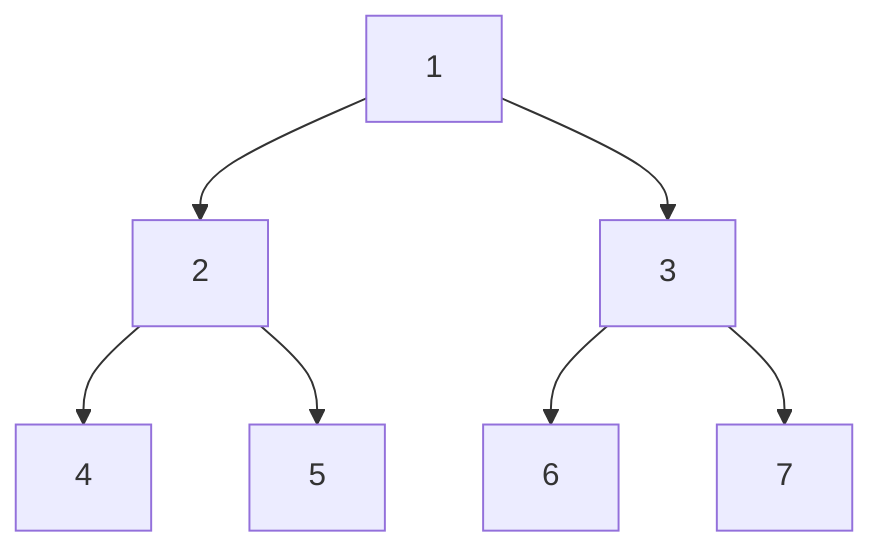

# Lecture 19: Binary Tree Traversals

"Visit every element" was trivial for a linear structure — just walk forward. A tree
offers no single obvious order: at every node, do you go left first, process the node
first, or go right first? Each choice defines a different **traversal**, and each one
turns out to be useful for a different real purpose.

## In This Lecture

- The traversal concept, and why a tree has more than one natural visiting order
- Pre-order, in-order, and post-order traversal (all depth-first)
- Level-order traversal (breadth-first, from Lecture 17)
- A direct comparison, and when to reach for each one

## The Tree Traversal Concept

All traversals in this lecture work on the same example tree:



The three **depth-first** traversals — pre-order, in-order, post-order — differ only in
*when* they process the current node relative to visiting its left and right subtrees.

## Pre-Order Traversal: Node, Left, Right

Process the current node **first**, then recurse left, then recurse right.

```cpp title="tree_traversals.cpp"
#include <iostream>
using namespace std;

struct TreeNode {
    int data;
    TreeNode* left;
    TreeNode* right;
    TreeNode(int value) : data(value), left(nullptr), right(nullptr) {}
};

void preOrder(TreeNode* node) {
    if (node == nullptr) return;
    cout << node->data << " ";   // 1. process the node
    preOrder(node->left);         // 2. recurse left
    preOrder(node->right);        // 3. recurse right
}

void inOrder(TreeNode* node) {
    if (node == nullptr) return;
    inOrder(node->left);          // 1. recurse left
    cout << node->data << " ";   // 2. process the node
    inOrder(node->right);         // 3. recurse right
}

void postOrder(TreeNode* node) {
    if (node == nullptr) return;
    postOrder(node->left);        // 1. recurse left
    postOrder(node->right);       // 2. recurse right
    cout << node->data << " ";   // 3. process the node
}

int main() {
    TreeNode* root = new TreeNode(1);
    root->left = new TreeNode(2);
    root->right = new TreeNode(3);
    root->left->left = new TreeNode(4);
    root->left->right = new TreeNode(5);
    root->right->left = new TreeNode(6);
    root->right->right = new TreeNode(7);

    cout << "Pre-order  (Node, Left, Right): ";
    preOrder(root);
    cout << endl;

    cout << "In-order   (Left, Node, Right): ";
    inOrder(root);
    cout << endl;

    cout << "Post-order (Left, Right, Node): ";
    postOrder(root);
    cout << endl;

    return 0;
}
```

```text
$ g++ -std=c++17 -o tree_traversals tree_traversals.cpp
$ ./tree_traversals
Pre-order  (Node, Left, Right): 1 2 4 5 3 6 7 
In-order   (Left, Node, Right): 4 2 5 1 6 3 7 
Post-order (Left, Right, Node): 4 5 2 6 7 3 1 
```

## In-Order Traversal: Left, Node, Right

Recurse left **first**, then process the node, then recurse right. For a **Binary Search
Tree** specifically (Lecture 20), in-order traversal visits every node in **sorted
order** — this is the single most important fact about in-order traversal in the entire
course, and it's why BSTs are useful at all.

## Post-Order Traversal: Left, Right, Node

Recurse left, then recurse right, and process the node **last**. This ordering guarantees
every node's children are fully processed *before* the node itself — exactly what's
needed to safely delete an entire tree (free every child before freeing the parent) or to
evaluate an expression tree (Lecture 24) bottom-up.

## Recursive Traversal

Notice all three functions above share the exact same three-line shape — only the
*order* of the three lines changes. This is a direct application of Lecture 12's
recursion pattern: the base case is `node == nullptr` (an empty subtree has nothing to
visit), and the recursive case processes the node plus both subtrees in whichever order
defines that traversal.

## Level-Order Traversal

**Level-order** traversal (already used to build trees in Lecture 17) is the one
**breadth-first** traversal: visit every node at depth 0, then every node at depth 1, and
so on — using a queue, not recursion.

```cpp title="level_order.cpp"
#include <iostream>
#include <queue>
using namespace std;

struct TreeNode {
    int data;
    TreeNode* left;
    TreeNode* right;
    TreeNode(int value) : data(value), left(nullptr), right(nullptr) {}
};

void levelOrder(TreeNode* root) {
    if (root == nullptr) return;
    queue<TreeNode*> toVisit;
    toVisit.push(root);

    while (!toVisit.empty()) {
        TreeNode* current = toVisit.front();
        toVisit.pop();
        cout << current->data << " ";
        if (current->left != nullptr) toVisit.push(current->left);
        if (current->right != nullptr) toVisit.push(current->right);
    }
}

int main() {
    TreeNode* root = new TreeNode(1);
    root->left = new TreeNode(2);
    root->right = new TreeNode(3);
    root->left->left = new TreeNode(4);
    root->left->right = new TreeNode(5);
    root->right->left = new TreeNode(6);
    root->right->right = new TreeNode(7);

    cout << "Level-order (breadth-first): ";
    levelOrder(root);
    cout << endl;

    return 0;
}
```

```text
$ g++ -std=c++17 -o level_order level_order.cpp
$ ./level_order
Level-order (breadth-first): 1 2 3 4 5 6 7 
```

## Comparison of Traversal Methods

| Traversal | Order | Uses | Typical application |
|---|---|---|---|
| Pre-order | Node, Left, Right | Recursion (a stack, implicitly) | Copying/cloning a tree; serializing a tree to save it |
| In-order | Left, Node, Right | Recursion | Reading a **BST**'s values in sorted order (Lecture 20) |
| Post-order | Left, Right, Node | Recursion | Safely deleting a tree; evaluating expression trees (Lecture 24) |
| Level-order | Depth 0, then 1, then 2, ... | A queue, explicitly | Printing a tree level by level; finding the shortest path in an unweighted tree |

Notice pre-order, in-order, and post-order all use **recursion**, which means they're all
secretly using the **call stack** (Lecture 12) to remember where to return to — the only
traversal that uses an explicit data structure (a queue) is level-order.

## Applications of Tree Traversal

- **In-order** traversal of a BST retrieves every value in sorted order with zero extra
  sorting work — a direct preview of Lecture 20.
- **Post-order** traversal is required whenever children must be fully processed before
  their parent — freeing memory, or evaluating an expression tree bottom-up (Lecture 24).
- **Pre-order** traversal is the natural way to copy a tree, since you create the root
  first, then attach freshly-copied left and right subtrees to it.
- **Level-order** traversal is how a tree's shape is actually printed for a human to read
  (exactly what Lecture 17's `printLevelOrder` does), and how BFS (Lecture 26) generalizes
  to graphs.

## Try It Yourself

1. Trace `preOrder`, `inOrder`, and `postOrder` by hand on paper for the example tree
   shown above (nodes 1–7), writing down the visit order for each — then confirm every
   one matches `tree_traversals.cpp`'s real output.
2. Write a recursive function `int countLeaves(TreeNode* node)` that returns the number of
   leaf nodes in a tree (a node with `left == nullptr` and `right == nullptr`). Test it on
   the example tree and confirm it returns `4`.

## Key Takeaways

- **Pre-order**, **in-order**, and **post-order** are all depth-first traversals,
  differing only in *when* the current node is processed relative to its two subtrees —
  and all three follow directly from Lecture 12's recursion pattern.
- **In-order** traversal of a Binary Search Tree visits nodes in sorted order — the
  single most important fact in this lecture, and the whole reason BSTs are useful.
- **Post-order** guarantees children are processed before their parent — required for
  safe deletion and bottom-up expression evaluation.
- **Level-order** is the only breadth-first traversal, built on a queue rather than
  recursion — it visits the tree one whole depth at a time.
