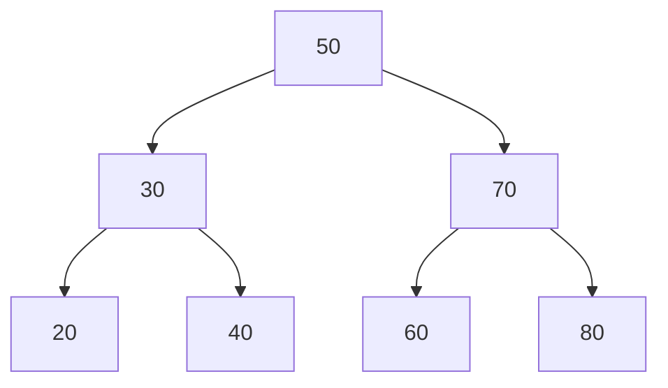

# Lecture 20: Binary Search Trees: Search and Insertion

Every tree so far has stored values with no particular order. Add **one rule** — every
node's left subtree holds only smaller values, and its right subtree holds only larger
ones — and you get a **Binary Search Tree (BST)**: a structure that can search, insert,
and delete in O(log n) time, the tree equivalent of binary search from an array.

## In This Lecture

- The BST property, and how it differs from a plain binary tree
- Searching a BST, both recursively and iteratively
- Inserting into a BST while preserving the property
- Finding the minimum and maximum values
- The complexity of every BST operation, and why the tree's *shape* matters

## The Binary Search Tree Concept and Property

**BST property**: for every node, every value in its **left** subtree is smaller than the
node's own value, and every value in its **right** subtree is larger.



Every value to the left of `50` (`30, 20, 40`) is less than `50`; every value to the
right (`70, 60, 80`) is greater — and that same rule holds recursively at every node, not
just the root (`20 < 30 < 40`, `60 < 70 < 80`).

## Binary Tree versus BST

Every BST *is* a binary tree — it just adds an ordering constraint on top. A plain binary
tree (Lecture 16) makes no promise about where values sit; a BST's entire value comes from
that one added promise, since it's what makes fast search possible at all.

## Searching in a BST

Because of the BST property, search never needs to check both subtrees — comparing the
target against the current node tells you which single subtree it *must* be in, if it
exists at all.

```cpp title="bst.cpp"
#include <iostream>
using namespace std;

struct TreeNode {
    int data;
    TreeNode* left;
    TreeNode* right;
    TreeNode(int value) : data(value), left(nullptr), right(nullptr) {}
};

class BST {
private:
    TreeNode* root;

    TreeNode* insertHelper(TreeNode* node, int value) {
        if (node == nullptr) return new TreeNode(value);
        if (value < node->data) node->left = insertHelper(node->left, value);
        else if (value > node->data) node->right = insertHelper(node->right, value);
        // if value == node->data, it's already present -- do nothing (no duplicates)
        return node;
    }

    bool searchRecursiveHelper(TreeNode* node, int target) const {
        if (node == nullptr) return false;
        if (target == node->data) return true;
        if (target < node->data) return searchRecursiveHelper(node->left, target);
        return searchRecursiveHelper(node->right, target);
    }

public:
    BST() : root(nullptr) {}

    void insert(int value) { root = insertHelper(root, value); }

    bool searchRecursive(int target) const { return searchRecursiveHelper(root, target); }

    bool searchIterative(int target) const {
        TreeNode* current = root;
        while (current != nullptr) {
            if (target == current->data) return true;
            current = (target < current->data) ? current->left : current->right;
        }
        return false;
    }

    int findMin() const {
        TreeNode* current = root;
        while (current->left != nullptr) current = current->left;
        return current->data;
    }

    int findMax() const {
        TreeNode* current = root;
        while (current->right != nullptr) current = current->right;
        return current->data;
    }
};

int main() {
    BST tree;
    for (int value : {50, 30, 70, 20, 40, 60, 80}) {
        tree.insert(value);
    }

    cout << "Search 40 (recursive): " << (tree.searchRecursive(40) ? "found" : "not found") << endl;
    cout << "Search 90 (recursive): " << (tree.searchRecursive(90) ? "found" : "not found") << endl;
    cout << "Search 60 (iterative): " << (tree.searchIterative(60) ? "found" : "not found") << endl;

    cout << "Minimum value: " << tree.findMin() << endl;
    cout << "Maximum value: " << tree.findMax() << endl;

    return 0;
}
```

```text
$ g++ -std=c++17 -o bst bst.cpp
$ ./bst
Search 40 (recursive): found
Search 90 (recursive): not found
Search 60 (iterative): found
Minimum value: 20
Maximum value: 80
```

## Recursive versus Iterative Search

Both versions do exactly the same comparisons, in exactly the same order — the only
difference is *how* they track "keep going": recursion uses the call stack implicitly,
iteration uses an explicit `while` loop and a `current` pointer. The iterative version
avoids the (small) overhead of function calls and cannot risk a stack overflow on a very
deep tree — which is why real-world library implementations of tree search are usually
iterative, even though the recursive version often reads more clearly for teaching.

## Insertion in a BST

Insertion follows the exact same "which side does it belong on?" logic as search, walking
down until it finds an empty spot (a `nullptr`) — then places the new node there. Trace
`insertHelper`: at every node, comparing `value` against `node->data` decides whether to
recurse left or right, exactly mirroring `searchRecursiveHelper`.

## Minimum and Maximum Value

The BST property gives a direct shortcut: the **minimum** value is always the leftmost
node (keep following `left` until there is no more `left`), and the **maximum** is always
the rightmost node — no comparisons against every value needed, unlike an unsorted
structure.

## Complexity of BST Operations

| Operation | Balanced BST | Skewed BST (worst case) |
|---|---|---|
| Search | O(log n) | O(n) |
| Insert | O(log n) | O(n) |
| Find min/max | O(log n) | O(n) |

!!! warning "A BST's speed depends entirely on its shape"
    Every operation's complexity comes from how many levels must be walked — and that
    depends on the tree's **height**. Insert `10, 20, 30, 40, 50` *in that already-sorted
    order* and every node ends up with only a right child: a completely skewed tree,
    structurally identical to a linked list, with search degrading to O(n). A BST built
    from randomly-ordered insertions tends to stay roughly balanced (height ≈ log n), but
    nothing *guarantees* it — which is exactly the problem Lecture 22's AVL tree solves,
    by actively rebalancing itself after every insertion.

## Applications of BST

- **Fast, ordered lookup tables** — anywhere you need both fast search *and* the ability
  to retrieve values in sorted order (via in-order traversal, Lecture 19).
- **Implementing sets and maps** — many language standard libraries' ordered
  set/map types (like C++'s `std::set` and `std::map`) are backed by a self-balancing BST.
- **Range queries** — "find all values between X and Y" can skip entire subtrees that
  fall outside the range, something an unsorted structure can't do.

## Try It Yourself

1. Compile and run `bst.cpp`, then insert the values `10, 20, 30, 40, 50` **in that
   order** into a fresh `BST`, and print the result of `tree.findMax()`'s equivalent
   walk depth (how many `->right` steps does it take?). Confirm this matches the "skewed
   tree" warning above.
2. Add a method `int height() const` to the `BST` class (reusing Lecture 17's recursive
   pattern), and call it on both a BST built from randomly-ordered values and one built
   from already-sorted values, to see the shape difference reflected as a number.

## Key Takeaways

- The **BST property** — left subtree smaller, right subtree larger, at every node — is
  the one rule that turns a plain binary tree into a fast-searchable structure.
- **Search** and **insertion** both work by repeatedly choosing left or right based on a
  single comparison, walking down exactly one path from the root.
- **Minimum** and **maximum** are found directly, by following `left` or `right`
  pointers to the end — no need to check every value.
- A BST's complexity is **O(log n) only if the tree stays roughly balanced** — a
  skewed BST (e.g., built from already-sorted input) degrades to O(n), the exact problem
  Lecture 22's AVL tree exists to prevent.
