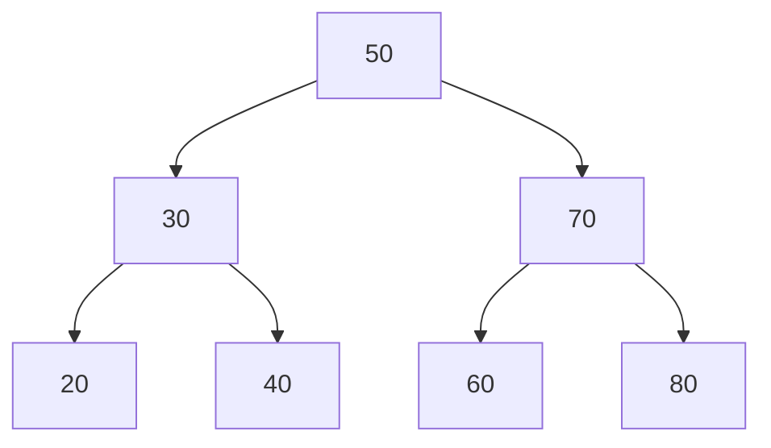
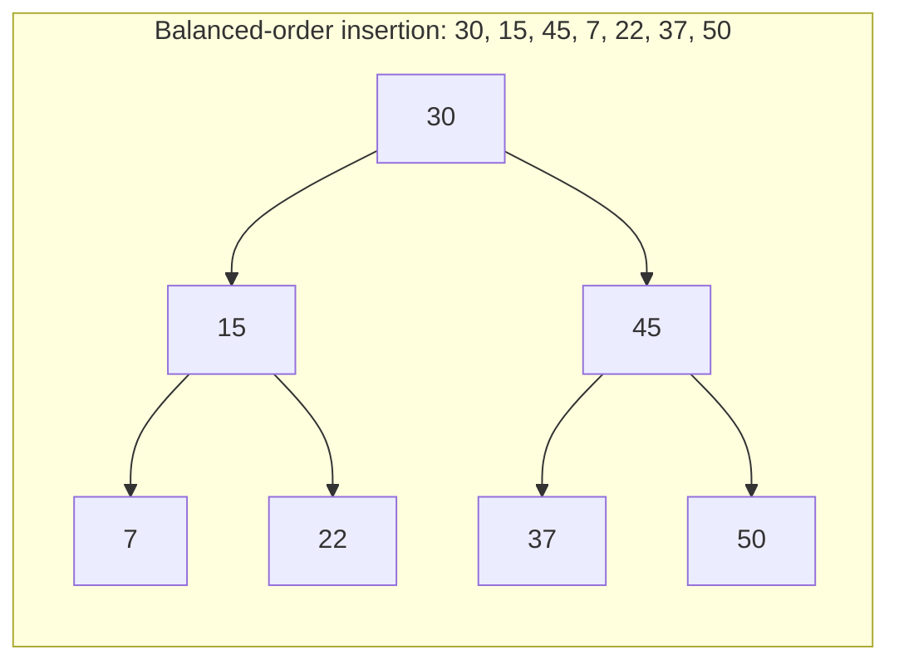
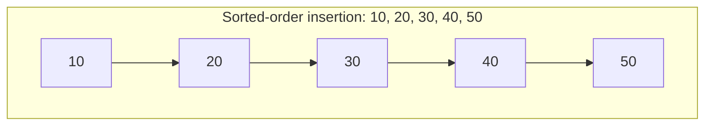

# Lecture 20: Binary Search Trees: Search and Insertion

Every tree so far has stored values with no particular order. Add **one rule** — every
node's left subtree holds only smaller values, and its right subtree holds only larger
ones — and you get a **Binary Search Tree (BST)**: a structure that can search, insert,
and delete in O(log n) time, the tree equivalent of binary search from an array.

## In This Lecture

- The BST property, and how it differs from a plain binary tree
- Searching a BST, both recursively and iteratively
- Inserting into a BST while preserving the property
- Finding the minimum and maximum values
- The complexity of every BST operation, and why the tree's *shape* matters
- A worked example that builds a visibly skewed tree from sorted input, side by side
  with a balanced tree built from the same values in a different order
- A real, measured comparison of search speed on a balanced tree versus a skewed one

## The Binary Search Tree Concept and Property

**BST property**: for every node, every value in its **left** subtree is smaller than the
node's own value, and every value in its **right** subtree is larger.



Every value to the left of `50` (`30, 20, 40`) is less than `50`; every value to the
right (`70, 60, 80`) is greater — and that same rule holds recursively at every node, not
just the root (`20 < 30 < 40`, `60 < 70 < 80`).

## Binary Tree versus BST

Every BST *is* a binary tree — it just adds an ordering constraint on top. A plain binary
tree (Lecture 16) makes no promise about where values sit; a BST's entire value comes from
that one added promise, since it's what makes fast search possible at all.

## Searching in a BST

Because of the BST property, search never needs to check both subtrees — comparing the
target against the current node tells you which single subtree it *must* be in, if it
exists at all.

```cpp title="bst.cpp"
#include <iostream>
using namespace std;

struct TreeNode {
    int data;
    TreeNode* left;
    TreeNode* right;
    TreeNode(int value) : data(value), left(nullptr), right(nullptr) {}
};

class BST {
private:
    TreeNode* root;

    TreeNode* insertHelper(TreeNode* node, int value) {
        if (node == nullptr) return new TreeNode(value);
        if (value < node->data) node->left = insertHelper(node->left, value);
        else if (value > node->data) node->right = insertHelper(node->right, value);
        // if value == node->data, it's already present -- do nothing (no duplicates)
        return node;
    }

    bool searchRecursiveHelper(TreeNode* node, int target) const {
        if (node == nullptr) return false;
        if (target == node->data) return true;
        if (target < node->data) return searchRecursiveHelper(node->left, target);
        return searchRecursiveHelper(node->right, target);
    }

public:
    BST() : root(nullptr) {}

    void insert(int value) { root = insertHelper(root, value); }

    bool searchRecursive(int target) const { return searchRecursiveHelper(root, target); }

    bool searchIterative(int target) const {
        TreeNode* current = root;
        while (current != nullptr) {
            if (target == current->data) return true;
            current = (target < current->data) ? current->left : current->right;
        }
        return false;
    }

    int findMin() const {
        TreeNode* current = root;
        while (current->left != nullptr) current = current->left;
        return current->data;
    }

    int findMax() const {
        TreeNode* current = root;
        while (current->right != nullptr) current = current->right;
        return current->data;
    }
};

int main() {
    BST tree;
    for (int value : {50, 30, 70, 20, 40, 60, 80}) {
        tree.insert(value);
    }

    cout << "Search 40 (recursive): " << (tree.searchRecursive(40) ? "found" : "not found") << endl;
    cout << "Search 90 (recursive): " << (tree.searchRecursive(90) ? "found" : "not found") << endl;
    cout << "Search 60 (iterative): " << (tree.searchIterative(60) ? "found" : "not found") << endl;

    cout << "Minimum value: " << tree.findMin() << endl;
    cout << "Maximum value: " << tree.findMax() << endl;

    return 0;
}
```

```text
$ g++ -std=c++17 -o bst bst.cpp
$ ./bst
Search 40 (recursive): found
Search 90 (recursive): not found
Search 60 (iterative): found
Minimum value: 20
Maximum value: 80
```

## Recursive versus Iterative Search

Both versions do exactly the same comparisons, in exactly the same order — the only
difference is *how* they track "keep going": recursion uses the call stack implicitly,
iteration uses an explicit `while` loop and a `current` pointer. The iterative version
avoids the (small) overhead of function calls and cannot risk a stack overflow on a very
deep tree — which is why real-world library implementations of tree search are usually
iterative, even though the recursive version often reads more clearly for teaching.

## Insertion in a BST

Insertion follows the exact same "which side does it belong on?" logic as search, walking
down until it finds an empty spot (a `nullptr`) — then places the new node there. Trace
`insertHelper`: at every node, comparing `value` against `node->data` decides whether to
recurse left or right, exactly mirroring `searchRecursiveHelper`.

## Minimum and Maximum Value

The BST property gives a direct shortcut: the **minimum** value is always the leftmost
node (keep following `left` until there is no more `left`), and the **maximum** is always
the rightmost node — no comparisons against every value needed, unlike an unsorted
structure.

## Complexity of BST Operations

| Operation | Balanced BST | Skewed BST (worst case) |
|---|---|---|
| Search | O(log n) | O(n) |
| Insert | O(log n) | O(n) |
| Find min/max | O(log n) | O(n) |

!!! warning "A BST's speed depends entirely on its shape"
    Every operation's complexity comes from how many levels must be walked — and that
    depends on the tree's **height**. Insert `10, 20, 30, 40, 50` *in that already-sorted
    order* and every node ends up with only a right child: a completely skewed tree,
    structurally identical to a linked list, with search degrading to O(n). A BST built
    from randomly-ordered insertions tends to stay roughly balanced (height ≈ log n), but
    nothing *guarantees* it — which is exactly the problem Lecture 22's AVL tree solves,
    by actively rebalancing itself after every insertion.

## Worked Example: Building a Skewed Tree

The warning above is easy to read past — seeing the actual shape difference makes it
concrete. Two insertion orders, same seven-ish values, wildly different results:





The balanced tree spreads its 7 values across 3 levels; the skewed tree needs 5 levels for
only 5 values, because every insertion after the first attaches as a right child of the
previous one — a BST built from already-sorted input can *never* branch left, since every
new value is larger than everything inserted so far.

```cpp title="bst_skewed.cpp"
#include <iostream>
using namespace std;

struct TreeNode {
    int data;
    TreeNode* left;
    TreeNode* right;
    TreeNode(int value) : data(value), left(nullptr), right(nullptr) {}
};

class BST {
private:
    TreeNode* root;

    TreeNode* insertHelper(TreeNode* node, int value) {
        if (node == nullptr) return new TreeNode(value);
        if (value < node->data) node->left = insertHelper(node->left, value);
        else if (value > node->data) node->right = insertHelper(node->right, value);
        return node;
    }

    int heightHelper(TreeNode* node) const {
        if (node == nullptr) return -1;
        return 1 + max(heightHelper(node->left), heightHelper(node->right));
    }

    // Prints the tree sideways: right subtree above, left subtree below,
    // indented by depth -- makes a skewed "staircase" shape immediately
    // visible, the same way turning your head 90 degrees to look at a
    // real staircase would be.
    void printSidewaysHelper(TreeNode* node, int depth) const {
        if (node == nullptr) return;
        printSidewaysHelper(node->right, depth + 1);
        cout << string(depth * 4, ' ') << node->data << endl;
        printSidewaysHelper(node->left, depth + 1);
    }

public:
    BST() : root(nullptr) {}

    void insert(int value) { root = insertHelper(root, value); }

    int height() const { return heightHelper(root); }

    void printSideways() const {
        if (root == nullptr) { cout << "(empty tree)" << endl; return; }
        printSidewaysHelper(root, 0);
    }
};

int main() {
    BST balanced;
    for (int value : {30, 15, 45, 7, 22, 37, 50}) {
        balanced.insert(value);
    }

    BST skewed;
    for (int value : {10, 20, 30, 40, 50}) {
        skewed.insert(value);
    }

    cout << "Balanced-order insertion (30,15,45,7,22,37,50):" << endl;
    balanced.printSideways();
    cout << "Height: " << balanced.height() << endl;

    cout << endl << "Sorted-order insertion (10,20,30,40,50):" << endl;
    skewed.printSideways();
    cout << "Height: " << skewed.height() << endl;

    return 0;
}
```

```text
$ g++ -std=c++17 -o bst_skewed bst_skewed.cpp
$ ./bst_skewed
Balanced-order insertion (30,15,45,7,22,37,50):
        50
    45
        37
30
        22
    15
        7
Height: 2

Sorted-order insertion (10,20,30,40,50):
                50
            40
        30
    20
10
Height: 4
```

Read `printSideways`'s output rotated 90 degrees counter-clockwise (root `30` at the far
left, its children indented to the right) and it's literally the balanced tree's diagram
above. The skewed output tells the same story numerically: **7 nodes fit in height 2**
for the balanced tree, while the skewed tree needs **height 4 for only 5 nodes** — every
single one of those 5 nodes sits on one unbroken right-leaning path, exactly the
"linked list wearing a tree's clothing" shape Lecture 16 warned about.

## Real Comparison: Search Speed, Balanced versus Skewed

Height is not just an abstract number — it's *exactly* how many comparisons a worst-case
search performs, since search walks one node per level. The next program builds a large
balanced BST (inserting the middle of a sorted range first, then recursively the middle of
each half — a divide-and-conquer insertion order that keeps height around `log₂ n`) and a
large skewed BST (inserting the same values in plain sorted order), then times searching
for every value in each tree. Per this book's rule against fabricated or hand-predicted
performance numbers, the program measures its own timing with `<chrono>` and prints only
the **verdict** — which tree was faster — rather than raw, machine-dependent nanosecond
counts that could vary from one computer to the next.

```cpp title="bst_timing.cpp"
#include <iostream>
#include <chrono>
using namespace std;
using namespace std::chrono;

struct TreeNode {
    int data;
    TreeNode* left;
    TreeNode* right;
    TreeNode(int value) : data(value), left(nullptr), right(nullptr) {}
};

TreeNode* insertNode(TreeNode* node, int value) {
    if (node == nullptr) return new TreeNode(value);
    if (value < node->data) node->left = insertNode(node->left, value);
    else if (value > node->data) node->right = insertNode(node->right, value);
    return node;
}

bool search(TreeNode* node, int target) {
    while (node != nullptr) {
        if (target == node->data) return true;
        node = (target < node->data) ? node->left : node->right;
    }
    return false;
}

// Inserts sortedValues[lo..hi] by always inserting the MIDDLE value first --
// this builds a tree that stays balanced, height ~ log2(n), instead of the
// straight line you'd get from inserting the same values in sorted order.
void insertBalanced(TreeNode*& root, int sortedValues[], int lo, int hi) {
    if (lo > hi) return;
    int mid = (lo + hi) / 2;
    root = insertNode(root, sortedValues[mid]);
    insertBalanced(root, sortedValues, lo, mid - 1);
    insertBalanced(root, sortedValues, mid + 1, hi);
}

int main() {
    const int N = 6000;
    int values[N];
    for (int i = 0; i < N; i++) values[i] = i;

    TreeNode* balancedRoot = nullptr;
    insertBalanced(balancedRoot, values, 0, N - 1);

    TreeNode* skewedRoot = nullptr;
    for (int i = 0; i < N; i++) skewedRoot = insertNode(skewedRoot, values[i]);   // already sorted -> skewed

    // Search for every value once, repeated a few passes so the total time
    // is large enough to measure reliably.
    const int PASSES = 20;

    auto startBalanced = steady_clock::now();
    int foundBalanced = 0;
    for (int pass = 0; pass < PASSES; pass++)
        for (int i = 0; i < N; i++)
            if (search(balancedRoot, values[i])) foundBalanced++;
    auto endBalanced = steady_clock::now();

    auto startSkewed = steady_clock::now();
    int foundSkewed = 0;
    for (int pass = 0; pass < PASSES; pass++)
        for (int i = 0; i < N; i++)
            if (search(skewedRoot, values[i])) foundSkewed++;
    auto endSkewed = steady_clock::now();

    auto balancedDuration = duration_cast<microseconds>(endBalanced - startBalanced).count();
    auto skewedDuration = duration_cast<microseconds>(endSkewed - startSkewed).count();

    cout << "All " << N << " values found in both trees: "
         << (foundBalanced == N * PASSES && foundSkewed == N * PASSES ? "yes" : "no") << endl;
    cout << "Search verdict: the balanced tree was "
         << (balancedDuration < skewedDuration ? "FASTER" : "NOT faster")
         << " than the skewed tree over " << (PASSES * N) << " total searches." << endl;

    return 0;
}
```

```text
$ g++ -std=c++17 -o bst_timing bst_timing.cpp
$ ./bst_timing
All 6000 values found in both trees: yes
Search verdict: the balanced tree was FASTER than the skewed tree over 120000 total searches.
```

Both trees hold the exact same 6,000 values and answer every search correctly — the only
difference is *shape*, and shape alone is enough to make the balanced tree's 120,000
searches measurably faster than the skewed tree's. A skewed BST with `n` nodes has height
`n - 1`, so searching it degrades to the same O(n) walk as a linked list; nothing about the
BST property itself prevents this, since the property only constrains *relative order*
(left smaller, right larger), never *shape*. That gap — a BST that is only *usually*
balanced by luck of insertion order, versus one that is *guaranteed* balanced — is exactly
what Lecture 22's AVL tree closes, by actively rotating nodes after every insertion to keep
height at O(log n) no matter what order values arrive in.

## Applications of BST

- **Fast, ordered lookup tables** — anywhere you need both fast search *and* the ability
  to retrieve values in sorted order (via in-order traversal, Lecture 19).
- **Implementing sets and maps** — many language standard libraries' ordered
  set/map types (like C++'s `std::set` and `std::map`) are backed by a self-balancing BST.
- **Range queries** — "find all values between X and Y" can skip entire subtrees that
  fall outside the range, something an unsorted structure can't do.

## Try It Yourself

1. Compile and run `bst.cpp`, then insert the values `10, 20, 30, 40, 50` **in that
   order** into a fresh `BST`, and print the result of `tree.findMax()`'s equivalent
   walk depth (how many `->right` steps does it take?). Confirm this matches the "skewed
   tree" warning above.
2. Add a method `int height() const` to the `BST` class in `bst.cpp` (reusing Lecture 17's
   recursive pattern — `bst_skewed.cpp` already shows the technique), and call it on both a
   BST built from randomly-ordered values and one built from already-sorted values, to see
   the shape difference reflected as a number.
3. Compile and run `bst_skewed.cpp`, then add a third tree built by inserting
   `10, 50, 20, 40, 30` (deliberately neither sorted nor the same as the "balanced" order
   given), print its `printSideways()` output and `height()`, and decide for yourself
   whether its shape counts as "balanced enough."
4. Compile and run `bst_timing.cpp`, then change `N` to `600` (ten times smaller) and
   re-run it a few times. Is the verdict ("the balanced tree was FASTER") still reliably
   the same every time, or does it start to flip? What does that tell you about how large
   a gap in height is needed before the timing difference stops being noise?
5. Modify `insertBalanced` in `bst_timing.cpp` to insert the **last** element of each range
   first instead of the middle one, and predict what shape of tree that produces before
   re-running — then check `bst_skewed.cpp`'s `printSideways` technique against it if you
   want to see the shape directly.

## Key Takeaways

- The **BST property** — left subtree smaller, right subtree larger, at every node — is
  the one rule that turns a plain binary tree into a fast-searchable structure.
- **Search** and **insertion** both work by repeatedly choosing left or right based on a
  single comparison, walking down exactly one path from the root.
- **Minimum** and **maximum** are found directly, by following `left` or `right`
  pointers to the end — no need to check every value.
- Insertion **order**, not just the set of values, determines a BST's shape: inserting
  already-sorted values produces a **skewed** tree — every node with only a right child,
  height `n - 1` for `n` nodes — while a divide-and-conquer insertion order (always the
  middle of what remains) keeps height near `log₂ n`.
- A BST's complexity is **O(log n) only if the tree stays roughly balanced** — a
  skewed BST (e.g., built from already-sorted input) degrades to O(n), measurably slower
  in a real, compiled search-speed comparison, and the exact problem Lecture 22's AVL
  tree exists to prevent by actively rebalancing after every insertion.
