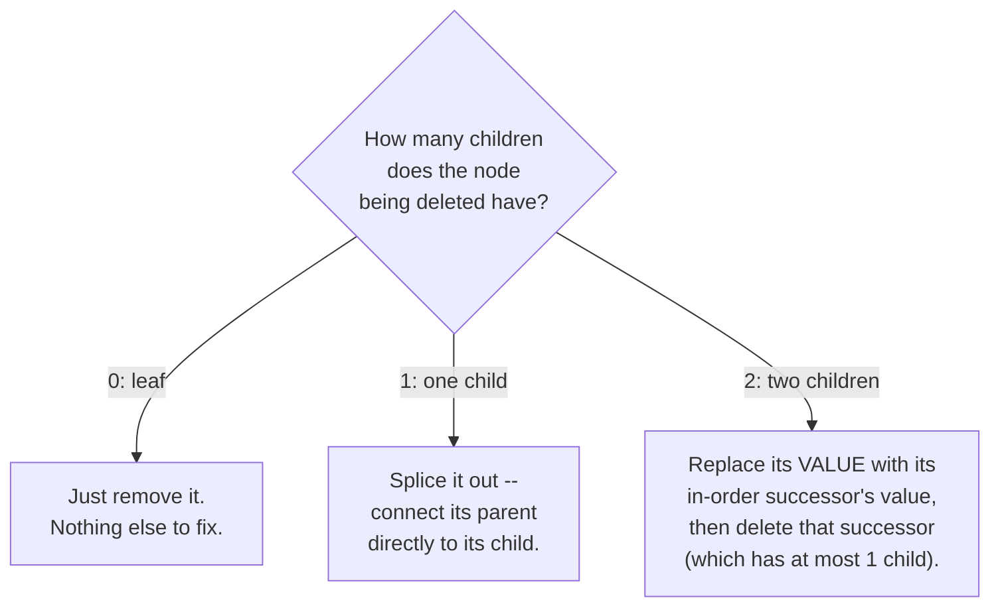
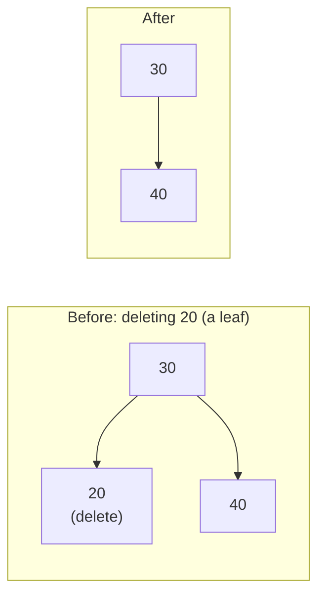
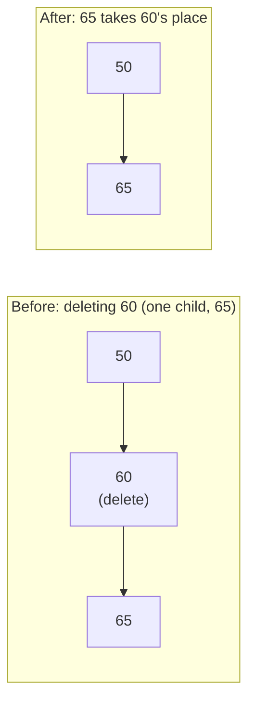
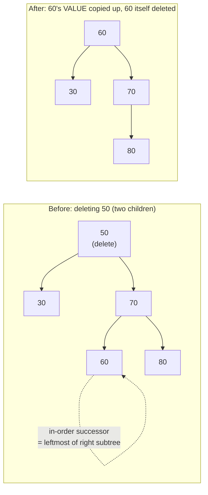
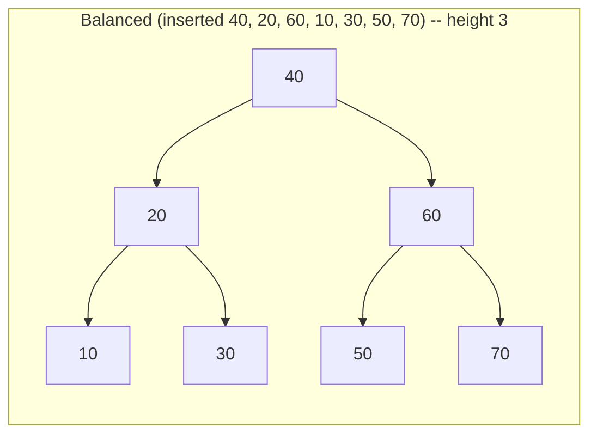
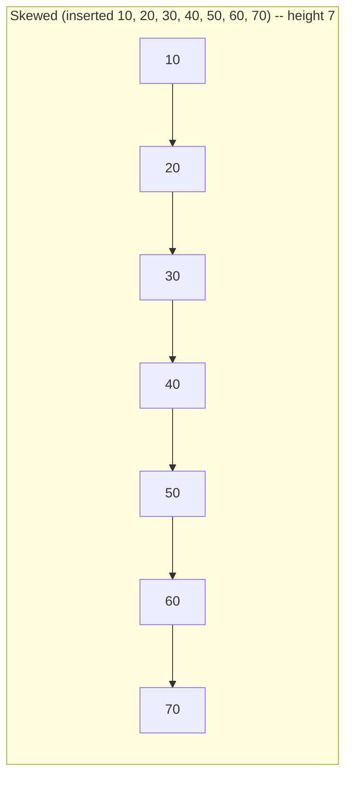

# Lecture 21: Binary Search Trees: Deletion and Analysis

Insertion only ever needed to find one empty spot. Deletion is genuinely harder, because
removing a node must not break the BST property for anything still connected to it —
and the fix required depends entirely on how many children the node being deleted has.

## In This Lecture

- The three cases of BST deletion: leaf, one child, two children
- Why the two-children case needs a helper concept: the in-order successor
- A worked example of deletion cascading several levels deep, traced with real output
- The in-order predecessor as a symmetric alternative to the successor
- Best-case and worst-case behavior, tied directly to tree shape
- Common pitfalls when implementing BST deletion by hand

## BST Deletion: Three Cases



### Case 1: Deleting a Leaf Node

No children means nothing depends on this node — simply remove it, and set its parent's
pointer to it to `nullptr`.



### Case 2: Deleting a Node with One Child

The node's single child can safely take its exact place — connect the deleted node's
*parent* directly to the deleted node's *child*, skipping over the deleted node entirely.



### Case 3: Deleting a Node with Two Children

This is the genuinely tricky case: you can't just remove the node, because *both* of its
subtrees need a new place to attach, and neither can simply replace the other without
risking the BST property. The standard fix: find the node's **in-order successor** — the
*smallest* value in its right subtree (found the same way as Lecture 20's `findMin`,
starting from the right child) — copy that value into the node being "deleted," and then
delete the successor node instead, which is guaranteed to have **at most one child**
(because it's the leftmost node of a subtree, so it can have no left child of its own),
reducing this case back to Case 1 or Case 2.



Notice which *node object* actually gets freed: `50`'s original struct is **never**
deleted in this case — it survives, but `node->data = successor->data` overwrites its
value to `60`. It's the *successor's* original node (`60`, found several pointers away)
whose memory is what the recursive call `deleteHelper(node->right, successor->data)`
actually frees, since by the time that recursive call finds it, `60` is a leaf (Case 1).

```cpp title="bst_delete.cpp"
#include <iostream>
using namespace std;

struct TreeNode {
    int data;
    TreeNode* left;
    TreeNode* right;
    TreeNode(int value) : data(value), left(nullptr), right(nullptr) {}
};

class BST {
private:
    TreeNode* root;

    TreeNode* insertHelper(TreeNode* node, int value) {
        if (node == nullptr) return new TreeNode(value);
        if (value < node->data) node->left = insertHelper(node->left, value);
        else if (value > node->data) node->right = insertHelper(node->right, value);
        return node;
    }

    TreeNode* findMinNode(TreeNode* node) const {
        while (node->left != nullptr) node = node->left;
        return node;
    }

    TreeNode* deleteHelper(TreeNode* node, int value) {
        if (node == nullptr) return nullptr;

        if (value < node->data) {
            node->left = deleteHelper(node->left, value);
        } else if (value > node->data) {
            node->right = deleteHelper(node->right, value);
        } else {
            // Found the node to delete.
            if (node->left == nullptr && node->right == nullptr) {
                // Case 1: leaf node
                delete node;
                return nullptr;
            } else if (node->left == nullptr) {
                // Case 2: only a right child
                TreeNode* temp = node->right;
                delete node;
                return temp;
            } else if (node->right == nullptr) {
                // Case 2: only a left child
                TreeNode* temp = node->left;
                delete node;
                return temp;
            } else {
                // Case 3: two children -- find in-order successor (min of right subtree)
                TreeNode* successor = findMinNode(node->right);
                node->data = successor->data;                      // copy its value up
                node->right = deleteHelper(node->right, successor->data);  // delete the successor
            }
        }
        return node;
    }

    void inOrderHelper(TreeNode* node) const {
        if (node == nullptr) return;
        inOrderHelper(node->left);
        cout << node->data << " ";
        inOrderHelper(node->right);
    }

public:
    BST() : root(nullptr) {}
    void insert(int value) { root = insertHelper(root, value); }
    void remove(int value) { root = deleteHelper(root, value); }
    void printInOrder() const { inOrderHelper(root); cout << endl; }
};

int main() {
    BST tree;
    for (int value : {50, 30, 70, 20, 40, 60, 80, 65}) {
        tree.insert(value);
    }

    cout << "Original (in-order, so sorted): ";
    tree.printInOrder();

    tree.remove(20);   // Case 1: leaf node
    cout << "After deleting 20 (leaf):       ";
    tree.printInOrder();

    tree.remove(60);   // Case 2: one child (65)
    cout << "After deleting 60 (one child):  ";
    tree.printInOrder();

    tree.remove(70);   // Case 3: two children (65 was 60's child, now 70's right subtree)
    cout << "After deleting 70 (two children): ";
    tree.printInOrder();

    return 0;
}
```

```text
$ g++ -std=c++17 -o bst_delete bst_delete.cpp
$ ./bst_delete
Original (in-order, so sorted): 20 30 40 50 60 65 70 80 
After deleting 20 (leaf):       30 40 50 60 65 70 80 
After deleting 60 (one child):  30 40 50 65 70 80 
After deleting 70 (two children): 30 40 50 65 80 
```

The BST stays perfectly sorted (via in-order traversal) after every single deletion — the
strongest possible confirmation that the BST property was preserved throughout, no matter
which of the three cases fired.

## A Multi-Level Cascading Deletion

The `main()` example above kept every deletion shallow — the successor was always just
one or two hops away. That's not guaranteed. Deleting a node with two children can require
walking arbitrarily far down the right subtree to find the successor, and then walking
that *same* distance again to actually remove it. The code below instruments
`deleteHelper` with a depth counter to make that cascade visible.

```cpp title="bst_delete_cascade.cpp"
#include <iostream>
#include <string>
using namespace std;

struct TreeNode {
    int data;
    TreeNode* left;
    TreeNode* right;
    TreeNode(int value) : data(value), left(nullptr), right(nullptr) {}
};

TreeNode* insertHelper(TreeNode* node, int value) {
    if (node == nullptr) return new TreeNode(value);
    if (value < node->data) node->left = insertHelper(node->left, value);
    else if (value > node->data) node->right = insertHelper(node->right, value);
    return node;
}

// Same deleteHelper as bst_delete.cpp, but with a depth counter and trace
// printing so the recursive descent is visible, not just the final result.
TreeNode* deleteHelper(TreeNode* node, int value, int depth) {
    if (node == nullptr) return nullptr;

    if (value < node->data) {
        cout << string(depth * 2, ' ') << "depth " << depth << ": " << value
             << " < " << node->data << ", recurse left" << endl;
        node->left = deleteHelper(node->left, value, depth + 1);
    } else if (value > node->data) {
        cout << string(depth * 2, ' ') << "depth " << depth << ": " << value
             << " > " << node->data << ", recurse right" << endl;
        node->right = deleteHelper(node->right, value, depth + 1);
    } else {
        cout << string(depth * 2, ' ') << "depth " << depth << ": found " << value << " -- ";
        if (node->left == nullptr && node->right == nullptr) {
            cout << "leaf, remove directly" << endl;
            delete node;
            return nullptr;
        } else if (node->left == nullptr) {
            cout << "one child (right), splice it in" << endl;
            TreeNode* temp = node->right;
            delete node;
            return temp;
        } else if (node->right == nullptr) {
            cout << "one child (left), splice it in" << endl;
            TreeNode* temp = node->left;
            delete node;
            return temp;
        } else {
            cout << "two children, find in-order successor" << endl;
            TreeNode* successor = node->right;
            int successorDepth = depth + 1;
            while (successor->left != nullptr) {
                cout << string(successorDepth * 2, ' ') << "depth " << successorDepth
                     << ": successor search, " << successor->data << " has a left child, go left" << endl;
                successor = successor->left;
                successorDepth++;
            }
            cout << string(successorDepth * 2, ' ') << "depth " << successorDepth
                 << ": successor found = " << successor->data << endl;
            cout << string(depth * 2, ' ') << "depth " << depth << ": copy " << successor->data
                 << " into this node, then delete " << successor->data << " from the right subtree" << endl;
            node->data = successor->data;
            node->right = deleteHelper(node->right, successor->data, depth + 1);
        }
    }
    return node;
}

void printIndented(TreeNode* node, int depth = 0) {
    if (node == nullptr) return;
    printIndented(node->right, depth + 1);
    cout << string(depth * 4, ' ') << node->data << endl;
    printIndented(node->left, depth + 1);
}

void inOrder(TreeNode* node) {
    if (node == nullptr) return;
    inOrder(node->left);
    cout << node->data << " ";
    inOrder(node->right);
}

int main() {
    // Build a tree where deleting the ROOT requires walking six levels down
    // the right subtree to find the in-order successor, then six levels
    // again to actually remove it -- deletion is not always a shallow fix.
    TreeNode* root = nullptr;
    for (int value : {50, 30, 80, 20, 40, 70, 65, 60, 58, 57}) {
        root = insertHelper(root, value);
    }

    cout << "Tree before deletion (rotated sideways, root on the left):" << endl;
    printIndented(root);
    cout << endl << "In-order (sorted): ";
    inOrder(root);
    cout << endl << endl;

    cout << "Deleting the ROOT (50), which has two children:" << endl;
    root = deleteHelper(root, 50, 0);

    cout << endl << "Tree after deletion:" << endl;
    printIndented(root);
    cout << endl << "In-order (still sorted): ";
    inOrder(root);
    cout << endl;

    return 0;
}
```

```text
$ g++ -std=c++17 -o bst_delete_cascade bst_delete_cascade.cpp
$ ./bst_delete_cascade
Tree before deletion (rotated sideways, root on the left):
    80
        70
            65
                60
                    58
                        57
50
        40
    30
        20

In-order (sorted): 20 30 40 50 57 58 60 65 70 80 

Deleting the ROOT (50), which has two children:
depth 0: found 50 -- two children, find in-order successor
  depth 1: successor search, 80 has a left child, go left
    depth 2: successor search, 70 has a left child, go left
      depth 3: successor search, 65 has a left child, go left
        depth 4: successor search, 60 has a left child, go left
          depth 5: successor search, 58 has a left child, go left
            depth 6: successor found = 57
depth 0: copy 57 into this node, then delete 57 from the right subtree
  depth 1: 57 < 80, recurse left
    depth 2: 57 < 70, recurse left
      depth 3: 57 < 65, recurse left
        depth 4: 57 < 60, recurse left
          depth 5: 57 < 58, recurse left
            depth 6: found 57 -- leaf, remove directly

Tree after deletion:
    80
        70
            65
                60
                    58
57
        40
    30
        20

In-order (still sorted): 20 30 40 57 58 60 65 70 80
```

Two things worth noticing in that trace. First, the search for the successor and the
deletion of the successor walk the **exact same six-node path** twice — the code doesn't
remember where it found `57` the first time, so it re-derives the path via the same value
comparisons the second time. Second, notice `50` and `57` never appear in the same place
at once: `50`'s node survives and is silently relabeled `57`, while the *real* `57` node
several levels down is the one that's actually freed — exactly the point made above.

!!! note "Predecessor works exactly as well as successor"
    This lecture (and most textbooks) uses the **in-order successor** — the minimum of the
    right subtree — but the **in-order predecessor** (the *maximum* of the *left*
    subtree, found by walking `node->left` and then `right` until `right` is `nullptr`)
    works identically by symmetry: it's also guaranteed to have at most one child, and
    copying its value up preserves the BST property exactly the same way. Real-world BST
    and AVL implementations pick one convention and use it consistently; neither is more
    "correct" than the other, and alternating between them for different deletions would
    still produce a valid BST, just an unpredictable one to trace by hand.

## Balanced BST versus Skewed BST

Lecture 20 already warned about this, but deletion makes it concrete: repeatedly deleting
and re-inserting values can shift a BST's shape unpredictably. A **balanced** BST keeps
its height close to `log₂(n)`; a **skewed** BST — in the worst case, a straight line of
single-child nodes — has height `n - 1`, no better than a linked list.

The same seven values, `10` through `70`, can end up in either shape depending purely on
*insertion order* — the values themselves never change, only what order they arrived in:





Both are valid BSTs over the exact same seven values — in-order traversal produces the
identical sorted sequence for both. What differs is how many comparisons `search`,
`insert`, or `delete` need to reach any given value: at most 3 for the balanced shape
(a complete tree of 7 nodes has height 3), but up to 7 for the skewed one.

## Best-Case and Worst-Case Behavior

| | Balanced BST | Skewed BST |
|---|---|---|
| Height | O(log n) | O(n) |
| Search/Insert/Delete | O(log n) | O(n) |
| Deletion's *extra* work beyond finding the node (Case 3 only) | O(log n) to find the successor | O(n) to find the successor |

This is worth internalizing precisely: **a BST's Big-O is not a fixed property of "being
a BST"** — it's a property of the tree's actual *shape* at the time, which depends on the
order values were inserted (and deleted). This exact gap — same structure, wildly
different performance depending on shape — is Lecture 22's motivation for the AVL tree,
which adds automatic rebalancing so the worst case simply can't happen.

### Deletion's Three Cases, Side by Side

| Case | Children | Fix | Cost of the fix itself |
|---|---|---|---|
| 1 | 0 (leaf) | Remove directly | O(1) |
| 2 | 1 | Splice parent to child | O(1) |
| 3 | 2 | Copy successor's value up, then delete the successor | O(height) to *find* the successor, then the same recursive delete applies to it |

Every case eventually bottoms out at O(1) work — Case 3 is only "expensive" in the sense
that *finding* the successor costs a walk down the tree, exactly like Cases 1 and 2's own
walk down to find the node to delete in the first place. No case is inherently slower than
a plain `search` on the same tree.

### Common Pitfalls in BST Deletion

- **Freeing before reading** — exactly Lecture 5's classic bug, transplanted to trees:
  `delete node` before saving whatever pointer or value you still need from it corrupts
  the deletion. `bst_delete.cpp` above avoids this by saving `temp` (Case 2) or reading
  `successor->data` (Case 3) *before* any `delete` call.
- **Forgetting the two-children case reduces, it doesn't finish** — a common mistake is to
  copy the successor's value up and stop, forgetting that the *original* successor node
  (still sitting in the right subtree, now a duplicate value) also needs to be removed via
  the recursive `deleteHelper` call.
- **Assuming the successor is always the right child directly** — it's the *leftmost* node
  of the right subtree, which can be arbitrarily far down, as the cascading example above
  demonstrates. Code that only checks `node->right` itself (instead of walking
  `node->right->left->left->...`) silently produces wrong results whenever the successor
  isn't immediately adjacent.

## Applications of BST

Beyond ordered lookup (Lecture 20), BSTs power:

- **Range and nearest-neighbor queries** — "find every value between 40 and 70" can skip
  entire subtrees provably outside that range.
- **Priority scheduling with ordering** — where both "give me the smallest" and "search
  for a specific value" are needed together, something a plain heap (Lecture 23) alone
  doesn't support.

## Try It Yourself

1. Trace `deleteHelper`'s Case 3 by hand: draw the tree from `main()` right before
   `tree.remove(70)` is called, find `70`'s in-order successor yourself, and confirm it
   matches what the program's real output implies.
2. Modify `bst_delete.cpp` to delete every value from the tree, one at a time, in the same
   order they were inserted, printing `printInOrder()` after each deletion. Confirm the
   tree correctly ends up printing nothing (an empty line) after the last deletion.
3. Modify `bst_delete_cascade.cpp` to build the tree by inserting the same ten values in a
   *different* order (try `{50, 80, 70, 65, 60, 58, 57, 30, 20, 40}`) and delete `50`
   again. Does the trace still cascade six levels deep? Explain, based on the resulting
   tree's shape, why it does or doesn't.
4. Implement `findPredecessor` (mirroring `findMinNode`, but walking `node->left` then
   `right` repeatedly) and rewrite `deleteHelper`'s Case 3 to use the in-order
   **predecessor** instead of the successor. Run it against the same `main()` from
   `bst_delete.cpp` and confirm `printInOrder()` still produces a correctly sorted result
   after every deletion — a different internal shape, but an equally valid BST.

## Key Takeaways

- BST deletion has **three cases**, decided by how many children the node being deleted
  has: 0 (just remove), 1 (splice out), or 2 (replace with the in-order successor, then
  delete that successor instead).
- The **in-order successor** of a node with two children is always the leftmost node of
  its right subtree — found the same way as `findMin` — and is guaranteed to have at most
  one child, which is what makes the two-children case reducible to the simpler cases.
- The node whose *value* changes (the one being "deleted") and the node whose *memory* is
  actually freed (the successor) are two different nodes — a two-children deletion never
  frees the node it was called on.
- The **in-order predecessor** (max of the left subtree) is an equally valid, purely
  symmetric alternative to the successor — neither is more "correct."
- Case 3's cost comes entirely from *finding* the successor, which can be as cheap as
  O(log n) or as expensive as O(n) depending on the tree's shape — exactly like any other
  BST walk.
- A BST's actual performance depends entirely on its **current shape**, not just on being
  a BST — a skewed tree gives no better than O(n) for any operation.
- This shape-dependence is precisely the problem Lecture 22's **AVL tree** solves.
