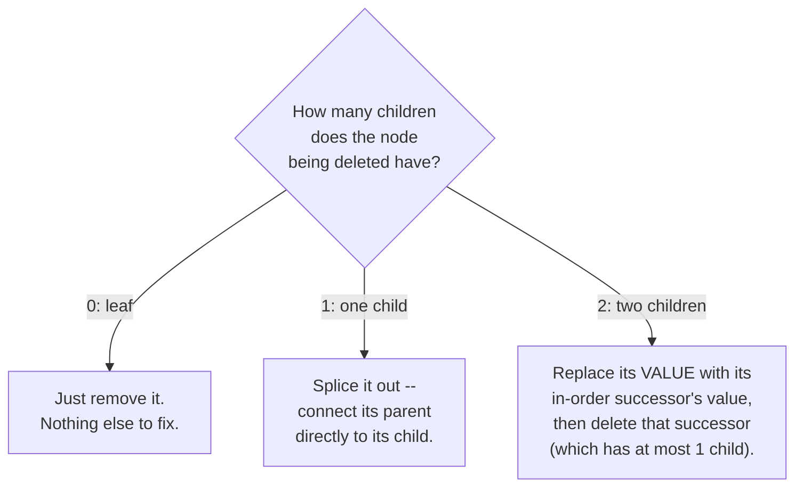

# Lecture 21: Binary Search Trees: Deletion and Analysis

Insertion only ever needed to find one empty spot. Deletion is genuinely harder, because
removing a node must not break the BST property for anything still connected to it —
and the fix required depends entirely on how many children the node being deleted has.

## In This Lecture

- The three cases of BST deletion: leaf, one child, two children
- Why the two-children case needs a helper concept: the in-order successor
- Best-case and worst-case behavior, tied directly to tree shape

## BST Deletion: Three Cases



### Case 1: Deleting a Leaf Node

No children means nothing depends on this node — simply remove it, and set its parent's
pointer to it to `nullptr`.

### Case 2: Deleting a Node with One Child

The node's single child can safely take its exact place — connect the deleted node's
*parent* directly to the deleted node's *child*, skipping over the deleted node entirely.

### Case 3: Deleting a Node with Two Children

This is the genuinely tricky case: you can't just remove the node, because *both* of its
subtrees need a new place to attach, and neither can simply replace the other without
risking the BST property. The standard fix: find the node's **in-order successor** — the
*smallest* value in its right subtree (found the same way as Lecture 20's `findMin`,
starting from the right child) — copy that value into the node being "deleted," and then
delete the successor node instead, which is guaranteed to have **at most one child**
(because it's the leftmost node of a subtree, so it can have no left child of its own),
reducing this case back to Case 1 or Case 2.

```cpp title="bst_delete.cpp"
#include <iostream>
using namespace std;

struct TreeNode {
    int data;
    TreeNode* left;
    TreeNode* right;
    TreeNode(int value) : data(value), left(nullptr), right(nullptr) {}
};

class BST {
private:
    TreeNode* root;

    TreeNode* insertHelper(TreeNode* node, int value) {
        if (node == nullptr) return new TreeNode(value);
        if (value < node->data) node->left = insertHelper(node->left, value);
        else if (value > node->data) node->right = insertHelper(node->right, value);
        return node;
    }

    TreeNode* findMinNode(TreeNode* node) const {
        while (node->left != nullptr) node = node->left;
        return node;
    }

    TreeNode* deleteHelper(TreeNode* node, int value) {
        if (node == nullptr) return nullptr;

        if (value < node->data) {
            node->left = deleteHelper(node->left, value);
        } else if (value > node->data) {
            node->right = deleteHelper(node->right, value);
        } else {
            // Found the node to delete.
            if (node->left == nullptr && node->right == nullptr) {
                // Case 1: leaf node
                delete node;
                return nullptr;
            } else if (node->left == nullptr) {
                // Case 2: only a right child
                TreeNode* temp = node->right;
                delete node;
                return temp;
            } else if (node->right == nullptr) {
                // Case 2: only a left child
                TreeNode* temp = node->left;
                delete node;
                return temp;
            } else {
                // Case 3: two children -- find in-order successor (min of right subtree)
                TreeNode* successor = findMinNode(node->right);
                node->data = successor->data;                      // copy its value up
                node->right = deleteHelper(node->right, successor->data);  // delete the successor
            }
        }
        return node;
    }

    void inOrderHelper(TreeNode* node) const {
        if (node == nullptr) return;
        inOrderHelper(node->left);
        cout << node->data << " ";
        inOrderHelper(node->right);
    }

public:
    BST() : root(nullptr) {}
    void insert(int value) { root = insertHelper(root, value); }
    void remove(int value) { root = deleteHelper(root, value); }
    void printInOrder() const { inOrderHelper(root); cout << endl; }
};

int main() {
    BST tree;
    for (int value : {50, 30, 70, 20, 40, 60, 80, 65}) {
        tree.insert(value);
    }

    cout << "Original (in-order, so sorted): ";
    tree.printInOrder();

    tree.remove(20);   // Case 1: leaf node
    cout << "After deleting 20 (leaf):       ";
    tree.printInOrder();

    tree.remove(60);   // Case 2: one child (65)
    cout << "After deleting 60 (one child):  ";
    tree.printInOrder();

    tree.remove(70);   // Case 3: two children (65 was 60's child, now 70's right subtree)
    cout << "After deleting 70 (two children): ";
    tree.printInOrder();

    return 0;
}
```

```text
$ g++ -std=c++17 -o bst_delete bst_delete.cpp
$ ./bst_delete
Original (in-order, so sorted): 20 30 40 50 60 65 70 80 
After deleting 20 (leaf):       30 40 50 60 65 70 80 
After deleting 60 (one child):  30 40 50 65 70 80 
After deleting 70 (two children): 30 40 50 65 80 
```

The BST stays perfectly sorted (via in-order traversal) after every single deletion — the
strongest possible confirmation that the BST property was preserved throughout, no matter
which of the three cases fired.

## Balanced BST versus Skewed BST

Lecture 20 already warned about this, but deletion makes it concrete: repeatedly deleting
and re-inserting values can shift a BST's shape unpredictably. A **balanced** BST keeps
its height close to `log₂(n)`; a **skewed** BST — in the worst case, a straight line of
single-child nodes — has height `n - 1`, no better than a linked list.

## Best-Case and Worst-Case Behavior

| | Balanced BST | Skewed BST |
|---|---|---|
| Height | O(log n) | O(n) |
| Search/Insert/Delete | O(log n) | O(n) |

This is worth internalizing precisely: **a BST's Big-O is not a fixed property of "being
a BST"** — it's a property of the tree's actual *shape* at the time, which depends on the
order values were inserted (and deleted). This exact gap — same structure, wildly
different performance depending on shape — is Lecture 22's motivation for the AVL tree,
which adds automatic rebalancing so the worst case simply can't happen.

## Applications of BST

Beyond ordered lookup (Lecture 20), BSTs power:

- **Range and nearest-neighbor queries** — "find every value between 40 and 70" can skip
  entire subtrees provably outside that range.
- **Priority scheduling with ordering** — where both "give me the smallest" and "search
  for a specific value" are needed together, something a plain heap (Lecture 23) alone
  doesn't support.

## Try It Yourself

1. Trace `deleteHelper`'s Case 3 by hand: draw the tree from `main()` right before
   `tree.remove(70)` is called, find `70`'s in-order successor yourself, and confirm it
   matches what the program's real output implies.
2. Modify `bst_delete.cpp` to delete every value from the tree, one at a time, in the same
   order they were inserted, printing `printInOrder()` after each deletion. Confirm the
   tree correctly ends up printing nothing (an empty line) after the last deletion.

## Key Takeaways

- BST deletion has **three cases**, decided by how many children the node being deleted
  has: 0 (just remove), 1 (splice out), or 2 (replace with the in-order successor, then
  delete that successor instead).
- The **in-order successor** of a node with two children is always the leftmost node of
  its right subtree — found the same way as `findMin` — and is guaranteed to have at most
  one child, which is what makes the two-children case reducible to the simpler cases.
- A BST's actual performance depends entirely on its **current shape**, not just on being
  a BST — a skewed tree gives no better than O(n) for any operation.
- This shape-dependence is precisely the problem Lecture 22's **AVL tree** solves.
