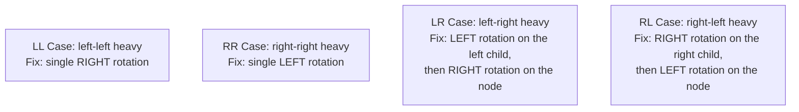

# Lecture 22: AVL Trees

Lecture 21 ended with a warning: a plain BST's performance depends entirely on its
shape, and nothing stops it from degrading into a skewed, linked-list-like O(n)
structure. An **AVL tree** (named for its inventors, Adelson-Velsky and Landis) is a BST
that actively fixes its own shape after every insertion, *guaranteeing* O(log n) height —
no matter what order values arrive in.

## In This Lecture

- Why balanced search trees are needed, precisely
- The AVL balance factor, and the height-balance rule it enforces
- The four rotation cases: single (LL, RR) and double (LR, RL)
- A complete, working AVL insertion that rebalances automatically
- AVL tree performance, guaranteed

## Need for Balanced Search Trees

Insert `10, 20, 30, 40, 50` into a plain BST and every node lands with only a right
child — height `n - 1`, search degraded to O(n). An AVL tree refuses to let this happen:
after every insertion, it checks whether the tree has become too lopsided, and if so,
performs a **rotation** to restore balance immediately.

## AVL Tree Concept and Balance Factor

Every node in an AVL tree tracks its own **balance factor**:

```text
balance factor = height(left subtree) - height(right subtree)
```

The **AVL property**: every node's balance factor must be `-1`, `0`, or `1`. If an
insertion ever pushes a node's balance factor to `-2` or `2`, the tree is out of balance
at that node, and a rotation must fix it before moving on.

## AVL Tree Rotations

There are two situations, each with a mirror image, for four cases total:



A **single rotation** (LL or RR) is needed when the imbalance is a straight line; a
**double rotation** (LR or RL) is needed when the imbalance zig-zags — the first rotation
straightens the zig-zag into a straight line, and the second rotation then fixes it like
a single-rotation case.

```cpp title="avl_tree.cpp"
#include <iostream>
#include <algorithm>
using namespace std;

struct AVLNode {
    int data;
    AVLNode* left;
    AVLNode* right;
    int height;
    AVLNode(int value) : data(value), left(nullptr), right(nullptr), height(1) {}
};

int height(AVLNode* node) {
    return (node == nullptr) ? 0 : node->height;
}

int balanceFactor(AVLNode* node) {
    return (node == nullptr) ? 0 : height(node->left) - height(node->right);
}

void updateHeight(AVLNode* node) {
    node->height = 1 + max(height(node->left), height(node->right));
}

// Right rotation: fixes a left-heavy imbalance (LL case).
AVLNode* rotateRight(AVLNode* y) {
    AVLNode* x = y->left;
    AVLNode* transferred = x->right;

    x->right = y;
    y->left = transferred;

    updateHeight(y);
    updateHeight(x);
    return x;   // x is the new root of this subtree
}

// Left rotation: fixes a right-heavy imbalance (RR case).
AVLNode* rotateLeft(AVLNode* x) {
    AVLNode* y = x->right;
    AVLNode* transferred = y->left;

    y->left = x;
    x->right = transferred;

    updateHeight(x);
    updateHeight(y);
    return y;   // y is the new root of this subtree
}

AVLNode* insert(AVLNode* node, int value) {
    if (node == nullptr) return new AVLNode(value);

    if (value < node->data) node->left = insert(node->left, value);
    else if (value > node->data) node->right = insert(node->right, value);
    else return node;   // no duplicates

    updateHeight(node);
    int balance = balanceFactor(node);

    // LL case
    if (balance > 1 && value < node->left->data) {
        return rotateRight(node);
    }
    // RR case
    if (balance < -1 && value > node->right->data) {
        return rotateLeft(node);
    }
    // LR case
    if (balance > 1 && value > node->left->data) {
        node->left = rotateLeft(node->left);
        return rotateRight(node);
    }
    // RL case
    if (balance < -1 && value < node->right->data) {
        node->right = rotateRight(node->right);
        return rotateLeft(node);
    }

    return node;   // already balanced, nothing to do
}

// Prints every node at exactly `remaining` steps below `node` (1 = node itself).
void printLevel(AVLNode* node, int remaining) {
    if (node == nullptr) return;
    if (remaining == 1) { cout << node->data << " "; return; }
    printLevel(node->left, remaining - 1);
    printLevel(node->right, remaining - 1);
}

void printLevelOrder(AVLNode* root) {
    if (root == nullptr) { cout << "(empty)" << endl; return; }
    for (int level = 1; level <= height(root); level++) {
        printLevel(root, level);
        cout << endl;
    }
}

int main() {
    cout << "RR case: inserting 10, 20, 30 (would skew right in a plain BST):" << endl;
    AVLNode* rrRoot = nullptr;
    rrRoot = insert(rrRoot, 10);
    rrRoot = insert(rrRoot, 20);
    rrRoot = insert(rrRoot, 30);
    cout << "Root after all three inserts: " << rrRoot->data
         << " (height " << rrRoot->height << ") -- single left rotation fixed it" << endl;
    printLevelOrder(rrRoot);

    cout << endl << "LR case: inserting 30, 10, 20 (zig-zags left-then-right):" << endl;
    AVLNode* lrRoot = nullptr;
    lrRoot = insert(lrRoot, 30);
    lrRoot = insert(lrRoot, 10);
    lrRoot = insert(lrRoot, 20);
    cout << "Root after all three inserts: " << lrRoot->data
         << " (height " << lrRoot->height << ") -- double rotation fixed it" << endl;
    printLevelOrder(lrRoot);

    return 0;
}
```

```text
$ g++ -std=c++17 -o avl_tree avl_tree.cpp
$ ./avl_tree
RR case: inserting 10, 20, 30 (would skew right in a plain BST):
Root after all three inserts: 20 (height 2) -- single left rotation fixed it
20 
10 30 

LR case: inserting 30, 10, 20 (zig-zags left-then-right):
Root after all three inserts: 20 (height 2) -- double rotation fixed it
20 
10 30
```

Watch the first block closely: inserting `10, 20, 30` in strictly increasing order would
skew a plain BST into a straight right-leaning line (Lecture 21's worst case) — but the
AVL tree's root ends up as `20`, with `10` and `30` as its children, a perfectly balanced
shape of height 2 instead of height 3. The RR-case single rotation fired automatically the
moment `30` was inserted and the balance factor at `10` hit `-2`.

The second block starts fresh with `30, 10, 20` — `20` doesn't fit cleanly under a single
rotation, because it lands in `10`'s *right* subtree, zig-zagging instead of forming a
straight line. That's exactly the LR case: rotating left at `10` first straightens the
zig-zag into a straight line, and the subsequent rotation right at `30` then finishes the
job — landing on the *same* balanced shape, root `20` with children `10` and `30`.

## Operations on an AVL Tree

- **Insertion** — exactly like a plain BST insert, followed by walking back up and
  checking/fixing the balance factor at every ancestor, as shown above.
- **Searching** — identical to a plain BST search (Lecture 20); the AVL property doesn't
  change *how* you search, only guarantees the search never has to walk more than
  O(log n) levels.
- **Deletion** — follows Lecture 21's three deletion cases, then walks back up performing
  whatever rotations are needed to restore the AVL property, the same way insertion does.

## AVL Tree Performance

| | Plain BST (worst case) | AVL Tree (always) |
|---|---|---|
| Height | O(n) | O(log n) — **guaranteed** |
| Search/Insert/Delete | O(n) | O(log n) — **guaranteed** |

The word "guaranteed" is the entire point of this lecture: a plain BST's O(log n) is
*best case*, dependent on insertion order; an AVL tree's O(log n) is a mathematical
property of the structure itself, true for every possible sequence of insertions.

## Try It Yourself

1. Compile and run `avl_tree.cpp`, then insert `1, 2, 3, 4, 5, 6, 7` in that exact order
   into a fresh AVL tree, printing the level-order result after each insertion. Confirm
   the tree never grows taller than height 3, unlike a plain BST (Lecture 21) which would
   become a straight line of height 7.
2. The lecture traced the **LR** case (`30, 10, 20`) by hand. Now trace its mirror image,
   the **RL** case, by hand: insert `10, 30, 20` into an empty AVL tree, one node at a
   time, and predict the final root and its two children before running the code to
   check yourself.

## Key Takeaways

- An AVL tree is a BST with one added rule: every node's **balance factor**
  (left height − right height) must stay within `{-1, 0, 1}`.
- Four rotation cases restore balance after an insertion breaks the rule: **LL**/**RR**
  (single rotation) and **LR**/**RL** (double rotation — one rotation to straighten the
  zig-zag, one more to fix it).
- Search works identically to a plain BST; insertion and deletion both add a rebalancing
  walk back up to the root afterward.
- Unlike a plain BST, an AVL tree's O(log n) performance is **guaranteed**, not dependent
  on the order values happen to arrive in.
