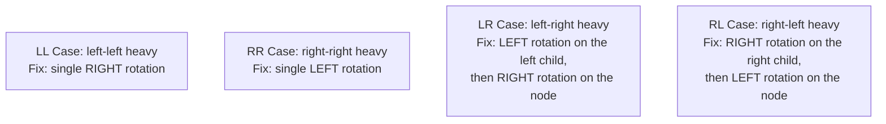
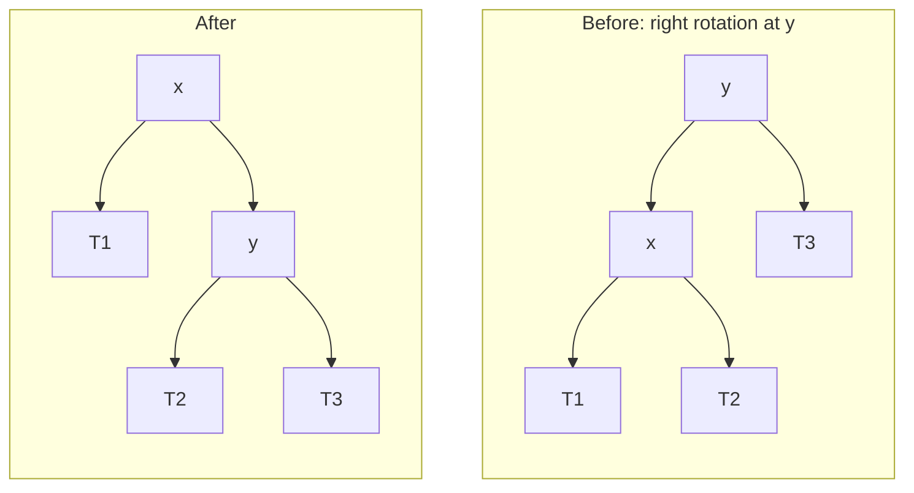
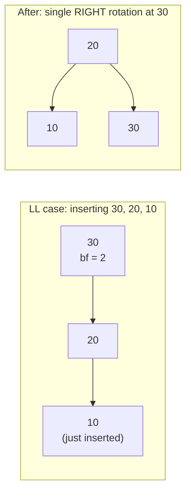
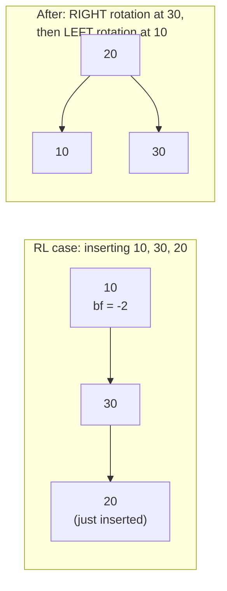
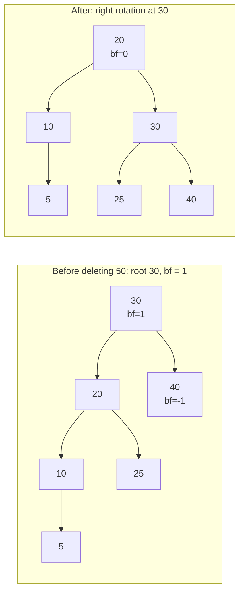

# Lecture 22: AVL Trees

Lecture 21 ended with a warning: a plain BST's performance depends entirely on its
shape, and nothing stops it from degrading into a skewed, linked-list-like O(n)
structure. An **AVL tree** (named for its inventors, Adelson-Velsky and Landis) is a BST
that actively fixes its own shape after every insertion, *guaranteeing* O(log n) height —
no matter what order values arrive in.

## In This Lecture

- Why balanced search trees are needed, precisely
- The AVL balance factor, and the height-balance rule it enforces
- The four rotation cases: single (LL, RR) and double (LR, RL) — all four verified with
  real compiled output, not hand-traced
- Why a rotation is guaranteed to preserve the BST property, not just "happen to"
- A complete, working AVL insertion that rebalances automatically
- A complete, working AVL **deletion** that rebalances automatically, including a case
  where deletion (not insertion) triggers a rotation
- AVL tree performance, guaranteed, and how AVL trees compare to the red-black trees
  C++'s own `std::map`/`std::set` actually use

## Need for Balanced Search Trees

Insert `10, 20, 30, 40, 50` into a plain BST and every node lands with only a right
child — height `n - 1`, search degraded to O(n). An AVL tree refuses to let this happen:
after every insertion, it checks whether the tree has become too lopsided, and if so,
performs a **rotation** to restore balance immediately.

## AVL Tree Concept and Balance Factor

Every node in an AVL tree tracks its own **balance factor**:

```text
balance factor = height(left subtree) - height(right subtree)
```

The **AVL property**: every node's balance factor must be `-1`, `0`, or `1`. If an
insertion ever pushes a node's balance factor to `-2` or `2`, the tree is out of balance
at that node, and a rotation must fix it before moving on.

## AVL Tree Rotations

There are two situations, each with a mirror image, for four cases total:



A **single rotation** (LL or RR) is needed when the imbalance is a straight line; a
**double rotation** (LR or RL) is needed when the imbalance zig-zags — the first rotation
straightens the zig-zag into a straight line, and the second rotation then fixes it like
a single-rotation case.

### Why a Rotation Preserves the BST Property

A rotation looks like a big structural change, but it's built entirely out of the one
guarantee a BST already gives you: **every value in a subtree falls within a known
range**. Label the imbalanced node `y`, its left child `x`, and the three subtrees
involved `T1`, `T2`, `T3` (using the same names `rotateRight`'s code uses, where `T2` is
`x->right`, the subtree that gets "transferred"):



Before the rotation, the BST property already guarantees `T1 < x < T2 < y < T3` (every
value in `T1` is less than `x`, every value in `T2` is between `x` and `y`, every value in
`T3` is greater than `y`). The rotation only ever moves `T2` — from being `x`'s *right*
subtree to being `y`'s *left* subtree — and that's legal precisely because `T2 < y`
already held before the move. Nothing about the actual *values* changes, and no value
crosses a boundary it wasn't already inside; only three pointers are reassigned
(`x->right`, `y->left`, and whichever pointer used to point at `y` now points at `x`).
This is exactly what `rotateRight`'s three lines (`x->right = y`, `y->left = transferred`,
plus the caller re-linking `x` in `y`'s old place) do.

```cpp title="avl_tree.cpp"
#include <iostream>
#include <algorithm>
using namespace std;

struct AVLNode {
    int data;
    AVLNode* left;
    AVLNode* right;
    int height;
    AVLNode(int value) : data(value), left(nullptr), right(nullptr), height(1) {}
};

int height(AVLNode* node) {
    return (node == nullptr) ? 0 : node->height;
}

int balanceFactor(AVLNode* node) {
    return (node == nullptr) ? 0 : height(node->left) - height(node->right);
}

void updateHeight(AVLNode* node) {
    node->height = 1 + max(height(node->left), height(node->right));
}

// Right rotation: fixes a left-heavy imbalance (LL case).
AVLNode* rotateRight(AVLNode* y) {
    AVLNode* x = y->left;
    AVLNode* transferred = x->right;

    x->right = y;
    y->left = transferred;

    updateHeight(y);
    updateHeight(x);
    return x;   // x is the new root of this subtree
}

// Left rotation: fixes a right-heavy imbalance (RR case).
AVLNode* rotateLeft(AVLNode* x) {
    AVLNode* y = x->right;
    AVLNode* transferred = y->left;

    y->left = x;
    x->right = transferred;

    updateHeight(x);
    updateHeight(y);
    return y;   // y is the new root of this subtree
}

AVLNode* insert(AVLNode* node, int value) {
    if (node == nullptr) return new AVLNode(value);

    if (value < node->data) node->left = insert(node->left, value);
    else if (value > node->data) node->right = insert(node->right, value);
    else return node;   // no duplicates

    updateHeight(node);
    int balance = balanceFactor(node);

    // LL case
    if (balance > 1 && value < node->left->data) {
        return rotateRight(node);
    }
    // RR case
    if (balance < -1 && value > node->right->data) {
        return rotateLeft(node);
    }
    // LR case
    if (balance > 1 && value > node->left->data) {
        node->left = rotateLeft(node->left);
        return rotateRight(node);
    }
    // RL case
    if (balance < -1 && value < node->right->data) {
        node->right = rotateRight(node->right);
        return rotateLeft(node);
    }

    return node;   // already balanced, nothing to do
}

// Prints every node at exactly `remaining` steps below `node` (1 = node itself).
void printLevel(AVLNode* node, int remaining) {
    if (node == nullptr) return;
    if (remaining == 1) { cout << node->data << " "; return; }
    printLevel(node->left, remaining - 1);
    printLevel(node->right, remaining - 1);
}

void printLevelOrder(AVLNode* root) {
    if (root == nullptr) { cout << "(empty)" << endl; return; }
    for (int level = 1; level <= height(root); level++) {
        printLevel(root, level);
        cout << endl;
    }
}

int main() {
    cout << "RR case: inserting 10, 20, 30 (would skew right in a plain BST):" << endl;
    AVLNode* rrRoot = nullptr;
    rrRoot = insert(rrRoot, 10);
    rrRoot = insert(rrRoot, 20);
    rrRoot = insert(rrRoot, 30);
    cout << "Root after all three inserts: " << rrRoot->data
         << " (height " << rrRoot->height << ") -- single left rotation fixed it" << endl;
    printLevelOrder(rrRoot);

    cout << endl << "LR case: inserting 30, 10, 20 (zig-zags left-then-right):" << endl;
    AVLNode* lrRoot = nullptr;
    lrRoot = insert(lrRoot, 30);
    lrRoot = insert(lrRoot, 10);
    lrRoot = insert(lrRoot, 20);
    cout << "Root after all three inserts: " << lrRoot->data
         << " (height " << lrRoot->height << ") -- double rotation fixed it" << endl;
    printLevelOrder(lrRoot);

    return 0;
}
```

```text
$ g++ -std=c++17 -o avl_tree avl_tree.cpp
$ ./avl_tree
RR case: inserting 10, 20, 30 (would skew right in a plain BST):
Root after all three inserts: 20 (height 2) -- single left rotation fixed it
20 
10 30 

LR case: inserting 30, 10, 20 (zig-zags left-then-right):
Root after all three inserts: 20 (height 2) -- double rotation fixed it
20 
10 30
```

Watch the first block closely: inserting `10, 20, 30` in strictly increasing order would
skew a plain BST into a straight right-leaning line (Lecture 21's worst case) — but the
AVL tree's root ends up as `20`, with `10` and `30` as its children, a perfectly balanced
shape of height 2 instead of height 3. The RR-case single rotation fired automatically the
moment `30` was inserted and the balance factor at `10` hit `-2`.

The second block starts fresh with `30, 10, 20` — `20` doesn't fit cleanly under a single
rotation, because it lands in `10`'s *right* subtree, zig-zagging instead of forming a
straight line. That's exactly the LR case: rotating left at `10` first straightens the
zig-zag into a straight line, and the subsequent rotation right at `30` then finishes the
job — landing on the *same* balanced shape, root `20` with children `10` and `30`.

### The LL and RL Cases, Verified

The lecture so far has only shown RR and LR firing. Their mirror images — **LL** and
**RL** — are just as important, and it would be easy to *assume* they behave symmetrically
without checking. They do, but "should behave symmetrically" is exactly the kind of claim
this book insists on confirming with a real compiled balance factor, not a hand-wave.





```cpp title="avl_ll_rl.cpp"
#include <iostream>
#include <algorithm>
using namespace std;

struct AVLNode {
    int data;
    AVLNode* left;
    AVLNode* right;
    int height;
    AVLNode(int value) : data(value), left(nullptr), right(nullptr), height(1) {}
};

int height(AVLNode* node) { return (node == nullptr) ? 0 : node->height; }
int balanceFactor(AVLNode* node) { return (node == nullptr) ? 0 : height(node->left) - height(node->right); }
void updateHeight(AVLNode* node) { node->height = 1 + max(height(node->left), height(node->right)); }

AVLNode* rotateRight(AVLNode* y) {
    AVLNode* x = y->left;
    AVLNode* transferred = x->right;
    x->right = y;
    y->left = transferred;
    updateHeight(y);
    updateHeight(x);
    return x;
}

AVLNode* rotateLeft(AVLNode* x) {
    AVLNode* y = x->right;
    AVLNode* transferred = y->left;
    y->left = x;
    x->right = transferred;
    updateHeight(x);
    updateHeight(y);
    return y;
}

AVLNode* insert(AVLNode* node, int value) {
    if (node == nullptr) return new AVLNode(value);
    if (value < node->data) node->left = insert(node->left, value);
    else if (value > node->data) node->right = insert(node->right, value);
    else return node;

    updateHeight(node);
    int balance = balanceFactor(node);

    if (balance > 1 && value < node->left->data) return rotateRight(node);
    if (balance < -1 && value > node->right->data) return rotateLeft(node);
    if (balance > 1 && value > node->left->data) {
        node->left = rotateLeft(node->left);
        return rotateRight(node);
    }
    if (balance < -1 && value < node->right->data) {
        node->right = rotateRight(node->right);
        return rotateLeft(node);
    }
    return node;
}

void printLevel(AVLNode* node, int remaining) {
    if (node == nullptr) return;
    if (remaining == 1) { cout << node->data << " "; return; }
    printLevel(node->left, remaining - 1);
    printLevel(node->right, remaining - 1);
}

void printLevelOrder(AVLNode* root) {
    if (root == nullptr) { cout << "(empty)" << endl; return; }
    for (int level = 1; level <= height(root); level++) {
        printLevel(root, level);
        cout << endl;
    }
}

int main() {
    cout << "LL case: inserting 30, 20, 10 (would skew left in a plain BST):" << endl;
    AVLNode* llRoot = nullptr;
    llRoot = insert(llRoot, 30);
    cout << "  after inserting 30: root=" << llRoot->data << ", balance factor=" << balanceFactor(llRoot) << endl;
    llRoot = insert(llRoot, 20);
    cout << "  after inserting 20: root=" << llRoot->data << ", balance factor=" << balanceFactor(llRoot) << endl;
    llRoot = insert(llRoot, 10);
    cout << "  after inserting 10: root=" << llRoot->data << ", balance factor=" << balanceFactor(llRoot)
         << " (height " << llRoot->height << ") -- single right rotation fixed it" << endl;
    printLevelOrder(llRoot);

    cout << endl << "RL case: inserting 10, 30, 20 (zig-zags right-then-left):" << endl;
    AVLNode* rlRoot = nullptr;
    rlRoot = insert(rlRoot, 10);
    cout << "  after inserting 10: root=" << rlRoot->data << ", balance factor=" << balanceFactor(rlRoot) << endl;
    rlRoot = insert(rlRoot, 30);
    cout << "  after inserting 30: root=" << rlRoot->data << ", balance factor=" << balanceFactor(rlRoot) << endl;
    rlRoot = insert(rlRoot, 20);
    cout << "  after inserting 20: root=" << rlRoot->data << ", balance factor=" << balanceFactor(rlRoot)
         << " (height " << rlRoot->height << ") -- double rotation fixed it" << endl;
    printLevelOrder(rlRoot);

    return 0;
}
```

```text
$ g++ -std=c++17 -o avl_ll_rl avl_ll_rl.cpp
$ ./avl_ll_rl
LL case: inserting 30, 20, 10 (would skew left in a plain BST):
  after inserting 30: root=30, balance factor=0
  after inserting 20: root=30, balance factor=1
  after inserting 10: root=20, balance factor=0 (height 2) -- single right rotation fixed it
20 
10 30 

RL case: inserting 10, 30, 20 (zig-zags right-then-left):
  after inserting 10: root=10, balance factor=0
  after inserting 30: root=10, balance factor=-1
  after inserting 20: root=20, balance factor=0 (height 2) -- double rotation fixed it
20 
10 30 
```

The printed balance factor confirms the case at every step: after inserting `20`, the
root `30`'s balance factor reads exactly `1` (not yet a violation — that's why nothing
rotates until the *third* insert). Only once `10` is inserted does `30`'s balance factor
hit `2`, and because `10 < 30->left->data` (`20`), the condition `balance > 1 && value <
node->left->data` is the one that fires — the **LL** branch, a single right rotation. The
RL block confirms the mirror image the same way: `10`'s balance factor hits `-2` after
`20` is inserted, but `20 > node->right->data` is false (`20 < 30`), so the **RL** branch
fires instead of RR — first a right rotation at `30`, then a left rotation at `10`. Both
land on the identical shape (root `20`, children `10` and `30`) that the RR and LR cases
above also produced, for the same underlying reason: three values, however they arrive,
have exactly one balanced arrangement.

## Operations on an AVL Tree

- **Insertion** — exactly like a plain BST insert, followed by walking back up and
  checking/fixing the balance factor at every ancestor, as shown above.
- **Searching** — identical to a plain BST search (Lecture 20); the AVL property doesn't
  change *how* you search, only guarantees the search never has to walk more than
  O(log n) levels.
- **Deletion** — follows Lecture 21's three deletion cases, then walks back up performing
  whatever rotations are needed to restore the AVL property, the same way insertion does.

### AVL Deletion, With Rebalancing

Deletion's rebalancing walk looks almost identical to insertion's — same four cases, same
idea of fixing the balance factor on the way back up the call stack — with one important
difference: **insertion** picks LL/RR/LR/RL by comparing the *newly inserted value*
against `node->left->data` or `node->right->data`, but after a **deletion** there's no
"value just inserted" to compare against. Instead, the case is chosen from the *child's
own* balance factor:

```cpp title="avl_delete.cpp"
#include <iostream>
#include <algorithm>
using namespace std;

struct AVLNode {
    int data;
    AVLNode* left;
    AVLNode* right;
    int height;
    AVLNode(int value) : data(value), left(nullptr), right(nullptr), height(1) {}
};

int height(AVLNode* node) { return (node == nullptr) ? 0 : node->height; }
int balanceFactor(AVLNode* node) { return (node == nullptr) ? 0 : height(node->left) - height(node->right); }
void updateHeight(AVLNode* node) { node->height = 1 + max(height(node->left), height(node->right)); }

AVLNode* rotateRight(AVLNode* y) {
    AVLNode* x = y->left;
    AVLNode* transferred = x->right;
    x->right = y;
    y->left = transferred;
    updateHeight(y);
    updateHeight(x);
    return x;
}

AVLNode* rotateLeft(AVLNode* x) {
    AVLNode* y = x->right;
    AVLNode* transferred = y->left;
    y->left = x;
    x->right = transferred;
    updateHeight(x);
    updateHeight(y);
    return y;
}

AVLNode* insert(AVLNode* node, int value) {
    if (node == nullptr) return new AVLNode(value);
    if (value < node->data) node->left = insert(node->left, value);
    else if (value > node->data) node->right = insert(node->right, value);
    else return node;
    updateHeight(node);
    int balance = balanceFactor(node);
    if (balance > 1 && value < node->left->data) return rotateRight(node);
    if (balance < -1 && value > node->right->data) return rotateLeft(node);
    if (balance > 1 && value > node->left->data) { node->left = rotateLeft(node->left); return rotateRight(node); }
    if (balance < -1 && value < node->right->data) { node->right = rotateRight(node->right); return rotateLeft(node); }
    return node;
}

// AVL deletion: ordinary BST deletion (Lecture 21's three cases), then the
// SAME rebalancing walk insertion uses -- except the case is now chosen from
// the CHILD's balance factor, not from a value comparison (there's no
// "value just inserted" to compare against on the way back up from a delete).
AVLNode* deleteAVL(AVLNode* node, int value) {
    if (node == nullptr) return nullptr;

    if (value < node->data) {
        node->left = deleteAVL(node->left, value);
    } else if (value > node->data) {
        node->right = deleteAVL(node->right, value);
    } else {
        if (node->left == nullptr && node->right == nullptr) {
            delete node;
            return nullptr;
        } else if (node->left == nullptr) {
            AVLNode* temp = node->right;
            delete node;
            return temp;
        } else if (node->right == nullptr) {
            AVLNode* temp = node->left;
            delete node;
            return temp;
        } else {
            AVLNode* successor = node->right;
            while (successor->left != nullptr) successor = successor->left;
            node->data = successor->data;
            node->right = deleteAVL(node->right, successor->data);
        }
    }

    updateHeight(node);
    int balance = balanceFactor(node);

    // LL / LR: decided by the LEFT child's own balance factor
    if (balance > 1 && balanceFactor(node->left) >= 0) return rotateRight(node);
    if (balance > 1 && balanceFactor(node->left) < 0) {
        node->left = rotateLeft(node->left);
        return rotateRight(node);
    }
    // RR / RL: decided by the RIGHT child's own balance factor
    if (balance < -1 && balanceFactor(node->right) <= 0) return rotateLeft(node);
    if (balance < -1 && balanceFactor(node->right) > 0) {
        node->right = rotateRight(node->right);
        return rotateLeft(node);
    }
    return node;
}

void printLevel(AVLNode* node, int remaining) {
    if (node == nullptr) return;
    if (remaining == 1) { cout << node->data << "(bf=" << balanceFactor(node) << ") "; return; }
    printLevel(node->left, remaining - 1);
    printLevel(node->right, remaining - 1);
}
void printLevelOrder(AVLNode* root) {
    if (root == nullptr) { cout << "(empty)" << endl; return; }
    for (int level = 1; level <= height(root); level++) { printLevel(root, level); cout << endl; }
}

int main() {
    AVLNode* root = nullptr;
    for (int value : {30, 20, 40, 10, 25, 35, 50, 5}) root = insert(root, value);

    cout << "Tree after inserting 30, 20, 40, 10, 25, 35, 50, 5:" << endl;
    printLevelOrder(root);
    cout << "root=" << root->data << ", height=" << root->height << endl << endl;

    cout << "Deleting 35 (a leaf; its parent 40 stays within {-1,0,1}, no rotation needed):" << endl;
    root = deleteAVL(root, 35);
    printLevelOrder(root);
    cout << "root=" << root->data << ", height=" << root->height << endl << endl;

    cout << "Deleting 50 (removes 40's only remaining child, pushing the ROOT's" << endl;
    cout << "balance factor out of range):" << endl;
    root = deleteAVL(root, 50);
    printLevelOrder(root);
    cout << "root=" << root->data << ", height=" << root->height
         << " -- a right rotation fired at the old root (30) to fix it" << endl;

    return 0;
}
```

```text
$ g++ -std=c++17 -o avl_delete avl_delete.cpp
$ ./avl_delete
Tree after inserting 30, 20, 40, 10, 25, 35, 50, 5:
30(bf=1) 
20(bf=1) 40(bf=0) 
10(bf=1) 25(bf=0) 35(bf=0) 50(bf=0) 
5(bf=0) 
root=30, height=4

Deleting 35 (a leaf; its parent 40 stays within {-1,0,1}, no rotation needed):
30(bf=1) 
20(bf=1) 40(bf=-1) 
10(bf=1) 25(bf=0) 50(bf=0) 
5(bf=0) 
root=30, height=4

Deleting 50 (removes 40's only remaining child, pushing the ROOT's
balance factor out of range):
20(bf=0) 
10(bf=1) 30(bf=0) 
5(bf=0) 25(bf=0) 40(bf=0) 
root=20, height=3 -- a right rotation fired at the old root (30) to fix it
```



Deleting `35` removes a leaf and leaves `40`'s balance factor at `-1` — still legal, so no
rotation fires, exactly the same as an ordinary BST delete. Deleting `50` next removes
`40`'s only remaining child; `40` becomes a leaf, and the root `30`'s balance factor jumps
from `1` to `2` (its right side just lost a level while its left side didn't). Because
`balanceFactor(node->left)` — that's `20`'s balance factor, which is `1`, meaning
non-negative — the very first condition (`balance > 1 && balanceFactor(node->left) >= 0`)
fires: a single right rotation at `30`, landing on `20` as the new subtree root. This is
the same LL-style fix as before, just triggered by a shrinking subtree instead of a
growing one.

!!! warning "A common pitfall: reusing insertion's value-comparison logic for deletion"
    It's tempting to copy `insert`'s four `if` conditions verbatim into a deletion
    function, since they look almost identical. They don't work: `insert` always knows
    which value was just added, so it can ask "is the new value less than the left
    child's value?" to distinguish LL from LR. After a deletion, no such value exists —
    the imbalance was caused by something *disappearing*, not arriving. The fix is exactly
    what `deleteAVL` does above: ask the unbalanced child for **its own** balance factor
    instead.

## AVL Tree Performance

| | Plain BST (worst case) | AVL Tree (always) |
|---|---|---|
| Height | O(n) | O(log n) — **guaranteed** |
| Search/Insert/Delete | O(n) | O(log n) — **guaranteed** |

The word "guaranteed" is the entire point of this lecture: a plain BST's O(log n) is
*best case*, dependent on insertion order; an AVL tree's O(log n) is a mathematical
property of the structure itself, true for every possible sequence of insertions.

### AVL Trees in the Real World: A Trade-Off, Not a Free Lunch

AVL trees aren't the *only* self-balancing BST, and they're not always the one real
systems reach for. The most common alternative is the **red-black tree**, which relaxes
the balance rule (roughly: the longest root-to-leaf path is never more than twice the
shortest) instead of AVL's strict `{-1, 0, 1}` requirement:

| | AVL Tree | Red-Black Tree |
|---|---|---|
| Balance guarantee | Strict — height ≤ ~1.44 log₂(n) | Looser — height ≤ 2 log₂(n) |
| Lookup speed | Faster (shorter worst-case height) | Slightly slower |
| Rotations per insert/delete | Can cascade further to stay strict | Fewer rotations on average |
| Used by | Databases and systems needing fast, frequent lookups | C++'s `std::map`/`std::set`, Java's `TreeMap`, Linux kernel schedulers |

Neither is "better" in the abstract — it's the same trade-off theme from Lecture 5's
array-vs-linked-list table: AVL trees pay a little more on every insert/delete to keep
lookups as fast as possible; red-black trees accept slightly slower lookups in exchange
for cheaper updates. C++'s standard library picked red-black trees for `std::map` and
`std::set` because most programs read *and* write a map, not just read it — but if you
profile a workload that's overwhelmingly lookups, hand-rolling (or reaching for a library
that provides) an AVL tree can be a legitimate win.

## Try It Yourself

1. Compile and run `avl_tree.cpp`, then insert `1, 2, 3, 4, 5, 6, 7` in that exact order
   into a fresh AVL tree, printing the level-order result after each insertion. Confirm
   the tree never grows taller than height 3, unlike a plain BST (Lecture 21) which would
   become a straight line of height 7.
2. Compile and run `avl_ll_rl.cpp` yourself, then insert `1, 2, 3` (an LL case) and `3, 1,
   2` (an RL case) into two fresh trees, printing the balance factor after each insertion
   the way `main()` already does. Confirm both land on the same shape (root `2`, children
   `1` and `3`) that `30, 20, 10` and `10, 30, 20` produced.
3. Modify `avl_delete.cpp`'s `main()` to also delete `25` (after `35` and `50`), printing
   the tree and every balance factor afterward. Does a rotation fire? Explain what you
   observe in terms of `20`'s balance factor before and after, referencing the actual
   printed `bf=` values rather than predicting from memory.
4. `deleteAVL` uses the in-order **successor** (mirroring Lecture 21). Predict, then
   verify by modifying the code, whether switching to the in-order **predecessor**
   (Lecture 21's Try-It-Yourself exercise 4) changes which rotation fires when deleting
   `50` from the tree in `avl_delete.cpp`'s `main()`.

## Key Takeaways

- An AVL tree is a BST with one added rule: every node's **balance factor**
  (left height − right height) must stay within `{-1, 0, 1}`.
- Four rotation cases restore balance after an insertion breaks the rule: **LL**/**RR**
  (single rotation) and **LR**/**RL** (double rotation — one rotation to straighten the
  zig-zag, one more to fix it). All four were verified with real balance-factor output in
  this lecture — never assume which case fires without checking.
- A rotation only ever moves one subtree (`T2` in the generic diagram) across a boundary
  the BST property already guaranteed was safe to cross — that's *why* it preserves
  ordering, not just an empirical fact about the code.
- **Deletion** rebalances the same way insertion does, but chooses LL/RR/LR/RL from the
  unbalanced **child's own balance factor**, not a value comparison — there's no "value
  just inserted" to compare against after something is removed.
- Real systems often use **red-black trees** instead of AVL trees — a looser balance
  guarantee traded for cheaper updates; know both exist and why a codebase might pick
  either.
- Search works identically to a plain BST; insertion and deletion both add a rebalancing
  walk back up to the root afterward.
- Unlike a plain BST, an AVL tree's O(log n) performance is **guaranteed**, not dependent
  on the order values happen to arrive in.
