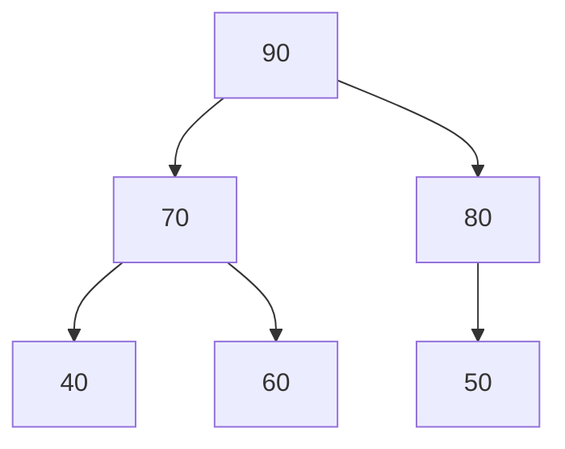
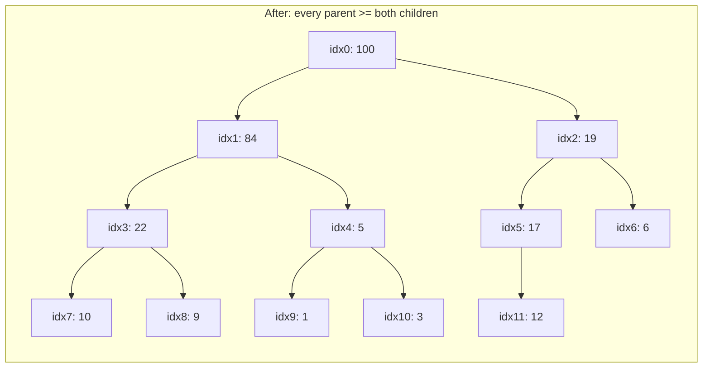

# Lecture 23: Heap and Priority Queue

Lecture 14 introduced the priority queue concept and used C++'s built-in
`std::priority_queue` without asking how it actually works underneath. The answer is a
**heap**: a complete binary tree (Lecture 16) with one simple ordering rule, stored
compactly in an array (Lecture 16's array representation, finally put to real use).

## In This Lecture

- The heap concept and the heap property
- Min-heap and max-heap
- The array representation of a heap, and why completeness makes it work
- Insertion (with "heapify up") and deletion (with "heapify down")
- Building an entire heap from an unsorted array in O(n), traced step by step
- A real, measured comparison: repeated insertion versus bottom-up heapify
- Building a priority queue on top of a heap, with a real task-scheduling example
- Heap sort, previewing Lecture 31
- Common pitfalls when implementing heap operations by hand

## The Heap Concept and Heap Property

A **heap** is a **complete** binary tree (every level full except possibly the last,
filled left to right — Lecture 16) that additionally satisfies the **heap property**:

- **Max-heap**: every parent's value is **greater than or equal to** both its children's.
- **Min-heap**: every parent's value is **less than or equal to** both its children's.

Notice what the heap property does *not* promise: unlike a BST, there's no left-vs-right
ordering rule — only parent-vs-child. That relaxation is exactly what makes heap
insertion and removal faster and simpler than a BST's.



Every parent is ≥ both its children — a valid max-heap, even though `70 > 50`, which
would never be allowed in a BST (where `50` would have to be smaller than everything in
`70`'s *entire* left subtree, not just its immediate children).

## Array Representation of a Heap

Because a heap is always **complete**, Lecture 16's array formulas apply directly, with
no wasted space and no pointers needed at all:

```text
For a node at index i:
  parent index = (i - 1) / 2
  left child index  = 2*i + 1
  right child index = 2*i + 2
```

## Operations on a Heap: Insertion and Heapify-Up

Inserting into a heap has two steps: add the new value at the very next open array slot
(preserving completeness), then **heapify up** — repeatedly swap it with its parent for
as long as it violates the heap property.

```cpp title="max_heap.cpp"
#include <iostream>
#include <vector>
using namespace std;

class MaxHeap {
private:
    vector<int> data;

    int parentIndex(int i) const { return (i - 1) / 2; }
    int leftIndex(int i) const { return 2 * i + 1; }
    int rightIndex(int i) const { return 2 * i + 2; }

    void heapifyUp(int i) {
        while (i > 0 && data[parentIndex(i)] < data[i]) {
            swap(data[parentIndex(i)], data[i]);
            i = parentIndex(i);
        }
    }

    void heapifyDown(int i) {
        int largest = i;
        int left = leftIndex(i);
        int right = rightIndex(i);

        if (left < data.size() && data[left] > data[largest]) largest = left;
        if (right < data.size() && data[right] > data[largest]) largest = right;

        if (largest != i) {
            swap(data[i], data[largest]);
            heapifyDown(largest);
        }
    }

public:
    void insert(int value) {
        data.push_back(value);          // step 1: add at the next open slot
        heapifyUp(data.size() - 1);      // step 2: bubble it up to its correct place
    }

    int extractMax() {
        int maxValue = data[0];
        data[0] = data.back();           // move the last element to the root...
        data.pop_back();
        if (!data.empty()) heapifyDown(0);  // ...then bubble it down to its correct place
        return maxValue;
    }

    void printArray() const {
        for (int v : data) cout << v << " ";
        cout << endl;
    }
};

int main() {
    MaxHeap heap;
    for (int value : {50, 80, 40, 90, 60, 70}) {
        heap.insert(value);
    }

    cout << "Heap array after inserting 50, 80, 40, 90, 60, 70: ";
    heap.printArray();

    cout << "Extracting in max-heap order: ";
    MaxHeap copy = heap;
    for (int i = 0; i < 6; i++) {
        cout << copy.extractMax() << " ";
    }
    cout << endl;

    return 0;
}
```

```text
$ g++ -std=c++17 -o max_heap max_heap.cpp
$ ./max_heap
Heap array after inserting 50, 80, 40, 90, 60, 70: 90 80 70 50 60 40 
Extracting in max-heap order: 90 80 70 60 50 40
```

`extractMax` always returns the **root** (guaranteed to be the maximum, by the heap
property), then patches the hole by moving the very last element to the root and letting
it sink back down (**heapify down**) to wherever it actually belongs.

## Build-Heap

Rather than inserting elements one at a time (each costing O(log n)), an entire array can
be turned into a valid heap in O(n) total by calling `heapifyDown` on every non-leaf node,
starting from the *last* non-leaf and working back to the root — this is what a
`std::priority_queue` constructed directly from an existing container does internally.

Why start from the *last non-leaf* rather than index 0? Every leaf is already a valid
"heap" of size one — there's nothing below it to violate the heap property against — so
`heapifyDown` only needs to run on nodes that actually *have* children. For an array of
size `n`, the last non-leaf sits at index `n/2 - 1` (everything after that is a leaf, by
the same index arithmetic Lecture 16 introduced).

```cpp title="heap_buildheap_trace.cpp"
#include <iostream>
#include <vector>
using namespace std;

int leftIndex(int i) { return 2 * i + 1; }
int rightIndex(int i) { return 2 * i + 2; }

void printArr(const vector<int>& data) {
    for (int v : data) cout << v << " ";
    cout << endl;
}

void heapifyDown(vector<int>& data, int i, int size) {
    int largest = i;
    int left = leftIndex(i);
    int right = rightIndex(i);
    if (left < size && data[left] > data[largest]) largest = left;
    if (right < size && data[right] > data[largest]) largest = right;
    if (largest != i) {
        cout << "    swap index " << i << " (" << data[i] << ") with index "
             << largest << " (" << data[largest] << ")" << endl;
        swap(data[i], data[largest]);
        heapifyDown(data, largest, size);
    } else {
        cout << "    index " << i << " (" << data[i] << ") already >= both children, stop" << endl;
    }
}

int main() {
    vector<int> data = {5, 3, 17, 10, 84, 19, 6, 22, 9, 1, 100, 12};
    int n = data.size();

    cout << "Starting array (not yet a heap): ";
    printArr(data);
    cout << endl;

    for (int i = n / 2 - 1; i >= 0; i--) {
        cout << "heapifyDown starting at index " << i << " (value " << data[i] << "):" << endl;
        heapifyDown(data, i, n);
        cout << "  array now: "; printArr(data);
        cout << endl;
    }

    cout << "Final array (valid max-heap): ";
    printArr(data);
    return 0;
}
```

```text
$ g++ -std=c++17 -o heap_buildheap_trace heap_buildheap_trace.cpp
$ ./heap_buildheap_trace
Starting array (not yet a heap): 5 3 17 10 84 19 6 22 9 1 100 12 

heapifyDown starting at index 5 (value 19):
    index 5 (19) already >= both children, stop
  array now: 5 3 17 10 84 19 6 22 9 1 100 12 

heapifyDown starting at index 4 (value 84):
    swap index 4 (84) with index 10 (100)
    index 10 (84) already >= both children, stop
  array now: 5 3 17 10 100 19 6 22 9 1 84 12 

heapifyDown starting at index 3 (value 10):
    swap index 3 (10) with index 7 (22)
    index 7 (10) already >= both children, stop
  array now: 5 3 17 22 100 19 6 10 9 1 84 12 

heapifyDown starting at index 2 (value 17):
    swap index 2 (17) with index 5 (19)
    index 5 (17) already >= both children, stop
  array now: 5 3 19 22 100 17 6 10 9 1 84 12 

heapifyDown starting at index 1 (value 3):
    swap index 1 (3) with index 4 (100)
    swap index 4 (3) with index 10 (84)
    index 10 (3) already >= both children, stop
  array now: 5 100 19 22 84 17 6 10 9 1 3 12 

heapifyDown starting at index 0 (value 5):
    swap index 0 (5) with index 1 (100)
    swap index 1 (5) with index 4 (84)
    index 4 (5) already >= both children, stop
  array now: 100 84 19 22 5 17 6 10 9 1 3 12 

Final array (valid max-heap): 100 84 19 22 5 17 6 10 9 1 3 12
```

The array as a tree, before and after `buildHeap` runs — notice indices `7`, `8`, `9`,
`10`, `11` (all leaves) never move at all, only the six non-leaf indices (`0` through `5`)
are ever the *starting point* of a `heapifyDown` call:




Watch index `1` (value `3`) specifically: it takes **two** swaps to settle (first with
index `4`, then with index `10`), because sifting down can cascade through multiple
levels, exactly like `heapifyUp` in `insert` — the only difference is direction.

### Repeated Insertion versus Bottom-Up Heapify: A Real Comparison

The claim "build-heap is O(n), not O(n log n)" is easy to state and easy to get wrong by
intuition — it *looks* like `n` calls to a function that walks O(log n) levels should cost
O(n log n). The reason it doesn't: most nodes in a heap are near the *bottom*, where
`heapifyDown` has almost no distance left to sift through, so the total work summed across
every starting index converges to O(n), not O(n log n) (the precise argument sums a
geometric-like series over the tree's levels — covered fully in a data structures theory
course, but the *practical* difference is easy to measure directly):

```cpp title="heap_build_compare.cpp"
#include <iostream>
#include <vector>
using namespace std;

int swapCount = 0;

int parentIndex(int i) { return (i - 1) / 2; }
int leftIndex(int i) { return 2 * i + 1; }
int rightIndex(int i) { return 2 * i + 2; }

void heapifyUp(vector<int>& data, int i) {
    while (i > 0 && data[parentIndex(i)] < data[i]) {
        swap(data[parentIndex(i)], data[i]);
        swapCount++;
        i = parentIndex(i);
    }
}

void heapifyDown(vector<int>& data, int i, int size) {
    int largest = i;
    int left = leftIndex(i);
    int right = rightIndex(i);
    if (left < size && data[left] > data[largest]) largest = left;
    if (right < size && data[right] > data[largest]) largest = right;
    if (largest != i) {
        swap(data[i], data[largest]);
        swapCount++;
        heapifyDown(data, largest, size);
    }
}

vector<int> buildViaRepeatedInsertion(const vector<int>& source) {
    vector<int> data;
    for (int value : source) {
        data.push_back(value);
        heapifyUp(data, data.size() - 1);
    }
    return data;
}

vector<int> buildViaHeapify(vector<int> data) {
    for (int i = (int)data.size() / 2 - 1; i >= 0; i--) {
        heapifyDown(data, i, data.size());
    }
    return data;
}

void printArr(const vector<int>& data) {
    for (int v : data) cout << v << " ";
    cout << endl;
}

int main() {
    vector<int> source = {5, 3, 17, 10, 84, 19, 6, 22, 9, 1, 100, 12};

    swapCount = 0;
    vector<int> viaInsertion = buildViaRepeatedInsertion(source);
    cout << "Built via " << source.size() << " repeated insertions (heapify-up each time):" << endl;
    cout << "  result: "; printArr(viaInsertion);
    cout << "  total swaps performed: " << swapCount << endl << endl;

    swapCount = 0;
    vector<int> viaHeapify = buildViaHeapify(source);
    cout << "Built via bottom-up heapify (buildHeap) on the same array:" << endl;
    cout << "  result: "; printArr(viaHeapify);
    cout << "  total swaps performed: " << swapCount << endl;

    return 0;
}
```

```text
$ g++ -std=c++17 -o heap_build_compare heap_build_compare.cpp
$ ./heap_build_compare
Built via 12 repeated insertions (heapify-up each time):
  result: 100 84 19 17 22 12 6 3 9 1 10 5 
  total swaps performed: 11

Built via bottom-up heapify (buildHeap) on the same array:
  result: 100 84 19 22 5 17 6 10 9 1 3 12 
  total swaps performed: 7
```

Both produce a *valid* max-heap (they arrange the same 12 values differently — there is no
single "correct" heap shape for a given set of values) but the bottom-up heapify used
fewer swaps to get there: `7` versus `11`. On a small example the gap looks modest, but
the two approaches scale differently — repeated insertion's total swap count grows like
O(n log n) in the worst case, while heapify's stays O(n) — so the gap widens as `n` grows,
even though both numbers are small enough here to count by hand from the output above.

## Heap-Based Priority Queue

A priority queue (Lecture 14) is really just a heap wearing a different name: `insert` is
identical, and `extractMax`/`extractMin` *is* `dequeue` — the highest-priority element is
always sitting at the root, ready to be removed in O(log n). C++'s `std::priority_queue`
*is* exactly this: a heap wrapped in a container interface, with `push`/`pop`/`top` in
place of `insert`/`extractMax`/peek.

```cpp title="pq_scheduler.cpp"
#include <iostream>
#include <queue>
#include <vector>
#include <string>
using namespace std;

struct Task {
    string name;
    int priority;   // higher number = more urgent
};

// A custom comparator so std::priority_queue orders Tasks by priority
// instead of comparing Task objects directly (which wouldn't compile).
struct CompareTask {
    bool operator()(const Task& a, const Task& b) {
        return a.priority < b.priority;   // smaller priority sorts "less" -> max-heap by priority
    }
};

int main() {
    priority_queue<Task, vector<Task>, CompareTask> scheduler;

    scheduler.push({"Send weekly report", 2});
    scheduler.push({"Patch security vulnerability", 9});
    scheduler.push({"Reply to email", 1});
    scheduler.push({"Server is down", 10});
    scheduler.push({"Update documentation", 3});

    cout << "Processing tasks in priority order:" << endl;
    while (!scheduler.empty()) {
        Task next = scheduler.top();
        scheduler.pop();
        cout << "  [priority " << next.priority << "] " << next.name << endl;
    }

    return 0;
}
```

```text
$ g++ -std=c++17 -o pq_scheduler pq_scheduler.cpp
$ ./pq_scheduler
Processing tasks in priority order:
  [priority 10] Server is down
  [priority 9] Patch security vulnerability
  [priority 3] Update documentation
  [priority 2] Send weekly report
  [priority 1] Reply to email
```

Five tasks were `push`ed in an arbitrary order, but they come back out in strictly
descending priority — exactly what an operating system's process scheduler, a printer
queue, or a hospital triage system needs. Internally, `scheduler` is a `vector<Task>`
being maintained as a heap the entire time; `CompareTask` is the same idea as
`CompareFrequency` in Lecture 24's Huffman coding, just inverted (there, smaller frequency
came first — a min-heap; here, larger priority comes first — a max-heap).

!!! note "std::priority_queue is a max-heap by default"
    Passing no comparator at all (`priority_queue<int> pq;`) gives you a **max-heap** —
    `pq.top()` returns the largest element. To get min-heap behavior with built-in types,
    pass `greater<int>` as the comparator instead of writing a custom struct: `priority_
    queue<int, vector<int>, greater<int>> minHeap;`. Lecture 24's `CompareFrequency` uses
    the custom-struct approach because `HuffmanNode*` has no natural `<` ordering to flip.

## Heap Sort — A Preview

Repeatedly calling `extractMax` on a max-heap built from an array, and writing each
result into a new array from the *back* forward, produces a fully sorted array — this is
**heap sort**, one of the efficient sorting algorithms covered properly in Lecture 31.

## Complexity of Heap Operations

| Operation | Complexity | Why |
|---|---|---|
| `insert` | O(log n) | Heapify-up walks at most the tree's height |
| `extractMax`/`extractMin` | O(log n) | Heapify-down walks at most the tree's height |
| Peek at max/min | O(1) | Always sitting at index 0 |
| Build-heap from an existing array | O(n) | Cheaper than n individual O(log n) inserts |

Every operation's cost comes from the tree's height — and because a heap is *always*
complete by construction (unlike a plain BST), that height is *always* O(log n), with no
equivalent of Lecture 21's skewed-tree worst case.

### Common Pitfalls With Heaps

- **Checking bounds against the wrong size after `pop_back`** — `extractMax` must call
  `heapifyDown` using the *new*, shrunken size, not the size the array had before removing
  the last element. Comparing against a stale size risks reading past the end of the
  array.
- **Flipping only one comparison when converting max-heap to min-heap** — both
  `heapifyUp`'s `<` and `heapifyDown`'s two `>` comparisons need to flip together;
  flipping only one produces a structure that's neither a valid max-heap nor a valid
  min-heap.
- **Assuming a heap is sorted** — indexing straight across a heap array (`data[0],
  data[1], data[2], ...`) does **not** produce sorted order; only *repeated extraction*
  does (that's precisely what heap sort, below, relies on). A heap only guarantees
  parent-vs-child ordering, never sibling-vs-sibling.
- **Forgetting `std::priority_queue`'s comparator convention** — the comparator passed to
  `priority_queue` answers "is `a` *lower priority* than `b`?", which is why `<` gives a
  max-heap (the standard library treats "compares less" as "belongs further from the
  top") — the same inverted logic `CompareFrequency` (Lecture 24) and `CompareTask` above
  both rely on.

## Try It Yourself

1. Compile and run `max_heap.cpp`, then change `MaxHeap` into a `MinHeap` by flipping the
   two comparisons in `heapifyUp` and `heapifyDown` (`<` becomes `>` and vice versa).
   Confirm the extraction order comes out smallest-first instead of largest-first.
2. Trace `heapifyUp` by hand for inserting `90` as the *seventh* value into the heap array
   `[80, 60, 70, 50, 40, 30]` (already valid as a max-heap). Which parent(s) does `90` swap
   past before settling into place? Confirm your trace against the program's real output.
3. Compile and run `heap_buildheap_trace.cpp`, then trace by hand what changes if the
   *first* two elements of the source array are swapped (`{3, 5, 17, 10, 84, 19, 6, 22, 9,
   1, 100, 12}` instead of `{5, 3, ...}`). Does `heapifyDown` still need to run starting at
   index `0`? Confirm against the real output.
4. Modify `pq_scheduler.cpp` into a **min-heap** priority queue (lowest number = most
   urgent, matching how many real task trackers rank "P0" above "P3") by flipping
   `CompareTask`'s comparison, or by using `greater<Task>` with an added `operator>`.
   Confirm the processing order comes out ascending by priority number instead of
   descending.

## Key Takeaways

- A **heap** is a complete binary tree with the **heap property**: every parent is ≥ (max-
  heap) or ≤ (min-heap) both its children — a weaker rule than a BST's, which is exactly
  what makes heap operations simpler and consistently O(log n).
- Because a heap is always complete, it's stored efficiently as a plain **array**, using
  Lecture 16's index arithmetic — no pointers needed.
- **Insertion** appends and **heapifies up**; **extraction** removes the root, moves the
  last element there, and **heapifies down** — both O(log n), guaranteed.
- **Build-heap** turns an entire unsorted array into a valid heap in O(n) by calling
  `heapifyDown` on every non-leaf node, starting from the last one — measurably fewer
  swaps than the same data built via `n` repeated insertions, confirmed with real counts.
- A heap **guarantees parent-vs-child ordering only** — indexing straight across the array
  is never sorted order; only repeated extraction produces one (heap sort).
- A priority queue *is* a heap — `std::priority_queue` (and Lecture 14's use of it) was
  using exactly this structure the entire time; a custom comparator struct adapts it to
  any type, ordered by any field.
