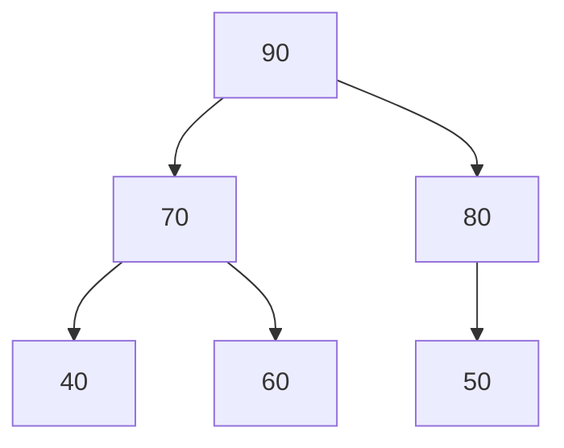

# Lecture 23: Heap and Priority Queue

Lecture 14 introduced the priority queue concept and used C++'s built-in
`std::priority_queue` without asking how it actually works underneath. The answer is a
**heap**: a complete binary tree (Lecture 16) with one simple ordering rule, stored
compactly in an array (Lecture 16's array representation, finally put to real use).

## In This Lecture

- The heap concept and the heap property
- Min-heap and max-heap
- The array representation of a heap, and why completeness makes it work
- Insertion (with "heapify up") and deletion (with "heapify down")
- Building a priority queue on top of a heap
- Heap sort, previewing Lecture 31

## The Heap Concept and Heap Property

A **heap** is a **complete** binary tree (every level full except possibly the last,
filled left to right — Lecture 16) that additionally satisfies the **heap property**:

- **Max-heap**: every parent's value is **greater than or equal to** both its children's.
- **Min-heap**: every parent's value is **less than or equal to** both its children's.

Notice what the heap property does *not* promise: unlike a BST, there's no left-vs-right
ordering rule — only parent-vs-child. That relaxation is exactly what makes heap
insertion and removal faster and simpler than a BST's.



Every parent is ≥ both its children — a valid max-heap, even though `70 > 50`, which
would never be allowed in a BST (where `50` would have to be smaller than everything in
`70`'s *entire* left subtree, not just its immediate children).

## Array Representation of a Heap

Because a heap is always **complete**, Lecture 16's array formulas apply directly, with
no wasted space and no pointers needed at all:

```text
For a node at index i:
  parent index = (i - 1) / 2
  left child index  = 2*i + 1
  right child index = 2*i + 2
```

## Operations on a Heap: Insertion and Heapify-Up

Inserting into a heap has two steps: add the new value at the very next open array slot
(preserving completeness), then **heapify up** — repeatedly swap it with its parent for
as long as it violates the heap property.

```cpp title="max_heap.cpp"
#include <iostream>
#include <vector>
using namespace std;

class MaxHeap {
private:
    vector<int> data;

    int parentIndex(int i) const { return (i - 1) / 2; }
    int leftIndex(int i) const { return 2 * i + 1; }
    int rightIndex(int i) const { return 2 * i + 2; }

    void heapifyUp(int i) {
        while (i > 0 && data[parentIndex(i)] < data[i]) {
            swap(data[parentIndex(i)], data[i]);
            i = parentIndex(i);
        }
    }

    void heapifyDown(int i) {
        int largest = i;
        int left = leftIndex(i);
        int right = rightIndex(i);

        if (left < data.size() && data[left] > data[largest]) largest = left;
        if (right < data.size() && data[right] > data[largest]) largest = right;

        if (largest != i) {
            swap(data[i], data[largest]);
            heapifyDown(largest);
        }
    }

public:
    void insert(int value) {
        data.push_back(value);          // step 1: add at the next open slot
        heapifyUp(data.size() - 1);      // step 2: bubble it up to its correct place
    }

    int extractMax() {
        int maxValue = data[0];
        data[0] = data.back();           // move the last element to the root...
        data.pop_back();
        if (!data.empty()) heapifyDown(0);  // ...then bubble it down to its correct place
        return maxValue;
    }

    void printArray() const {
        for (int v : data) cout << v << " ";
        cout << endl;
    }
};

int main() {
    MaxHeap heap;
    for (int value : {50, 80, 40, 90, 60, 70}) {
        heap.insert(value);
    }

    cout << "Heap array after inserting 50, 80, 40, 90, 60, 70: ";
    heap.printArray();

    cout << "Extracting in max-heap order: ";
    MaxHeap copy = heap;
    for (int i = 0; i < 6; i++) {
        cout << copy.extractMax() << " ";
    }
    cout << endl;

    return 0;
}
```

```text
$ g++ -std=c++17 -o max_heap max_heap.cpp
$ ./max_heap
Heap array after inserting 50, 80, 40, 90, 60, 70: 90 80 70 50 60 40 
Extracting in max-heap order: 90 80 70 60 50 40
```

`extractMax` always returns the **root** (guaranteed to be the maximum, by the heap
property), then patches the hole by moving the very last element to the root and letting
it sink back down (**heapify down**) to wherever it actually belongs.

## Build-Heap

Rather than inserting elements one at a time (each costing O(log n)), an entire array can
be turned into a valid heap in O(n) total by calling `heapifyDown` on every non-leaf node,
starting from the *last* non-leaf and working back to the root — this is what a
`std::priority_queue` constructed directly from an existing container does internally.

## Heap-Based Priority Queue

A priority queue (Lecture 14) is really just a heap wearing a different name: `insert` is
identical, and `extractMax`/`extractMin` *is* `dequeue` — the highest-priority element is
always sitting at the root, ready to be removed in O(log n).

## Heap Sort — A Preview

Repeatedly calling `extractMax` on a max-heap built from an array, and writing each
result into a new array from the *back* forward, produces a fully sorted array — this is
**heap sort**, one of the efficient sorting algorithms covered properly in Lecture 31.

## Complexity of Heap Operations

| Operation | Complexity | Why |
|---|---|---|
| `insert` | O(log n) | Heapify-up walks at most the tree's height |
| `extractMax`/`extractMin` | O(log n) | Heapify-down walks at most the tree's height |
| Peek at max/min | O(1) | Always sitting at index 0 |
| Build-heap from an existing array | O(n) | Cheaper than n individual O(log n) inserts |

Every operation's cost comes from the tree's height — and because a heap is *always*
complete by construction (unlike a plain BST), that height is *always* O(log n), with no
equivalent of Lecture 21's skewed-tree worst case.

## Try It Yourself

1. Compile and run `max_heap.cpp`, then change `MaxHeap` into a `MinHeap` by flipping the
   two comparisons in `heapifyUp` and `heapifyDown` (`<` becomes `>` and vice versa).
   Confirm the extraction order comes out smallest-first instead of largest-first.
2. Trace `heapifyUp` by hand for inserting `90` as the *seventh* value into the heap array
   `[80, 60, 70, 50, 40, 30]` (already valid as a max-heap). Which parent(s) does `90` swap
   past before settling into place? Confirm your trace against the program's real output.

## Key Takeaways

- A **heap** is a complete binary tree with the **heap property**: every parent is ≥ (max-
  heap) or ≤ (min-heap) both its children — a weaker rule than a BST's, which is exactly
  what makes heap operations simpler and consistently O(log n).
- Because a heap is always complete, it's stored efficiently as a plain **array**, using
  Lecture 16's index arithmetic — no pointers needed.
- **Insertion** appends and **heapifies up**; **extraction** removes the root, moves the
  last element there, and **heapifies down** — both O(log n), guaranteed.
- A priority queue *is* a heap — Lecture 14's `std::priority_queue` was using exactly this
  structure the entire time.
