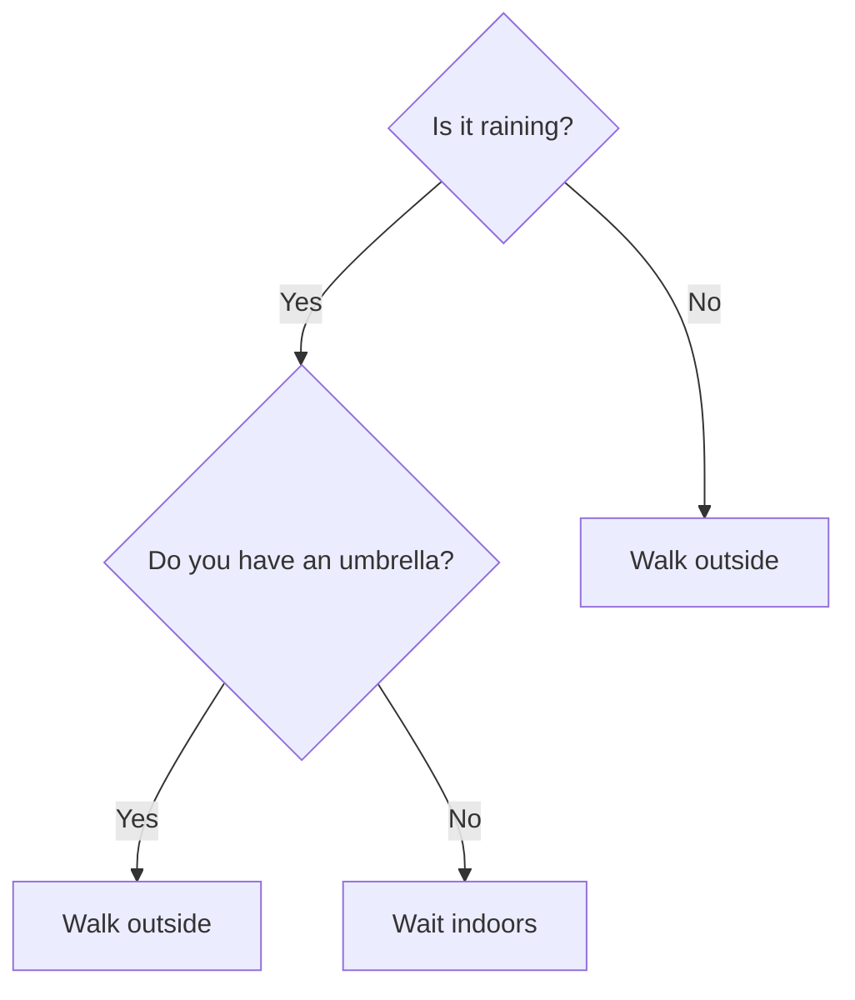
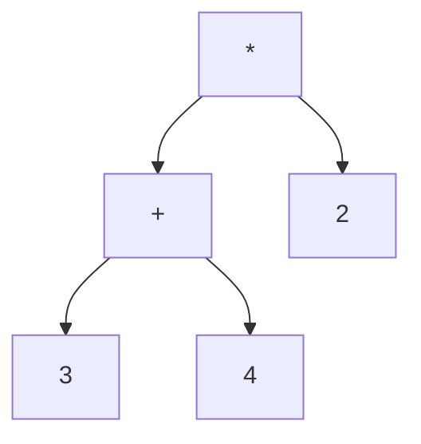
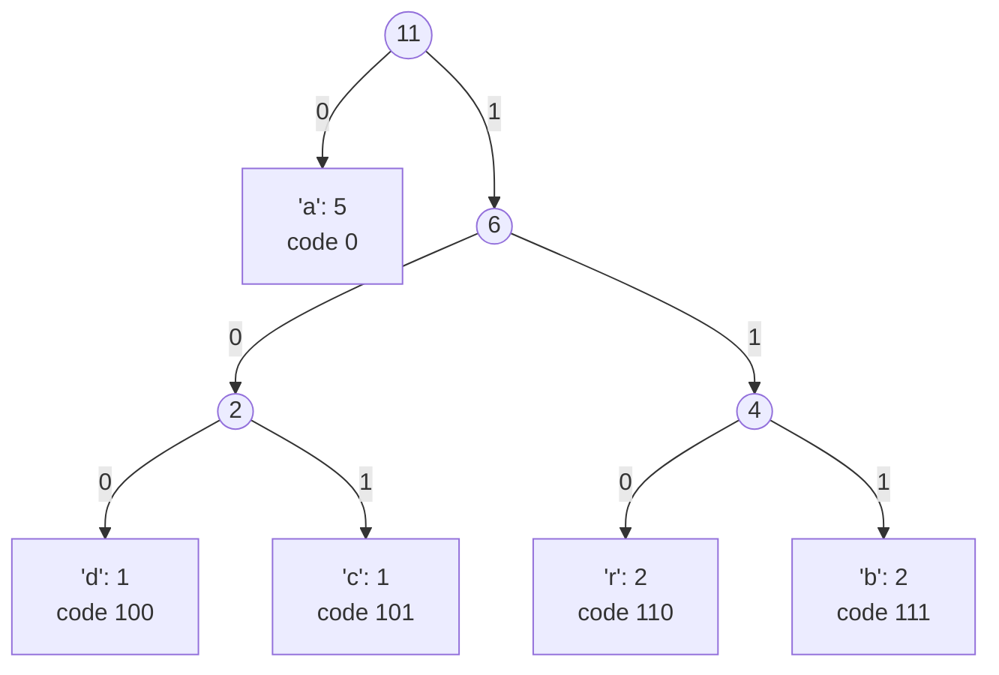
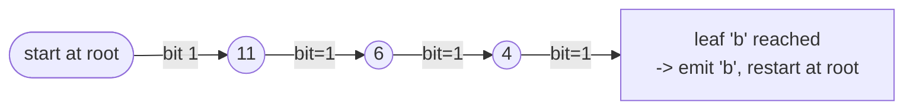

# Lecture 24: Tree Applications

Unit 5 closes by putting trees to real work: a tree that represents a decision process, a
tree that represents an arithmetic expression, and — combining nearly everything this
unit and Lecture 23 covered — a tree that compresses data.

## In This Lecture

- Decision trees, briefly, plus a compiled example that actually walks one
- Expression trees: building one from postfix, evaluating it with a traversal, and
  reconstructing infix notation from it
- Huffman coding: building an optimal compression tree with a min-heap
- Huffman **decoding**: reconstructing the original message from encoded bits, with a
  real, verified encode-then-decode round trip
- A survey of where binary trees show up in real systems, and common pitfalls to avoid

## Decision Trees

A **decision tree** represents a sequence of yes/no (or multi-way) decisions as a tree,
where internal nodes are questions and leaves are outcomes:



This exact structure underlies machine learning decision trees, customer support phone
menus ("press 1 for sales, 2 for support"), and troubleshooting guides — any process that
narrows down to an answer through a sequence of branching questions. Every internal node
is a **question with two (or more) outcomes**; every leaf is a **final answer** with no
further branching — structurally identical to the BST's "smaller goes left, larger goes
right" idea, except the branching condition here is an arbitrary yes/no question instead
of a numeric comparison.

```cpp title="decision_tree.cpp"
#include <iostream>
#include <string>
using namespace std;

struct DecisionNode {
    string question;   // set on internal nodes
    string outcome;     // set on leaf nodes (question is empty)
    DecisionNode* yesBranch;
    DecisionNode* noBranch;

    // Leaf constructor
    DecisionNode(string result) : outcome(result), yesBranch(nullptr), noBranch(nullptr) {}
    // Internal node constructor
    DecisionNode(string q, DecisionNode* yes, DecisionNode* no)
        : question(q), yesBranch(yes), noBranch(no) {}

    bool isLeaf() const { return yesBranch == nullptr && noBranch == nullptr; }
};

// Walks the tree following a fixed sequence of yes/no answers, printing each
// question asked along the way, until it reaches a leaf (the outcome).
string traverse(DecisionNode* node, const bool answers[], int& index) {
    if (node->isLeaf()) {
        cout << "  -> outcome: " << node->outcome << endl;
        return node->outcome;
    }
    bool answer = answers[index++];
    cout << "  " << node->question << " " << (answer ? "Yes" : "No") << endl;
    return traverse(answer ? node->yesBranch : node->noBranch, answers, index);
}

int main() {
    // Same tree as the diagram: "Is it raining?" -> "Do you have an umbrella?"
    DecisionNode* walkOutside1 = new DecisionNode("Walk outside");
    DecisionNode* waitIndoors = new DecisionNode("Wait indoors");
    DecisionNode* umbrellaQuestion = new DecisionNode(
        "Do you have an umbrella?", walkOutside1, waitIndoors);
    DecisionNode* walkOutside2 = new DecisionNode("Walk outside");
    DecisionNode* root = new DecisionNode(
        "Is it raining?", umbrellaQuestion, walkOutside2);

    cout << "Scenario 1: raining, no umbrella" << endl;
    bool scenario1[] = {true, false};
    int index1 = 0;
    traverse(root, scenario1, index1);

    cout << endl << "Scenario 2: not raining" << endl;
    bool scenario2[] = {false};
    int index2 = 0;
    traverse(root, scenario2, index2);

    cout << endl << "Scenario 3: raining, has umbrella" << endl;
    bool scenario3[] = {true, true};
    int index3 = 0;
    traverse(root, scenario3, index3);

    return 0;
}
```

```text
$ g++ -std=c++17 -o decision_tree decision_tree.cpp
$ ./decision_tree
Scenario 1: raining, no umbrella
  Is it raining? Yes
  Do you have an umbrella? No
  -> outcome: Wait indoors

Scenario 2: not raining
  Is it raining? No
  -> outcome: Walk outside

Scenario 3: raining, has umbrella
  Is it raining? Yes
  Do you have an umbrella? Yes
  -> outcome: Walk outside
```

Notice scenario 2 only consults **one** question, not two — `traverse` reaches the `"Walk
outside"` leaf immediately after `"Is it raining?"` answers `No`, exactly like a BST search
that finds its target without walking to the tree's full height. A decision tree's *worst
case* number of questions is bounded by its height, the same shape-dependent idea Lecture
21 covered for BSTs — a lopsided decision tree (one long chain of questions before ever
reaching a "No" branch) is just as much a performance problem for decision trees as a
skewed BST is for search.

## Expression Trees

An **expression tree** represents an arithmetic expression as a tree: every leaf is an
operand, every internal node is an operator, and its two children are the operator's
operands. This is a direct payoff of Lecture 11's postfix notation and Lecture 19's
post-order traversal, combined.



This tree represents `(3 + 4) * 2` — and evaluating it is exactly a **post-order**
traversal: evaluate both children first, then apply the operator at the node.

```cpp title="expression_tree.cpp"
#include <iostream>
#include <stack>
#include <sstream>
using namespace std;

struct ExprNode {
    char value;      // an operator (+, -, *, /) or a digit character
    ExprNode* left;
    ExprNode* right;
    ExprNode(char v) : value(v), left(nullptr), right(nullptr) {}
};

bool isOperator(char c) {
    return c == '+' || c == '-' || c == '*' || c == '/';
}

// Builds an expression tree directly from a postfix expression (Lecture 11).
ExprNode* buildFromPostfix(const string& postfix) {
    stack<ExprNode*> nodes;
    istringstream tokens(postfix);
    string token;

    while (tokens >> token) {
        ExprNode* node = new ExprNode(token[0]);
        if (isOperator(token[0])) {
            node->right = nodes.top(); nodes.pop();
            node->left = nodes.top(); nodes.pop();
        }
        nodes.push(node);
    }
    return nodes.top();
}

// Evaluates the tree with a post-order traversal: children first, then the operator.
int evaluate(ExprNode* node) {
    if (!isOperator(node->value)) {
        return node->value - '0';   // convert the digit character to an int
    }
    int leftVal = evaluate(node->left);
    int rightVal = evaluate(node->right);
    switch (node->value) {
        case '+': return leftVal + rightVal;
        case '-': return leftVal - rightVal;
        case '*': return leftVal * rightVal;
        case '/': return leftVal / rightVal;
    }
    return 0;
}

int main() {
    // "3 4 + 2 *" is the postfix form of (3 + 4) * 2
    ExprNode* tree = buildFromPostfix("3 4 + 2 *");
    cout << "Expression tree for postfix \"3 4 + 2 *\" evaluates to: " << evaluate(tree) << endl;

    ExprNode* tree2 = buildFromPostfix("5 1 2 + 4 * + 3 -");
    cout << "Expression tree for postfix \"5 1 2 + 4 * + 3 -\" evaluates to: " << evaluate(tree2) << endl;

    return 0;
}
```

```text
$ g++ -std=c++17 -o expression_tree expression_tree.cpp
$ ./expression_tree
Expression tree for postfix "3 4 + 2 *" evaluates to: 14
Expression tree for postfix "5 1 2 + 4 * + 3 -" evaluates to: 14
```

The second expression is the same one traced by hand in Lecture 11 — same answer, now
computed by a tree instead of directly manipulating a stack, exactly the connection this
lecture set out to make explicit.

### Reconstructing Infix Notation From the Tree

`evaluate` uses a post-order traversal (children, then the node) to *compute* a number.
Lecture 19's **in-order** traversal (left child, node, right child) does something
different but equally useful on the same tree: it reconstructs a fully-parenthesized
**infix** expression — the human-readable form Lecture 11 started from before ever
converting to postfix.

```cpp title="expr_infix.cpp"
#include <iostream>
#include <stack>
#include <sstream>
using namespace std;

struct ExprNode {
    char value;
    ExprNode* left;
    ExprNode* right;
    ExprNode(char v) : value(v), left(nullptr), right(nullptr) {}
};

bool isOperator(char c) { return c == '+' || c == '-' || c == '*' || c == '/'; }

ExprNode* buildFromPostfix(const string& postfix) {
    stack<ExprNode*> nodes;
    istringstream tokens(postfix);
    string token;
    while (tokens >> token) {
        ExprNode* node = new ExprNode(token[0]);
        if (isOperator(token[0])) {
            node->right = nodes.top(); nodes.pop();
            node->left = nodes.top(); nodes.pop();
        }
        nodes.push(node);
    }
    return nodes.top();
}

int evaluate(ExprNode* node) {
    if (!isOperator(node->value)) return node->value - '0';
    int leftVal = evaluate(node->left);
    int rightVal = evaluate(node->right);
    switch (node->value) {
        case '+': return leftVal + rightVal;
        case '-': return leftVal - rightVal;
        case '*': return leftVal * rightVal;
        case '/': return leftVal / rightVal;
    }
    return 0;
}

// In-order traversal with parentheses around every operator's subtree
// reconstructs a fully-parenthesized infix expression from the tree.
string toInfix(ExprNode* node) {
    if (!isOperator(node->value)) return string(1, node->value);
    return "(" + toInfix(node->left) + " " + node->value + " " + toInfix(node->right) + ")";
}

int main() {
    ExprNode* tree = buildFromPostfix("3 4 + 2 *");
    cout << "Postfix \"3 4 + 2 *\" as a tree, read back out in-order (infix): "
         << toInfix(tree) << " = " << evaluate(tree) << endl;

    ExprNode* tree2 = buildFromPostfix("5 1 2 + 4 * + 3 -");
    cout << "Postfix \"5 1 2 + 4 * + 3 -\" as a tree, read back out in-order (infix): "
         << toInfix(tree2) << " = " << evaluate(tree2) << endl;

    return 0;
}
```

```text
$ g++ -std=c++17 -o expr_infix expr_infix.cpp
$ ./expr_infix
Postfix "3 4 + 2 *" as a tree, read back out in-order (infix): ((3 + 4) * 2) = 14
Postfix "5 1 2 + 4 * + 3 -" as a tree, read back out in-order (infix): ((5 + ((1 + 2) * 4)) - 3) = 14
```

`toInfix` fully parenthesizes *every* operator's subtree, even ones a human wouldn't
bother writing parentheses around (like `(3 + 4)` even though `+` binds the same either
way here) — that's a deliberate simplification: it guarantees the printed expression is
unambiguous without needing to reason about operator precedence at print time, at the cost
of being more heavily parenthesized than a human would naturally write. One tree, three
different traversals, three different uses: **pre-order** would print prefix notation,
**post-order** evaluates a number, **in-order** reconstructs infix — the exact same
traversal-order-changes-meaning idea Lecture 19 introduced, now paying off concretely.

## Huffman Trees and Huffman Coding

**Huffman coding** is a real, widely-used compression technique: characters that appear
*more often* get *shorter* binary codes, and characters that appear rarely get longer
ones — reducing the total number of bits needed overall, compared to giving every
character the same fixed number of bits.

The algorithm builds a **Huffman tree** using a **min-heap** (Lecture 23) of nodes, each
starting as a single character with its frequency:

1. Put every character in a min-heap, keyed by frequency.
2. Repeatedly extract the two smallest-frequency nodes, merge them into a new internal
   node (frequency = the sum of both), and insert that merged node back into the heap.
3. Stop when only one node remains — that's the root of the Huffman tree.
4. Walk the tree: each left branch appends `0`, each right branch appends `1`; each leaf's
   accumulated path is that character's code.

```cpp title="huffman_coding.cpp"
#include <iostream>
#include <queue>
#include <unordered_map>
#include <string>
#include <vector>
using namespace std;

struct HuffmanNode {
    char character;
    int frequency;
    HuffmanNode* left;
    HuffmanNode* right;
    HuffmanNode(char c, int freq) : character(c), frequency(freq), left(nullptr), right(nullptr) {}
    HuffmanNode(int freq, HuffmanNode* l, HuffmanNode* r)
        : character('\0'), frequency(freq), left(l), right(r) {}
};

// Min-heap comparator: std::priority_queue is a MAX-heap by default, so this
// comparator is deliberately inverted to make it behave as a min-heap instead.
struct CompareFrequency {
    bool operator()(HuffmanNode* a, HuffmanNode* b) {
        return a->frequency > b->frequency;
    }
};

void generateCodes(HuffmanNode* node, const string& path, unordered_map<char, string>& codes) {
    if (node == nullptr) return;
    if (node->left == nullptr && node->right == nullptr) {
        codes[node->character] = path.empty() ? "0" : path;   // handle a single-character input
        return;
    }
    generateCodes(node->left, path + "0", codes);
    generateCodes(node->right, path + "1", codes);
}

int main() {
    string text = "abracadabra";
    unordered_map<char, int> frequency;
    for (char c : text) frequency[c]++;

    priority_queue<HuffmanNode*, vector<HuffmanNode*>, CompareFrequency> minHeap;
    for (auto& pair : frequency) {
        minHeap.push(new HuffmanNode(pair.first, pair.second));
    }

    while (minHeap.size() > 1) {
        HuffmanNode* first = minHeap.top(); minHeap.pop();
        HuffmanNode* second = minHeap.top(); minHeap.pop();
        HuffmanNode* merged = new HuffmanNode(first->frequency + second->frequency, first, second);
        minHeap.push(merged);
    }
    HuffmanNode* root = minHeap.top();

    unordered_map<char, string> codes;
    generateCodes(root, "", codes);

    cout << "Text: \"" << text << "\" (" << text.length() << " characters)" << endl << endl;
    cout << "Character frequencies and Huffman codes:" << endl;
    int totalBitsHuffman = 0;
    for (auto& pair : frequency) {
        cout << "  '" << pair.first << "': frequency " << pair.second
             << ", code " << codes[pair.first] << endl;
        totalBitsHuffman += pair.second * codes[pair.first].length();
    }

    int totalBitsFixed = text.length() * 8;   // a plain ASCII character is 8 bits
    cout << endl << "Total bits with fixed-width (8 bits/char): " << totalBitsFixed << endl;
    cout << "Total bits with Huffman coding:              " << totalBitsHuffman << endl;

    return 0;
}
```

```text
$ g++ -std=c++17 -o huffman_coding huffman_coding.cpp
$ ./huffman_coding
Text: "abracadabra" (11 characters)

Character frequencies and Huffman codes:
  'd': frequency 1, code 100
  'c': frequency 1, code 101
  'r': frequency 2, code 110
  'b': frequency 2, code 111
  'a': frequency 5, code 0

Total bits with fixed-width (8 bits/char): 88
Total bits with Huffman coding:              23
```

!!! note "Why the printed order isn't a-b-r-c-d"
    The characters print in `unordered_map`'s internal hash order, not insertion order or
    frequency order — that order is an implementation detail, not something Huffman coding
    promises. What *is* guaranteed is the **code lengths**: `'a'`, the most frequent
    character, gets the shortest possible code (1 bit); the two characters that appear
    twice (`b`, `r`) get 3-bit codes; the two that appear once (`c`, `d`) also get 3-bit
    codes — always shorter or equal for more frequent characters, never the reverse.

`'a'` — by far the most frequent character — gets the shortest possible code, just one
bit. Rarer characters (`c`, `d`) get three bits each. The result: this short piece of
text shrinks from 88 bits to 23, a real, working demonstration of *why* frequency-based
coding saves space, using exactly the min-heap from Lecture 23 to build the tree.

### Visualizing the Huffman Tree

The codes printed above (`a`→`0`, `b`→`111`, `r`→`110`, `c`→`101`, `d`→`100`) aren't
arbitrary — each one is the exact left/right path from the root to that character's leaf
(`0` for left, `1` for right). Drawing the tree those paths imply makes the "more frequent
= shorter code" rule visible directly as *tree depth*:



`'a'` sits directly under the root — depth 1, a 1-bit code — because it was the *last*
node merged (the algorithm always merges the two smallest-frequency nodes first, so the
most frequent node ends up merged in last, closest to the root). `'c'` and `'d'`, the two
rarest characters, sit at depth 3, merged together *first*, then buried deeper as larger
subtrees merged on top of them. This is the entire algorithm's mechanism, visible as
geometry: repeatedly merging the two smallest frequencies naturally pushes rare characters
deep and common characters shallow.

!!! note "This diagram reflects one specific compiled run's codes"
    Because of the `unordered_map` iteration-order caveat above, a different environment
    could assign these exact bit patterns differently (e.g. `c` and `d` might swap which
    gets `100` vs `101`) — but the *shape* is guaranteed: `a` will always end up at depth
    1, and `c`/`d` will always be exactly as deep as `r`/`b`, tied for the two rarest
    frequencies, regardless of which specific 0/1 labels a given run happens to print.

### Huffman Decoding: Closing the Loop

Building the code table is only half the story — a compression scheme is only useful if
the original message can be recovered. **Decoding** walks the *same* tree from the root,
one bit at a time: `0` means go left, `1` means go right, and reaching a leaf emits that
character and restarts the walk at the root for the next code.

```cpp title="huffman_roundtrip.cpp"
#include <iostream>
#include <queue>
#include <unordered_map>
#include <string>
#include <vector>
using namespace std;

struct HuffmanNode {
    char character;
    int frequency;
    HuffmanNode* left;
    HuffmanNode* right;
    HuffmanNode(char c, int freq) : character(c), frequency(freq), left(nullptr), right(nullptr) {}
    HuffmanNode(int freq, HuffmanNode* l, HuffmanNode* r)
        : character('\0'), frequency(freq), left(l), right(r) {}
};

struct CompareFrequency {
    bool operator()(HuffmanNode* a, HuffmanNode* b) {
        return a->frequency > b->frequency;
    }
};

void generateCodes(HuffmanNode* node, const string& path, unordered_map<char, string>& codes) {
    if (node == nullptr) return;
    if (node->left == nullptr && node->right == nullptr) {
        codes[node->character] = path.empty() ? "0" : path;
        return;
    }
    generateCodes(node->left, path + "0", codes);
    generateCodes(node->right, path + "1", codes);
}

// Encode a whole message by concatenating each character's code.
string encode(const string& text, unordered_map<char, string>& codes) {
    string bits;
    for (char c : text) bits += codes[c];
    return bits;
}

// Decode a bitstring by walking the tree from the root: '0' goes left, '1'
// goes right, and reaching a leaf emits that character and restarts at the
// root for the next code.
string decode(const string& bits, HuffmanNode* root) {
    string result;
    HuffmanNode* current = root;
    for (char bit : bits) {
        current = (bit == '0') ? current->left : current->right;
        if (current->left == nullptr && current->right == nullptr) {
            result += current->character;
            current = root;
        }
    }
    return result;
}

int main() {
    string text = "abracadabra";
    unordered_map<char, int> frequency;
    for (char c : text) frequency[c]++;

    priority_queue<HuffmanNode*, vector<HuffmanNode*>, CompareFrequency> minHeap;
    for (auto& pair : frequency) {
        minHeap.push(new HuffmanNode(pair.first, pair.second));
    }
    while (minHeap.size() > 1) {
        HuffmanNode* first = minHeap.top(); minHeap.pop();
        HuffmanNode* second = minHeap.top(); minHeap.pop();
        HuffmanNode* merged = new HuffmanNode(first->frequency + second->frequency, first, second);
        minHeap.push(merged);
    }
    HuffmanNode* root = minHeap.top();

    unordered_map<char, string> codes;
    generateCodes(root, "", codes);

    string encoded = encode(text, codes);
    string decoded = decode(encoded, root);

    cout << "Original text:  \"" << text << "\"" << endl;
    cout << "Encoded bits:   " << encoded << " (" << encoded.length() << " bits)" << endl;
    cout << "Decoded text:   \"" << decoded << "\"" << endl;
    cout << "Round trip matches original? " << (decoded == text ? "yes" : "NO -- BUG") << endl;

    return 0;
}
```

```text
$ g++ -std=c++17 -o huffman_roundtrip huffman_roundtrip.cpp
$ ./huffman_roundtrip
Original text:  "abracadabra"
Encoded bits:   01111100101010001111100 (23 bits)
Decoded text:   "abracadabra"
Round trip matches original? yes
```

The encoded length, `23` bits, matches the `Total bits with Huffman coding` figure from
the section above — the same computation, now actually carried out on the full message
rather than just summed from per-character counts. Decoding never needs to know where one
code ends and the next begins from any external marker (no comma, no fixed width) — the
tree structure itself guarantees the bits are **prefix-free**: no character's code is a
prefix of another's, since every code corresponds to a distinct leaf, and reaching *any*
leaf always means "stop, a full character was just decoded." That property is what makes
`decode`'s simple "restart at root after every leaf" logic correct at all.



Decoding the three bits `111` (the code for `'b'`) walks right, right, right from the
root — three internal nodes deep — then hits a leaf and emits `b`, exactly matching the
code table `generateCodes` built.

## Applications of Binary Trees

| Application | Which tree concept |
|---|---|
| File compression (ZIP, JPEG) | Huffman trees, exactly as shown above |
| Compilers and calculators | Expression trees for parsing and evaluating |
| Decision support / ML classifiers | Decision trees |
| Ordered sets and maps | Self-balancing BSTs (Lecture 22's AVL tree) |
| Task/event scheduling | Heaps as priority queues (Lecture 23) |
| Autocomplete and spell-check | Trie — a specialized tree not covered in this course, but built on the exact same node/child ideas |
| Databases and file systems | B-trees — a wide, shallow generalization of a BST, tuned for disk/SSD access instead of memory |
| Parsing HTML, JSON, and XML | A tree mirrors the nested document structure directly, one node per element |

Every row shares the same underlying pattern this whole unit has built toward: whenever a
problem has a natural notion of "this thing contains/depends on/branches into these other
things," a tree is almost always the right shape to reach for — the only real design
decisions left are what the node stores, and what rule (if any) governs how children
relate to their parent.

### Common Pitfalls When Applying Trees

- **Confusing which traversal order a task needs** — evaluating an expression tree needs
  post-order (children before the operator); printing it back as infix needs in-order;
  neither would give a sensible result run in the wrong order. Always ask "does this
  computation need children resolved before or after visiting this node?" before picking
  an order.
- **Forgetting Huffman codes are prefix-free by construction, not by coincidence** — it's
  tempting to think you need to explicitly check for "does this code prefix another
  code?" when designing a compression scheme by hand; a tree-based code gets this for
  free, because every code corresponds to a distinct *leaf*, and no leaf is an ancestor of
  another leaf.
- **Building a Huffman tree from an empty or single-character input** — the `while
  (minHeap.size() > 1)` loop in `huffman_coding.cpp` never executes if there's only one
  distinct character, leaving `root` as that single leaf node directly; `generateCodes`
  handles this correctly (`path.empty() ? "0" : path`), but a hand-rolled version that
  assumes the root is always an internal node would break on this input.
- **Decoding past the end of a bitstring** — `decode`'s loop naturally stops when the
  bitstring runs out, but if the bitstring were ever corrupted or truncated mid-code, the
  walk would be left partway down the tree, not at a leaf, with no character emitted for
  those trailing bits — worth an explicit check in any production decoder.

## Try It Yourself

1. Compile and run `expression_tree.cpp`, then build and evaluate the tree for the
   postfix expression `"10 2 /"` (which represents `10 / 2`). Confirm the output is `5`.
2. Run `huffman_coding.cpp` on a different string of your choosing (try one with very
   uneven character frequencies, like `"aaaaaaaaab"`) and compare the fixed-width vs.
   Huffman total bit counts. Which kind of text benefits *most* from Huffman coding —
   very repetitive text, or text where every character appears about equally often?
3. Modify `expr_infix.cpp` to also print the **prefix** form (pre-order: operator, then
   both children — no parentheses needed at all, since prefix notation is inherently
   unambiguous) alongside the infix form already printed. Confirm your prefix output for
   `"3 4 + 2 *"` reads `* + 3 4 2`.
4. Modify `huffman_roundtrip.cpp` to corrupt one bit in the middle of `encoded` (flip a
   `'0'` to `'1'` or vice versa) before decoding it. Run it and observe how the decoded
   text differs from the original — explain, in terms of which tree path the flipped bit
   sends `decode` down, why a single bit error can corrupt more than just one character.
5. Extend `decision_tree.cpp` with one more level of questions under `"Wait indoors"` (for
   example, `"Do you have work to finish?"` branching to `"Catch up on chores"` or `"Read
   a book"`), and add a fourth scenario to `main()` that reaches your new leaf.

## Key Takeaways

- **Decision trees** model branching yes/no processes — the same idea as a BST's
  comparison-based branching, generalized to arbitrary questions instead of `<`/`>`.
- **Expression trees** model arithmetic: **post-order** evaluates a number, **in-order**
  reconstructs infix notation, and **pre-order** would produce prefix notation — the same
  tree, three different meanings depending purely on traversal order (Lecture 19).
- **Huffman coding** builds an optimal-length binary code by repeatedly merging the two
  least-frequent nodes using a **min-heap** (Lecture 23) — more frequent characters end up
  shallower in the tree, which is exactly what gives them shorter codes.
- Huffman codes are **prefix-free by construction** (every code is a distinct leaf), which
  is precisely what makes unambiguous **decoding** possible — walk left/right by bit,
  emit a character at every leaf, and restart at the root.
- This lecture is a genuine synthesis: expression trees connect back to Lecture 11's
  stacks, and Huffman trees connect back to Lecture 23's heaps — a preview of how
  data structures compose together in real systems, not just in isolation.
- This closes Unit 5. Unit 6 moves from trees — where a node has at most a fixed, small
  number of children — to **graphs**, where a node can connect to any number of other
  nodes in any pattern at all.
