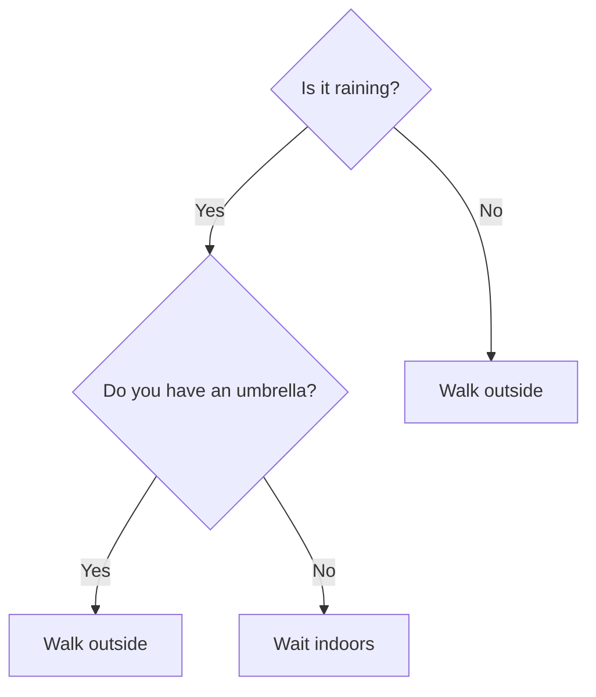
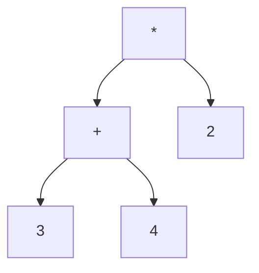

# Lecture 24: Tree Applications

Unit 5 closes by putting trees to real work: a tree that represents a decision process, a
tree that represents an arithmetic expression, and — combining nearly everything this
unit and Lecture 23 covered — a tree that compresses data.

## In This Lecture

- Decision trees, briefly
- Expression trees: building one from postfix, and evaluating it with a traversal
- Huffman coding: building an optimal compression tree with a min-heap
- A survey of where binary trees show up in real systems

## Decision Trees

A **decision tree** represents a sequence of yes/no (or multi-way) decisions as a tree,
where internal nodes are questions and leaves are outcomes:



This exact structure underlies machine learning decision trees, customer support phone
menus ("press 1 for sales, 2 for support"), and troubleshooting guides — any process that
narrows down to an answer through a sequence of branching questions.

## Expression Trees

An **expression tree** represents an arithmetic expression as a tree: every leaf is an
operand, every internal node is an operator, and its two children are the operator's
operands. This is a direct payoff of Lecture 11's postfix notation and Lecture 19's
post-order traversal, combined.



This tree represents `(3 + 4) * 2` — and evaluating it is exactly a **post-order**
traversal: evaluate both children first, then apply the operator at the node.

```cpp title="expression_tree.cpp"
#include <iostream>
#include <stack>
#include <sstream>
using namespace std;

struct ExprNode {
    char value;      // an operator (+, -, *, /) or a digit character
    ExprNode* left;
    ExprNode* right;
    ExprNode(char v) : value(v), left(nullptr), right(nullptr) {}
};

bool isOperator(char c) {
    return c == '+' || c == '-' || c == '*' || c == '/';
}

// Builds an expression tree directly from a postfix expression (Lecture 11).
ExprNode* buildFromPostfix(const string& postfix) {
    stack<ExprNode*> nodes;
    istringstream tokens(postfix);
    string token;

    while (tokens >> token) {
        ExprNode* node = new ExprNode(token[0]);
        if (isOperator(token[0])) {
            node->right = nodes.top(); nodes.pop();
            node->left = nodes.top(); nodes.pop();
        }
        nodes.push(node);
    }
    return nodes.top();
}

// Evaluates the tree with a post-order traversal: children first, then the operator.
int evaluate(ExprNode* node) {
    if (!isOperator(node->value)) {
        return node->value - '0';   // convert the digit character to an int
    }
    int leftVal = evaluate(node->left);
    int rightVal = evaluate(node->right);
    switch (node->value) {
        case '+': return leftVal + rightVal;
        case '-': return leftVal - rightVal;
        case '*': return leftVal * rightVal;
        case '/': return leftVal / rightVal;
    }
    return 0;
}

int main() {
    // "3 4 + 2 *" is the postfix form of (3 + 4) * 2
    ExprNode* tree = buildFromPostfix("3 4 + 2 *");
    cout << "Expression tree for postfix \"3 4 + 2 *\" evaluates to: " << evaluate(tree) << endl;

    ExprNode* tree2 = buildFromPostfix("5 1 2 + 4 * + 3 -");
    cout << "Expression tree for postfix \"5 1 2 + 4 * + 3 -\" evaluates to: " << evaluate(tree2) << endl;

    return 0;
}
```

```text
$ g++ -std=c++17 -o expression_tree expression_tree.cpp
$ ./expression_tree
Expression tree for postfix "3 4 + 2 *" evaluates to: 14
Expression tree for postfix "5 1 2 + 4 * + 3 -" evaluates to: 14
```

The second expression is the same one traced by hand in Lecture 11 — same answer, now
computed by a tree instead of directly manipulating a stack, exactly the connection this
lecture set out to make explicit.

## Huffman Trees and Huffman Coding

**Huffman coding** is a real, widely-used compression technique: characters that appear
*more often* get *shorter* binary codes, and characters that appear rarely get longer
ones — reducing the total number of bits needed overall, compared to giving every
character the same fixed number of bits.

The algorithm builds a **Huffman tree** using a **min-heap** (Lecture 23) of nodes, each
starting as a single character with its frequency:

1. Put every character in a min-heap, keyed by frequency.
2. Repeatedly extract the two smallest-frequency nodes, merge them into a new internal
   node (frequency = the sum of both), and insert that merged node back into the heap.
3. Stop when only one node remains — that's the root of the Huffman tree.
4. Walk the tree: each left branch appends `0`, each right branch appends `1`; each leaf's
   accumulated path is that character's code.

```cpp title="huffman_coding.cpp"
#include <iostream>
#include <queue>
#include <unordered_map>
#include <string>
#include <vector>
using namespace std;

struct HuffmanNode {
    char character;
    int frequency;
    HuffmanNode* left;
    HuffmanNode* right;
    HuffmanNode(char c, int freq) : character(c), frequency(freq), left(nullptr), right(nullptr) {}
    HuffmanNode(int freq, HuffmanNode* l, HuffmanNode* r)
        : character('\0'), frequency(freq), left(l), right(r) {}
};

// Min-heap comparator: std::priority_queue is a MAX-heap by default, so this
// comparator is deliberately inverted to make it behave as a min-heap instead.
struct CompareFrequency {
    bool operator()(HuffmanNode* a, HuffmanNode* b) {
        return a->frequency > b->frequency;
    }
};

void generateCodes(HuffmanNode* node, const string& path, unordered_map<char, string>& codes) {
    if (node == nullptr) return;
    if (node->left == nullptr && node->right == nullptr) {
        codes[node->character] = path.empty() ? "0" : path;   // handle a single-character input
        return;
    }
    generateCodes(node->left, path + "0", codes);
    generateCodes(node->right, path + "1", codes);
}

int main() {
    string text = "abracadabra";
    unordered_map<char, int> frequency;
    for (char c : text) frequency[c]++;

    priority_queue<HuffmanNode*, vector<HuffmanNode*>, CompareFrequency> minHeap;
    for (auto& pair : frequency) {
        minHeap.push(new HuffmanNode(pair.first, pair.second));
    }

    while (minHeap.size() > 1) {
        HuffmanNode* first = minHeap.top(); minHeap.pop();
        HuffmanNode* second = minHeap.top(); minHeap.pop();
        HuffmanNode* merged = new HuffmanNode(first->frequency + second->frequency, first, second);
        minHeap.push(merged);
    }
    HuffmanNode* root = minHeap.top();

    unordered_map<char, string> codes;
    generateCodes(root, "", codes);

    cout << "Text: \"" << text << "\" (" << text.length() << " characters)" << endl << endl;
    cout << "Character frequencies and Huffman codes:" << endl;
    int totalBitsHuffman = 0;
    for (auto& pair : frequency) {
        cout << "  '" << pair.first << "': frequency " << pair.second
             << ", code " << codes[pair.first] << endl;
        totalBitsHuffman += pair.second * codes[pair.first].length();
    }

    int totalBitsFixed = text.length() * 8;   // a plain ASCII character is 8 bits
    cout << endl << "Total bits with fixed-width (8 bits/char): " << totalBitsFixed << endl;
    cout << "Total bits with Huffman coding:              " << totalBitsHuffman << endl;

    return 0;
}
```

```text
$ g++ -std=c++17 -o huffman_coding huffman_coding.cpp
$ ./huffman_coding
Text: "abracadabra" (11 characters)

Character frequencies and Huffman codes:
  'd': frequency 1, code 100
  'c': frequency 1, code 101
  'r': frequency 2, code 110
  'b': frequency 2, code 111
  'a': frequency 5, code 0

Total bits with fixed-width (8 bits/char): 88
Total bits with Huffman coding:              23
```

!!! note "Why the printed order isn't a-b-r-c-d"
    The characters print in `unordered_map`'s internal hash order, not insertion order or
    frequency order — that order is an implementation detail, not something Huffman coding
    promises. What *is* guaranteed is the **code lengths**: `'a'`, the most frequent
    character, gets the shortest possible code (1 bit); the two characters that appear
    twice (`b`, `r`) get 3-bit codes; the two that appear once (`c`, `d`) also get 3-bit
    codes — always shorter or equal for more frequent characters, never the reverse.

`'a'` — by far the most frequent character — gets the shortest possible code, just one
bit. Rarer characters (`c`, `d`) get three bits each. The result: this short piece of
text shrinks from 88 bits to 23, a real, working demonstration of *why* frequency-based
coding saves space, using exactly the min-heap from Lecture 23 to build the tree.

## Applications of Binary Trees

| Application | Which tree concept |
|---|---|
| File compression (ZIP, JPEG) | Huffman trees, exactly as shown above |
| Compilers and calculators | Expression trees for parsing and evaluating |
| Decision support / ML classifiers | Decision trees |
| Ordered sets and maps | Self-balancing BSTs (Lecture 22's AVL tree) |
| Task/event scheduling | Heaps as priority queues (Lecture 23) |
| Autocomplete and spell-check | Trie — a specialized tree not covered in this course, but built on the exact same node/child ideas |

## Try It Yourself

1. Compile and run `expression_tree.cpp`, then build and evaluate the tree for the
   postfix expression `"10 2 /"` (which represents `10 / 2`). Confirm the output is `5`.
2. Run `huffman_coding.cpp` on a different string of your choosing (try one with very
   uneven character frequencies, like `"aaaaaaaaab"`) and compare the fixed-width vs.
   Huffman total bit counts. Which kind of text benefits *most* from Huffman coding —
   very repetitive text, or text where every character appears about equally often?

## Key Takeaways

- **Decision trees** model branching yes/no processes; **expression trees** model
  arithmetic, and evaluating one is a direct application of Lecture 19's post-order
  traversal.
- **Huffman coding** builds an optimal-length binary code by repeatedly merging the two
  least-frequent nodes using a **min-heap** (Lecture 23) — more frequent characters end up
  with shorter codes.
- This lecture is a genuine synthesis: expression trees connect back to Lecture 11's
  stacks, and Huffman trees connect back to Lecture 23's heaps — a preview of how
  data structures compose together in real systems, not just in isolation.
- This closes Unit 5. Unit 6 moves from trees — where a node has at most a fixed, small
  number of children — to **graphs**, where a node can connect to any number of other
  nodes in any pattern at all.
