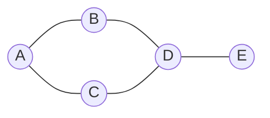
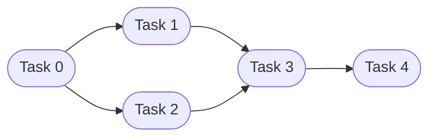
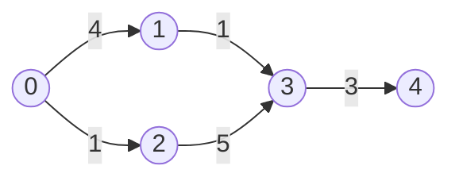
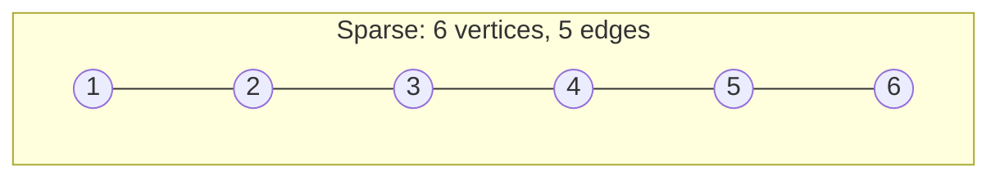
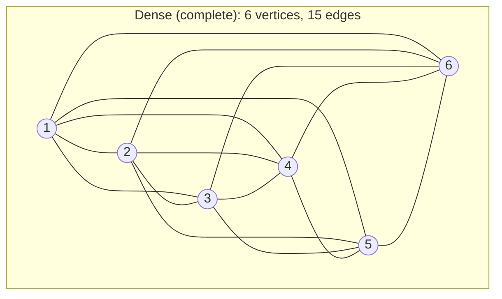

# Lecture 25: Graphs and Representation

A tree restricts every node to exactly one parent — no cycles, no cross-connections. A
**graph** removes that restriction entirely: any node can connect to any number of other
nodes, in any pattern. This is the most general structure in the course, and it's the one
behind maps, social networks, and the internet itself.

## In This Lecture

- Core graph terminology: vertices, edges, directed vs. undirected, weighted vs. unweighted
- Degree, path, cycle, and connectivity
- Directed graphs in practice: in-degree, out-degree, and why direction changes everything
- The two standard representations: adjacency matrix and adjacency list
- Converting the same graph between both representations, by hand and in code
- A direct, quantified comparison of when to use each, including why real-world graphs are sparse

## Graph Concepts and Terminology

A **graph** `G = (V, E)` consists of a set of **vertices** (nodes) `V` and a set of
**edges** `E` connecting pairs of vertices.



| Term | Meaning |
|---|---|
| **Vertex** (node) | A single point in the graph |
| **Edge** | A connection between two vertices |
| **Directed graph** | Edges have a direction — `A → B` doesn't imply `B → A` |
| **Undirected graph** | Edges have no direction — a connection works both ways |
| **Weighted graph** | Every edge carries a number (cost, distance, time) — needed for Lecture 27's shortest path |
| **Unweighted graph** | Edges simply exist or don't — no associated cost |
| **Degree** (of a vertex) | The number of edges connected to it |
| **Path** | A sequence of edges connecting one vertex to another |
| **Cycle** | A path that starts and ends at the same vertex |
| **Connected graph** | Every vertex can reach every other vertex via some path |

## Types of Graphs

- A graph can be **directed** or **undirected**, and **weighted** or **unweighted**,
  independently — four combinations in total. A road map with one-way streets and
  distances is directed *and* weighted; a friendship graph on a social network is
  typically undirected and unweighted.
- A **cyclic** graph contains at least one cycle; an **acyclic** graph contains none. A
  **DAG** (Directed Acyclic Graph) — directed with no cycles — represents things like
  task dependencies, where a cycle would mean an impossible contradiction ("task A
  depends on B, which depends on A").

In a **directed** graph, an edge `A --> B` is drawn with an arrowhead, and it says nothing
about whether `B --> A` also exists — the two are entirely separate edges that happen to
connect the same two vertices. This single diagram is a DAG: task `0` must finish before
either `1` or `2` can start, and both `1` and `2` must finish before `3` starts.



Compare that to the **undirected** diagram back in Graph Concepts — every edge there
already implicitly means "and vice versa." Add weights to the directed version and you get
a graph that could represent, say, estimated task durations in hours:



## Directed Graphs in Practice

Direction changes what "neighbor" even means. In an undirected `addEdge(u, v)`, the edge
is written into *both* `adjList[u]` and `adjList[v]` — but a directed edge is written only
into `adjList[u]`, because "u points to v" says nothing about v pointing back. This has a
direct consequence for degree: a directed vertex has an **out-degree** (edges leaving it)
and an **in-degree** (edges arriving at it), which can differ.

```cpp title="directed_graph.cpp"
#include <iostream>
#include <vector>
#include <list>
using namespace std;

class DirectedGraph {
private:
    int numVertices;
    vector<list<int>> adjList;

public:
    DirectedGraph(int v) : numVertices(v), adjList(v) {}

    void addEdge(int u, int v) {
        adjList[u].push_back(v);   // directed: only u -> v, not the reverse
    }

    void print() const {
        for (int i = 0; i < numVertices; i++) {
            cout << i << " -> ";
            for (int neighbor : adjList[i]) {
                cout << neighbor << " ";
            }
            cout << endl;
        }
    }

    // in-degree can't be read directly off adjList[i] the way out-degree can --
    // it has to be computed by scanning every OTHER vertex's list for a mention of i.
    void printDegrees() const {
        vector<int> inDegree(numVertices, 0);
        for (int i = 0; i < numVertices; i++) {
            for (int neighbor : adjList[i]) {
                inDegree[neighbor]++;
            }
        }
        for (int i = 0; i < numVertices; i++) {
            cout << "  vertex " << i << ": out-degree " << adjList[i].size()
                 << ", in-degree " << inDegree[i] << endl;
        }
    }
};

int main() {
    // The task-dependency DAG from the diagram above: edge u -> v means
    // "task u must finish before task v can start".
    DirectedGraph graph(5);
    graph.addEdge(0, 1);
    graph.addEdge(0, 2);
    graph.addEdge(1, 3);
    graph.addEdge(2, 3);
    graph.addEdge(3, 4);

    cout << "Directed adjacency list:" << endl;
    graph.print();

    cout << "In-degree / out-degree per vertex:" << endl;
    graph.printDegrees();

    return 0;
}
```

```text
$ g++ -std=c++17 -o directed_graph directed_graph.cpp
$ ./directed_graph
Directed adjacency list:
0 -> 1 2 
1 -> 3 
2 -> 3 
3 -> 4 
4 -> 
In-degree / out-degree per vertex:
  vertex 0: out-degree 2, in-degree 0
  vertex 1: out-degree 1, in-degree 1
  vertex 2: out-degree 1, in-degree 1
  vertex 3: out-degree 1, in-degree 2
  vertex 4: out-degree 0, in-degree 1
```

Vertex `0`'s in-degree of `0` marks it as a **source** (nothing must happen before it);
vertex `4`'s out-degree of `0` marks it as a **sink** (nothing depends on it finishing).
This exact in-degree/out-degree bookkeeping is what a real task scheduler or build system
(like `make`, or a CI pipeline's dependency graph) uses to decide which tasks are ready to
run: a task becomes runnable only once every task pointing *into* it has completed.

!!! note "Undirected degree is a special case, not a separate idea"
    An undirected edge is really just a directed edge in *both* directions at once — which
    is why, for an undirected graph, in-degree and out-degree are always equal for every
    vertex, and people just call it "degree." Lecture 25's `addEdge` writing to both
    `adjList[u]` and `adjList[v]` is exactly this: two directed edges added together.

## Adjacency Matrix

An **adjacency matrix** is a 2D array (Lecture 4) of size `V × V`, where
`matrix[i][j] = 1` (or the edge's weight) if an edge connects vertex `i` to vertex `j`,
and `0` otherwise.

```cpp title="adjacency_matrix.cpp"
#include <iostream>
#include <vector>
using namespace std;

class GraphMatrix {
private:
    int numVertices;
    vector<vector<int>> matrix;

public:
    GraphMatrix(int v) : numVertices(v), matrix(v, vector<int>(v, 0)) {}

    void addEdge(int u, int v) {
        matrix[u][v] = 1;
        matrix[v][u] = 1;   // undirected: the connection works both ways
    }

    void print() const {
        cout << "  ";
        for (int i = 0; i < numVertices; i++) cout << i << " ";
        cout << endl;
        for (int i = 0; i < numVertices; i++) {
            cout << i << " ";
            for (int j = 0; j < numVertices; j++) {
                cout << matrix[i][j] << " ";
            }
            cout << endl;
        }
    }
};

int main() {
    // Vertices 0-4, matching the diagram: A=0, B=1, C=2, D=3, E=4
    GraphMatrix graph(5);
    graph.addEdge(0, 1);   // A-B
    graph.addEdge(0, 2);   // A-C
    graph.addEdge(1, 3);   // B-D
    graph.addEdge(2, 3);   // C-D
    graph.addEdge(3, 4);   // D-E

    cout << "Adjacency matrix:" << endl;
    graph.print();

    return 0;
}
```

```text
$ g++ -std=c++17 -o adjacency_matrix adjacency_matrix.cpp
$ ./adjacency_matrix
Adjacency matrix:
  0 1 2 3 4 
0 0 1 1 0 0 
1 1 0 0 1 0 
2 1 0 0 1 0 
3 0 1 1 0 1 
4 0 0 0 1 0 
```

Checking whether an edge exists between any two vertices is O(1) — a direct array lookup
— but the matrix uses O(V²) memory regardless of how many edges actually exist, which
wastes enormous space for a **sparse** graph (one with relatively few edges compared to
the number of possible pairs).

## Adjacency List

An **adjacency list** stores, for each vertex, only the list of vertices it's actually
connected to — using exactly the linked structures from Units 2–4.

```cpp title="adjacency_list.cpp"
#include <iostream>
#include <vector>
#include <list>
using namespace std;

class GraphList {
private:
    int numVertices;
    vector<list<int>> adjList;

public:
    GraphList(int v) : numVertices(v), adjList(v) {}

    void addEdge(int u, int v) {
        adjList[u].push_back(v);
        adjList[v].push_back(u);   // undirected
    }

    void print() const {
        for (int i = 0; i < numVertices; i++) {
            cout << i << ": ";
            for (int neighbor : adjList[i]) {
                cout << neighbor << " ";
            }
            cout << endl;
        }
    }
};

int main() {
    GraphList graph(5);
    graph.addEdge(0, 1);
    graph.addEdge(0, 2);
    graph.addEdge(1, 3);
    graph.addEdge(2, 3);
    graph.addEdge(3, 4);

    cout << "Adjacency list:" << endl;
    graph.print();

    return 0;
}
```

```text
$ g++ -std=c++17 -o adjacency_list adjacency_list.cpp
$ ./adjacency_list
Adjacency list:
0: 1 2 
1: 0 3 
2: 0 3 
3: 1 2 4 
4: 3 
```

Notice the same graph, represented far more compactly — only actual edges take up space.

## Converting Between Representations

Both representations describe the *same underlying graph* — they're just different data
structures storing the same facts. To make that concrete, worked out by hand first: take
the weighted graph `0-1 (4), 0-2 (1), 1-3 (1), 2-3 (5), 3-4 (3)`. Vertex `3`'s row in the
matrix has a `1` in column `1` (and a `1` in column `3` of row `1`, by symmetry) — that
single number *is* the same fact as the adjacency list's entry `1:1` inside `adjList[3]`.
Neither representation contains information the other lacks; they just organize it
differently, trading space for lookup speed (or vice versa).

The code below builds *both* representations from one shared edge list, then cross-checks
a single fact — the weight of the edge between vertices 3 and 1 — against both, to prove
they agree.

```cpp title="graph_conversion.cpp"
#include <iostream>
#include <vector>
#include <list>
using namespace std;

struct Edge { int u, v, weight; };

void buildMatrix(int numVertices, const vector<Edge>& edges, vector<vector<int>>& matrix) {
    matrix.assign(numVertices, vector<int>(numVertices, 0));
    for (const Edge& e : edges) {
        matrix[e.u][e.v] = e.weight;
        matrix[e.v][e.u] = e.weight;
    }
}

void buildList(int numVertices, const vector<Edge>& edges, vector<list<pair<int,int>>>& adjList) {
    adjList.assign(numVertices, list<pair<int,int>>());
    for (const Edge& e : edges) {
        adjList[e.u].push_back({e.v, e.weight});
        adjList[e.v].push_back({e.u, e.weight});
    }
}

int main() {
    // One shared source of truth: a plain edge list.
    vector<Edge> edges = {
        {0, 1, 4}, {0, 2, 1}, {1, 3, 1}, {2, 3, 5}, {3, 4, 3}
    };
    int numVertices = 5;

    vector<vector<int>> matrix;
    buildMatrix(numVertices, edges, matrix);

    vector<list<pair<int,int>>> adjList;
    buildList(numVertices, edges, adjList);

    cout << "Adjacency matrix (weights, 0 = no edge):" << endl;
    cout << "  ";
    for (int i = 0; i < numVertices; i++) cout << i << " ";
    cout << endl;
    for (int i = 0; i < numVertices; i++) {
        cout << i << " ";
        for (int j = 0; j < numVertices; j++) cout << matrix[i][j] << " ";
        cout << endl;
    }

    cout << "Adjacency list (neighbor:weight):" << endl;
    for (int i = 0; i < numVertices; i++) {
        cout << i << ": ";
        for (auto& [neighbor, weight] : adjList[i]) {
            cout << neighbor << ":" << weight << " ";
        }
        cout << endl;
    }

    cout << "Vertex 3's weight to vertex 1, from matrix: " << matrix[3][1] << endl;
    cout << "Vertex 3's weight to vertex 1, from list:   ";
    for (auto& [neighbor, weight] : adjList[3]) {
        if (neighbor == 1) cout << weight << endl;
    }

    return 0;
}
```

```text
$ g++ -std=c++17 -o graph_conversion graph_conversion.cpp
$ ./graph_conversion
Adjacency matrix (weights, 0 = no edge):
  0 1 2 3 4 
0 0 4 1 0 0 
1 4 0 0 1 0 
2 1 0 0 5 0 
3 0 1 5 0 3 
4 0 0 0 3 0 
Adjacency list (neighbor:weight):
0: 1:4 2:1 
1: 0:4 3:1 
2: 0:1 3:5 
3: 1:1 2:5 4:3 
4: 3:3 
Vertex 3's weight to vertex 1, from matrix: 1
Vertex 3's weight to vertex 1, from list:   1
```

Both queries — `matrix[3][1]` and scanning `adjList[3]` for neighbor `1` — return the same
weight, `1`, confirming the two representations agree. Notice, too, *how* each one answers
the question: the matrix jumps straight to the answer with a single array index (O(1)), no
matter how large the graph is, while the list has to scan through vertex 3's neighbors
one at a time until it finds `1` (O(degree of 3) — here, only 3 entries, but potentially
much longer on a high-degree vertex). That difference in *how* the same fact is retrieved
is exactly what the comparison table below quantifies.

## Comparison of Graph Representations

| | Adjacency Matrix | Adjacency List |
|---|---|---|
| Space | O(V²), regardless of edge count | O(V + E) — proportional to what's actually there |
| Check if edge (u, v) exists | O(1) | O(degree of u) — must scan u's neighbor list |
| Visit all neighbors of a vertex | O(V) — must scan the whole row | O(degree of u) — exactly the neighbors, nothing more |
| Best for | Dense graphs (many edges), or when "does this edge exist?" is the main query | Sparse graphs (most real-world graphs), or when "what are this vertex's neighbors?" is the main query |

Real-world graphs — road networks, social networks, the web — are almost always
**sparse**: a city isn't directly connected to every other city, and you don't personally
know everyone on a social network. This is exactly why the **adjacency list** is the
representation Lectures 26–28 will build on for BFS, DFS, Dijkstra's algorithm, and
minimum spanning trees.

### Why Sparsity Matters, Concretely

"Sparse" is not just a qualitative label — the gap between O(V²) and O(V + E) becomes
enormous at real scale. A **complete graph** (every vertex connected to every other one)
on `V` vertices has `V(V-1)/2` edges; a **sparse** graph might have only `O(V)` edges
total — a small constant number per vertex, not a constant *fraction* of all possible
pairs.





Scale that same 6-vertex comparison up to something road-network-sized. A city road
network with `V = 1,000,000` intersections is still sparse — each intersection connects to
only a handful of others, so `E` is on the order of a few million. An adjacency matrix for
that graph would need `V² = 1,000,000,000,000` cells — a trillion entries, the overwhelming
majority of them `0` — while an adjacency list needs space proportional to `V + E`, only a
few million entries. This is precisely why every mapping application, social network, and
web crawler in existence stores its graph as an adjacency list (or a close relative of
one): the matrix's O(1) edge lookup isn't worth a data structure that can't fit in memory.

| | Adjacency Matrix | Adjacency List |
|---|---|---|
| Space, `V = 1,000,000`, sparse (`E ≈ 3,000,000`) | ~1 trillion cells | ~4 million entries |
| Add a new vertex | Must rebuild the entire matrix (new row + column) | O(1) — just append an empty list |
| Iterating *all* edges in the graph | O(V²) — scan the whole matrix | O(V + E) — walk each list once |

That last row matters more than it looks: BFS, DFS, Dijkstra's algorithm, and both MST
algorithms in the next three lectures all need to visit every edge at least once. Doing
that in O(V + E) instead of O(V²) is often the difference between an algorithm that
finishes instantly and one that doesn't finish within a human lifetime on a
million-vertex graph.

## Try It Yourself

1. Compile and run `adjacency_matrix.cpp`, then verify by hand that the matrix is
   **symmetric** (`matrix[i][j] == matrix[j][i]` for every pair) — explain in one sentence
   why this must always be true for an *undirected* graph, and what would change for a
   *directed* one.
2. Modify `adjacency_list.cpp`'s `addEdge` to take a third `weight` parameter, changing
   `list<int>` to `list<pair<int,int>>` (neighbor, weight), and print each edge's weight
   alongside its neighbor. This is exactly the representation Lecture 27's Dijkstra's
   algorithm will need.
3. Compile and run `directed_graph.cpp`, then add one more edge, `graph.addEdge(4, 0)`,
   turning the DAG into a graph with a cycle (`0 → 2 → 3 → 4 → 0`). Recompute vertex 0's
   in-degree and out-degree by hand first, then confirm against the program's output.
4. Compile and run `graph_conversion.cpp`, then add a new edge, `{0, 4, 9}`, to the shared
   `edges` vector. Predict, before running, what changes in *both* printed representations
   — specifically, which two matrix cells change and which two adjacency-list entries gain
   a new neighbor — then confirm.
5. A **self-loop** is an edge from a vertex to itself (`u == v`). In the adjacency matrix,
   where would `addEdge(2, 2)` write its `1`? In the adjacency list, what would
   `adjList[2]` end up containing? Trace both by hand, then verify by adding the call to
   either example.

## Key Takeaways

- A **graph** generalizes a tree completely: any vertex can connect to any number of
  others, with no restriction on cycles or a single parent.
- Core vocabulary — directed/undirected, weighted/unweighted, degree, path, cycle,
  connected — describes every graph algorithm for the rest of this unit.
- A **directed** edge only appears in its source vertex's adjacency list, which is why
  directed graphs need both an **in-degree** and an **out-degree** per vertex — an
  undirected graph's single "degree" is just the special case where they're always equal.
- An **adjacency matrix** gives O(1) edge lookups at O(V²) space; an **adjacency list**
  gives compact O(V + E) space at the cost of scanning a vertex's actual neighbor list.
- Both representations encode the exact same facts about a graph — `graph_conversion.cpp`
  builds both from one shared edge list and confirms they agree — they simply trade space
  for lookup speed in opposite directions.
- Most real-world graphs are **sparse**, and at real scale (millions of vertices) that gap
  is the difference between an adjacency list that fits in memory and a matrix that
  doesn't — which is why the adjacency list is the representation used throughout the rest
  of this unit.
