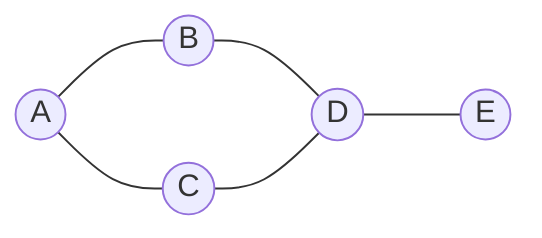

# Lecture 25: Graphs and Representation

A tree restricts every node to exactly one parent — no cycles, no cross-connections. A
**graph** removes that restriction entirely: any node can connect to any number of other
nodes, in any pattern. This is the most general structure in the course, and it's the one
behind maps, social networks, and the internet itself.

## In This Lecture

- Core graph terminology: vertices, edges, directed vs. undirected, weighted vs. unweighted
- Degree, path, cycle, and connectivity
- The two standard representations: adjacency matrix and adjacency list
- A direct comparison of when to use each

## Graph Concepts and Terminology

A **graph** `G = (V, E)` consists of a set of **vertices** (nodes) `V` and a set of
**edges** `E` connecting pairs of vertices.



| Term | Meaning |
|---|---|
| **Vertex** (node) | A single point in the graph |
| **Edge** | A connection between two vertices |
| **Directed graph** | Edges have a direction — `A → B` doesn't imply `B → A` |
| **Undirected graph** | Edges have no direction — a connection works both ways |
| **Weighted graph** | Every edge carries a number (cost, distance, time) — needed for Lecture 27's shortest path |
| **Unweighted graph** | Edges simply exist or don't — no associated cost |
| **Degree** (of a vertex) | The number of edges connected to it |
| **Path** | A sequence of edges connecting one vertex to another |
| **Cycle** | A path that starts and ends at the same vertex |
| **Connected graph** | Every vertex can reach every other vertex via some path |

## Types of Graphs

- A graph can be **directed** or **undirected**, and **weighted** or **unweighted**,
  independently — four combinations in total. A road map with one-way streets and
  distances is directed *and* weighted; a friendship graph on a social network is
  typically undirected and unweighted.
- A **cyclic** graph contains at least one cycle; an **acyclic** graph contains none. A
  **DAG** (Directed Acyclic Graph) — directed with no cycles — represents things like
  task dependencies, where a cycle would mean an impossible contradiction ("task A
  depends on B, which depends on A").

## Adjacency Matrix

An **adjacency matrix** is a 2D array (Lecture 4) of size `V × V`, where
`matrix[i][j] = 1` (or the edge's weight) if an edge connects vertex `i` to vertex `j`,
and `0` otherwise.

```cpp title="adjacency_matrix.cpp"
#include <iostream>
#include <vector>
using namespace std;

class GraphMatrix {
private:
    int numVertices;
    vector<vector<int>> matrix;

public:
    GraphMatrix(int v) : numVertices(v), matrix(v, vector<int>(v, 0)) {}

    void addEdge(int u, int v) {
        matrix[u][v] = 1;
        matrix[v][u] = 1;   // undirected: the connection works both ways
    }

    void print() const {
        cout << "  ";
        for (int i = 0; i < numVertices; i++) cout << i << " ";
        cout << endl;
        for (int i = 0; i < numVertices; i++) {
            cout << i << " ";
            for (int j = 0; j < numVertices; j++) {
                cout << matrix[i][j] << " ";
            }
            cout << endl;
        }
    }
};

int main() {
    // Vertices 0-4, matching the diagram: A=0, B=1, C=2, D=3, E=4
    GraphMatrix graph(5);
    graph.addEdge(0, 1);   // A-B
    graph.addEdge(0, 2);   // A-C
    graph.addEdge(1, 3);   // B-D
    graph.addEdge(2, 3);   // C-D
    graph.addEdge(3, 4);   // D-E

    cout << "Adjacency matrix:" << endl;
    graph.print();

    return 0;
}
```

```text
$ g++ -std=c++17 -o adjacency_matrix adjacency_matrix.cpp
$ ./adjacency_matrix
Adjacency matrix:
  0 1 2 3 4 
0 0 1 1 0 0 
1 1 0 0 1 0 
2 1 0 0 1 0 
3 0 1 1 0 1 
4 0 0 0 1 0 
```

Checking whether an edge exists between any two vertices is O(1) — a direct array lookup
— but the matrix uses O(V²) memory regardless of how many edges actually exist, which
wastes enormous space for a **sparse** graph (one with relatively few edges compared to
the number of possible pairs).

## Adjacency List

An **adjacency list** stores, for each vertex, only the list of vertices it's actually
connected to — using exactly the linked structures from Units 2–4.

```cpp title="adjacency_list.cpp"
#include <iostream>
#include <vector>
#include <list>
using namespace std;

class GraphList {
private:
    int numVertices;
    vector<list<int>> adjList;

public:
    GraphList(int v) : numVertices(v), adjList(v) {}

    void addEdge(int u, int v) {
        adjList[u].push_back(v);
        adjList[v].push_back(u);   // undirected
    }

    void print() const {
        for (int i = 0; i < numVertices; i++) {
            cout << i << ": ";
            for (int neighbor : adjList[i]) {
                cout << neighbor << " ";
            }
            cout << endl;
        }
    }
};

int main() {
    GraphList graph(5);
    graph.addEdge(0, 1);
    graph.addEdge(0, 2);
    graph.addEdge(1, 3);
    graph.addEdge(2, 3);
    graph.addEdge(3, 4);

    cout << "Adjacency list:" << endl;
    graph.print();

    return 0;
}
```

```text
$ g++ -std=c++17 -o adjacency_list adjacency_list.cpp
$ ./adjacency_list
Adjacency list:
0: 1 2 
1: 0 3 
2: 0 3 
3: 1 2 4 
4: 3 
```

Notice the same graph, represented far more compactly — only actual edges take up space.

## Comparison of Graph Representations

| | Adjacency Matrix | Adjacency List |
|---|---|---|
| Space | O(V²), regardless of edge count | O(V + E) — proportional to what's actually there |
| Check if edge (u, v) exists | O(1) | O(degree of u) — must scan u's neighbor list |
| Visit all neighbors of a vertex | O(V) — must scan the whole row | O(degree of u) — exactly the neighbors, nothing more |
| Best for | Dense graphs (many edges), or when "does this edge exist?" is the main query | Sparse graphs (most real-world graphs), or when "what are this vertex's neighbors?" is the main query |

Real-world graphs — road networks, social networks, the web — are almost always
**sparse**: a city isn't directly connected to every other city, and you don't personally
know everyone on a social network. This is exactly why the **adjacency list** is the
representation Lectures 26–28 will build on for BFS, DFS, Dijkstra's algorithm, and
minimum spanning trees.

## Try It Yourself

1. Compile and run `adjacency_matrix.cpp`, then verify by hand that the matrix is
   **symmetric** (`matrix[i][j] == matrix[j][i]` for every pair) — explain in one sentence
   why this must always be true for an *undirected* graph, and what would change for a
   *directed* one.
2. Modify `adjacency_list.cpp`'s `addEdge` to take a third `weight` parameter, changing
   `list<int>` to `list<pair<int,int>>` (neighbor, weight), and print each edge's weight
   alongside its neighbor. This is exactly the representation Lecture 27's Dijkstra's
   algorithm will need.

## Key Takeaways

- A **graph** generalizes a tree completely: any vertex can connect to any number of
  others, with no restriction on cycles or a single parent.
- Core vocabulary — directed/undirected, weighted/unweighted, degree, path, cycle,
  connected — describes every graph algorithm for the rest of this unit.
- An **adjacency matrix** gives O(1) edge lookups at O(V²) space; an **adjacency list**
  gives compact O(V + E) space at the cost of scanning a vertex's actual neighbor list.
- Most real-world graphs are **sparse**, which is why the adjacency list is the
  representation used throughout the rest of this unit.
