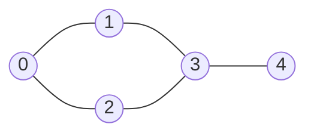

# Lecture 26: Graph Traversal: BFS and DFS

Lecture 19's tree traversals never had to worry about visiting the same node twice —
trees have no cycles. A graph can, so graph traversal needs one extra piece of
bookkeeping: a **visited** set, tracking which vertices have already been processed, so
the algorithm can't loop forever around a cycle. With that one addition, tree traversal's
two core strategies — breadth-first and depth-first — carry over directly.

## In This Lecture

- Why graph traversal needs a "visited" set that tree traversal never did
- Breadth-First Search (BFS), using a queue — same tool as Lecture 17's tree building
- Depth-First Search (DFS), using recursion (the call stack) — same tool as Lecture 19
- A direct comparison, and real applications of each

## The Graph Traversal Concept

Both traversals answer the same question — "visit every vertex reachable from a starting
point" — but explore in a fundamentally different order. Both examples below use the
exact same graph from Lecture 25.



## Breadth-First Search (BFS)

**BFS** explores level by level: visit the starting vertex, then all of its direct
neighbors, then all of *their* unvisited neighbors, and so on — exactly Lecture 17's
level-order tree traversal, generalized to graphs with a visited set added.

```cpp title="graph_bfs.cpp"
#include <iostream>
#include <vector>
#include <list>
#include <queue>
using namespace std;

class Graph {
private:
    int numVertices;
    vector<list<int>> adjList;

public:
    Graph(int v) : numVertices(v), adjList(v) {}

    void addEdge(int u, int v) {
        adjList[u].push_back(v);
        adjList[v].push_back(u);
    }

    void bfs(int start) const {
        vector<bool> visited(numVertices, false);
        queue<int> toVisit;

        visited[start] = true;
        toVisit.push(start);

        while (!toVisit.empty()) {
            int current = toVisit.front();
            toVisit.pop();
            cout << current << " ";

            for (int neighbor : adjList[current]) {
                if (!visited[neighbor]) {
                    visited[neighbor] = true;   // mark visited when ENQUEUED, not dequeued
                    toVisit.push(neighbor);
                }
            }
        }
        cout << endl;
    }
};

int main() {
    Graph graph(5);
    graph.addEdge(0, 1);
    graph.addEdge(0, 2);
    graph.addEdge(1, 3);
    graph.addEdge(2, 3);
    graph.addEdge(3, 4);

    cout << "BFS starting from vertex 0: ";
    graph.bfs(0);

    return 0;
}
```

```text
$ g++ -std=c++17 -o graph_bfs graph_bfs.cpp
$ ./graph_bfs
BFS starting from vertex 0: 0 1 2 3 4
```

!!! warning "Mark visited when enqueuing, not when dequeuing"
    If `visited[neighbor] = true` happened only when a vertex is *dequeued* rather than
    when it's first *discovered*, the same vertex could be pushed onto the queue multiple
    times before it's ever processed — wasting work, and in graphs with cycles, this
    subtle bug is a common source of incorrect BFS implementations.

## Depth-First Search (DFS)

**DFS** explores as far as possible down one path before backtracking — exactly
Lecture 19's pre-order tree traversal, generalized with a visited set.

```cpp title="graph_dfs.cpp"
#include <iostream>
#include <vector>
#include <list>
using namespace std;

class Graph {
private:
    int numVertices;
    vector<list<int>> adjList;

    void dfsHelper(int current, vector<bool>& visited) const {
        visited[current] = true;
        cout << current << " ";

        for (int neighbor : adjList[current]) {
            if (!visited[neighbor]) {
                dfsHelper(neighbor, visited);
            }
        }
    }

public:
    Graph(int v) : numVertices(v), adjList(v) {}

    void addEdge(int u, int v) {
        adjList[u].push_back(v);
        adjList[v].push_back(u);
    }

    void dfs(int start) const {
        vector<bool> visited(numVertices, false);
        dfsHelper(start, visited);
        cout << endl;
    }
};

int main() {
    Graph graph(5);
    graph.addEdge(0, 1);
    graph.addEdge(0, 2);
    graph.addEdge(1, 3);
    graph.addEdge(2, 3);
    graph.addEdge(3, 4);

    cout << "DFS starting from vertex 0: ";
    graph.dfs(0);

    return 0;
}
```

```text
$ g++ -std=c++17 -o graph_dfs graph_dfs.cpp
$ ./graph_dfs
DFS starting from vertex 0: 0 1 3 2 4
```

Follow the path: from `0`, DFS commits to neighbor `1` first, then from `1` commits to
its unvisited neighbor `3`, then from `3` commits to `2` (its first unvisited neighbor),
then from `2` finds nothing new (its only neighbors, `0` and `3`, are both already
visited), backtracks to `3`, and finally visits `4`. Compare this to BFS's `0 1 2 3 4` —
same graph, same start, genuinely different order.

## BFS versus DFS

| | BFS | DFS |
|---|---|---|
| Data structure | Queue (explicit) | Call stack (via recursion) |
| Exploration pattern | Level by level, outward from the start | As deep as possible, then backtrack |
| Finds shortest path (unweighted) | Yes — the first time a vertex is reached is via the fewest edges | No guarantee |
| Memory (worst case) | O(V) — could hold an entire "level" in the queue | O(V) — the recursion depth, worst case a single long path |

## Traversal Complexity

Both BFS and DFS are **O(V + E)**: every vertex is visited exactly once (O(V)), and every
edge is examined exactly once from each endpoint while scanning neighbor lists (O(E)) —
this is why the adjacency list from Lecture 25, not the matrix, is the right
representation here: scanning only a vertex's *actual* neighbors is what makes O(V + E)
achievable instead of O(V²).

## Applications of BFS and DFS

- **BFS**: shortest path in an *unweighted* graph (the number of hops, not distance);
  finding all friends-of-friends within `k` connections on a social network; the "six
  degrees of separation" kind of query.
- **DFS**: detecting cycles in a graph; topological sorting of a DAG (Lecture 25); solving
  mazes (commit to a path, backtrack on dead ends — Lecture 12's backtracking, generalized
  to graphs); finding connected components.

## Try It Yourself

1. Compile and run both `graph_bfs.cpp` and `graph_dfs.cpp` with a **new** edge added,
   `graph.addEdge(0, 4)`, creating a cycle. Confirm both algorithms still terminate
   correctly (thanks to the visited set) and don't loop forever.
2. Convert `dfsHelper` from recursive to **iterative**, using an explicit `stack<int>`
   instead of the call stack (mirroring how BFS explicitly uses a queue). Compare your
   iterative DFS's output order to the recursive version's — are they identical, and if
   not, can you explain why?

## Key Takeaways

- Graph traversal needs a **visited** set that tree traversal never required, because
  graphs can contain cycles that would otherwise loop forever.
- **BFS** explores level by level using an explicit **queue** — the same tool from
  Lecture 17's tree-building — and is the right choice for shortest-path-by-hop-count
  queries.
- **DFS** explores as deep as possible before backtracking, using **recursion** (the call
  stack) — the same tool from Lecture 19's pre-order traversal — and is the right choice
  for cycle detection and exhaustive path exploration.
- Both run in **O(V + E)**, which is exactly why the adjacency list representation from
  Lecture 25 matters: it lets each vertex's neighbors be scanned in time proportional to
  its actual degree, not the whole vertex count.
