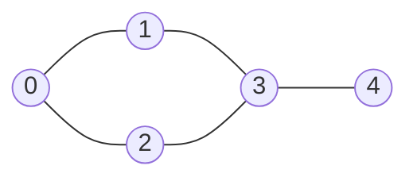
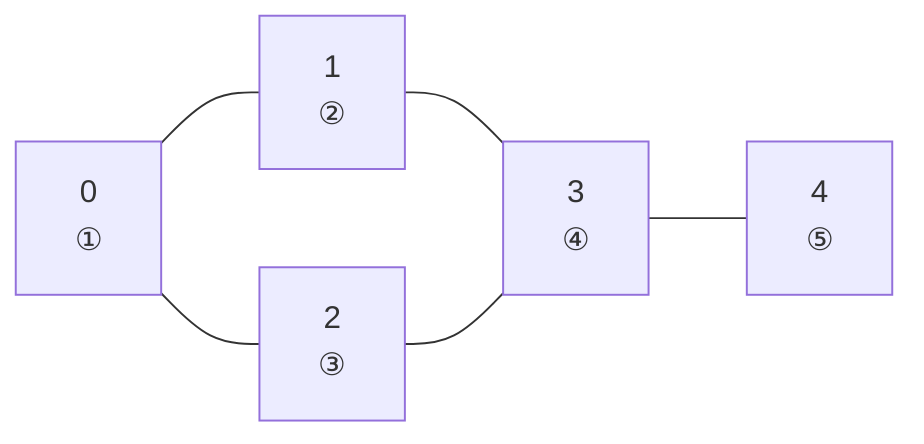
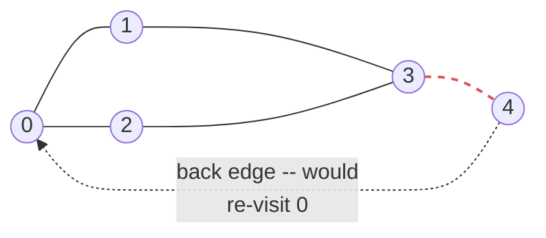

# Lecture 26: Graph Traversal: BFS and DFS

Lecture 19's tree traversals never had to worry about visiting the same node twice —
trees have no cycles. A graph can, so graph traversal needs one extra piece of
bookkeeping: a **visited** set, tracking which vertices have already been processed, so
the algorithm can't loop forever around a cycle. With that one addition, tree traversal's
two core strategies — breadth-first and depth-first — carry over directly.

## In This Lecture

- Why graph traversal needs a "visited" set that tree traversal never did
- Breadth-First Search (BFS), using a queue — same tool as Lecture 17's tree building
- Depth-First Search (DFS), using recursion (the call stack) — same tool as Lecture 19
- Tracing both algorithms step by step, so the queue/call-stack bookkeeping is visible
- What happens on a graph with a **cycle**, and how the visited set stops an infinite loop
- A direct comparison, a real-scenario "which one wins" table, and applications of each

## The Graph Traversal Concept

Both traversals answer the same question — "visit every vertex reachable from a starting
point" — but explore in a fundamentally different order. Both examples below use the
exact same graph from Lecture 25.



## Breadth-First Search (BFS)

**BFS** explores level by level: visit the starting vertex, then all of its direct
neighbors, then all of *their* unvisited neighbors, and so on — exactly Lecture 17's
level-order tree traversal, generalized to graphs with a visited set added.

```cpp title="graph_bfs.cpp"
#include <iostream>
#include <vector>
#include <list>
#include <queue>
using namespace std;

class Graph {
private:
    int numVertices;
    vector<list<int>> adjList;

public:
    Graph(int v) : numVertices(v), adjList(v) {}

    void addEdge(int u, int v) {
        adjList[u].push_back(v);
        adjList[v].push_back(u);
    }

    void bfs(int start) const {
        vector<bool> visited(numVertices, false);
        queue<int> toVisit;

        visited[start] = true;
        toVisit.push(start);

        while (!toVisit.empty()) {
            int current = toVisit.front();
            toVisit.pop();
            cout << current << " ";

            for (int neighbor : adjList[current]) {
                if (!visited[neighbor]) {
                    visited[neighbor] = true;   // mark visited when ENQUEUED, not dequeued
                    toVisit.push(neighbor);
                }
            }
        }
        cout << endl;
    }
};

int main() {
    Graph graph(5);
    graph.addEdge(0, 1);
    graph.addEdge(0, 2);
    graph.addEdge(1, 3);
    graph.addEdge(2, 3);
    graph.addEdge(3, 4);

    cout << "BFS starting from vertex 0: ";
    graph.bfs(0);

    return 0;
}
```

```text
$ g++ -std=c++17 -o graph_bfs graph_bfs.cpp
$ ./graph_bfs
BFS starting from vertex 0: 0 1 2 3 4
```

!!! warning "Mark visited when enqueuing, not when dequeuing"
    If `visited[neighbor] = true` happened only when a vertex is *dequeued* rather than
    when it's first *discovered*, the same vertex could be pushed onto the queue multiple
    times before it's ever processed — wasting work, and in graphs with cycles, this
    subtle bug is a common source of incorrect BFS implementations.

### Tracing BFS Step by Step

The queue's contents at each moment are the whole algorithm — printing what gets dequeued
and what gets newly enqueued at every step turns "trust me, it visits level by level" into
something you can watch happen.

```cpp title="graph_bfs_trace.cpp"
#include <iostream>
#include <vector>
#include <list>
#include <queue>
using namespace std;

class Graph {
private:
    int numVertices;
    vector<list<int>> adjList;

public:
    Graph(int v) : numVertices(v), adjList(v) {}

    void addEdge(int u, int v) {
        adjList[u].push_back(v);
        adjList[v].push_back(u);
    }

    void bfsTrace(int start) const {
        vector<bool> visited(numVertices, false);
        queue<int> toVisit;
        int step = 1;

        visited[start] = true;
        toVisit.push(start);

        while (!toVisit.empty()) {
            int current = toVisit.front();
            toVisit.pop();

            cout << "  Step " << step << ": dequeue " << current;
            cout << " -- enqueue [";
            bool first = true;
            for (int neighbor : adjList[current]) {
                if (!visited[neighbor]) {
                    if (!first) cout << " ";
                    cout << neighbor;
                    first = false;
                    visited[neighbor] = true;
                    toVisit.push(neighbor);
                }
            }
            cout << "]" << endl;
            step++;
        }
    }
};

int main() {
    Graph graph(5);
    graph.addEdge(0, 1);
    graph.addEdge(0, 2);
    graph.addEdge(1, 3);
    graph.addEdge(2, 3);
    graph.addEdge(3, 4);

    cout << "BFS trace, starting from vertex 0:" << endl;
    graph.bfsTrace(0);

    return 0;
}
```

```text
$ g++ -std=c++17 -o graph_bfs_trace graph_bfs_trace.cpp
$ ./graph_bfs_trace
BFS trace, starting from vertex 0:
  Step 1: dequeue 0 -- enqueue [1 2]
  Step 2: dequeue 1 -- enqueue [3]
  Step 3: dequeue 2 -- enqueue []
  Step 4: dequeue 3 -- enqueue [4]
  Step 5: dequeue 4 -- enqueue []
```

| Step | Dequeued | Queue *before* this step | Newly enqueued | Queue *after* this step |
|---|---|---|---|---|
| 1 | 0 | `[0]` | 1, 2 | `[1, 2]` |
| 2 | 1 | `[1, 2]` | 3 | `[2, 3]` |
| 3 | 2 | `[2, 3]` | (none — both neighbors already visited) | `[3]` |
| 4 | 3 | `[3]` | 4 | `[4]` |
| 5 | 4 | `[4]` | (none) | `[]` |

Reading the "newly enqueued" column top to bottom and left to right reproduces BFS's final
order exactly: `0, 1, 2, 3, 4` — vertex `0` first, then everything discovered at step 1 (in
the order it was enqueued), then everything discovered at step 2, and so on. This is what
"level by level" means mechanically: the queue is a strict first-in-first-out record of
discovery order, so processing order and discovery order are the same thing.



The circled numbers are BFS's visit order. Notice vertices `1` and `2` — both direct
neighbors of `0` — are numbered `②` and `③` consecutively, *before* vertex `3` (numbered
`④`), even though `3` was reachable one hop earlier through a shorter chain of discovery.
That's the "level by level" guarantee made visible: everything at distance 1 from the
start (`1` and `2`) is fully processed before anything at distance 2 (`3`) is even looked
at, and everything at distance 2 is processed before distance 3 (`4`).

## Depth-First Search (DFS)

**DFS** explores as far as possible down one path before backtracking — exactly
Lecture 19's pre-order tree traversal, generalized with a visited set.

```cpp title="graph_dfs.cpp"
#include <iostream>
#include <vector>
#include <list>
using namespace std;

class Graph {
private:
    int numVertices;
    vector<list<int>> adjList;

    void dfsHelper(int current, vector<bool>& visited) const {
        visited[current] = true;
        cout << current << " ";

        for (int neighbor : adjList[current]) {
            if (!visited[neighbor]) {
                dfsHelper(neighbor, visited);
            }
        }
    }

public:
    Graph(int v) : numVertices(v), adjList(v) {}

    void addEdge(int u, int v) {
        adjList[u].push_back(v);
        adjList[v].push_back(u);
    }

    void dfs(int start) const {
        vector<bool> visited(numVertices, false);
        dfsHelper(start, visited);
        cout << endl;
    }
};

int main() {
    Graph graph(5);
    graph.addEdge(0, 1);
    graph.addEdge(0, 2);
    graph.addEdge(1, 3);
    graph.addEdge(2, 3);
    graph.addEdge(3, 4);

    cout << "DFS starting from vertex 0: ";
    graph.dfs(0);

    return 0;
}
```

```text
$ g++ -std=c++17 -o graph_dfs graph_dfs.cpp
$ ./graph_dfs
DFS starting from vertex 0: 0 1 3 2 4
```

Follow the path: from `0`, DFS commits to neighbor `1` first, then from `1` commits to
its unvisited neighbor `3`, then from `3` commits to `2` (its first unvisited neighbor),
then from `2` finds nothing new (its only neighbors, `0` and `3`, are both already
visited), backtracks to `3`, and finally visits `4`. Compare this to BFS's `0 1 2 3 4` —
same graph, same start, genuinely different order.

### Tracing DFS Step by Step

Where BFS's queue holds *many* discovered-but-unprocessed vertices at once, DFS's call
stack holds a single unbroken chain — the path from the start vertex down to wherever the
recursion currently sits. Printing the recursion depth alongside each visit, and each
skipped already-visited neighbor, makes that chain-and-backtrack structure visible.

```cpp title="graph_dfs_trace.cpp"
#include <iostream>
#include <vector>
#include <list>
using namespace std;

class Graph {
private:
    int numVertices;
    vector<list<int>> adjList;

    void dfsHelper(int current, vector<bool>& visited, int depth) const {
        visited[current] = true;
        cout << "  " << string(depth * 2, ' ') << "visit " << current
             << " (depth " << depth << ")" << endl;

        for (int neighbor : adjList[current]) {
            if (!visited[neighbor]) {
                dfsHelper(neighbor, visited, depth + 1);
            } else {
                cout << "  " << string(depth * 2, ' ') << "  (skip " << neighbor
                     << ", already visited)" << endl;
            }
        }
    }

public:
    Graph(int v) : numVertices(v), adjList(v) {}

    void addEdge(int u, int v) {
        adjList[u].push_back(v);
        adjList[v].push_back(u);
    }

    void dfsTrace(int start) const {
        vector<bool> visited(numVertices, false);
        dfsHelper(start, visited, 0);
    }
};

int main() {
    Graph graph(5);
    graph.addEdge(0, 1);
    graph.addEdge(0, 2);
    graph.addEdge(1, 3);
    graph.addEdge(2, 3);
    graph.addEdge(3, 4);

    cout << "DFS trace, starting from vertex 0:" << endl;
    graph.dfsTrace(0);

    return 0;
}
```

```text
$ g++ -std=c++17 -o graph_dfs_trace graph_dfs_trace.cpp
$ ./graph_dfs_trace
DFS trace, starting from vertex 0:
  visit 0 (depth 0)
    visit 1 (depth 1)
      (skip 0, already visited)
      visit 3 (depth 2)
        (skip 1, already visited)
        visit 2 (depth 3)
          (skip 0, already visited)
          (skip 3, already visited)
        visit 4 (depth 3)
          (skip 3, already visited)
    (skip 2, already visited)
```

The indentation *is* the call stack: `visit 2` at depth 3 is nested three calls deep
inside `visit 3` inside `visit 1` inside `visit 0` — exactly the chain of still-open
`dfsHelper` calls waiting on the stack at that moment. Backtracking is what happens when a
recursive call returns: after `visit 2` finds nothing new and returns, control resumes
inside `visit 3`'s loop, which then tries its next neighbor, `4`. The final `(skip 2,
already visited)` line back at depth 0 is `dfsHelper(0, ...)` finally checking its second
neighbor after the entire `1`-`3`-`2`-`4` chain has already unwound.


Compare this numbering to BFS's diagram above: DFS reaches `2` (numbered `④`) *after* `3`
(numbered `③`), because it commits to the deepest unexplored path from `1` before ever
coming back to try `0`'s other neighbor — the opposite of BFS's breadth-first, level-by-
level order.

## BFS versus DFS

| | BFS | DFS |
|---|---|---|
| Data structure | Queue (explicit) | Call stack (via recursion) |
| Exploration pattern | Level by level, outward from the start | As deep as possible, then backtrack |
| Finds shortest path (unweighted) | Yes — the first time a vertex is reached is via the fewest edges | No guarantee |
| Memory (worst case) | O(V) — could hold an entire "level" in the queue | O(V) — the recursion depth, worst case a single long path |

## Traversal Complexity

Both BFS and DFS are **O(V + E)**: every vertex is visited exactly once (O(V)), and every
edge is examined exactly once from each endpoint while scanning neighbor lists (O(E)) —
this is why the adjacency list from Lecture 25, not the matrix, is the right
representation here: scanning only a vertex's *actual* neighbors is what makes O(V + E)
achievable instead of O(V²).

## Traversal on a Graph With a Cycle

Every example so far has, coincidentally, been on a graph shaped roughly like a tree with
one extra cross-connection (`2-3`) — it has a cycle already (`0-1-3-2-0` is a valid cycle
through it), but adding one *more* edge makes the cycle-safety mechanism impossible to
miss. Adding `graph.addEdge(4, 0)` closes a second loop, `0-2-3-4-0`, directly through the
vertex that was previously the traversal's dead end.



The dashed edge is a **back edge**: without a visited set, reaching `4` and then following
this edge back to `0` — which itself has already-unvisited-looking neighbors `1` and `2` —
would restart the exact same traversal, over and over, forever. The visited set is what
turns this from an infinite loop into a single, correctly-terminating pass.

```cpp title="graph_cycle.cpp"
#include <iostream>
#include <vector>
#include <list>
#include <queue>
using namespace std;

class Graph {
private:
    int numVertices;
    vector<list<int>> adjList;

public:
    Graph(int v) : numVertices(v), adjList(v) {}

    void addEdge(int u, int v) {
        adjList[u].push_back(v);
        adjList[v].push_back(u);
    }

    void bfs(int start) const {
        vector<bool> visited(numVertices, false);
        queue<int> toVisit;
        visited[start] = true;
        toVisit.push(start);

        while (!toVisit.empty()) {
            int current = toVisit.front();
            toVisit.pop();
            cout << current << " ";
            for (int neighbor : adjList[current]) {
                if (!visited[neighbor]) {
                    visited[neighbor] = true;
                    toVisit.push(neighbor);
                }
            }
        }
        cout << endl;
    }

    void dfsHelper(int current, vector<bool>& visited) const {
        visited[current] = true;
        cout << current << " ";
        for (int neighbor : adjList[current]) {
            if (!visited[neighbor]) {
                dfsHelper(neighbor, visited);
            }
        }
    }

    void dfs(int start) const {
        vector<bool> visited(numVertices, false);
        dfsHelper(start, visited);
        cout << endl;
    }
};

int main() {
    Graph graph(5);
    graph.addEdge(0, 1);
    graph.addEdge(0, 2);
    graph.addEdge(1, 3);
    graph.addEdge(2, 3);
    graph.addEdge(3, 4);
    graph.addEdge(4, 0);   // NEW: closes a cycle, 0 -> 2 -> 3 -> 4 -> 0

    cout << "Graph now contains a cycle: 0 -> 2 -> 3 -> 4 -> 0" << endl;
    cout << "BFS starting from vertex 0: ";
    graph.bfs(0);
    cout << "DFS starting from vertex 0: ";
    graph.dfs(0);

    return 0;
}
```

```text
$ g++ -std=c++17 -o graph_cycle graph_cycle.cpp
$ ./graph_cycle
Graph now contains a cycle: 0 -> 2 -> 3 -> 4 -> 0
BFS starting from vertex 0: 0 1 2 4 3 
DFS starting from vertex 0: 0 1 3 2 4
```

Both visit orders changed from the original graph's — the new edge `4-0` means `adjList[0]`
now lists `4` as a neighbor too, which shifts *what gets discovered when*. BFS now
discovers `4` directly from `0` at step 1 (instead of reaching it three hops later through
`3`), so it comes out as `0 1 2 4 3` rather than `0 1 2 3 4`. But the important fact is
what *didn't* happen: every vertex still appears in the output **exactly once**. When BFS
dequeues `4` and scans its neighbor list `[3, 0]`, both are already `visited`, so nothing
gets enqueued — the back edge is checked and discarded in O(1), not followed. DFS behaves
the same way: when the recursion reaches `4` and looks at neighbor `0`, `visited[0]` is
already `true`, so `dfsHelper` simply returns without recursing — no infinite recursion,
no stack overflow.

!!! note "Same code, no special-casing for cycles"
    Neither `bfs` nor `dfs` above contains any code written specifically to "handle
    cycles" — no cycle-detection check, no extra flag. The ordinary `if (!visited[neighbor])`
    guard that both algorithms already had is entirely sufficient. This is worth
    internalizing: correct use of a visited set doesn't just make traversal *efficient* (by
    avoiding redundant work), it's what makes traversal *correct* — that is, guaranteed to
    terminate — on any graph, cyclic or not.

## Applications of BFS and DFS

- **BFS**: shortest path in an *unweighted* graph (the number of hops, not distance);
  finding all friends-of-friends within `k` connections on a social network; the "six
  degrees of separation" kind of query.
- **DFS**: detecting cycles in a graph; topological sorting of a DAG (Lecture 25); solving
  mazes (commit to a path, backtrack on dead ends — Lecture 12's backtracking, generalized
  to graphs); finding connected components.

### When BFS Wins vs. When DFS Wins

The two algorithms visit the same vertices and run in the same O(V + E) time, so the
choice between them comes down entirely to what question you're actually trying to
answer:

| Scenario | Better choice | Why |
|---|---|---|
| Shortest path by hop count (unweighted) | **BFS** | The first time BFS reaches a vertex, it did so via the fewest possible edges — guaranteed, because it exhausts every shorter path first. DFS gives no such guarantee: it might stumble onto a vertex via a long, winding path before a two-hop path is ever tried. |
| "Is there a cycle in this graph?" | **DFS** | DFS naturally tracks the current path (the recursion stack); a cycle shows up as an edge to a vertex that's *already on the current stack*, not merely visited elsewhere. This distinction (visited-on-current-path vs. visited-anywhere) is exactly what cycle detection and topological sorting need. |
| Peer-to-peer network: find all nodes within 3 hops | **BFS** | "Within `k` hops" is a level-by-level question by definition — BFS can stop the moment it finishes level `k`, without ever exploring level `k+1`. |
| Solving a maze (find *any* path out) | **DFS** | Committing to a corridor and backtracking only on dead ends matches DFS's natural behavior, and it uses far less memory than BFS would on a maze with many open corridors at once (BFS's queue can hold an entire "frontier" of cells simultaneously). |
| Exploring an extremely deep, narrow graph (e.g., a long dependency chain) | **DFS** | BFS's queue would still only hold one frontier at a time here too, but DFS's implicit recursion requires no extra data structure at all — simpler code for a structure that's naturally chain-shaped. |
| Web crawler indexing an entire site, breadth of coverage matters early | **BFS** | Visiting pages close to the homepage first tends to surface the most broadly relevant content early, rather than DFS potentially disappearing down one narrow link chain for a long time. |

Memory is the other deciding factor in practice: BFS's queue can hold an entire level's
worth of vertices at once (potentially very large on a "bushy" graph), while DFS's stack
depth is bounded by the *longest path* from the start (potentially very large on a "long
and stringy" graph) — which one is worse depends entirely on the shape of the graph you're
traversing.

## Try It Yourself

1. Compile and run `graph_cycle.cpp`, then add one more edge on top of it,
   `graph.addEdge(1, 4)`, creating a second, overlapping cycle. Predict which vertices'
   `adjList` entries change before running, then confirm both BFS and DFS still visit
   every vertex exactly once.
2. Convert `dfsHelper` from recursive to **iterative**, using an explicit `stack<int>`
   instead of the call stack (mirroring how BFS explicitly uses a queue). Compare your
   iterative DFS's output order to the recursive version's — are they identical, and if
   not, can you explain why?
3. Compile and run `graph_bfs_trace.cpp` and `graph_dfs_trace.cpp` with `graph.addEdge(0, 4)`
   added (reproducing the cycle from `graph_cycle.cpp`). Extend the trace table by hand for
   BFS, and the indentation trace by hand for DFS, then confirm against the real output.
4. Using either traversal as a starting point, write a `findConnectedComponents` function
   that returns the number of separate connected components in a graph — call the
   traversal once from every *unvisited* vertex (not just vertex 0), counting how many
   times you had to restart. Test it on a graph built from two entirely separate edge
   groups, e.g. `{0,1}, {1,2}` and `{3,4}`, and confirm it reports `2` components.

## Key Takeaways

- Graph traversal needs a **visited** set that tree traversal never required, because
  graphs can contain cycles that would otherwise loop forever.
- **BFS** explores level by level using an explicit **queue** — the same tool from
  Lecture 17's tree-building — and is the right choice for shortest-path-by-hop-count
  queries.
- **DFS** explores as deep as possible before backtracking, using **recursion** (the call
  stack) — the same tool from Lecture 19's pre-order traversal — and is the right choice
  for cycle detection and exhaustive path exploration.
- On a graph with a genuine cycle (`graph_cycle.cpp`), neither algorithm needs any special
  cycle-handling code — the same `if (!visited[neighbor])` guard that makes traversal
  efficient on an acyclic graph is exactly what makes it *correct* (guaranteed to
  terminate) on a cyclic one.
- The choice between BFS and DFS is rarely about speed (both are O(V + E)) — it's about
  which question you're answering (hop-count shortest path vs. cycle/path structure) and
  which memory shape (wide queue vs. deep stack) your graph's shape favors.
- Both run in **O(V + E)**, which is exactly why the adjacency list representation from
  Lecture 25 matters: it lets each vertex's neighbors be scanned in time proportional to
  its actual degree, not the whole vertex count.
