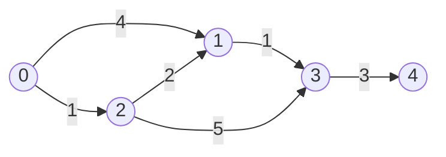

# Lecture 27: Shortest Path: Dijkstra's Algorithm

BFS (Lecture 26) finds the shortest path by *hop count* — perfect when every edge is
equal. Real maps aren't like that: a highway edge and a back-road edge don't cost the
same. **Dijkstra's algorithm** finds the shortest path in a **weighted** graph, and it
does it by combining almost everything this course has built so far: a graph, a
priority queue (Lecture 23), and greedy, step-by-step decision-making.

## In This Lecture

- The shortest-path concept, and single-source shortest path
- Dijkstra's algorithm, built on a min-heap priority queue
- Its time complexity
- Real applications, and where the algorithm breaks down

## The Shortest-Path Concept

In a **weighted graph**, the "shortest" path isn't the one with the fewest edges — it's
the one with the smallest total weight along the way. **Single-source shortest path**
means: given one starting vertex, find the shortest distance from it to *every* other
reachable vertex, all at once.



The shortest path from `0` to `1` isn't the direct edge (weight 4) — it's `0 → 2 → 1`
(weight `1 + 2 = 3`), one less than the direct edge. Dijkstra's algorithm finds exactly
this kind of answer, systematically.

## Dijkstra's Algorithm

The core idea: maintain a running "best known distance" to every vertex (starting at
infinity for everyone except the source, which is 0), and repeatedly pick the *closest*
unprocessed vertex, using it to try to improve ("relax") its neighbors' distances. A
min-heap priority queue (Lecture 23) is exactly the tool for "repeatedly pick the
closest" efficiently.

```cpp title="dijkstra.cpp"
#include <iostream>
#include <vector>
#include <queue>
#include <climits>
using namespace std;

class WeightedGraph {
private:
    int numVertices;
    vector<vector<pair<int, int>>> adjList;   // adjList[u] = list of (neighbor, weight)

public:
    WeightedGraph(int v) : numVertices(v), adjList(v) {}

    void addEdge(int u, int v, int weight) {
        adjList[u].push_back({v, weight});
        adjList[v].push_back({u, weight});   // undirected
    }

    vector<int> dijkstra(int source) const {
        vector<int> distance(numVertices, INT_MAX);
        distance[source] = 0;

        // Min-heap of (distance, vertex) pairs -- pair's default comparison
        // orders by distance first, exactly what's needed here.
        priority_queue<pair<int, int>, vector<pair<int, int>>, greater<pair<int, int>>> pq;
        pq.push({0, source});

        while (!pq.empty()) {
            auto [currentDist, current] = pq.top();
            pq.pop();

            if (currentDist > distance[current]) continue;   // a stale, outdated entry

            for (auto& [neighbor, weight] : adjList[current]) {
                int newDist = distance[current] + weight;
                if (newDist < distance[neighbor]) {
                    distance[neighbor] = newDist;
                    pq.push({newDist, neighbor});
                }
            }
        }
        return distance;
    }
};

int main() {
    WeightedGraph graph(5);
    graph.addEdge(0, 1, 4);
    graph.addEdge(0, 2, 1);
    graph.addEdge(2, 1, 2);
    graph.addEdge(1, 3, 1);
    graph.addEdge(2, 3, 5);
    graph.addEdge(3, 4, 3);

    vector<int> distances = graph.dijkstra(0);

    cout << "Shortest distances from vertex 0:" << endl;
    for (int i = 0; i < distances.size(); i++) {
        cout << "  to " << i << ": " << distances[i] << endl;
    }

    return 0;
}
```

```text
$ g++ -std=c++17 -o dijkstra dijkstra.cpp
$ ./dijkstra
Shortest distances from vertex 0:
  to 0: 0
  to 1: 3
  to 2: 1
  to 3: 4
  to 4: 7
```

Confirming by hand: `0 → 2` costs `1`; `0 → 2 → 1` costs `1 + 2 = 3` (beating the direct
edge's `4`, exactly as predicted above); `0 → 2 → 1 → 3` costs `3 + 1 = 4`; and
`0 → 2 → 1 → 3 → 4` costs `4 + 3 = 7`. Every distance the algorithm reports matches a
real, traceable shortest path.

!!! note "Why a stale priority-queue entry can exist at all"
    Because a shorter path to a vertex can be discovered *after* an older, longer-distance
    entry for that same vertex is already sitting in the queue, the queue can hold more
    than one entry per vertex. The `if (currentDist > distance[current]) continue;` line
    skips any entry that's been made obsolete by a better one found in the meantime — a
    small but essential correctness check, easy to forget when first implementing this.

## Time Complexity

With a binary heap-based priority queue (exactly `std::priority_queue`, Lecture 23), each
vertex can be pushed onto the queue up to once per incoming edge, and each push/pop is
O(log V) — giving a total of **O((V + E) log V)** for the whole algorithm, efficient
enough for graphs with hundreds of thousands of edges.

## Applications

- **GPS and mapping software** — literally this algorithm (or a close variant), finding
  the shortest driving route between two points on a weighted road network.
- **Network routing protocols** — finding the lowest-cost path for data packets across a
  network of routers.
- **Games** — AI pathfinding on a weighted grid or graph representing a game map.

## Limitations of Dijkstra's Algorithm

- **Cannot handle negative edge weights.** The algorithm assumes that once a vertex is
  processed with its best-known distance, that distance can never improve — a negative
  edge encountered later could violate that assumption and produce a wrong answer. (The
  Bellman-Ford algorithm, outside this course's scope, handles negative weights instead.)
- **Single-source only.** It finds shortest paths *from one starting vertex* to everywhere
  else — finding shortest paths between *every* pair of vertices needs a different
  algorithm (or running Dijkstra once per vertex).

## Try It Yourself

1. Compile and run `dijkstra.cpp`, then add a new, much shorter edge —
   `graph.addEdge(0, 4, 2)` — a direct connection from `0` to `4` with weight `2`. Predict
   the new shortest distance to vertex `4` before running it, then confirm.
2. Modify `main()` to also print the actual *path* to each vertex, not just the distance —
   you'll need to track, for each vertex, which neighbor last improved its distance (a
   `vector<int> previous`, updated alongside `distance` inside the relaxation step), then
   walk `previous` backward from the destination to the source.

## Key Takeaways

- Dijkstra's algorithm solves **single-source shortest path** on a weighted graph by
  greedily processing the closest unprocessed vertex first, using a min-heap priority
  queue (Lecture 23) to always know which vertex that is.
- **Relaxation** — checking whether going through the current vertex improves a
  neighbor's known distance — is the core operation, repeated until the queue is empty.
- Runs in **O((V + E) log V)** with a binary heap-based priority queue.
- Fails on graphs with **negative edge weights**, and only answers shortest-path-from-one-
  source — both real limitations worth knowing before reaching for it.
